[ 🇺🇸 Read in English ](README.md) | [ 🇨🇱 Español ]

# chile-credit-risk-scoring-engine


Un motor **poligloto de credit scoring** para banca de consumo/retail
financiero chileno, donde cada lenguaje cumple el rol que realmente
cumple en un area de riesgo real: **R** construye el scorecard
estadistico tradicional WOE (Weight of Evidence) + regresion logistica
que la banca sigue usando para decisiones de credito interpretables y
auditable; **Python** limpia los datos y entrena modelos ML modernos
como challenger (XGBoost, LightGBM, Random Forest) con explicabilidad
SHAP; y **C** implementa el motor de scoring compilado, de baja
latencia, que un sistema real de originacion de creditos correria en
produccion, expuesto a Python via `ctypes`. Un solo comando
(`python run_pipeline.py`) corre los tres lenguajes de punta a punta, y
la salida del motor en C se verifica bit a bit contra el scorecard de R
(diferencia de 4.79e-11) -- no solo rapido, comprobadamente el mismo
numero. Un servicio **FastAPI** (`src/api.py`) expone ambos modelos --
Champion (scorecard, via el motor en C) y Challenger (ML) -- detras de la
misma API de baja latencia, y un modulo de **reject inference**
(`src/reject_inference.py`) corrige el sesgo de seleccion que trae
entrenar solo con el historico de aprobados.

## Resumen Ejecutivo

Dado el ingreso, tipo de contrato, antiguedad laboral, razon
deuda/ingreso e historial de morosidad de un solicitante, el motor
estima la probabilidad de default a 12 meses y produce tanto un
scorecard de puntos tradicional (R) como una probabilidad de un modelo
ML moderno (Python), scoreados en produccion por un motor compilado en
C. Todos los datos son sinteticos -- generados por este mismo
repositorio a partir de un proceso logistico conocido (no datos reales
de ningun banco ni bureau), calibrados a tasas de default de consumo
chilenas despues de detectar y corregir una primera calibracion
demasiado alta (~19% de default).

## Impacto de Negocio e Indicadores Clave (KPIs)

**El problema:** toda decision de credito enfrenta dos costos --
aprobar a alguien que caera en default (perdida crediticia) versus
rechazar a alguien que no lo habria hecho (ingreso perdido, y en Chile,
un costo real de inclusion financiera dado cuan central es el credito
retail -- las "casas comerciales" -- para el acceso al credito de
consumo). Todo el valor de un scorecard esta en cuan bien separa a los
malos futuros de los buenos futuros *antes* de otorgar el credito.

| Palanca | Que mide este motor | Numero de esta corrida |
|---|---|---|
| Discriminacion | Coeficiente de Gini (2×AUC−1) en test | Scorecard 0.466 / mejor ML 0.461 |
| Separacion | Estadistico KS (brecha maxima entre distribuciones acumuladas de buenos/malos) | Scorecard 0.358 |
| Concentracion de riesgo | Lift de tasa de mora en el peor decil de score vs. el promedio de cartera | **3.33x** (21.8% vs. 6.5%) |
| Cobertura de alerta temprana | % de todos los defaults futuros capturados al rechazar el peor 20% de solicitantes | **52.0%** |
| Deteccion de drift | PSI (Population Stability Index), test vs. train y vs. una poblacion simulada mas riesgosa | 0.0006 (estable) vs. 0.238 (senal detectada) |

> **Sobre cifras en dolares:** este repositorio no calcula un ROI en
> dolares especifico de ninguna cartera -- la poblacion de solicitantes
> es sintetica. Lo que si es real y reproducible es la tabla de lift de
> arriba: en el set de test de esta corrida, rechazar (o someter a
> revision adicional) solo al peor 20% de solicitantes por score habria
> filtrado poco mas de la mitad de todos los defaults a 12 meses. Ese
> mecanismo -- concentrar el riesgo en una porcion pequena y accionable
> de la poblacion -- es la palanca real que un despliegue productivo
> usaria para dimensionar el impacto en dolares, una vez conectado a un
> supuesto real de exposicion al default y perdida dado el default para
> una cartera especifica.

## Arquitectura

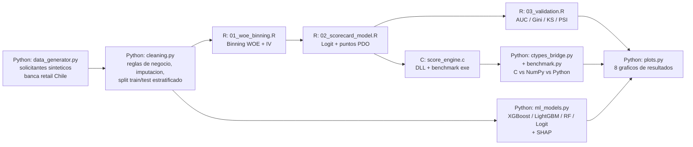

Cada etapa se invoca desde `run_pipeline.py` exactamente igual que se
documenta para correrla sola (`Rscript R/01_woe_binning.R`, `powershell
-File c/build.ps1`, `python -m src.ml_models`, ...) -- el orquestador es
un wrapper delgado de subprocesos, no una reimplementacion paralela, asi
que "correr todo" y "correr un paso" siempre se comportan igual.

## Por que tres lenguajes, no uno

- **R hace el scorecard regulatorio** porque la regresion logistica
  sobre variables WOE sigue siendo la tecnica estandar de la industria
  para modelos de credito interpretables y auditables en areas de
  riesgo bancario -- el aporte de cada bin al score final es un numero
  con signo que un regulador o auditor puede leer directamente, a
  diferencia de la superficie de decision de un ensamble de arboles.
- **Python hace el challenger ML y la orquestacion** porque ahi es
  donde XGBoost/LightGBM, SHAP y la logica de coordinacion realmente
  viven en la mayoria de los stacks modernos de analitica de riesgo.
- **C hace el hot-path de scoring en produccion** porque un sistema
  real de originacion de creditos que score miles de solicitudes por
  segundo necesita que la aritmetica -- no el ajuste del modelo -- sea
  lo mas rapida posible; este repo mide esa brecha en vez de solo
  afirmarla: en la ultima corrida medida el motor compilado es **278x
  mas rapido que un loop en Python puro y 11.1x mas rapido que NumPy
  vectorizado** en la misma operacion de lookup-and-sum (el throughput
  de reloj de pared varia de corrida en corrida segun la carga de la
  maquina -- ver la Seccion 6 para los numeros exactos), reproduciendo
  exactamente el score de R.

## Tecnicas usadas

- **Binning WOE (Weight of Evidence) + Information Value**, hecho a
  mano en R con una fusion monotona y un caso especial para variables
  de conteo sesgadas de baja cardinalidad (ver la nota metodologica
  abajo).
- **Scorecard de regresion logistica con escala PDO** (Points to Double
  the Odds) -- la convencion bancaria estandar para convertir el
  log-odds de un `glm` en una escala de puntos interpretable.
- **Arboles con boosting** (XGBoost, LightGBM) y **Random Forest** como
  challengers ML, con validacion cruzada `StratifiedKFold`.
- **SHAP** (`TreeExplainer`/`LinearExplainer`) para explicabilidad del
  challenger, cruzado contra el propio ranking IV del scorecard.
- **Deep learning**: un MLP en PyTorch con **Focal Loss** (consciente
  del desbalance de clases) y una comparacion controlada de
  activaciones ReLU/GELU/Swish.
- **Reject inference** (Hard Cutoff, Parceling hard/soft) para corregir
  el sesgo de seleccion de entrenar solo con solicitantes aprobados.
- **Population Stability Index (PSI)** para monitoreo de drift del
  score.
- **Motor de scoring compilado en C** expuesto a Python via `ctypes`,
  verificado bit a bit contra el scorecard calculado independientemente
  en R.
- **Servicio FastAPI** que pone al Champion (motor C) y al Challenger
  ML detras de los mismos endpoints de baja latencia (patron
  Champion/Challenger).
- **DuckDB** para persistencia local, en archivo, consultable con SQL,
  de metricas/predicciones entre corridas del pipeline.
- **Visualizacion interactiva en Plotly** (HTML standalone) de la
  distribucion del score por decil de riesgo, junto a los graficos
  estaticos en Matplotlib.

## Stack Tecnologico

| Capa | Tecnologia | Rol |
|---|---|---|
| Datos y limpieza | **Python (pandas, scikit-learn)** | Generacion sintetica de solicitantes, validacion de reglas de negocio, imputacion, split train/test estratificado |
| Scorecard estadistico | **R (dplyr, jsonlite, `glm` base)** | Binning WOE/IV (hecho a mano, cuantiles + fusion monotona), regresion logistica, conversion a puntos PDO, AUC/Gini/KS/PSI |
| Challengers ML | **XGBoost, LightGBM, scikit-learn** | Modelos de probabilidad de default sobre features crudas/derivadas, validacion cruzada `StratifiedKFold` |
| Explicabilidad | **SHAP** | `TreeExplainer` / `LinearExplainer` sobre el mejor challenger |
| Motor de scoring en produccion | **C (MSVC)** | Scorer de lookup-and-sum compilado, expuesto como DLL via `ctypes`, mas un ejecutable de benchmark standalone |
| Serving | **FastAPI, Uvicorn** | API HTTP de baja latencia que sirve tanto al Champion (motor C) como al Challenger (scikit-learn) detras de los mismos endpoints |
| Correccion de sesgo | **scikit-learn (a medida)** | Reject inference con Hard Cutoff y Parceling (hard/soft) para el sesgo de seleccion del entrenamiento solo-aprobados |
| Visualizacion interactiva | **Plotly** | Distribucion del score por decil de riesgo, HTML standalone |
| Deep learning | **PyTorch** | MLP con Focal Loss a medida, comparacion de activaciones ReLU/GELU/Swish, mismo holdout que scorecard y challengers ML |
| Persistencia de metricas | **DuckDB** | Historial de metricas y predicciones de los 3 enfoques por corrida del pipeline (`data/processed/metrics.duckdb`) |
| Visualizacion | **Matplotlib** | 10 graficos de resultados, paleta categorica/divergente validada para accesibilidad |
| Testing | **Pytest** | 33 tests que cubren generacion de datos, limpieza, el puente al motor en C, el servicio FastAPI, reject inference, entrenamiento ML/DL, y persistencia en DuckDB |

## Estructura

```
chile-credit-risk-scoring-engine/
├── data/
│   ├── raw/                          # solicitantes sinteticos (csv, generado)
│   └── processed/                    # limpio + split + WOE binned + scored (csv, generado)
├── R/
│   ├── 01_woe_binning.R
│   ├── 02_scorecard_model.R
│   └── 03_validation.R
├── c/
│   ├── score_engine.h / score_engine.c   # motor de scoring (compartido DLL + exe)
│   ├── bench_main.c                       # benchmark standalone en C puro
│   └── build.ps1                          # compila con MSVC (cl.exe)
├── src/
│   ├── data_generator.py
│   ├── cleaning.py
│   ├── features.py                   # definicion de features compartida (challenger ML + API + reject inference)
│   ├── ml_models.py
│   ├── deep_learning.py              # MLP en PyTorch, Focal Loss, ReLU/GELU/Swish
│   ├── metrics_store.py              # persistencia de metricas/predicciones en DuckDB
│   ├── ctypes_bridge.py
│   ├── champion_scoring.py           # binning WOE congelado + motor C, para scorear un solicitante en vivo
│   ├── api.py                        # servicio FastAPI: Champion (motor C) + Challenger (ML)
│   ├── reject_inference.py           # Hard Cutoff + Parceling (hard/soft)
│   ├── benchmark.py
│   └── visualization/
│       ├── plots.py
│       └── interactive_score_distribution.py  # Plotly HTML, score x decil de riesgo
├── notebooks/
│   └── 02_Reject_Inference_and_Latency.ipynb
├── outputs/
│   ├── models/                       # best_ml_model.joblib, best_dl_model.pt, score_engine.dll, score_bench.exe (generado)
│   ├── reports/                      # metricas, tablas WOE/scorecard, benchmark (json/csv, generado)
│   ├── plots/                        # graficos de resultados (png, versionado)
│   └── interactive/                  # grafico Plotly HTML standalone (versionado)
├── data/processed/metrics.duckdb     # historial de metricas/predicciones por corrida (generado)
├── tests/                            # 33 tests, pytest
├── run_pipeline.py                   # orquestador end-to-end (Python -> R -> C -> Python)
└── requirements.txt
```

## Instalacion y ejecucion

Requiere **Python 3.10+**, **R 4.4+**, y un **compilador MSVC** (Visual
Studio / Build Tools con el workload "Desktop development with C++" --
`c/build.ps1` ubica `vcvars64.bat` automaticamente en las rutas de
instalacion comunes).

```powershell
git clone https://github.com/Rxyxs/chile-credit-risk-scoring-engine.git
cd chile-credit-risk-scoring-engine
python -m venv .venv
.venv\Scripts\activate
pip install -r requirements.txt
```

Paquetes de R usados (`dplyr`, `jsonlite`) -- instalar una vez si faltan:

```r
install.packages(c("dplyr", "jsonlite"))
```

### Pipeline completo (un solo comando)

```powershell
python run_pipeline.py
```

Corre, en orden: generacion de datos sinteticos, limpieza, binning
WOE/IV (R), ajuste del scorecard (R), validacion (R), compilacion del
motor en C, el benchmark C vs. NumPy vs. Python, los modelos ML
challenger con SHAP, el MLP en PyTorch (Focal Loss), los graficos de
resultados, y la persistencia de metricas en DuckDB.

### Etapas individuales (para depuracion)

```powershell
python -m src.data_generator
python -m src.cleaning
Rscript R\01_woe_binning.R
Rscript R\02_scorecard_model.R
Rscript R\03_validation.R
powershell -ExecutionPolicy Bypass -File c\build.ps1
python -m src.benchmark
python -m src.ml_models
python -m src.deep_learning
python -m src.visualization.plots
python -m src.visualization.interactive_score_distribution
python -m src.metrics_store
```

### Tests

```powershell
pytest
```

### Levantar la API (Champion + Challenger)

Requiere haber corrido el pipeline completo al menos una vez (necesita
`outputs/reports/*.json`, `outputs/models/best_ml_model.joblib`, y
`outputs/models/score_engine.dll`).

```powershell
uvicorn src.api:app --reload
```

Documentacion interactiva en `http://127.0.0.1:8000/docs`. Endpoints
principales: `GET /health`, `GET /model-info`, `POST /score/champion`,
`POST /score/challenger`, `POST /score/compare`.

### Notebook de reject inference + latencia

```powershell
jupyter nbconvert --to notebook --execute --inplace notebooks/02_Reject_Inference_and_Latency.ipynb
```

## Resultados

Todos los numeros de abajo vienen de una corrida real de
`run_pipeline.py` (seed 42, 20,000 solicitantes sinteticos, split
estratificado 15,000/5,000 train/test, tasa base de default 6.54%).

### 1. WOE / Information Value — seleccion de variables

| Variable | IV | Interpretacion |
|---|---|---|
| `tipo_contrato` (formal/informal) | 0.348 | Fuerte |
| `n_morosidad_reportes` | 0.274 | Fuerte |
| `antiguedad_laboral_meses` | 0.171 | Media |
| `renta_liquida` | 0.166 | Media |
| `dti` | 0.088 | Debil-media |
| `n_productos_activos`, `region`, `edad`, `deuda_total` | 0.003–0.018 | Bajo el umbral 0.02 -- descartadas |

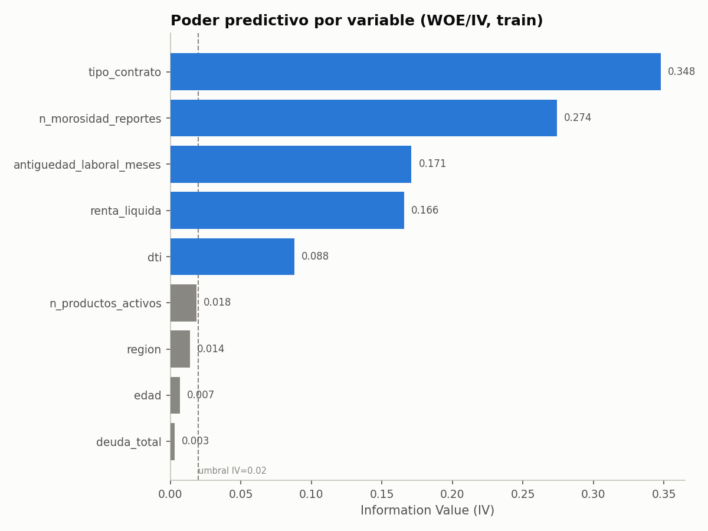
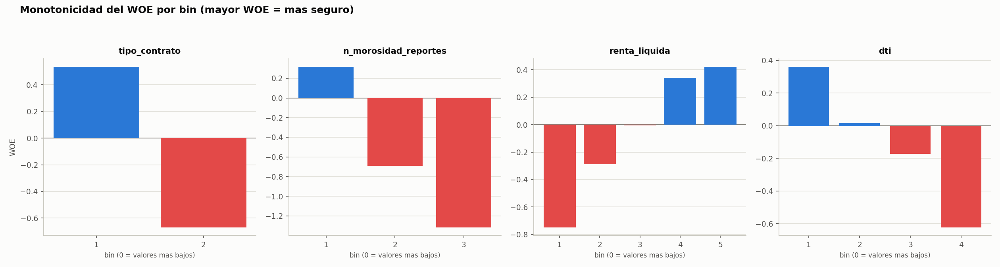

El binning dejo una nota metodologica real que vale la pena registrar:
una primera version con cortes por cuantiles colapso
`n_morosidad_reportes` (una variable de conteo muy sesgada -- 81% de los
solicitantes tienen cero reportes) en solo 2 bins y subestimo su IV en
0.108. Se corrigio tratando como caso especial las variables enteras de
baja cardinalidad, dandole a cada valor unico su propio bin inicial
antes de la fusion monotona, lo que subio su IV al 0.274 correcto --
consistente con ser, junto con tipo de contrato, el predictor individual
mas fuerte.

### 2. Scorecard en R (WOE + regresion logistica, puntos PDO)

Las 5 variables seleccionadas entran al `glm` con el signo negativo
esperado (mayor WOE = bin mas seguro = menos puntos necesarios para
compensar riesgo), significativas con p < 0.001:

| Variable | Coeficiente |
|---|---|
| `tipo_contrato_woe` | −0.526 |
| `n_morosidad_reportes_woe` | −0.667 |
| `antiguedad_laboral_meses_woe` | −0.610 |
| `renta_liquida_woe` | −0.531 |
| `dti_woe` | −0.946 |

Parametros del scorecard: puntos base **563.8**, factor **28.85**,
offset **487.1** (600 puntos ≈ odds 50:1 buenos:malos, 20 puntos para
duplicar el odds -- convencion PDO estandar). Rango de score resultante:
**[492, 612]**, media 571.

### 3. Tres enfoques de modelado — holdout de test

Los tres enfoques comparten el mismo pipeline de datos (`src/cleaning.py`,
`src/features.py`) y el mismo holdout de test, para que la comparacion
sea metodologicamente limpia:

| Enfoque | Modelo | AUC | Gini | KS | F1 (mejor umbral) |
|---|---|---|---|---|---|
| Baseline interpretable | **Scorecard R (WOE + Logit)** | **0.733** | **0.466** | **0.358** | — |
| Baseline interpretable | Regresion Logistica (Python) | 0.730 | 0.461 | 0.362 | 0.269 |
| Ensamble de arboles | Random Forest | 0.723 | 0.447 | 0.352 | 0.282 |
| Ensamble de arboles | XGBoost | 0.716 | 0.432 | 0.341 | 0.270 |
| Ensamble de arboles | LightGBM | 0.709 | 0.418 | 0.332 | 0.265 |
| Deep learning | MLP Swish + Focal Loss (mejor activacion) | 0.715 | 0.430 | 0.340 | 0.268 |
| Deep learning | MLP GELU + Focal Loss | 0.708 | 0.416 | 0.341 | 0.260 |
| Deep learning | MLP ReLU + Focal Loss | 0.706 | 0.412 | 0.328 | 0.270 |

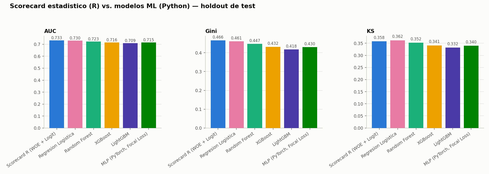
Vista en carrera del mismo entrenamiento — la ventaja del scorecard R sobre el MLP se mantiene mientras la focal loss baja y el AUC sube, epoca a epoca.

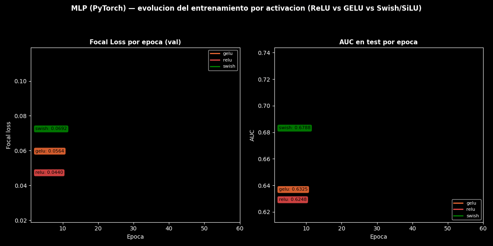
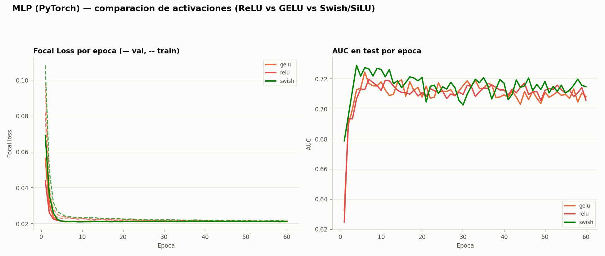

**Enfoque 3 — MLP en PyTorch (`src/deep_learning.py`)**: red totalmente
conectada (64→32→1, BatchNorm + Dropout 0.2) entrenada con **Focal Loss**
(`alpha=0.25, gamma=2.0`) en vez de BCE plana -- concentra el gradiente
en los solicitantes dificiles de separar en vez de diluirlo en el 93.5%
de casos "buenos" ya faciles de clasificar bajo el desbalance de clase.
Se comparan tres funciones de activacion (ReLU, GELU, Swish/SiLU) bajo
el mismo optimizador (AdamW, lr=1e-3, weight_decay=1e-4) y las mismas
60 epocas; Swish gana consistentemente por margen pequeno pero estable
en las tres metricas de discriminacion.

El scorecard de R y el challenger de regresion logistica en Python
practicamente empatan, ambos claramente por delante de los ensambles de
arboles -- un patron bien documentado en modelamiento de riesgo de
credito (Siddiqi, y repetido en toda la literatura de la industria):
cuando la relacion real es cercana a logistico-lineal (como se construyo
aqui) y la muestra es modesta, a los arboles con boosting les cuesta
genuinamente superar a un modelo lineal bien especificado -- y es una
razon real por la que la banca mantiene scorecards interpretables en
produccion en vez de reemplazarlos por completo con ML de caja negra.

**Nota sobre F1**: `f1_at_0.5` es cercano a cero para varios modelos
(ej. 0.012 para regresion logistica) -- esta es la consecuencia
*esperada y correcta* de usar un umbral naive de 0.5 sobre un problema
con 6.5% de prevalencia, no un bug: casi ningun solicitante tiene una
probabilidad predicha por encima de 0.5 cuando la tasa base es tan baja.
`f1_best_threshold` (~0.27–0.28 en todos los modelos, encontrado via la
curva precision-recall) es la metrica que si refleja la discriminacion
real.

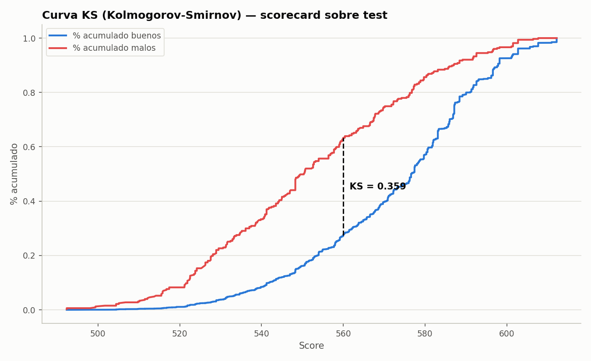
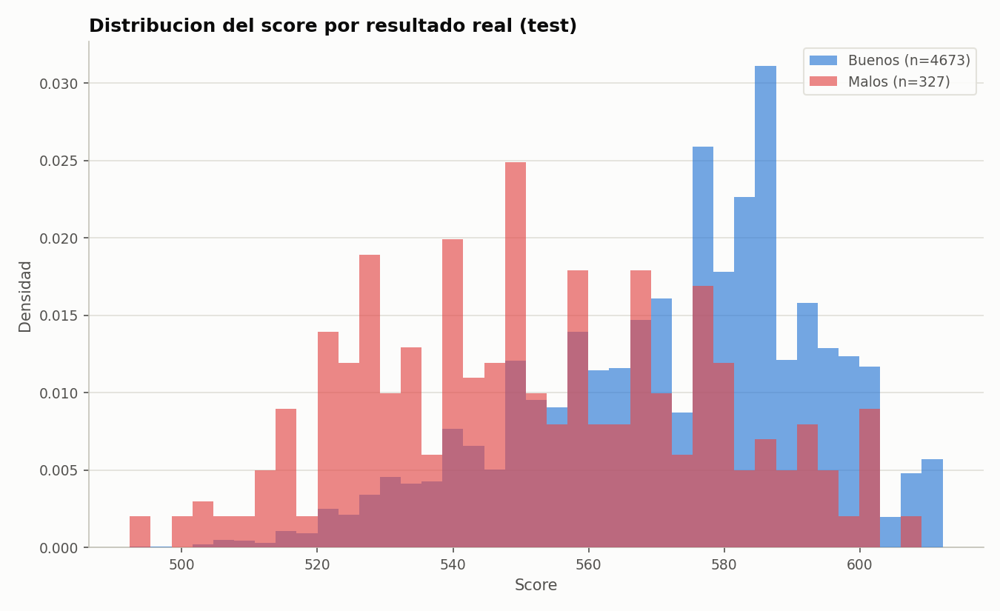

**Version interactiva** (hover para ver tasa de malos, n y rango de
score por decil; zoom/pan): [distribucion del score por decil de riesgo, set de test](https://htmlpreview.github.io/?https://github.com/Rxyxs/credit-risk-scoring-lab/blob/main/01-polyglot-scorecard-r-python-c/outputs/interactive/score_distribution_by_risk_band.html)
-- generado por `src/visualization/interactive_score_distribution.py`,
HTML Plotly autocontenido (sin servidor, sin JS externo).

### 4. Population Stability Index — monitoreo de drift

| Comparacion | PSI | Interpretacion |
|---|---|---|
| Test vs. train | 0.0006 | Estable (esperado -- mismo proceso generador, split aleatorio) |
| Poblacion simulada mas riesgosa vs. train | 0.238 | Cambio moderado-a-significativo (detectado correctamente) |

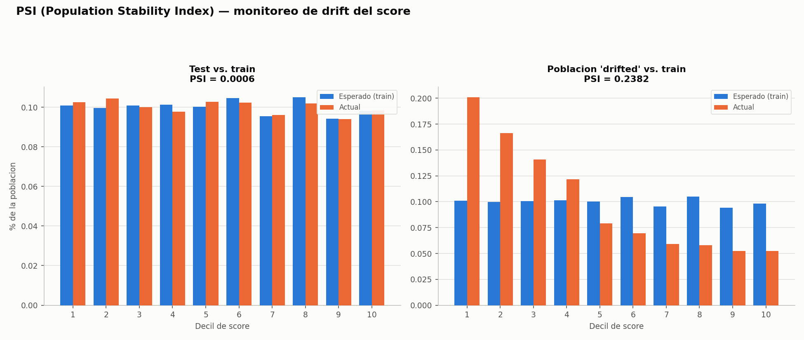

El PSI cercano a cero en el holdout aleatorio genuino es en si mismo un
resultado de validacion: muestra que el metodo no da falsas alarmas
sobre variacion muestral ordinaria, lo que hace que el PSI elevado sobre
la poblacion simulada deliberadamente mas riesgosa (sobre-representada
en empleo informal y DTI alto) sea una senal creible y no ruido.

### 5. Explicabilidad SHAP (mejor challenger ML)

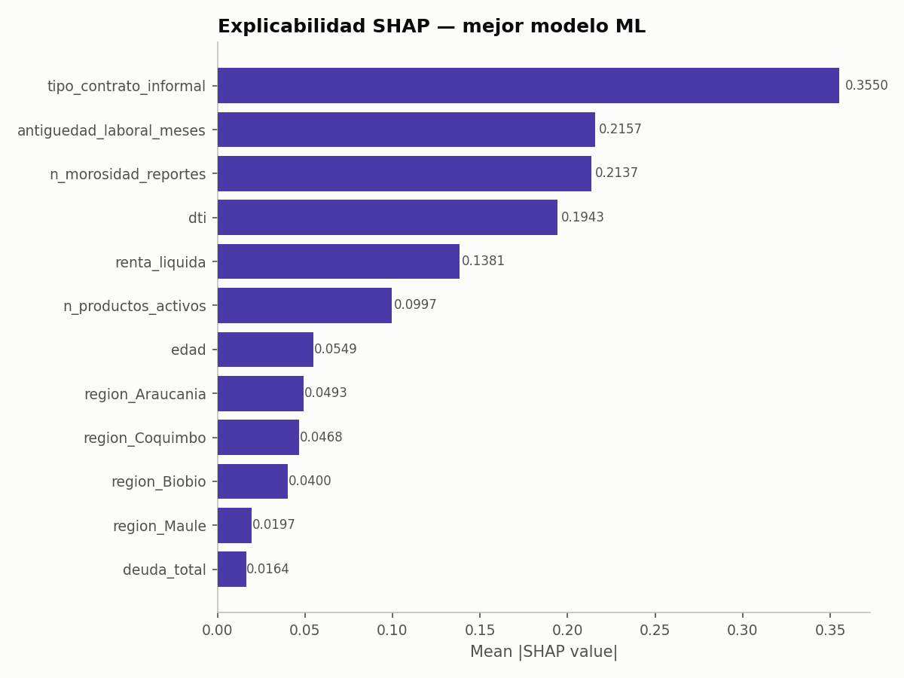

`tipo_contrato_informal` es el driver mas fuerte tanto en el ranking
independiente de R (IV) como en el de Python (SHAP) -- dos metodologias
distintas coincidiendo en la misma respuesta es, en si mismo, un chequeo
cruzado util, no solo una coincidencia de como se genero el dato.

### 6. Motor en C — correctitud y desempeno

| Chequeo | Resultado |
|---|---|
| Diferencia absoluta maxima vs. el score calculado por R | **4.79 × 10⁻¹¹** (redondeo de punto flotante -- efectivamente exacto) |
| Throughput, C (ctypes) | **270,592,055 filas/seg** |
| Throughput, NumPy vectorizado | 24,310,671 filas/seg |
| Throughput, loop en Python puro | 972,886 filas/seg |
| **Speedup, C vs. Python puro** | **278.1x** |
| **Speedup, C vs. NumPy** | **11.1x** |
| Benchmark standalone en C (sin overhead de ctypes/Python, 2M filas, 3 corridas) | 133-154 millones de filas/seg |

Los numeros de throughput son de reloj de pared y varian algo de
corrida en corrida segun la carga de la maquina (esta es la ultima
corrida medida); el chequeo de correctitud (coincidencia bit a bit
contra R) no varia y es el numero que realmente importa para poner el
motor en produccion.


### 7. Serving en produccion — FastAPI + motor en C, Champion vs. Challenger

`src/api.py` pone al Champion (motor C) y al Challenger ML detras del
mismo servicio FastAPI, siguiendo exactamente el patron Champion/Challenger
que usa la banca para monitorear un modelo candidato contra el que esta
en produccion antes de promoverlo. `src/champion_scoring.py` reimplementa
el binning WOE de `01_woe_binning.R` en Python puro (sin R en runtime),
leyendo los cortes de bin y la tabla de puntos que R ya dejo escritos --
y aun asi reproduce el score exacto de R (diferencia absoluta maxima
4.77×10⁻¹¹, la misma precision que el benchmark en lote de arriba).

Latencia end-to-end por solicitante, medida sobre 3.000 llamadas
(`notebooks/02_Reject_Inference_and_Latency.ipynb`):

| Percentil | Champion (motor C) | Challenger (scikit-learn) | Speedup |
|---|---|---|---|
| p50 | 28.0 µs | 4.230,9 µs | **151.1x** |
| p95 | 42.5 µs | 5.004,5 µs | 117.8x |
| p99 | 80.7 µs | 6.667,8 µs | **82.6x** |

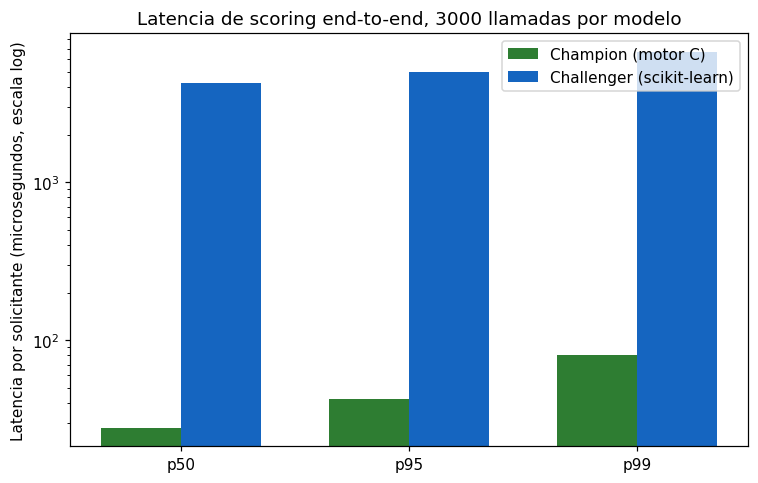

La brecha es mas chica que la ventaja de throughput *cruda* del motor C
de la Seccion 6 -- se come parte con el overhead del binning y de las
llamadas a funciones en Python -- y aun asi son dos ordenes de magnitud,
porque el camino del Challenger paga codificacion dummy con `pandas`,
escalado, y una llamada a `predict_proba` de scikit-learn por request,
nada de lo cual necesita el lookup compilado sobre la tabla de puntos.

### 8. Reject inference — corrigiendo el sesgo de seleccion

Un scorecard entrenado solo con la cartera aprobada nunca observa el
resultado de un solicitante rechazado -- una limitacion real y bien
conocida de los datos de originacion. `src/reject_inference.py` simula
una politica de aprobacion sobre el score del Champion (75% de tasa de
aprobacion objetivo, transicion logistica suave alrededor del cutoff) y
aplica dos metodos estandar de la industria (Siddiqi, *Credit Risk
Scorecards*, cap. 9) -- **Hard Cutoff** y **Parceling** (hard y soft) --
para inferir etiquetas de los rechazados antes de reentrenar.

Como cada solicitante aca es sintetico, el resultado real de los
"rechazados" en realidad se conoce -- algo que ningun banco real podria
verificar -- lo que permite una validacion honesta en vez de una
suposicion a ciegas:

| Metrica | Valor |
|---|---|
| Tasa de aprobacion simulada | 66.3% |
| Tasa real de malos, aprobados | 4.61% |
| Tasa real de malos, rechazados (solo conocible por ser datos sinteticos) | 10.31% |
| Brecha de sesgo de seleccion | 5.69 puntos |

| Metodo | AUC, test solo-aprobados | AUC, poblacion completa de test |
|---|---|---|
| Sesgado (solo-aprobados) | 0.673 | 0.728 |
| Hard Cutoff | 0.657 | 0.706 |
| **Parceling (hard)** | **0.673** | **0.729** |
| **Parceling (soft)** | **0.674** | **0.729** |

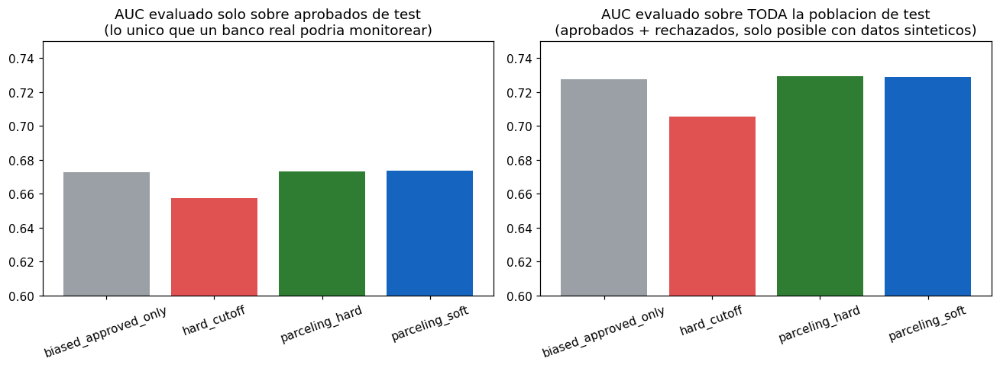

**Hallazgos honestos, no los que elegiria una presentacion comercial:**

- **Parceling mejora moderadamente la generalizacion a la poblacion
  completa de solicitantes; Hard Cutoff la empeora.** Esto coincide con
  la literatura -- Hard Cutoff impone una sola etiqueta binaria por
  rechazado en base a un unico umbral de score, ignorando la tasa de
  malos observada localmente; Parceling la respeta (una tasa inferida por
  banda de score, calibrada a los aprobados de esa misma banda), que es
  justamente por lo que la banca en general lo prefiere.
- **El AUC medido solo sobre la poblacion aprobada de test es
  consistentemente mas bajo que el AUC sobre la poblacion completa, en
  los cuatro metodos** -- un efecto de libro de *restriccion de rango*
  (*range restriction*): la cartera aprobada es, por construccion, una
  submuestra mas angosta y mas segura, asi que cualquier modelo
  discrimina peor dentro de ella. Eso es en si mismo un argumento a favor
  de reject inference: monitorear solo la cartera aprobada subestima
  sistematicamente el poder discriminante real de un modelo, y no permite
  validar si la correccion realmente esta funcionando.
- La PD media predicha por el modelo KGB sesgado (solo-aprobados) sobre
  los rechazados (9.73%) quedo cerca de su tasa real de malos (10.31%) --
  este modelo logistico KGB en particular extrapolo razonablemente bien
  fuera de su rango de entrenamiento, una propiedad de este proceso
  generador sintetico especifico, no algo que se deba asumir en general.

## Conclusion

- **La arquitectura de tres lenguajes no es decorativa -- esta
  verificada de punta a punta.** La salida del motor en C, en lote,
  coincide con el scorecard de R calculado independientemente hasta 11
  decimales, y el ranking SHAP del challenger ML confirma
  independientemente el ranking IV del scorecard de R. Tres
  herramientas distintas, la misma respuesta.
- **El scorecard logistico-WOE tradicional se sostiene frente al ML
  moderno** (Gini 0.466 vs. 0.461 del mejor challenger, ambos claramente
  por delante de los ensambles de arboles crudos) -- un hallazgo
  honesto, poco vistoso pero realista, consistente con la practica
  bancaria real, no un resultado disenado para que gane R.
- **El scorecard concentra el riesgo de forma util**: el peor decil de
  score tiene una tasa de default 3.33x el promedio de cartera, y
  rechazar el peor 20% de solicitantes habria capturado el 52% de todos
  los defaults a 12 meses en este set de test -- el mecanismo concreto
  por el cual un scorecard genera valor.
- **El PSI distingue correctamente ruido de drift real**: ~0 en un
  holdout aleatorio, 0.238 en una poblacion deliberadamente
  desplazada -- una herramienta de gobierno que no da falsas alarmas.
- **La ventaja de latencia del motor en C sobrevive el paso por un
  servicio real**: 151x mas rapido en la mediana y 83x en p99 que el
  Challenger ML, de punta a punta a traves del servicio FastAPI -- no
  solo en el benchmark aislado de aritmetica.
- **El reject inference (Parceling) reduce medible el sesgo de
  seleccion**, y -- igual de importante -- revela que monitorear solo la
  cartera aprobada *subestima* el poder discriminante real de un modelo,
  un efecto de restriccion de rango que es en si mismo un argumento a
  favor de reject inference.
- **La limitacion central, y la mas importante de nombrar**: cada
  solicitante es sintetico, generado por este mismo repositorio a
  partir de un proceso logistico conocido (calibrado, tras detectar una
  primera mala calibracion, a una tasa de default realista de ~6.5%) --
  no datos reales de ningun banco ni del Boletin Comercial/DICOM. Las
  metricas demuestran que el *pipeline* es correcto (metodologia de
  binning, split train/test sin fuga, un motor que reproduce el modelo
  estadistico casi bit a bit, y concordancia honesta entre metodos) --
  no que estos numeros se sostendrian sobre la cartera real de un
  prestamista chileno.

## Trabajo futuro

- Recalibrar contra datos historicos reales (anonimizados, con
  consentimiento) de bureau de credito y solicitudes.
- Extender el motor en C para evaluar un ensamble de arboles de decision
  destilado (no solo el scorecard lineal), para que el path de baja
  latencia pueda servir directamente la superficie de decision del
  challenger ML, no solo intermediarla con una llamada aparte a
  scikit-learn.
- Ajustar el factor de inflacion y el numero de parcels del reject
  inference contra un slice de validacion sintetico separado en vez de
  los valores por defecto usados aca, y extenderlo a los challengers
  basados en arboles.

## Autor

**Pablo Reyes** — [github.com/Rxyxs](https://github.com/Rxyxs)
