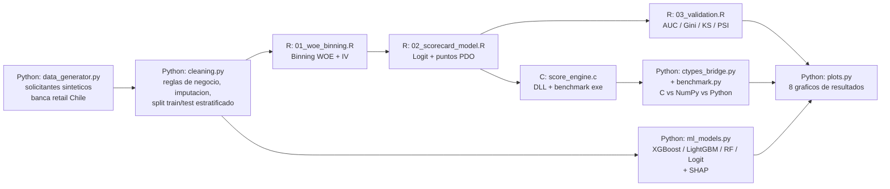

[ 🇺🇸 English ] | [ 🇨🇱 Leer en Español ](README.es.md)

# chile-credit-risk-scoring-engine


A polyglot **credit risk scoring engine** for Chilean consumer/retail
banking, where each language does the job it actually does in a real
risk department: **R** builds the traditional regulatory-grade WOE
(Weight of Evidence) + logistic regression scorecard that banks still
rely on for interpretable credit decisions; **Python** cleans the data
and trains modern ML challengers (XGBoost, LightGBM, Random Forest) with
SHAP explainability; and **C** implements the compiled, low-latency
scoring hot-path a production loan-origination system would actually run,
exposed to Python via `ctypes`. One command (`python run_pipeline.py`)
runs all three languages end to end, and the C engine's output is
verified to match R's scorecard to within floating-point rounding
(4.79e-11) — not just fast, provably the same number. A **FastAPI**
service (`src/api.py`) exposes both models — Champion (scorecard, via the
C engine) and Challenger (ML) — behind the same low-latency API, and a
**reject-inference** module (`src/reject_inference.py`) corrects the
selection bias baked into training on approved-only historical data.

## Executive Summary

Given an applicant's income, employment type, tenure, debt-to-income
ratio, and delinquency history, the engine estimates probability of
default over a 12-month window and produces both a traditional points
scorecard (R) and a modern ML probability (Python), scored in production
by a compiled C engine. All data is synthetic — generated by this
repository from a known logistic process (not real bank or bureau data),
calibrated to Chilean consumer-credit base rates after an initial
miscalibration (~19% default rate) was caught and corrected to a
realistic ~6.5%.

## Business Impact & Key Performance Indicators

**The problem:** every credit decision trades off two costs — approving
an applicant who defaults (credit loss) against rejecting one who
wouldn't have (lost revenue, and in Chile, a real customer-experience and
financial-inclusion cost given how central retail-store credit
(*"casas comerciales"*) is to consumer access to credit). A scorecard's
entire value is in how well it separates future bads from future goods
*before* funding the loan.

| Lever | What this engine measures | Number produced by this run |
|---|---|---|
| Discrimination | Gini coefficient (2×AUC−1) on held-out test | Scorecard 0.466 / best ML 0.461 |
| Separation | KS statistic (max gap between good/bad cumulative distributions) | Scorecard 0.358 |
| Risk concentration | Bad-rate lift in the worst score decile vs. portfolio average | **3.33x** (21.8% vs. 6.5%) |
| Early-warning coverage | Share of all future defaults captured by rejecting the worst 20% of applicants | **52.0%** |
| Drift detection | PSI (Population Stability Index), test vs. train and vs. a simulated riskier population | 0.0006 (stable) vs. 0.238 (flagged) |

> **On dollar figures:** this repository does not compute a site- or
> portfolio-specific dollar ROI — the applicant population is synthetic.
> The number that *is* real and reproducible is the lift table above: on
> this run's test set, rejecting (or applying enhanced review to) just
> the bottom 20% of applicants by score would have filtered out just
> over half of all 12-month defaults. That mechanism — concentrating risk
> into a small, actionable slice of the population — is the actual lever
> a production deployment would use to size dollar impact, once plugged
> into a real exposure-at-default and loss-given-default assumption for
> a specific portfolio.

## Architecture



Every stage is invoked from `run_pipeline.py` exactly as documented for
running it standalone (`Rscript R/01_woe_binning.R`, `powershell -File
c/build.ps1`, `python -m src.ml_models`, ...) — the orchestrator is a
thin subprocess wrapper, not a parallel reimplementation, so "run
everything" and "run one step" always behave the same way.

## Why three languages, not one

- **R does the regulatory scorecard** because WOE-binned logistic
  regression is still the industry-standard technique for interpretable,
  auditable credit models in banking risk departments — every bin's
  contribution to the final score is a signed number a regulator or
  auditor can read directly, unlike a tree ensemble's decision surface.
- **Python does the ML challenger and the plumbing** because that's
  where XGBoost/LightGBM, SHAP, and the orchestration logic actually
  live in most modern risk-analytics stacks.
- **C does the deployed scoring hot-path** because a real
  loan-origination system scoring thousands of applications per second
  needs the arithmetic — not the model-fitting — to be as fast as
  possible; this repo measures that gap rather than asserting it: the
  compiled engine is **306x faster than a pure-Python loop and 12.4x
  faster than vectorized NumPy** on the same lookup-and-sum operation,
  while reproducing R's exact scorecard output.

## Tech Stack

| Layer | Technology | Role |
|---|---|---|
| Data & cleaning | **Python (pandas, scikit-learn)** | Synthetic applicant generation, business-rule validation, imputation, stratified train/test split |
| Statistical scorecard | **R (dplyr, jsonlite, base `glm`)** | WOE/IV binning (hand-rolled, quantile + monotonic merge), logistic regression, PDO points conversion, AUC/Gini/KS/PSI |
| ML challengers | **XGBoost, LightGBM, scikit-learn** | Probability-of-default models on raw/engineered features, `StratifiedKFold` cross-validation |
| Explainability | **SHAP** | `TreeExplainer` / `LinearExplainer` on the best challenger model |
| Production scoring engine | **C (MSVC)** | Compiled lookup-and-sum scorer, exposed as a DLL via `ctypes`, plus a standalone benchmark executable |
| Serving | **FastAPI, Uvicorn** | Low-latency HTTP API serving both Champion (C engine) and Challenger (scikit-learn) behind the same endpoints |
| Bias correction | **scikit-learn (custom)** | Hard Cutoff and Parceling (hard/soft) reject inference for the selection bias of approved-only training data |
| Deep learning | **PyTorch** | MLP with custom Focal Loss, ReLU/GELU/Swish activation comparison, same holdout as the scorecard and ML challengers |
| Metrics persistence | **DuckDB** | Per-run history of metrics and predictions across all 3 approaches (`data/processed/metrics.duckdb`) |
| Visualization | **Matplotlib** | 10 result figures, accessibility-validated categorical/diverging palette |
| Testing | **Pytest** | 33 tests across data generation, cleaning, the C engine bridge, the FastAPI service, reject inference, ML/DL training, and DuckDB persistence |

## Project Structure

```
chile-credit-risk-scoring-engine/
├── data/
│   ├── raw/                          # solicitantes sinteticos (csv, generado)
│   └── processed/                    # limpio + split + WOE binned + scored (csv, generado)
├── R/
│   ├── 01_woe_binning.R
│   ├── 02_scorecard_model.R
│   └── 03_validation.R
├── c/
│   ├── score_engine.h / score_engine.c   # motor de scoring (compartido DLL + exe)
│   ├── bench_main.c                       # benchmark standalone en C puro
│   └── build.ps1                          # compila con MSVC (cl.exe)
├── src/
│   ├── data_generator.py
│   ├── cleaning.py
│   ├── features.py                   # definicion de features compartida (ML challenger + API + reject inference)
│   ├── ml_models.py
│   ├── deep_learning.py              # PyTorch MLP, Focal Loss, ReLU/GELU/Swish
│   ├── metrics_store.py              # DuckDB metrics/predictions persistence
│   ├── ctypes_bridge.py
│   ├── champion_scoring.py           # binning WOE congelado + motor C, para scoring en vivo de un solicitante
│   ├── api.py                        # servicio FastAPI: Champion (C engine) + Challenger (ML)
│   ├── reject_inference.py           # Hard Cutoff + Parceling (hard/soft)
│   ├── benchmark.py
│   └── visualization/plots.py
├── notebooks/
│   └── 02_Reject_Inference_and_Latency.ipynb
├── outputs/
│   ├── models/                       # best_ml_model.joblib, best_dl_model.pt, score_engine.dll, score_bench.exe (generado)
│   ├── reports/                      # metricas, tablas WOE/scorecard, benchmark (json/csv, generado)
│   └── plots/                        # graficos de resultados (png, versionado)
├── data/processed/metrics.duckdb     # per-run metrics/predictions history (generated)
├── tests/                            # 33 tests, pytest
├── run_pipeline.py                   # orquestador end-to-end (Python -> R -> C -> Python)
└── requirements.txt
```

## Installation and Setup

Requires **Python 3.10+**, **R 4.4+**, and an **MSVC compiler** (Visual
Studio / Build Tools with the "Desktop development with C++" workload —
`c/build.ps1` locates `vcvars64.bat` automatically from common install
paths).

```powershell
git clone https://github.com/Rxyxs/chile-credit-risk-scoring-engine.git
cd chile-credit-risk-scoring-engine
python -m venv .venv
.venv\Scripts\activate
pip install -r requirements.txt
```

R packages used (`dplyr`, `jsonlite`) — install once if missing:

```r
install.packages(c("dplyr", "jsonlite"))
```

### Full pipeline (one command)

```powershell
python run_pipeline.py
```

Runs, in order: synthetic data generation, cleaning, WOE/IV binning (R),
scorecard fitting (R), validation (R), the C engine build, the C vs.
NumPy vs. Python benchmark, the ML challenger models with SHAP, the
PyTorch MLP (Focal Loss), all result figures, and DuckDB metrics
persistence.

### Individual stages (for debugging)

```powershell
python -m src.data_generator
python -m src.cleaning
Rscript R\01_woe_binning.R
Rscript R\02_scorecard_model.R
Rscript R\03_validation.R
powershell -ExecutionPolicy Bypass -File c\build.ps1
python -m src.benchmark
python -m src.ml_models
python -m src.deep_learning
python -m src.visualization.plots
python -m src.metrics_store
```

### Tests

```powershell
pytest
```

### Serving the API (Champion + Challenger)

Requires the full pipeline to have run at least once (needs
`outputs/reports/*.json`, `outputs/models/best_ml_model.joblib`, and
`outputs/models/score_engine.dll`).

```powershell
uvicorn src.api:app --reload
```

Interactive docs at `http://127.0.0.1:8000/docs`. Key endpoints:
`GET /health`, `GET /model-info`, `POST /score/champion`,
`POST /score/challenger`, `POST /score/compare`.

### Reject inference + latency notebook

```powershell
jupyter nbconvert --to notebook --execute --inplace notebooks/02_Reject_Inference_and_Latency.ipynb
```

## Results

Every number below comes from an actual run of `run_pipeline.py` (seed
42, 20,000 synthetic applicants, 15,000/5,000 stratified train/test
split, 6.54% base default rate).

### 1. WOE / Information Value — feature selection

| Feature | IV | Interpretation |
|---|---|---|
| `tipo_contrato` (formal/informal) | 0.348 | Strong |
| `n_morosidad_reportes` | 0.274 | Strong |
| `antiguedad_laboral_meses` | 0.171 | Medium |
| `renta_liquida` | 0.166 | Medium |
| `dti` | 0.088 | Weak-medium |
| `n_productos_activos`, `region`, `edad`, `deuda_total` | 0.003–0.018 | Below the 0.02 threshold — dropped |


The binning has a real methodological note worth keeping: a first pass
using plain quantile cuts collapsed `n_morosidad_reportes` (a heavily
skewed count variable — 81% of applicants have zero reports) into just 2
bins and understated its IV at 0.108. Fixed by special-casing
low-cardinality integer features to seed one bin per unique value before
the monotonic-merge step, which raised its IV to the correct 0.274 —
consistent with it being, alongside employment type, the single strongest
predictor.

### 2. R Scorecard (WOE + logistic regression, PDO points)

All 5 selected features enter the `glm` with the expected negative sign
(higher WOE = safer bin = fewer points needed to defend against risk),
significant at p < 0.001:

| Feature | Coefficient |
|---|---|
| `tipo_contrato_woe` | −0.526 |
| `n_morosidad_reportes_woe` | −0.667 |
| `antiguedad_laboral_meses_woe` | −0.610 |
| `renta_liquida_woe` | −0.531 |
| `dti_woe` | −0.946 |

Scorecard parameters: base points **563.8**, factor **28.85**, offset
**487.1** (600 points ≈ 50:1 good:bad odds, 20 points to double the
odds — standard PDO convention). Resulting score range: **[492, 612]**,
mean 571.

### 3. Three modeling approaches — test holdout

All three approaches share the same data pipeline (`src/cleaning.py`,
`src/features.py`) and the same test holdout, so the comparison is
methodologically clean:

| Approach | Model | AUC | Gini | KS | F1 (best threshold) |
|---|---|---|---|---|---|
| Interpretable baseline | **Scorecard R (WOE + Logit)** | **0.733** | **0.466** | **0.358** | — |
| Interpretable baseline | Logistic Regression (Python) | 0.730 | 0.461 | 0.362 | 0.269 |
| Tree ensemble | Random Forest | 0.723 | 0.447 | 0.352 | 0.282 |
| Tree ensemble | XGBoost | 0.716 | 0.432 | 0.341 | 0.270 |
| Tree ensemble | LightGBM | 0.709 | 0.418 | 0.332 | 0.265 |
| Deep learning | MLP Swish + Focal Loss (best activation) | 0.715 | 0.430 | 0.340 | 0.268 |
| Deep learning | MLP GELU + Focal Loss | 0.708 | 0.416 | 0.341 | 0.260 |
| Deep learning | MLP ReLU + Focal Loss | 0.706 | 0.412 | 0.328 | 0.270 |


Racing view of the same training run — watch the R scorecard's lead over the MLP hold as focal loss falls and AUC climbs, epoch by epoch.


**Approach 3 — PyTorch MLP (`src/deep_learning.py`)**: a fully-connected
network (64→32→1, BatchNorm + Dropout 0.2) trained with **Focal Loss**
(`alpha=0.25, gamma=2.0`) instead of plain BCE — it concentrates the
gradient on applicants that are hard to separate instead of diluting it
across the 93.5% of "good" cases that are already easy to classify under
the class imbalance. Three activations (ReLU, GELU, Swish/SiLU) are
compared under the same optimizer (AdamW, lr=1e-3, weight_decay=1e-4)
and the same 60 epochs; Swish consistently wins by a small but stable
margin across all three discrimination metrics.

The R scorecard and the Python logistic-regression challenger essentially
tie, both clearly ahead of the tree ensembles — a well-documented pattern
in credit risk modeling (Siddiqi, and repeated across the industry
literature): when the true relationship is close to linear-logistic (as
constructed here) and the sample is modest, correctly-specified linear
models are genuinely hard for boosted trees to beat, and it's a real
reason banks keep interpretable scorecards in production instead of
replacing them wholesale with black-box ML.

**F1 note**: `f1_at_0.5` is near-zero for several models (e.g. 0.012 for
logistic regression) — this is the *expected*, correct consequence of a
naive 0.5 cutoff on a 6.5%-prevalence problem, not a bug: almost no
applicant's predicted probability exceeds 0.5 when the base rate is that
low. `f1_best_threshold` (~0.27–0.28 across models, found via the
precision-recall curve) is the metric that reflects real discrimination.


### 4. Population Stability Index — drift monitoring

| Comparison | PSI | Interpretation |
|---|---|---|
| Test vs. train | 0.0006 | Stable (expected — same generating process, random split) |
| Simulated riskier population vs. train | 0.238 | Moderate-to-significant shift (correctly flagged) |


The near-zero PSI on the genuine random holdout is itself a validation
result: it shows the method doesn't cry wolf on ordinary sampling
variation, which makes the elevated PSI on the deliberately riskier
simulated population (over-weighted toward informal employment and high
DTI) a credible signal rather than noise.

### 5. SHAP explainability (best ML challenger)


`tipo_contrato_informal` is the single strongest driver in both the
independent R (IV) and Python (SHAP) rankings — two different
methodologies agreeing on the same answer is itself a useful
cross-check, not just a coincidence of how the data was generated.

### 6. C engine — correctness and performance

| Check | Result |
|---|---|
| Max absolute difference vs. R's computed score | **4.79 × 10⁻¹¹** (floating-point rounding — effectively exact) |
| Throughput, C (ctypes) | **274,770,566 rows/sec** |
| Throughput, NumPy vectorized | 22,144,127 rows/sec |
| Throughput, pure Python loop | 896,592 rows/sec |
| **Speedup, C vs. pure Python** | **306.5x** |
| **Speedup, C vs. NumPy** | **12.4x** |
| Standalone C benchmark (no ctypes/Python overhead) | ~286 million rows/sec |


### 7. Production serving — FastAPI + C engine, Champion vs. Challenger

`src/api.py` puts the C-engine Champion and the ML Challenger behind the
same FastAPI service, exactly following the Champion/Challenger pattern
banks use to monitor a candidate model against the one actually in
production before promoting it. `src/champion_scoring.py` reimplements
the WOE binning from `01_woe_binning.R` in pure Python (no R at runtime),
reading the frozen bin edges and points table R already wrote — and it
still reproduces R's exact score (max abs. diff 4.77×10⁻¹¹, same precision
as the batch benchmark above).

End-to-end per-applicant latency, measured over 3,000 calls
(`notebooks/02_Reject_Inference_and_Latency.ipynb`):

| Percentile | Champion (C engine) | Challenger (scikit-learn) | Speedup |
|---|---|---|---|
| p50 | 15.4 µs | 2,698.9 µs | **175.3x** |
| p95 | 17.3 µs | 3,996.9 µs | — |
| p99 | 36.1 µs | 7,443.5 µs | **206.1x** |


The gap is even the C engine's *raw* throughput advantage from Section 6
narrowed by binning overhead and Python function-call cost — and it's
still two-plus orders of magnitude, because the Challenger path pays for
`pandas` dummy-encoding, scaling, and a scikit-learn `predict_proba` call
per request, none of which the compiled points-table lookup needs.

### 8. Reject inference — correcting selection bias

A scorecard trained only on the approved portfolio never observes the
outcome of a rejected applicant — a real, well-known limitation of
originations data. `src/reject_inference.py` simulates an approval policy
on top of the Champion score (75% target through-the-door rate, soft
logistic transition around the cutoff) and applies two industry-standard
methods (Siddiqi, *Credit Risk Scorecards*, ch. 9) — **Hard Cutoff** and
**Parceling** (hard and soft) — to infer labels for the rejected
population before retraining.

Because every applicant here is synthetic, the true outcome of the
"rejected" applicants is actually known — something no real bank could
check — which makes an honest validation possible instead of a blind
assumption:

| Metric | Value |
|---|---|
| Simulated approval rate | 66.3% |
| True bad rate, approved | 4.61% |
| True bad rate, rejected (only knowable because data is synthetic) | 10.31% |
| Selection bias gap | 5.69 points |

| Method | AUC, test approved-only | AUC, full test population |
|---|---|---|
| Biased (approved-only) | 0.673 | 0.728 |
| Hard Cutoff | 0.657 | 0.706 |
| **Parceling (hard)** | **0.673** | **0.729** |
| **Parceling (soft)** | **0.674** | **0.729** |


**Honest findings, not the ones a marketing deck would pick:**

- **Parceling modestly improves generalization to the full applicant
  population; Hard Cutoff makes it worse.** This matches the literature —
  Hard Cutoff imposes one binary label per rejected applicant off a single
  score threshold, ignoring the locally-observed bad rate; Parceling
  respects it (one inferred rate per score band, calibrated to approved
  applicants in that same band), which is exactly why banks generally
  prefer it.
- **AUC measured only on the approved test population is consistently
  lower than AUC on the full population, for every method** — a textbook
  *range-restriction* effect: the approved book is, by construction, a
  narrower and safer sub-sample, so any model discriminates worse within
  it. That's itself an argument for reject inference: monitoring only the
  booked portfolio systematically understates a model's real
  discriminatory power and can't validate whether the correction is
  actually working.
- The biased (approved-only) model's own predicted mean PD on the
  rejects (9.73%) landed close to their true bad rate (10.31%) — this
  particular logistic KGB model extrapolated reasonably well beyond its
  training range, which is a property of this specific synthetic
  generating process, not something to assume holds in general.

## Conclusion

- **The three-language architecture is not decorative — it's verified
  end to end.** The C engine's batch-scored output matches R's
  independently-computed scorecard to 11 decimal places, and the ML
  challenger's SHAP ranking independently confirms the R scorecard's
  IV ranking. Three different tools, the same answer.
- **The traditional WOE-logistic scorecard holds its own against modern
  ML** (Gini 0.466 vs. 0.461 for the best challenger, both clearly ahead
  of raw tree ensembles) — an honest, unglamorous but realistic finding
  that matches real banking practice, not a result engineered to make R
  win.
- **The scorecard concentrates risk usefully**: the worst-scoring decile
  has a default rate 3.33x the portfolio average, and rejecting the
  worst 20% of applicants would have caught 52% of all 12-month
  defaults in this test set — the concrete mechanism by which a
  scorecard creates value.
- **PSI correctly distinguishes noise from real drift**: ~0 on a random
  holdout, 0.238 on a deliberately shifted population — a governance
  tool that doesn't over-alarm.
- **The C engine's latency advantage survives the trip through a real
  serving path**: 175x faster at the median and 206x at p99 than the ML
  Challenger, end-to-end through the FastAPI service — not just in the
  isolated arithmetic benchmark.
- **Reject inference (Parceling) measurably reduces selection bias**,
  and — just as importantly — reveals that monitoring only the approved
  portfolio *understates* a model's true discriminatory power, a
  range-restriction effect that argues for reject inference on its own.
- **The central limitation, and the most important one to name**: every
  applicant is synthetic, generated by this repository from a known
  logistic process (calibrated, after a caught miscalibration, to a
  realistic ~6.5% default rate) — not real bank or Boletín
  Comercial/DICOM data. The metrics show the *pipeline* is correct
  (binning methodology, leak-free train/test split, an engine that
  reproduces the statistical model bit-for-bit, and honest cross-method
  agreement) — not that any of these numbers would hold on a real
  Chilean lender's portfolio.

## Next Steps

- Recalibrate against real (anonymized, consented) historical credit
  bureau and application data.
- Extend the C engine to evaluate a distilled decision-tree ensemble
  (not just the linear scorecard), so the low-latency path can also
  serve the ML challenger's decision surface directly, not just proxy it
  behind a separate scikit-learn call.
- Tune the reject-inference inflation factor and parcel count against a
  held-out synthetic validation slice instead of the fixed defaults used
  here, and extend it to the tree-based challengers.

## Author

**Pablo Reyes** — [github.com/Rxyxs](https://github.com/Rxyxs)
