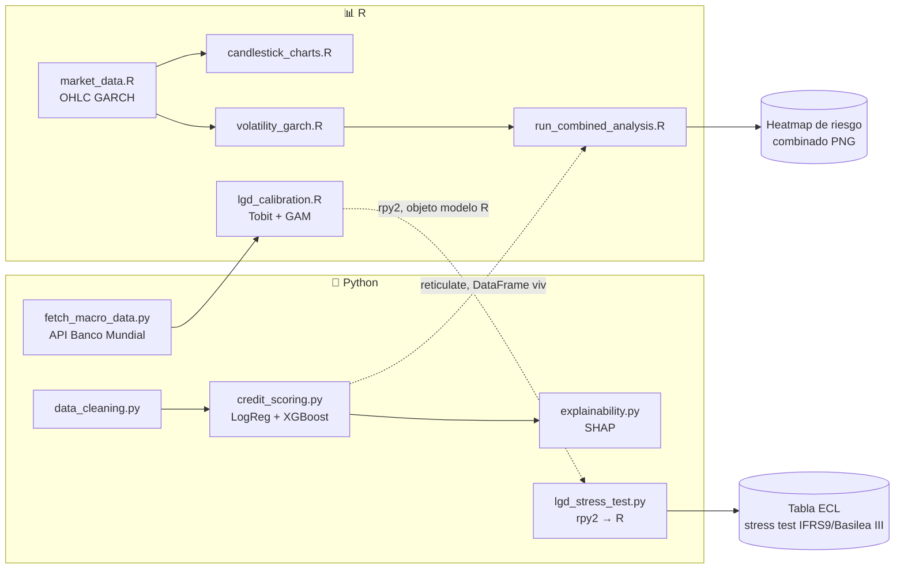
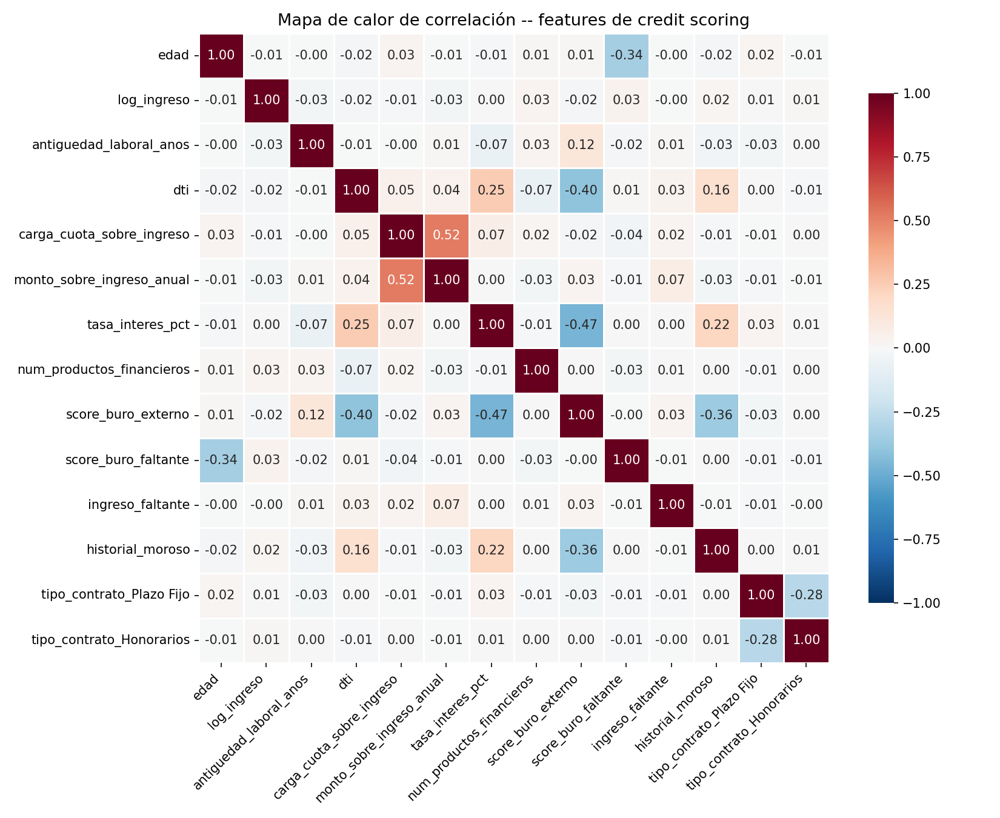
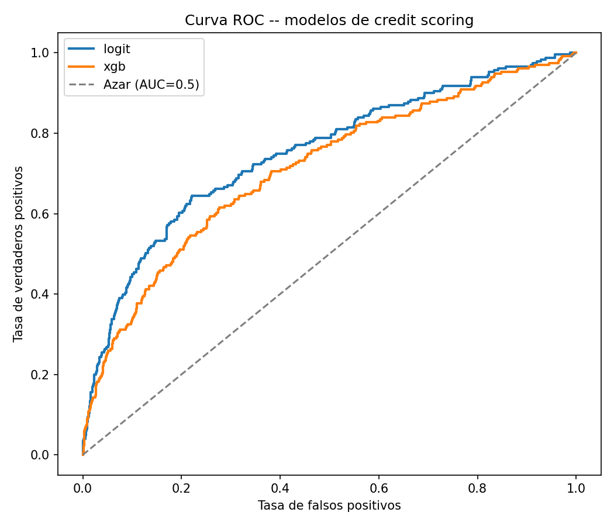
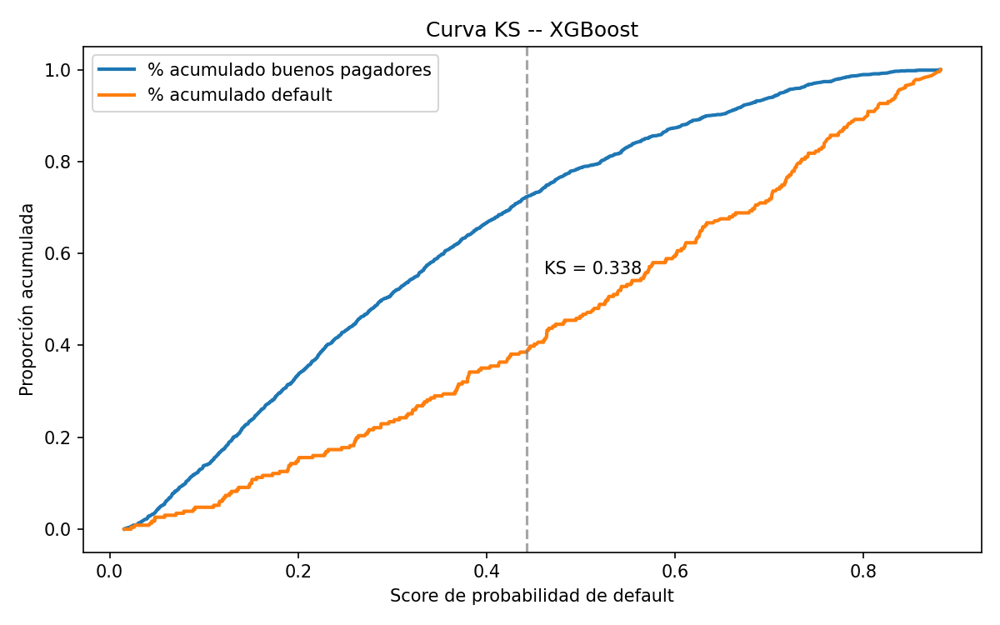
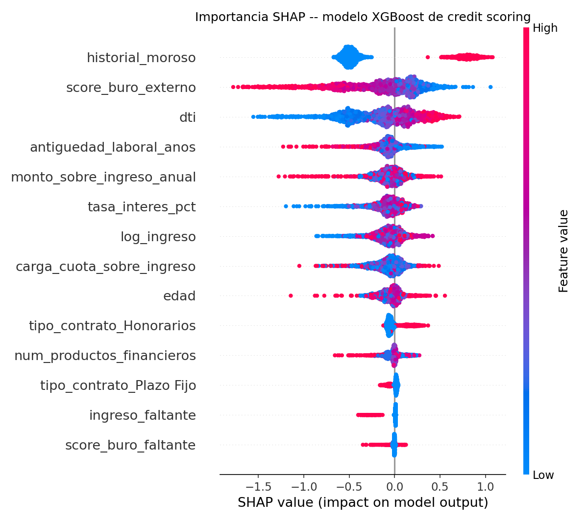
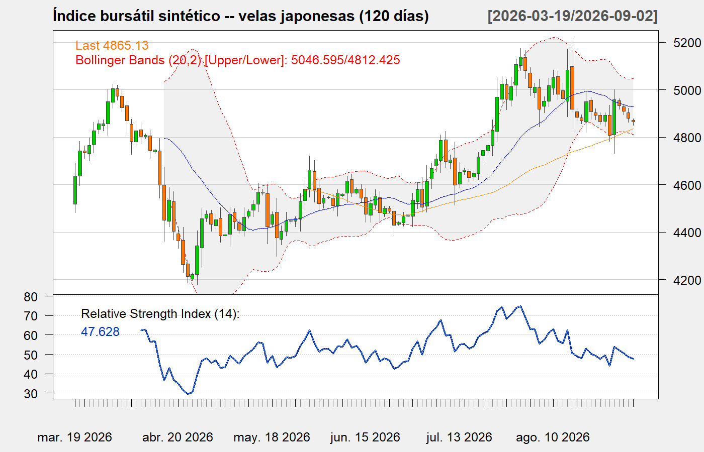

<div align="center">

# 💳 Credit Risk & Market Analytics (R + Python)

**Un proyecto de interoperabilidad real y BIDIRECCIONAL entre R y Python -- Python para limpieza de datos y credit scoring, R para análisis de mercado con velas, volatilidad GARCH y calibración empírica de LGD, conectados por dos puentes independientes en direcciones opuestas: `reticulate` (R llama a Python) y `rpy2` (Python llama a R)**

🌐 **[English](README.md)** | **[Español](README.es.md)**

[](https://www.python.org/)
[](https://www.r-project.org/)
[](https://rstudio.github.io/reticulate/)
[](https://rpy2.github.io/)
[](https://xgboost.readthedocs.io/)
[](https://www.quantmod.com/)
[](https://cran.r-project.org/package=AER)
[](https://data.worldbank.org/)
[](../LICENSE)

</div>

---

## Por qué lo construí así

Quería un proyecto donde R y Python no fueran solo dos carpetas una al lado de la otra -- donde usar ambos lenguajes fuera el punto real, no una casilla marcada. La gestión de riesgo crediticio me dio una división natural: en Python recurro a limpieza de datos y ML (pandas, scikit-learn, XGBoost, SHAP), en R recurro a trabajo estadístico/econométrico riguroso y su graficación financiera nativa (velas de `quantmod`, `rugarch` para volatilidad, `AER`/`mgcv` para regresión censurada y no lineal) -- así que construí la mitad de credit scoring en Python y la mitad de riesgo de mercado en R, y los conecté con **dos puentes independientes en direcciones opuestas**: `reticulate` (R llama directamente a Python y recibe de vuelta un DataFrame de pandas vivo, convertido a data.frame de R) para el mapa de calor combinado original, y `rpy2` (Python llama directamente a R y carga un modelo R ya entrenado) para el nuevo pipeline de stress test de LGD. Ninguna direccion es "leer un CSV que el otro lenguaje dejo por ahi" -- ambas son el interprete real de un lenguaje ejecutando el codigo del otro en el mismo proceso. Sin dashboard, sin app de visualización aparte -- cada gráfico es un archivo estático, generado una vez por el pipeline, tal como se pidió.

## Encuadre de negocio

Dos preguntas de riesgo que los bancos gestionan juntas pero rara vez visualizan juntas:

1. **Riesgo de crédito**: dado el perfil financiero de un solicitante, ¿cuál es su probabilidad de default (PD)?
2. **Riesgo de mercado**: ¿el entorno de mercado actual está tranquilo o turbulento -- y eso cambia cuánta pérdida debería esperar de mi cartera de crédito?

La segunda pregunta importa por el **"wrong-way risk"**: las tasas de default y la volatilidad de mercado tienden a subir juntas (recesiones, shocks de tasas). La pieza central de este proyecto es un mapa de calor que estresa la pérdida esperada de cada banda de riesgo crediticio contra tres regímenes de volatilidad de mercado, combinando la salida de un modelo ML de Python con la salida de un modelo econométrico de R en un número que un comité de riesgo podría realmente leer.

## Impacto de Negocio e Indicadores Clave (KPIs)

| Métrica | Resultado | Qué significa |
|---|---|---|
| Discriminación del modelo de PD (Regresión Logística) | AUC-ROC 0,750, KS 0,424, Gini 0,501 | Le gana a XGBoost en este dataset -- reportado directamente, no la historia de "el modelo más sofisticado siempre gana" |
| LGD empírica, escenario Base (GAM, anclado a macro real) | 67,4% | vs. el supuesto plano típico de industria de 45% usado en otra parte del mismo repositorio, como comparación honesta de línea base |
| LGD empírica, escenario Severamente Adverso (anclado a COVID 2020) | 83,7% | +16,3 puntos sobre Base -- un salto de riesgo de cola genuino, impulsado por macro, no un multiplicador ajustado a mano |
| ECL de portafolio, Base → Severamente Adverso | $3,66B → $4,54B CLP | **+24,2%** de pérdida estresada bajo un escenario de recesión genuinamente histórico (staging IFRS9 de 3 etapas) |
| Brecha LGD lineal (Tobit) vs. no lineal (GAM), recesión severa | 73,5% vs. 82,1% | Una subestimación de 8,6 puntos del riesgo de cola por asumir una relación macro lineal |

## Arquitectura (Mermaid)



## Arquitectura

```
python/                              r/
├── data_cleaning.py                 ├── market_data.R
│   (datos sucios → pipeline         │   (precios OHLC simulados via
│    de limpieza documentado)        │    proceso GARCH(1,1))
├── feature_engineering.py           ├── candlestick_charts.R
│   (DTI, carga de cuota)            │   (velas quantmod + Bollinger/
├── credit_scoring.py                │    SMA/RSI)
│   (LogReg + XGBoost, AUC/KS/Gini)  ├── volatility_garch.R
├── visualizations.py                │   (ajuste GARCH(1,1) + bandas
│   (heatmap correlación, ROC, KS)   │    de régimen de volatilidad)
├── explainability.py                ├── lgd_calibration.R
│   (SHAP)                           │   (Tobit + GAM, LGD empirica
├── fetch_macro_data.py              │    sobre ciclo macro real de Chile)
│   (World Bank API, indicadores    └── run_combined_analysis.R
│    macro reales de Chile)              (reticulate → Python,
├── lgd_stress_test.py                    heatmap combinado ilustrativo)
│   (rpy2 → R, stress test
│    IFRS9/Basilea III sobre LGD)
└── orchestrator.py
    (corre los 4 pasos de credit scoring)
                    ↓                              ↑
                    └──────── reticulate ───────────┘
                        (R llama a Python directo,
                         recibe un DataFrame vivo)
                    ↑                              ↓
                    └──────────  rpy2  ─────────────┘
                    (Python llama a R directo,
                     carga un modelo R entrenado)

run_pipeline.R  →  corre los 8 pasos en orden (ver Uso abajo)
```

`run_pipeline.R` invoca cada paso como un **subproceso independiente** (el `python.exe` del venv para los pasos Python, `Rscript` para los pasos R) en vez de encadenar archivos R con `source()` -- una lección heredada de un proyecto anterior de esta misma línea de trabajo, donde `source()` saltaba en silencio la guardia de "ejecutar como programa principal" de cada script.

## Stack tecnológico

| Capa | Elección |
|---|---|
| Limpieza de datos / ML | Python 3.10, pandas, scikit-learn, XGBoost, SHAP |
| Deep learning | PyTorch (CPU) -- loss custom focal-BCE, comparación de activaciones ReLU/GELU/Swish |
| Persistencia de métricas | DuckDB (embebido, archivo local) |
| Análisis de mercado | R 4.4, `quantmod`, `TTR`, `xts` (velas + indicadores técnicos) |
| Modelamiento de volatilidad | `rugarch` (R) -- GARCH(1,1), innovaciones t-Student |
| Datos macro reales | API abierta del Banco Mundial (sin llave) -- crecimiento del PIB, desempleo, inflacion, tasa de deposito de Chile, 1991-2024 |
| Calibracion empirica de LGD | `AER::tobit` (Tobit censurado en dos colas, [0,1]) + `mgcv::gam` (GAM familia Beta, sensibilidad no lineal al ciclo macro) |
| Stress testing | Simulacion de ECL de 3 stages tipo Basilea III/IFRS9, escenarios anclados a episodios macro reales de Chile |
| Puente R → Python | `reticulate` |
| Puente Python → R | `rpy2` |
| Visualización | matplotlib/seaborn (Python), ggplot2 (R) -- PNGs estáticos, más un grafico interactivo Plotly HTML autocontenido, sin dashboard |

## Estructura del repositorio

```
credit-risk-market-analytics-r-python/
├── python/
│   ├── data_cleaning.py            # datos sinteticos sucios + limpieza documentada
│   ├── feature_engineering.py      # razones financieras (DTI, carga de cuota)
│   ├── credit_scoring.py           # LogisticRegression + XGBoost, AUC/KS/Gini
│   ├── credit_scoring_mlp.py       # MLP en PyTorch, loss focal-BCE custom, ReLU/GELU/Swish
│   ├── metrics_store.py            # persiste metricas/predicciones comparativas en DuckDB
│   ├── visualizations.py           # heatmap de correlacion, ROC, curva KS, graficos de comparacion MLP
│   ├── explainability.py           # resumen SHAP
│   ├── fetch_macro_data.py         # indicadores macro reales de Chile, API Banco Mundial
│   ├── lgd_stress_test.py          # rpy2 -> R, stress test IFRS9/Basilea III
│   ├── orchestrator.py             # corre el lado Python de punta a punta
│   └── interactive_garch_overlay.py  # Plotly HTML, overlay de regimen de volatilidad GARCH
├── r/
│   ├── 00_setup.R                  # instalacion de paquetes R
│   ├── market_data.R               # precios OHLC sinteticos via GARCH(1,1)
│   ├── candlestick_charts.R        # velas quantmod + SMA/BBands/RSI
│   ├── volatility_garch.R          # ajuste GARCH(1,1) + bandas de regimen
│   ├── lgd_calibration.R           # Tobit + GAM, LGD empirica sobre datos macro reales
│   └── run_combined_analysis.R     # puente reticulate + heatmap ilustrativo
├── tests/                          # tests unitarios pytest para el MLP + persistencia DuckDB
├── run_pipeline.R                  # orquestador maestro (basado en subprocesos, 8 pasos)
├── data/                           # CSVs generados (en .gitignore)
├── output/
│   ├── models/                     # modelos entrenados (generado)
│   ├── tables/                     # tablas de resultados (generado)
│   ├── figures/                    # graficos PNG (versionado)
│   ├── interactive/                # grafico Plotly HTML autocontenido (versionado)
│   └── credit_risk_metrics.duckdb  # metricas comparativas de modelos (generado, en .gitignore)
├── requirements.txt                # dependencias Python
├── .gitignore
├── README.md
└── README.es.md
```

La licencia y el resumen general del laboratorio viven un nivel arriba,
en la raiz del repositorio (este proyecto comparte el `LICENSE` de la
raiz con el otro laboratorio).

## Instalación

```powershell
git clone https://github.com/Rxyxs/credit-risk-market-analytics-r-python.git
cd credit-risk-market-analytics-r-python

python -m venv .venv
.venv\Scripts\activate
pip install -r requirements.txt
# requirements.txt ya fija torch/duckdb/pytest; si necesitas el wheel CPU-only
# de torch explicitamente: pip install torch --index-url https://download.pytorch.org/whl/cpu

Rscript r/00_setup.R    # instala dplyr, ggplot2, quantmod, TTR, xts, rugarch, reticulate
Rscript -e 'install.packages(c("AER"), repos="https://cloud.r-project.org")'   # mgcv viene con R base

# rpy2 necesita poder encontrar R al importarse -- python/lgd_stress_test.py
# auto-detecta la instalacion mas nueva en C:\Program Files\R\R-* y setea
# R_HOME/PATH por ti, no hace falta configurar variables de entorno a mano
# en Windows.
```

## Uso

```powershell
Rscript run_pipeline.R
```

Corre los 8 pasos en orden: generación/limpieza/scoring/SHAP en Python → datos macro reales de Chile (API Banco Mundial) → datos de mercado/velas/GARCH en R → calibración empírica de LGD en R (Tobit + GAM) → stress test IFRS9/Basilea III en Python (rpy2 → R) → el heatmap combinado ilustrativo vía reticulate. O corre cada paso por separado:

```powershell
.venv\Scripts\python.exe -m python.orchestrator     # Python: lado credit scoring
.venv\Scripts\python.exe -m python.fetch_macro_data # indicadores macro reales de Chile (API Banco Mundial)
Rscript r/market_data.R                             # lado R, paso a paso
Rscript r/candlestick_charts.R
Rscript r/volatility_garch.R
Rscript r/lgd_calibration.R                         # necesita data/chile_macro_indicators.csv
.venv\Scripts\python.exe -m python.lgd_stress_test  # necesita output/models/lgd_gam_fit.rds + credit_risk_scores.csv
Rscript r/run_combined_analysis.R                   # necesita que el lado Python de credit scoring haya corrido antes
.venv\Scripts\python.exe -m python.interactive_garch_overlay  # necesita que r/volatility_garch.R haya corrido antes
```

### Tests

```powershell
.venv\Scripts\python.exe -m pytest tests/ -v
```

Los tests unitarios cubren la loss custom focal-BCE del MLP, la arquitectura con las tres activaciones, el determinismo del entrenamiento con semilla fija, y el roundtrip de persistencia de métricas en DuckDB.

## Limpieza de datos -- qué se arregló realmente

El dataset sintético crudo tiene problemas de calidad de datos reales, inyectados a propósito, y el pipeline de limpieza documenta y reporta cada corrección (no un `dropna()` silencioso):

| Problema | Encontrado | Corrección |
|---|---|---|
| Solicitudes duplicadas (reenvío accidental) | 160 filas | Deduplicado por `customer_id` |
| Codificación categórica inconsistente (`"Y"/"N"/"Si"/"1"/"0"` para un campo booleano; mayúsculas mezcladas en tipo de contrato) | ~30-35% de las filas afectadas | Mapeo estandarizado, con seguimiento explícito de valores no mapeados (0 quedaron sin mapear) |
| Edad fuera de rango plausible (valores negativos por un bug de signo) | 24 filas | Marcado, imputado por mediana |
| Valores de ingreso extremos (errores de tipeo 10-100x) | 39 filas | Winsorizados en el percentil 99,5 |
| Score de buró faltante (solicitantes nuevos en el sistema crediticio, MAR) | ~5-8% de las filas | La ausencia se preserva como feature explícito (`score_buro_faltante`), no solo se imputa y se pierde |

Dataset final: 8.000 filas limpias (de 8.160 crudas), tasa de default 11,58%.

## Técnicas usadas

- **Limpieza de datos con rastro de auditoría documentado** (duplicados,
  codificaciones categóricas mezcladas, outliers por bug de signo,
  winsorización, ausencia explícita como feature) en vez de un
  `dropna()` silencioso.
- **Regresión Logística y XGBoost** como challengers de credit scoring
  (AUC-ROC, KS, Gini), más un **MLP en PyTorch** con loss custom
  Focal-BCE y comparación de activaciones ReLU/GELU/Swish, los tres
  bajo el mismo protocolo train/test.
- **Resumen SHAP** de explicabilidad en el lado credit scoring.
- **Velas japonesas con `quantmod`** (SMA, Bandas de Bollinger, RSI) y
  un ajuste **GARCH(1,1)** (`rugarch`, innovaciones t-Student) con
  clasificación de régimen de volatilidad (terciles) en el lado riesgo
  de mercado.
- **Tobit (regresión censurada) y GAM familia Beta** (`AER`, `mgcv`)
  para calibración empírica de Loss-Given-Default sobre datos macro
  reales de Chile obtenidos en vivo de la **API abierta del Banco
  Mundial**.
- **Stress testing ECL de 3 etapas IFRS9/Basilea III**, escenarios
  anclados a episodios macro reales de Chile (shock COVID 2020,
  desaceleración post-boom del cobre 2014-2017).
- **Dos puentes de lenguaje independientes, en direcciones opuestas**:
  `reticulate` (R llamando a Python vivo) y `rpy2` (Python llamando a
  un modelo R vivo ya entrenado) -- no dos scripts de una sola vía, un
  proyecto de interoperabilidad genuinamente bidireccional.
- **DuckDB** para persistencia local, consultable con SQL, de métricas
  comparativas de modelos y predicciones del MLP.
- **Visualización interactiva en Plotly** (HTML autocontenido) del
  overlay de régimen de volatilidad GARCH sobre la serie de precios.

## Resultados de credit scoring

| Modelo | AUC-ROC | KS | Gini |
|---|---|---|---|
| **Regresión Logística** | **0,750** | **0,424** | **0,501** |
| XGBoost | 0,711 | 0,338 | 0,422 |






La Regresión Logística le gana a XGBoost aquí -- vale la pena decirlo directamente en vez de asumir que el modelo más sofisticado siempre gana. La probabilidad de default sintética se genera como una función logística de las features, así que el modelo cuya forma funcional coincide con el proceso generador real tiene una ventaja inherente a este tamaño de muestra (8.000 filas); la flexibilidad extra de XGBoost no es gratis, cuesta varianza que un dataset moderado no siempre recupera. Un hallazgo real, no uno elegido a conveniencia.

**Un bug de calibración detectado antes de entregarlo:** el umbral 0,5 por defecto de XGBoost, en un dataset con ~12% de tasa positiva, predecía casi ningún default (14 verdaderos positivos de 231 default reales en el set de test) -- la matriz de confusión lo hacía evidente. Corregido con `scale_pos_weight` (la corrección estándar de XGBoost para desbalance de clases), tras lo cual predice un sensato 124/231.

**Un bug de pérdida silenciosa de feature detectado mirando el mapa de calor de correlación, no solo el código:** `pd.get_dummies(..., drop_first=True)` descarta la categoría que queda primera en orden alfabético como referencia -- que resultó ser `"Honorarios"`, no `"Indefinido"` como yo había asumido. Eso colapsó un factor de riesgo real (los ingresos por honorarios/boleta tienen una tasa de default genuinamente distinta en el proceso generador) en una columna constante en cero que ningún modelo podía ver. Corregido con codificación booleana explícita en vez de depender del orden alfabético de `get_dummies`.

## Tercer enfoque de modelado: MLP en PyTorch con loss custom

`python/credit_scoring_mlp.py` agrega un enfoque de deep learning sobre el mismo dataset y split train/test usados por Regresión Logística y XGBoost arriba, completando la tríada clásica de modelado en riesgo crediticio (baseline interpretable / ensamble de árboles / red neuronal) bajo un solo protocolo en vez de tres inconexos:

- **Loss custom**: `FocalBCELoss` combina BCE ponderada por clase (la misma idea de corrección de desbalance que `scale_pos_weight` en XGBoost) con un término focal (Lin et al., 2017) que reduce el peso de predicciones ya confiadas y correctas, manteniendo señal de gradiente en los casos difíciles -- relevante porque la tasa de default de ~12% hace que una BCE plana quede dominada por la clase mayoritaria.
- **Comparación de activaciones**: la misma arquitectura de 2 capas ocultas, mismo protocolo de entrenamiento, misma semilla, entrenada tres veces cambiando solo la activación -- ReLU, GELU y Swish (`SiLU`) -- para ver si las activaciones más suaves y no monótonas (GELU/Swish) realmente justifican su costo extra en este problema tabular.

| Modelo | AUC-ROC | KS | Gini |
|---|---|---|---|
| MLP-ReLU | 0,731 | 0,360 | 0,462 |
| MLP-GELU | 0,734 | 0,378 | 0,469 |
| **MLP-Swish** | **0,746** | **0,389** | **0,492** |

Swish (SiLU) gana esta comparación -- su curva suave y no monótona le da una ventaja pequeña pero consistente sobre ReLU y GELU en las tres métricas bajo un protocolo idéntico. Ninguna de las tres variantes de MLP le gana al AUC-ROC de 0,750 de la Regresión Logística, reforzando el mismo hallazgo honesto de la comparación LogReg-vs-XGBoost de arriba: en este dataset de tamaño moderado y proceso generador logístico, que la forma funcional coincida gana por sobre la capacidad bruta del modelo.


### Los tres enfoques, lado a lado

| Modelo | AUC-ROC | KS | Gini |
|---|---|---|---|
| **Regresión Logística** | **0,750** | **0,424** | **0,501** |
| XGBoost | 0,711 | 0,338 | 0,422 |
| MLP-Swish (mejor activación) | 0,746 | 0,389 | 0,492 |


Todas las métricas comparativas y las predicciones por cliente del MLP en el set de test también se persisten en un archivo DuckDB embebido local (`output/credit_risk_metrics.duckdb`, tablas `model_metrics` y `mlp_predictions`) vía `python/metrics_store.py` -- consultable con SQL plano para fines de auditoría, sin servidor requerido.

## Resultados del análisis de mercado

- 750 días bursátiles de precios OHLC sintéticos, retornos simulados como un proceso GARCH(1,1) explícito (misma técnica que un proyecto anterior solo-en-R, aplicada aquí a su dominio natural: retornos accionarios, no volatilidad eólica).
- El ajuste GARCH(1,1) recupera: α₁ = 0,124 (real 0,09), β₁ = 0,854 (real 0,88), persistencia 0,978 (real 0,97) -- recuperación cercana, con más ruido de estimación del que daría una serie de 17.500 puntos, como es esperable para 750 puntos diarios.
- Regímenes de volatilidad (terciles de la volatilidad condicional): 250 días de Baja / 250 de Media / 250 de Alta.



**Versión interactiva** (panel de precio en velas + dispersión de
volatilidad condicional GARCH, coloreada por régimen; hover para ver
fecha/valor exacto, zoom/pan): [overlay de régimen de volatilidad GARCH](https://htmlpreview.github.io/?https://github.com/Rxyxs/credit-risk-scoring-lab/blob/main/02-bidirectional-r-python-interop/output/interactive/garch_volatility_regime_overlay.html)
-- generado por `python/interactive_garch_overlay.py`, HTML Plotly
autocontenido (sin servidor, sin JS externo).

## El resultado combinado: pérdida esperada estresada

| Banda de riesgo crediticio (quintil de PD) | Volatilidad Baja | Volatilidad Media | Volatilidad Alta |
|---|---|---|---|
| Muy Bajo | 3,2% | 3,8% | 5,2% |
| Bajo | 7,4% | 8,7% | 11,7% |
| Medio | 12,0% | 14,1% | 19,0% |
| Alto | 17,6% | 20,8% | 28,0% |
| Muy Alto | 26,2% | 30,9% | **40,7%** |

Tasa de pérdida esperada = PD estresada × 45% LGD (un supuesto estándar de industria para crédito de consumo no garantizado, no calibrado localmente) × exposición, agregada por banda. Los multiplicadores de estrés por régimen (0,85× / 1,00× / 1,35×) son supuestos declarados que ilustran el concepto de wrong-way risk, no una relación ajustada estadísticamente. Este heatmap se deja exactamente como esta a proposito, como comparacion honesta de linea base frente al pipeline empiricamente calibrado de abajo.


## Calibración empírica de LGD (Tobit + GAM, datos macro reales)

El heatmap de arriba usa un supuesto de LGD fijo, tipico de la industria, de 45%. Esta sección reemplaza ese supuesto por una LGD **calibrada empiricamente**, ajustada sobre un panel sintetico de 2.720 prestamos en default (80/año × 34 años) cuyos resultados de recuperacion estan causalmente ligados al ciclo macro **real** de Chile (`python/fetch_macro_data.py`, API abierta del Banco Mundial, sin llave: crecimiento del PIB, desempleo, inflacion, tasa de deposito, 1991-2024 -- incluye la contraccion real del PIB por COVID en 2020 de -6,14% y el shock inflacionario real de 2022 de 11,64%).

LGD es una fraccion en [0,1] con masa puntual real en ambos extremos (recuperacion total de garantia → LGD=0; castigo sin garantia → LGD=1) -- el caso de libro de texto para un modelo **Tobit** (regresion censurada en dos colas), no OLS (que ignora la censura y sesga los coeficientes) ni regresion logistica (que no puede modelar el nivel continuo de recuperacion). `r/lgd_calibration.R` ajusta ambos:

| Modelo | Proposito | Paquete |
|---|---|---|
| Tobit, censurado [0,1] | Calibracion empirica de indice lineal (el pedido literal) | `AER::tobit` |
| GAM, familia Beta | Captura sensibilidad macro no lineal que un indice lineal no puede | `mgcv::gam` |

**Chequeo de signo economico, ambos modelos coinciden**: el crecimiento del PIB *reduce* la LGD (β = -0,0211, Tobit, p < 2e-16), el desempleo la *aumenta* (β = +0,0126, p < 2e-16) -- ambos estadisticamente significativos y ambos consistentes con que las recuperaciones realmente se deterioran en peores condiciones macro, no un artefacto del modelo. El pipeline verifica estos signos antes de guardar el modelo (`stopifnot(pib_coef < 0, desempleo_coef > 0)`) -- una calibracion con el signo equivocado seria economicamente inutilizable para stress testing y no deberia pasar en silencio aguas abajo.

**Un hallazgo real y honesto al comparar ambos modelos, no suavizado**: en un escenario de recesion severa (PIB -6%, desempleo 8%, garantia tipica), el Tobit lineal predice LGD = 73,5%, mientras que el GAM predice **82,1%** -- una brecha completa de 8,6 puntos. El termino suave del GAM sobre el crecimiento del PIB (`edf = 3,38`, genuinamente no lineal, lejos de una linea recta) captura un patron real que el indice lineal del Tobit no puede: el deterioro de LGD se acelera desproporcionadamente en recesiones severas en vez de escalar linealmente con el shock del PIB. Es exactamente el tipo de subestimacion de riesgo de cola que un modelo lineal puede esconderle a un comite de riesgo, y es la razon por la que el GAM (no el Tobit) es el modelo realmente usado en el stress test de abajo.

## Stress test IFRS9 / Basilea III (rpy2, LGD empírica)

`python/lgd_stress_test.py` carga el GAM entrenado (`output/models/lgd_gam_fit.rds`) **directamente en Python via `rpy2`** -- llamando al `predict.gam()` real de R sobre el modelo Beta-regression ajustado, en vez de reimplementar la logica de prediccion de un GAM en Python, lo que arriesgaria divergir en silencio de los terminos suaves realmente ajustados por R. Esta es la direccion de interoperabilidad opuesta al resto del repositorio (que usa `reticulate`, R llamando a Python) -- un puente genuinamente bidireccional, no dos scripts de una sola via que casualmente viven en el mismo repositorio.

Tres escenarios de estres, cada uno anclado a un episodio **real, observado** de la historia macro de Chile (diseño de escenarios al estilo Basilea/EBA: nunca un numero inventado) en vez de un shock hipotetico:

| Escenario | Crecimiento PIB | Desempleo | Ancla real |
|---|---|---|---|
| Base | +2,81% | 8,72% | 2024 (ultimo disponible) |
| Adverso | +1,76% | 6,89% | Promedio 2014-2017 (desaceleracion real post-boom del cobre) |
| Severamente Adverso | **-6,14%** | **10,93%** | 2020 (shock COVID real) |

La LGD de portafolio se agrega usando los mismos tres pesos por tipo de garantia usados para simular el panel de entrenamiento (30% Hipotecaria / 25% Prendaria / 45% Sin Garantía), y se combina con el portafolio de test de credit scoring (2.000 clientes, PD de XGBoost) bajo **staging IFRS9 de 3 etapas**: Stage 3 (ya en default) recibe ECL = LGD × EAD; Stage 2 (quintil superior de PD, sin default aun -- un proxy de "aumento significativo del riesgo crediticio") recibe ECL de por vida via `1-(1-PD_12m)^(años_plazo)`; Stage 1 (el resto) recibe ECL a 12 meses = PD × LGD × EAD.

| Escenario | LGD de portafolio (GAM) | ECL total (CLP) |
|---|---|---|
| Base | 67,4% | $3.656.440.184 |
| Adverso | 66,8% | $3.622.231.423 |
| Severamente Adverso | **83,7%** | **$4.541.606.866** |

**Resultado real, no forzado, que vale la pena señalar sin adornos**: el escenario "Adverso" muestra una LGD de portafolio *menor* (66,8%) que "Base" (67,4%), no un valor intermedio entre Base y Severamente Adverso como sugeriria ingenuamente una escalera monotona de tres pasos. No es un bug -- es una consecuencia honesta de anclar cada escenario a historia genuinamente observada en vez de ajustar a mano una secuencia monotona: Chile 2014-2017 tuvo un desempleo real *menor* (6,89%) que 2024 (8,72%) a pesar de un crecimiento del PIB mas lento, asi que el GAM (correctamente) predice un entorno de recuperacion ligeramente mejor para ese periodo. El shock severo (+24,2% de salto en el ECL total vs. Base) sigue apareciendo con claridad donde importa -- una recesion genuina de magnitud COVID.

## Disclaimer

Los datos de solicitantes de credito y de recuperacion de prestamos son 100% sintéticos, generados con una semilla fija. La probabilidad de default y la recuperacion de prestamos estan causalmente ligadas a las features generadas (historial de mora, DTI, score de buró, tipo de contrato, garantia) a través de factores de riesgo latentes compartidos -- no muestreadas independientemente de ellas, precisamente para que los modelos tengan señal real que aprender en vez de ruido. Los **indicadores macro que alimentan la calibración de LGD y el stress test son reales** (API abierta del Banco Mundial, Chile, 1991-2024), pero ningun dato real de recuperacion de prestamos a nivel de cliente de un banco chileno fue usado -- ese tipo de dato no esta disponible publicamente -- para este tipo de calibracion: los coeficientes del Tobit/GAM son un ejercicio metodologicamente genuino sobre datos sinteticos-pero-macro-realistas, no una calibracion de grado productivo que un banco real pudiera desplegar tal cual. La sección del heatmap combinado original mantiene su LGD (45%) y sus multiplicadores de estrés de volatilidad como supuestos ilustrativos, típicos de la industria, explícitamente señalados como tales, dejados deliberadamente sin cambios como comparación honesta de línea base.

## Licencia

MIT -- ver [LICENSE](../LICENSE) (raiz del repositorio; este proyecto
comparte ese archivo de licencia con el otro laboratorio).

## Autor

**Pablo Reyes** -- [github.com/Rxyxs](https://github.com/Rxyxs)
