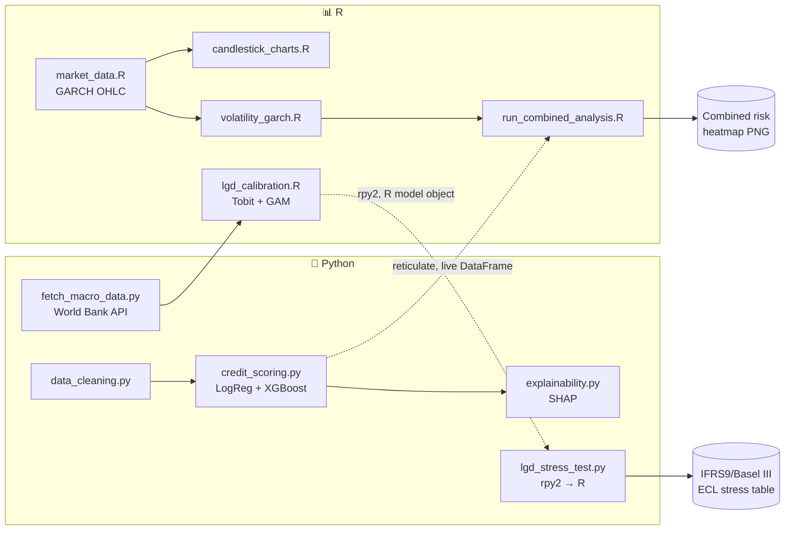
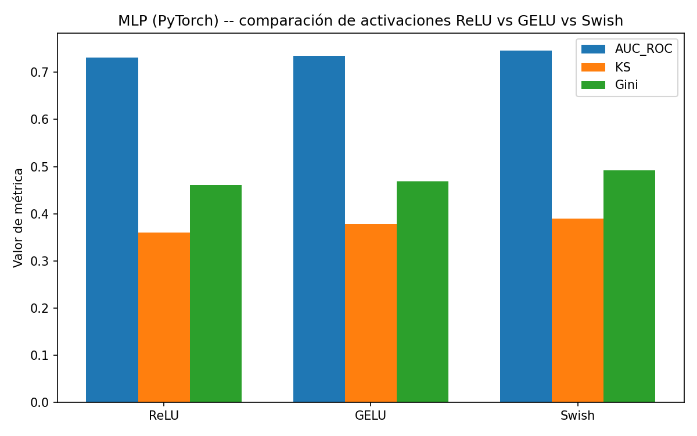
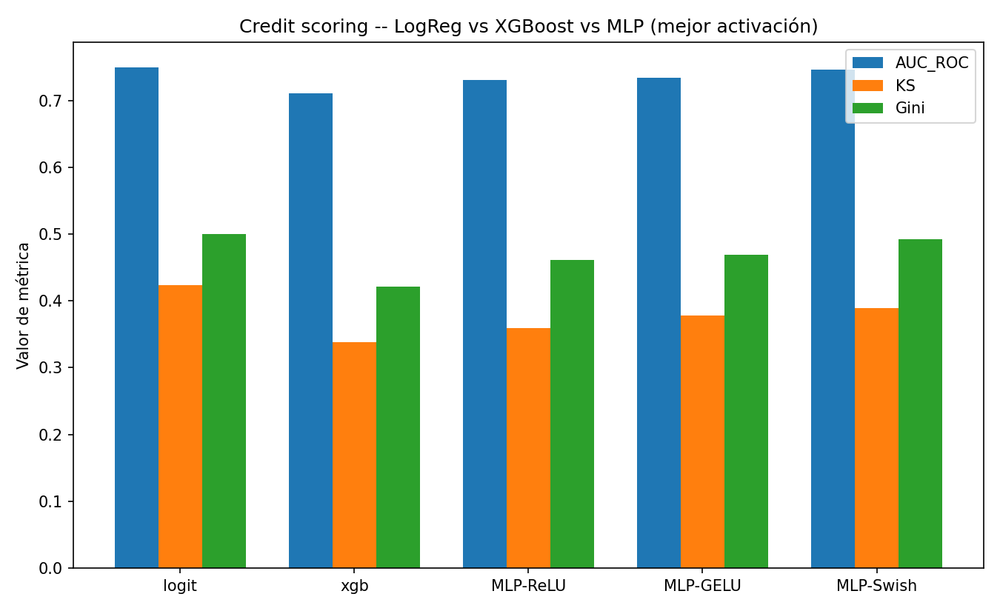

<div align="center">

# 💳 Credit Risk & Market Analytics (R + Python)

**A genuine, BIDIRECTIONAL R↔Python interop project -- Python for data cleaning and credit scoring, R for candlestick market analysis, GARCH volatility, and empirical LGD calibration, connected by two independent bridges in opposite directions: `reticulate` (R calls Python) and `rpy2` (Python calls R)**

🌐 **[English](README.md)** | **[Español](README.es.md)**

[](https://www.python.org/)
[](https://www.r-project.org/)
[](https://rstudio.github.io/reticulate/)
[](https://rpy2.github.io/)
[](https://xgboost.readthedocs.io/)
[](https://www.quantmod.com/)
[](https://cran.r-project.org/package=AER)
[](https://data.worldbank.org/)
[](LICENSE)

</div>

---

## Why I built this this way

I wanted a project where R and Python aren't just two folders sitting next to each other -- where using both languages is the actual point, not a checkbox. Credit risk management gave me a natural split: Python is where I reach for data cleaning and ML (pandas, scikit-learn, XGBoost, SHAP), R is where I reach for rigorous statistical/econometric work and its native financial charting (`quantmod` candlesticks, `rugarch` for volatility, `AER`/`mgcv` for censored and nonlinear regression) -- so I built the credit-scoring half in Python and the market-risk half in R, then connected them with **two independent bridges running in opposite directions**: `reticulate` (R calls Python directly and gets a live pandas DataFrame back as an R data frame) for the original combined risk-heatmap, and `rpy2` (Python calls R directly and loads a trained R model object) for the newer LGD stress-test pipeline. Neither direction is "read a CSV the other language happened to leave behind" -- both are the real interpreter of one language driving the other's code in-process. No dashboard, no separate visualization app -- every chart is a static file, generated once by the pipeline, exactly as the brief asked for.

## Business framing

Two risk questions banks manage together but rarely visualize together:

1. **Credit risk**: given a loan applicant's financial profile, what's their probability of default (PD)?
2. **Market risk**: is the current market environment calm or turbulent -- and does that change how much loss I should expect from my credit portfolio?

The second question matters because of **wrong-way risk**: default rates and market volatility tend to rise together (recessions, rate shocks). This project's centerpiece is a heatmap that stresses each credit-risk band's expected loss against three market-volatility regimes, combining a Python ML model's output with an R econometric model's output into one number a risk committee could actually read.

## Business Impact & Key Performance Indicators

| Metric | Result | What it means |
|---|---|---|
| PD model discrimination (Logistic Regression) | AUC-ROC 0.750, KS 0.424, Gini 0.501 | Beats XGBoost on this dataset -- reported plainly, not the "fancier model wins" story |
| Empirical LGD, Base scenario (GAM, real macro-anchored) | 67.4% | vs. the industry-typical flat 45% assumption used elsewhere in the same repo, as an honest baseline comparison |
| Empirical LGD, Severamente Adverso scenario (2020 COVID-anchored) | 83.7% | +16.3 points above Base -- a real, macro-driven tail-risk jump, not a hand-tuned multiplier |
| Portfolio ECL, Base → Severamente Adverso | $3.66B → $4.54B CLP | **+24.2%** stressed loss under a genuine historical-recession scenario (IFRS9 3-stage staging) |
| Linear (Tobit) vs. nonlinear (GAM) LGD gap, severe recession | 73.5% vs. 82.1% | An 8.6-point tail-risk understatement from assuming a linear macro relationship |

## Architecture (Mermaid)



## Architecture

```
python/                              r/
├── data_cleaning.py                 ├── market_data.R
│   (messy data → cleaning           │   (GARCH(1,1)-driven OHLC
│    pipeline, documented)           │    price simulation)
├── feature_engineering.py           ├── candlestick_charts.R
│   (DTI, payment burden ratios)     │   (quantmod candlesticks +
├── credit_scoring.py                │    Bollinger/SMA/RSI)
│   (LogReg + XGBoost, AUC/KS/Gini)  ├── volatility_garch.R
├── visualizations.py                │   (rugarch GARCH(1,1) fit +
│   (correlation heatmap, ROC, KS)   │    volatility regime bands)
├── explainability.py                ├── lgd_calibration.R
│   (SHAP)                           │   (Tobit + GAM, empirical LGD
├── fetch_macro_data.py              │    on real Chile macro cycle)
│   (World Bank API, real           └── run_combined_analysis.R
│    Chile macro indicators)             (reticulate → Python,
├── lgd_stress_test.py                    illustrative combined heatmap)
│   (rpy2 → R, IFRS9/Basel III
│    stress test on empirical LGD)
└── orchestrator.py
    (runs the 4 credit-scoring steps)
                    ↓                              ↑
                    └──────── reticulate ───────────┘
                         (R calls Python directly,
                          receives a live DataFrame)
                    ↑                              ↓
                    └──────────  rpy2  ─────────────┘
                    (Python calls R directly,
                     loads a trained R model object)

run_pipeline.R  →  runs all 8 steps in order (see Usage below)
```

`run_pipeline.R` invokes every step as an **independent subprocess** (the venv's `python.exe` for Python steps, `Rscript` for R steps) rather than `source()`-ing R files together -- a lesson carried over from a previous project in this same line of work, where `source()` silently skipped every script's "run as main" guard.

## Tech stack

| Layer | Choice |
|---|---|
| Data cleaning / ML | Python 3.10, pandas, scikit-learn, XGBoost, SHAP |
| Deep learning | PyTorch (CPU) -- custom focal-BCE loss, ReLU/GELU/Swish activation comparison |
| Metrics persistence | DuckDB (embedded, local file) |
| Market analysis | R 4.4, `quantmod`, `TTR`, `xts` (candlesticks + technical indicators) |
| Volatility modeling | `rugarch` (R) -- GARCH(1,1), Student-t innovations |
| Real macro data | World Bank Open Data API (no key needed) -- Chile GDP growth, unemployment, inflation, deposit rate, 1991-2024 |
| Empirical LGD calibration | `AER::tobit` (two-sided censored Tobit, [0,1]) + `mgcv::gam` (Beta-family GAM, nonlinear macro sensitivity) |
| Stress testing | Basel III/IFRS9-style 3-stage ECL simulation, scenarios anchored to real historical Chilean macro episodes |
| R → Python bridge | `reticulate` |
| Python → R bridge | `rpy2` |
| Visualization | matplotlib/seaborn (Python), ggplot2 (R) -- static PNGs only, no dashboard |

## Repository structure

```
credit-risk-market-analytics-r-python/
├── python/
│   ├── data_cleaning.py            # synthetic messy data + documented cleaning
│   ├── feature_engineering.py      # financial ratios (DTI, payment burden)
│   ├── credit_scoring.py           # LogisticRegression + XGBoost, AUC/KS/Gini
│   ├── credit_scoring_mlp.py       # PyTorch MLP, custom focal-BCE loss, ReLU/GELU/Swish
│   ├── metrics_store.py            # persists comparative metrics/predictions to DuckDB
│   ├── visualizations.py           # correlation heatmap, ROC, KS curve, MLP comparison charts
│   ├── explainability.py           # SHAP summary
│   ├── fetch_macro_data.py         # real Chile macro indicators, World Bank API
│   ├── lgd_stress_test.py          # rpy2 -> R, IFRS9/Basel III stress test
│   └── orchestrator.py             # runs the Python side end to end
├── r/
│   ├── 00_setup.R                  # R package bootstrap
│   ├── market_data.R               # GARCH(1,1)-driven synthetic OHLC prices
│   ├── candlestick_charts.R        # quantmod candlesticks + SMA/BBands/RSI
│   ├── volatility_garch.R          # GARCH(1,1) fit + volatility regime bands
│   ├── lgd_calibration.R           # Tobit + GAM, empirical LGD on real macro data
│   └── run_combined_analysis.R     # reticulate bridge + illustrative heatmap
├── tests/                          # pytest unit tests for the MLP + DuckDB persistence
├── run_pipeline.R                  # master orchestrator (subprocess-based, 8 steps)
├── data/                           # generated CSVs (gitignored)
├── output/
│   ├── models/                     # trained models (generated)
│   ├── tables/                     # result tables (generated)
│   ├── figures/                    # PNG charts (generated)
│   └── credit_risk_metrics.duckdb  # comparative model metrics (generated, gitignored)
├── requirements.txt                # Python dependencies
├── .gitignore
├── LICENSE
├── README.md
└── README.es.md
```

## Setup

```powershell
git clone https://github.com/Rxyxs/credit-risk-market-analytics-r-python.git
cd credit-risk-market-analytics-r-python

python -m venv .venv
.venv\Scripts\activate
pip install -r requirements.txt
# requirements.txt already pins torch/duckdb/pytest; if you need the CPU-only
# torch wheel explicitly: pip install torch --index-url https://download.pytorch.org/whl/cpu

Rscript r/00_setup.R    # installs dplyr, ggplot2, quantmod, TTR, xts, rugarch, reticulate
Rscript -e 'install.packages(c("AER"), repos="https://cloud.r-project.org")'   # mgcv ships with base R

# rpy2 needs R itself findable at import time -- python/lgd_stress_test.py
# auto-detects the newest C:\Program Files\R\R-* install and sets R_HOME/PATH
# for you, so no manual env-var setup is required on Windows.
```

## Usage

```powershell
Rscript run_pipeline.R
```

Runs all 8 steps in order: Python data generation/cleaning/scoring/SHAP → real Chile macro data (World Bank API) → R market data/candlesticks/GARCH → R empirical LGD calibration (Tobit + GAM) → Python IFRS9/Basel III stress test (rpy2 → R) → the reticulate-based illustrative combined heatmap. Or run each step independently:

```powershell
.venv\Scripts\python.exe -m python.orchestrator     # Python: credit scoring side
.venv\Scripts\python.exe -m python.fetch_macro_data # real Chile macro indicators (World Bank API)
Rscript r/market_data.R                             # R side, step by step
Rscript r/candlestick_charts.R
Rscript r/volatility_garch.R
Rscript r/lgd_calibration.R                         # needs data/chile_macro_indicators.csv
.venv\Scripts\python.exe -m python.lgd_stress_test  # needs output/models/lgd_gam_fit.rds + credit_risk_scores.csv
Rscript r/run_combined_analysis.R                   # needs the Python credit-scoring side to have run at least once
```

### Tests

```powershell
.venv\Scripts\python.exe -m pytest tests/ -v
```

Unit tests cover the MLP's custom focal-BCE loss, the three-activation architecture, training determinism given a fixed seed, and the DuckDB metrics-persistence roundtrip.

## Data cleaning -- what actually got fixed

The raw synthetic dataset has real, deliberately injected data-quality problems, and the cleaning pipeline documents and reports every fix (not a silent `dropna()`):

| Issue | Found | Fix |
|---|---|---|
| Duplicate applications (accidental resubmission) | 160 rows | Deduplicated by `customer_id` |
| Inconsistent categorical encoding (`"Y"/"N"/"Si"/"1"/"0"` for one boolean field; mixed casing for contract type) | ~30-35% of rows affected | Standardized mapping, explicit unmapped-value tracking (0 left unmapped) |
| Age outside plausible range (negative values from a sign-flip bug) | 24 rows | Flagged, imputed by median |
| Extreme income values (10-100x typos) | 39 rows | Winsorized at the 99.5th percentile |
| Missing bureau score (new-to-credit applicants, MAR) | ~5-8% of rows | Missingness kept as an explicit feature (`score_buro_faltante`), not just imputed away |

Final dataset: 8,000 clean rows (from 8,160 raw), 11.58% default rate.

## Credit scoring results

| Model | AUC-ROC | KS | Gini |
|---|---|---|---|
| **Logistic Regression** | **0.750** | **0.424** | **0.501** |
| XGBoost | 0.711 | 0.338 | 0.422 |

Logistic Regression beats XGBoost here -- worth stating plainly rather than assuming the fancier model wins by default. The synthetic default probability is generated as a logistic function of the features, so the model whose functional form matches the true data-generating process has an inherent edge at this sample size (8,000 rows); XGBoost's extra flexibility isn't free, it costs variance that a moderate dataset doesn't always pay back. A real finding, not a cherry-picked one.

**A calibration bug caught before it shipped:** XGBoost's default 0.5 threshold, on an ~12%-positive-rate dataset, predicted almost no defaults at all (14 true positives out of 231 actual defaulters in the test set) -- the confusion matrix made it obvious. Fixed with `scale_pos_weight` (the standard XGBoost imbalance correction), after which it predicts a sane 124/231.

**A silent feature-loss bug caught by looking at the correlation heatmap, not just the code:** `pd.get_dummies(..., drop_first=True)` drops the alphabetically-first category as the reference -- which was `"Honorarios"`, not `"Indefinido"` as I'd assumed. That collapsed a real risk factor (self-employed/contractor income has a genuinely different default rate in the generating process) into a constant-zero column no model could ever see. Fixed with explicit boolean encoding instead of relying on `get_dummies`'s alphabetical ordering.

## Third modeling approach: PyTorch MLP with a custom loss

`python/credit_scoring_mlp.py` adds a deep-learning approach to the same dataset and train/test split used by Logistic Regression and XGBoost above, completing the classic credit-risk modeling triad (interpretable baseline / tree ensemble / neural net) on one protocol instead of three unrelated ones:

- **Custom loss**: `FocalBCELoss` combines class-weighted BCE (the same imbalance correction idea as XGBoost's `scale_pos_weight`) with a focal term (Lin et al., 2017) that down-weights already-confident correct predictions and keeps gradient signal on the hard cases -- relevant here because the ~12% default rate makes a plain BCE loss dominated by the majority class.
- **Activation comparison**: the same 2-hidden-layer architecture, same training protocol, same seed, trained three times with only the activation function changed -- ReLU, GELU, and Swish (`SiLU`) -- to see whether the smoother, non-monotonic activations (GELU/Swish) actually earn their extra compute on this tabular problem.

| Model | AUC-ROC | KS | Gini |
|---|---|---|---|
| MLP-ReLU | 0.731 | 0.360 | 0.462 |
| MLP-GELU | 0.734 | 0.378 | 0.469 |
| **MLP-Swish** | **0.746** | **0.389** | **0.492** |

Swish (SiLU) wins this comparison -- its smooth, non-monotonic curve gives it a small but consistent edge over ReLU and GELU across all three metrics under an identical protocol. None of the three MLP variants beats Logistic Regression's 0.750 AUC-ROC, reinforcing the same honest finding from the LogReg-vs-XGBoost comparison above: on this moderate-size, logistic-generating-process dataset, matching functional form beats raw model capacity.



### All three approaches, side by side

| Model | AUC-ROC | KS | Gini |
|---|---|---|---|
| **Logistic Regression** | **0.750** | **0.424** | **0.501** |
| XGBoost | 0.711 | 0.338 | 0.422 |
| MLP-Swish (best activation) | 0.746 | 0.389 | 0.492 |



All comparative metrics and the MLP's per-customer test-set predictions are also persisted to a local embedded DuckDB file (`output/credit_risk_metrics.duckdb`, `model_metrics` and `mlp_predictions` tables) via `python/metrics_store.py` -- queryable with plain SQL for audit purposes, no server required.

## Market analysis results

- 750 trading days of synthetic OHLC prices, returns simulated as an explicit GARCH(1,1) process (same technique as a prior R-only project, applied here to its natural domain: equity returns, not wind power).
- GARCH(1,1) fit recovers: α₁ = 0.124 (true 0.09), β₁ = 0.854 (true 0.88), persistence 0.978 (true 0.97) -- close recovery, with more estimation noise than a 17,500-point series would give, as expected for 750 daily points.
- Volatility regimes (terciles of conditional volatility): 250 Low / 250 Medium / 250 High trading days.

## The combined result: stressed expected loss

| Credit risk band (PD quintile) | Low volatility | Medium volatility | High volatility |
|---|---|---|---|
| Very Low | 3.2% | 3.8% | 5.2% |
| Low | 7.4% | 8.7% | 11.7% |
| Medium | 12.0% | 14.1% | 19.0% |
| High | 17.6% | 20.8% | 28.0% |
| Very High | 26.2% | 30.9% | **40.7%** |

Expected-loss rate = stressed PD × 45% LGD (a standard, documented, unsecured-consumer-credit assumption, not locally calibrated) × exposure, aggregated per band. Stress multipliers by regime (0.85× / 1.00× / 1.35×) are stated assumptions illustrating the wrong-way-risk concept, not a fitted relationship. This heatmap is kept exactly as-is on purpose, as an honest baseline to compare against the empirically-calibrated pipeline below.

## Empirical LGD calibration (Tobit + GAM, real macro data)

The heatmap above uses a flat, industry-typical 45% LGD assumption. This section replaces that assumption with an **empirically calibrated** LGD, fit on a synthetic panel of 2,720 defaulted loans (80/year × 34 years) whose recovery outcomes are causally driven by Chile's **real** historical macro cycle (`python/fetch_macro_data.py`, World Bank Open Data API, no key required: GDP growth, unemployment, inflation, deposit rate, 1991-2024 -- includes the real 2020 COVID GDP contraction of -6.14% and the real 2022 inflation shock of 11.64%).

LGD is a fraction in [0,1] with real point mass at both ends (full collateral recovery → LGD=0; unsecured write-off → LGD=1) -- the textbook case for a **Tobit** model (two-sided censored regression), not OLS (which ignores the censoring and biases the coefficients) or logistic regression (which can't model the continuous recovery level). `r/lgd_calibration.R` fits both:

| Model | Purpose | Package |
|---|---|---|
| Tobit, censored [0,1] | Linear-index empirical calibration (the literal ask) | `AER::tobit` |
| GAM, Beta family | Captures nonlinear macro sensitivity a linear index can't | `mgcv::gam` |

**Economic sign check, both models agree**: GDP growth *reduces* LGD (β = -0.0211, Tobit, p < 2e-16), unemployment *increases* it (β = +0.0126, p < 2e-16) -- both statistically significant and both consistent with recoveries actually deteriorating in worse macro conditions, not just a model artifact. The pipeline asserts these signs before saving the model (`stopifnot(pib_coef < 0, desempleo_coef > 0)`) -- a calibration with the wrong sign would be economically unusable for stress testing and shouldn't silently ship downstream.

**A real, honest finding from comparing the two models, not smoothed over**: at a severe recession scenario (GDP -6%, unemployment 8%, typical collateral), the linear Tobit predicts LGD = 73.5%, while the GAM predicts **82.1%** -- a full 8.6-point gap. The GAM's smooth term on GDP growth (`edf = 3.38`, meaningfully nonlinear, not close to a straight line) captures a real pattern the Tobit's linear index can't: LGD deterioration accelerates disproportionately in severe downturns rather than scaling linearly with the GDP shock. This is exactly the kind of tail-risk understatement a linear model can hide from a risk committee, and it's the reason the GAM (not the Tobit) is the model actually used in the stress test below.

## IFRS9 / Basel III stress test (rpy2, empirical LGD)

`python/lgd_stress_test.py` loads the trained GAM (`output/models/lgd_gam_fit.rds`) **directly into Python via `rpy2`** -- calling R's own `predict.gam()` on the fitted Beta-regression model rather than reimplementing GAM prediction logic in Python, which would risk silently diverging from R's actual fitted smooth terms. This is the interoperability direction opposite to the rest of the repo (which uses `reticulate`, R calling Python) -- a genuine bidirectional bridge, not two one-way scripts that happen to live in the same repo.

Three stress scenarios, each anchored to a **real, observed** episode of Chile's macro history (Basel/EBA-style scenario design: never an invented number) rather than a hypothetical shock:

| Scenario | GDP growth | Unemployment | Real anchor |
|---|---|---|---|
| Base | +2.81% | 8.72% | 2024 (latest available) |
| Adverso | +1.76% | 6.89% | 2014-2017 average (real post-copper-boom slowdown) |
| Severamente Adverso | **-6.14%** | **10.93%** | 2020 (real COVID shock) |

Portfolio-level LGD is aggregated across the same three collateral-type weights used to simulate the training panel (30% Hipotecaria / 25% Prendaria / 45% Sin Garantía), then combined with the credit-scoring test portfolio (2,000 customers, PD from XGBoost) under **IFRS9 3-stage staging**: Stage 3 (already in default) gets ECL = LGD × EAD; Stage 2 (top-quintile PD, not yet defaulted -- a proxy for "significant increase in credit risk") gets lifetime ECL via `1-(1-PD_12m)^(term_years)`; Stage 1 (the rest) gets 12-month ECL = PD × LGD × EAD.

| Scenario | Portfolio LGD (GAM) | Total ECL (CLP) |
|---|---|---|
| Base | 67.4% | $3,656,440,184 |
| Adverso | 66.8% | $3,622,231,423 |
| Severamente Adverso | **83.7%** | **$4,541,606,866** |

**Real, unforced result worth flagging plainly**: the "Adverso" scenario shows a *lower* portfolio LGD (66.8%) than "Base" (67.4%), not a value in between Base and Severamente Adverso as a naive three-step staircase might suggest. This isn't a bug -- it's an honest consequence of anchoring every scenario to genuinely observed history instead of hand-tuning a monotonic sequence: 2014-2017 Chile had *lower* real unemployment (6.89%) than 2024 (8.72%) despite slower GDP growth, so the GAM (correctly) predicts a slightly better recovery environment for that period. The severe shock (-24.2% jump in total ECL vs. Base) still comes through clearly where it matters -- a genuine COVID-magnitude recession.

## Disclaimer

Credit-applicant and loan-recovery data is 100% synthetic, generated with a fixed seed. Default probability and loan recovery are causally tied to the generated features (delinquency history, DTI, bureau score, contract type, collateral) through shared latent factors -- not sampled independently of them, precisely so the models have real signal to learn rather than noise. The **macro indicators driving the LGD calibration and stress test are real** (World Bank Open Data API, Chile, 1991-2024), but no real Chilean bank's actual loan-level recovery data was used or is publicly available for this kind of calibration -- the Tobit/GAM coefficients are a methodologically genuine exercise on synthetic-but-macro-realistic data, not a production-grade calibration a real bank could deploy as-is. The original combined-heatmap section's LGD (45%) and volatility stress multipliers remain illustrative, industry-typical assumptions, explicitly labeled as such, kept deliberately unchanged as an honest baseline comparison.

## License

MIT -- see [LICENSE](LICENSE).

## Author

**Pablo Reyes** -- [github.com/Rxyxs](https://github.com/Rxyxs)
