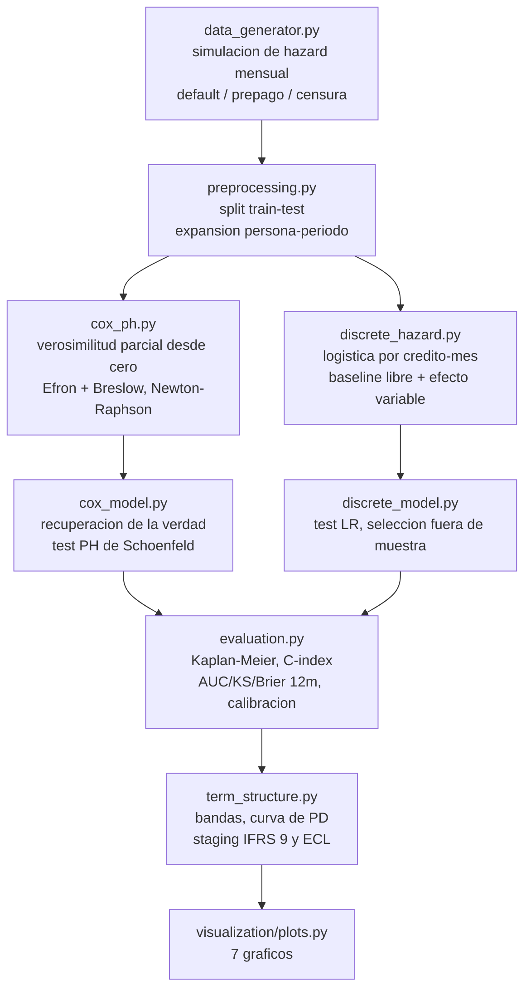

<div align="center">

# ⏳ PD de por vida con analisis de supervivencia

**Un modelo de scoring que responde *cuando*, no solo *si* — riesgos proporcionales de Cox implementado desde cero (verosimilitudes parciales de Efron y Breslow, gradiente y hessiano analiticos, diagnostico de Schoenfeld) mas un modelo de hazard en tiempo discreto, convertidos en una estructura temporal de PD para IFRS 9**

🌐 **[English](README.md)** | **[Español](README.es.md)**

[](https://www.python.org/)
[](https://numpy.org/)
[](https://scipy.org/)
[](https://scikit-learn.org/)
[](https://www.ifrs.org/)
[](tests/)
[](../LICENSE)

</div>

---

## Por que lo construi asi

Un scorecard entrega un numero por solicitante: probabilidad de default a 12
meses. Ese numero no dice nada sobre las dos preguntas que vienen justo
despues en la gestion de una cartera — *cuando* llega el riesgo, y *cuanto*
de ese riesgo vive despues del corte de los 12 meses. Las dos son
estructurales, no cosmeticas: la primera define politicas de alerta temprana
y cobranza, y la segunda es literalmente la diferencia entre provisionar en
Stage 1 y en Stage 2 bajo IFRS 9.

Asi que modele el hazard en vez de la etiqueta. Cada credito se sigue mes a
mes hasta que cae en default, prepaga, o sale de la ventana de observacion, y
un credito censurado se trata por lo que es — una observacion incompleta, no
un cliente bueno.

Escribi el modelo de Cox desde cero en vez de llamar a `lifelines`, porque lo
interesante es justamente la mecanica que una libreria esconde. Esta cartera
esta observada **mensualmente**, o sea que cientos de creditos comparten
exactamente el mismo tiempo de evento, y los empates son donde las
verosimilitudes parciales de Breslow y Efron dejan de coincidir. Con las dos
implementadas y una verdad de terreno simulada contra la cual comparar, esa
advertencia de manual pasa a ser un numero que puedo medir en mis propios
datos en vez de una cita que repito.

## Enfoque de negocio

La cartera es sintetica, pero el proceso generador es un hazard mensual real
con dos elementos puestos a proposito, que el pipeline tiene que
*descubrir*, no suponer:

1. **Seasoning**: el hazard base tiene forma de joroba — el riesgo sube
   despues de la originacion, piquea alrededor del mes 8-10, y despues baja.
   Una PD plana a 12 meses no puede expresar esa forma.
2. **Un efecto no proporcional**: el riesgo extra de los deudores con
   contrato informal es fuerte al inicio y se desvanece con el tiempo, lo que
   viola el supuesto central del modelo de Cox. El pipeline tiene que
   detectarlo con un test de residuos de Schoenfeld, en vez de reportar en
   silencio un hazard ratio constante equivocado.

## Resultados de una corrida real

`python run_pipeline.py`, 15.000 creditos (10.500 train / 4.500 test),
ventana de 36 meses, 19,0% de default observado, 81,0% censurado.

### .Funciona el motor de Cox escrito desde cero?

| Verificacion | Resultado |
|---|---|
| Gradiente analitico vs diferencias finitas | error maximo 6,7e-07 |
| Coeficientes verdaderos recuperados (Efron, 8 covariables) | error absoluto medio **0,0224** |
| Lo mismo con Breslow | error absoluto medio 0,0247 |
| Atenuacion de Breslow hacia cero (empates mensuales) | **1,72%** en promedio |
| Supuesto PH violado | solo `informal` — ρ = −0,064, **p = 0,0043** |
| Falsas alarmas entre las 8 covariables genuinamente proporcionales | **0** |

Las dos ultimas filas son las que importan: el diagnostico marco exactamente
la covariable cuyo efecto fue construido para decaer, y dejo tranquilas a las
otras ocho.

### Discriminacion y calibracion fuera de muestra (4.500 creditos de test)

| Modelo | C-index | AUC 12m | KS 12m | Brier 12m | Error medio de calibracion |
|---|---|---|---|---|---|
| Cox, empates Efron (desde cero) | 0,7841 | 0,8132 | 0,4829 | 0,0879 | 0,0134 |
| Hazard discreto, proporcional | 0,7841 | 0,8131 | 0,4828 | 0,0877 | 0,0124 |
| Hazard discreto, `informal` variable en el tiempo | **0,7842** | 0,8128 | **0,4853** | 0,0877 | **0,0107** |

353 creditos de test (7,8%) quedaron fuera de las metricas a 12 meses por
estar censurados antes del corte — contarlos como "buenos" habria inflado
todos los numeros de esa tabla.

### La estructura temporal, y lo que cuesta

| Banda | n | PD 6m | PD 12m | PD 24m | PD 36m | KM observado 12m | Riesgo despues del mes 12 |
|---|---|---|---|---|---|---|---|
| A | 900 | 1,0% | 2,4% | 4,7% | 6,6% | 2,7% | 63,8% |
| B | 900 | 1,8% | 4,2% | 8,1% | 11,2% | 3,6% | 62,6% |
| C | 900 | 3,0% | 6,7% | 12,5% | 17,0% | 6,3% | 60,5% |
| D | 900 | 5,5% | 12,0% | 21,2% | 27,8% | 12,4% | 56,9% |
| E | 900 | 20,3% | 35,8% | 51,9% | 60,9% | 38,8% | 41,2% |

- El hazard condicional piquea en el **mes 10** (suavizado a 3 meses), contra
  el mes 8 del hazard verdadero que genero los datos.
- La PD de la cartera pasa de **12,23% a 24,72%** entre 12 meses y vida
  completa — un multiplo de 2,02x, con **50,5% del riesgo total llegando
  despues del mes 12**.
- Provisionar a vida completa el 9,3% de la cartera que gatilla el proxy de
  SICR, en vez de a 12 meses, sube la perdida esperada de **CLP 660,6M a CLP
  787,8M (+19,3%)**. (LGD plana de 45%, EAD = monto originado, sin descontar
  — supuestos declarados; el aporte del modelo es la PD por horizonte, no la
  severidad.)

## Hallazgos honestos

- **Significancia estadistica y valor predictivo no son lo mismo.** El
  termino variable en el tiempo `informal × log(mes)` es contundentemente
  significativo dentro de muestra (LR = 21,91, 1 gl, p = 2,9e-06) y confirma
  el diagnostico de Cox — pero fuera de muestra mueve el AUC en −0,0003. Lo
  que si mejora es la calibracion (error medio 0,0124 → 0,0107, −13%). Como
  este modelo existe para producir PD provisionables y no un ranking, el
  pipeline selecciona por error de calibracion y lo dice en el codigo — pero
  no voy a vender un cambio de −0,0003 en AUC como una ganancia de
  discriminacion.
- **La especificacion variable en el tiempo extrapola mal.** Ajustada como
  `0,778 − 0,264·log(mes)`, sigue bien al efecto decreciente verdadero al
  inicio (0,778 contra un valor real de 0,68 en el mes 1), pero cruza cero
  cerca del mes 19 y llega a −0,17 en el mes 36, o sea implica que los
  informales son *mas seguros* al final de la vida del credito, cosa que no
  esta en el proceso generador. Una interaccion log-lineal es una
  aproximacion barata a un decaimiento exponencial: corrige el sesgo del
  horizonte corto y no hay que creerle en la cola.
- **El baseline mensual no parametrico se pone ruidoso donde el conjunto en
  riesgo se adelgaza.** Con un coeficiente libre por mes y creditos a 12 y 24
  meses que van saliendo, el ultimo tercio de la curva de hazard oscila
  visiblemente (ver `hazard_base_vs_verdad.png`); la curva suavizada sigue
  reproduciendo la joroba verdadera, pero no citaria el hazard de un mes
  tardio en particular.
- **Un `tol` por defecto casi produce un estadistico imposible.** Con el
  default de scikit-learn (`tol=1e-4`), lbfgs se detuvo antes del optimo y el
  test de razon de verosimilitud entre dos modelos anidados salio *negativo*
  (−8,21), algo que no puede pasar en teoria. Apretando a `tol=1e-10` dio
  +21,91. El comentario quedo en el codigo, porque la leccion es que un LR
  test entre modelos anidados sirve tambien como chequeo de convergencia.
- **La atenuacion de Breslow es real pero moderada aca (1,72%).** Con un
  hazard mensual de ~0,88%, el conjunto de empates en cada mes es chico
  respecto del conjunto en riesgo, que es justo el regimen donde las dos
  aproximaciones casi coinciden. Un test unitario construye el regimen
  contrario (discretizacion mas gruesa) y confirma que el encogimiento es
  sistematico, no ruido.

## Arquitectura



| Modulo | Que hace |
|---|---|
| [`src/data_generator.py`](src/data_generator.py) | Simula la cartera mes a mes desde un hazard conocido, con prepago como riesgo competitivo y una ventana de censura administrativa. Escribe los parametros verdaderos en `ground_truth.json`. |
| [`src/preprocessing.py`](src/preprocessing.py) | Split train/test, estandarizacion ajustada solo en train, y la expansion persona-periodo que convierte un credito en una fila por mes en riesgo. |
| [`src/cox_ph.py`](src/cox_ph.py) | El motor de Cox: verosimilitudes parciales de Breslow y Efron con gradiente/hessiano analiticos via sumas acumuladas por sufijo, Newton-Raphson amortiguado, errores estandar desde la informacion observada, hazard base de Breslow, residuos de Schoenfeld escalados y el test PH. |
| [`src/discrete_hazard.py`](src/discrete_hazard.py) | Modelo de hazard discreto: regresion logistica sobre credito-mes con un coeficiente libre por mes mas interacciones opcionales feature × log(mes), y test de razon de verosimilitud anidado. |
| [`src/cox_model.py`](src/cox_model.py) / [`src/discrete_model.py`](src/discrete_model.py) | Ajustan, comparan contra la verdad de terreno, validan fuera de muestra y escriben los reportes. |
| [`src/evaluation.py`](src/evaluation.py) | Metricas que respetan la censura: Kaplan-Meier con varianza de Greenwood, C-index de Harrell, metricas por horizonte que excluyen lo aun no observado, calibracion por decil contra KM. |
| [`src/term_structure.py`](src/term_structure.py) | Bandas de riesgo, PD por horizonte, proxy de SICR, ECL a 12 meses vs vida completa. |

## Como correrlo

```bash
python -m venv venv
venv\Scripts\activate            # Windows;  source venv/bin/activate en Linux/macOS
pip install -r requirements.txt

python run_pipeline.py           # todo end to end (~1 min)
pytest -q                        # 38 tests
```

Cualquier etapa corre sola, exactamente como la llama el orquestador:

```bash
python -m src.data_generator
python -m src.preprocessing
python -m src.cox_model
python -m src.discrete_model
python -m src.term_structure
python -m src.visualization.plots
```

Las salidas quedan en `outputs/reports/` (JSON + CSV) y `outputs/plots/`:

| Grafico | Que muestra |
|---|---|
| `coeficientes_vs_verdad.png` | Coeficientes estimados con IC 95% contra los valores verdaderos del simulador |
| `ph_test_schoenfeld.png` | Que covariable rompe el supuesto de hazards proporcionales, y por cuanto |
| `hazard_base_vs_verdad.png` | Forma del hazard estimado contra el hazard verdadero |
| `km_por_banda.png` | Curvas de default observadas por banda (Kaplan-Meier, bandas de Greenwood) |
| `pd_term_structure.png` | PD por horizonte y banda, mas el seasoning de la cartera |
| `calibracion_12m.png` | PD predicha vs observada por decil, ambos modelos |
| `ecl_ifrs9.png` | Provision a 12 meses vs staging IFRS 9 |

## Tests

38 tests (`pytest -q`), apuntados a lo que falla en silencio y no con un error:

- gradiente y hessiano analiticos contra diferencias finitas;
- recuperacion de coeficientes sobre datos simulados con betas conocidos;
- Breslow ≡ Efron cuando no hay empates, y Breslow estrictamente atenuado
  cuando los eventos se discretizan mas grueso;
- Kaplan-Meier y C-index contra ejemplos de cinco filas calculados a mano;
- que los creditos censurados antes del horizonte queden excluidos, y no
  etiquetados como buenos en silencio;
- que la expansion persona-periodo conserve el total de eventos y ponga el 1
  en el mes correcto;
- que el test PH se gatille con un efecto variable en el tiempo y se quede
  callado con uno proporcional.

## Alcance

Datos sinteticos, a proposito: tener un proceso generador conocido es lo que
convierte "recupero los coeficientes verdaderos" en una afirmacion
verificable. El lado de severidad (LGD, amortizacion del EAD, descuento) se
deja deliberadamente plano — el tema de este proyecto es la estructura
temporal de PD.

## Autor

Pablo Reyes — [github.com/Rxyxs](https://github.com/Rxyxs)
Codigo: MIT — ver [LICENSE](../LICENSE)
