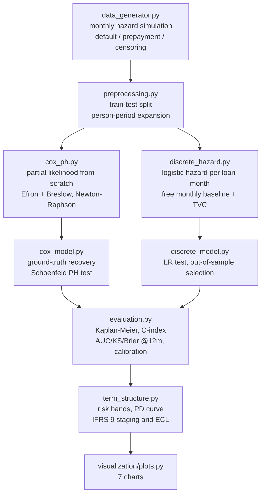

<div align="center">

# ⏳ Lifetime PD from Survival Analysis

**A credit-scoring model that answers *when*, not just *whether* — Cox proportional hazards written from scratch (Efron and Breslow partial likelihoods, analytic gradient and Hessian, Schoenfeld diagnostics) plus a discrete-time hazard model, turned into an IFRS 9 PD term structure**

🌐 **[English](README.md)** | **[Español](README.es.md)**

[](https://www.python.org/)
[](https://numpy.org/)
[](https://scipy.org/)
[](https://scikit-learn.org/)
[](https://www.ifrs.org/)
[](tests/)
[](../LICENSE)

</div>

---

## Why I built it this way

A scorecard gives one number per applicant: probability of default over the
next 12 months. That number is silent about the two things a portfolio
manager actually asks next — *when* does the risk arrive, and *how much of
it lives past the 12-month cut-off?* Both questions are structural, not
cosmetic: the first drives early-warning and collections policy, the second
is literally the difference between Stage 1 and Stage 2 provisioning under
IFRS 9.

So I modelled the hazard instead of the label. Every loan is followed month
by month until it defaults, prepays, or falls out of the observation window,
and a censored loan is treated as what it is — an incomplete observation,
not a "good" customer.

I wrote the Cox model from scratch rather than calling `lifelines`, because
the interesting part is precisely the mechanics a library hides. This
portfolio is observed **monthly**, so hundreds of loans share the exact same
event time, and ties are where the Breslow and Efron partial likelihoods
stop agreeing. With both implemented and a simulated ground truth to compare
against, that textbook caveat becomes a number I can measure on my own data
instead of a claim I repeat.

## Business framing

The loan book is synthetic, but the generating process is a real monthly
hazard with two deliberate features that the pipeline has to *discover*, not
assume:

1. **Seasoning**: the baseline hazard is hump-shaped — risk climbs after
   origination, peaks around month 8–10, then declines. A flat 12-month PD
   cannot express that shape.
2. **A non-proportional effect**: the extra risk carried by informal-contract
   borrowers is strong at origination and fades with time, which violates the
   core assumption of the Cox model. The pipeline is required to catch it
   with a Schoenfeld residual test rather than quietly report a wrong
   constant hazard ratio.

## Results from an actual run

`python run_pipeline.py`, 15,000 loans (10,500 train / 4,500 test), 36-month
window, 19.0% observed default rate, 81.0% censored.

### Does the from-scratch Cox engine work?

| Check | Result |
|---|---|
| Analytic gradient vs. finite differences | max error 6.7e-07 |
| True coefficients recovered (Efron, 8 covariates) | mean absolute error **0.0224** |
| Same, Breslow | mean absolute error 0.0247 |
| Breslow attenuation toward zero (monthly ties) | **1.72%** on average |
| PH assumption violated | `informal` only — ρ = −0.064, **p = 0.0043** |
| False alarms among the 8 genuinely proportional covariates | **0** |

The last two rows are the ones I care about: the diagnostic flagged exactly
the covariate whose effect was built to decay, and left the other eight
alone.

### Out-of-sample discrimination and calibration (4,500 test loans)

| Model | C-index | AUC @12m | KS @12m | Brier @12m | Mean calibration error |
|---|---|---|---|---|---|
| Cox, Efron ties (from scratch) | 0.7841 | 0.8132 | 0.4829 | 0.0879 | 0.0134 |
| Discrete-time hazard, proportional | 0.7841 | 0.8131 | 0.4828 | 0.0877 | 0.0124 |
| Discrete-time hazard, time-varying `informal` | **0.7842** | 0.8128 | **0.4853** | 0.0877 | **0.0107** |

353 test loans (7.8%) were excluded from the 12-month metrics because they
were censored before the cut-off — counting them as "good" would have
inflated every number in that table.

### The term structure, and what it costs

| Risk band | n | PD @6m | PD @12m | PD @24m | PD @36m | Observed KM @12m | Risk arriving after month 12 |
|---|---|---|---|---|---|---|---|
| A | 900 | 1.0% | 2.4% | 4.7% | 6.6% | 2.7% | 63.8% |
| B | 900 | 1.8% | 4.2% | 8.1% | 11.2% | 3.6% | 62.6% |
| C | 900 | 3.0% | 6.7% | 12.5% | 17.0% | 6.3% | 60.5% |
| D | 900 | 5.5% | 12.0% | 21.2% | 27.8% | 12.4% | 56.9% |
| E | 900 | 20.3% | 35.8% | 51.9% | 60.9% | 38.8% | 41.2% |

- Conditional hazard peaks at **month 10** (3-month smoothed), matching the
  month-8 peak of the true generating hazard.
- Portfolio PD goes **12.23% → 24.72%** from 12 months to lifetime — a 2.02×
  multiple, with **50.5% of the total risk arriving after month 12**.
- Provisioning the 9.3% of the book that trips the SICR proxy at lifetime
  instead of 12 months raises expected credit loss from **CLP 660.6M to CLP
  787.8M (+19.3%)**. (LGD 45% flat, EAD = originated amount, undiscounted —
  declared assumptions; the model's contribution is the PD by horizon, not
  the severity.)

## Honest findings

- **Statistical significance and predictive value are not the same thing.**
  The time-varying `informal × log(month)` term is overwhelmingly significant
  in-sample (LR = 21.91, 1 df, p = 2.9e-06) and it confirms the Cox
  diagnostic — yet out of sample it moves AUC by −0.0003. What it *does*
  improve is calibration (mean error 0.0124 → 0.0107, −13%). Since this model
  exists to produce provisionable PDs rather than a ranking, the pipeline
  selects on calibration error and says so in code — but I am not going to
  dress a −0.0003 AUC change up as a discrimination win.
- **The time-varying specification extrapolates badly.** Fitted as
  `0.778 − 0.264·log(month)`, it tracks the true decaying effect early
  (0.778 vs. a true 0.68 at month 1) but crosses zero around month 19 and
  reaches −0.17 by month 36, implying informal borrowers are *safer* late in
  life, which is not in the generating process. A log-linear interaction is a
  cheap approximation to an exponential decay; the honest reading is that it
  fixes the early-horizon bias and should not be trusted at the tail.
- **The non-parametric monthly baseline gets noisy where the risk set
  thins.** With a free coefficient per month and loans of 12- and 24-month
  terms leaving the book, the last third of the hazard curve wobbles visibly
  (see `hazard_base_vs_verdad.png`); the smoothed curve still tracks the true
  hump, but I would not quote a single late month's hazard.
- **A tolerance default nearly produced an impossible statistic.** With
  scikit-learn's default `tol=1e-4`, lbfgs stopped short of the optimum and
  the likelihood-ratio test between two nested models came out *negative*
  (−8.21), which cannot happen in theory. Tightening to `tol=1e-10` gave
  +21.91. The comment stayed in the code, because the lesson is that a
  nested-model LR test doubles as a convergence check.
- **Breslow's attenuation is real but modest here (1.72%).** With a ~0.88%
  monthly hazard, the tied set at any month is small relative to the risk
  set, which is exactly the regime where the two approximations nearly agree.
  A unit test constructs the opposite regime (coarser discretisation) and
  confirms the shrinkage is systematic, not noise.

## Architecture



| Module | What it does |
|---|---|
| [`src/data_generator.py`](src/data_generator.py) | Simulates the book month by month from a known hazard, with prepayment as a competing risk and an administrative censoring window. Writes the true parameters to `ground_truth.json`. |
| [`src/preprocessing.py`](src/preprocessing.py) | Train/test split, train-only standardisation, and the person-period expansion that turns one loan into one row per month at risk. |
| [`src/cox_ph.py`](src/cox_ph.py) | The Cox engine: Breslow and Efron partial likelihoods with analytic gradient/Hessian via suffix cumulative sums, damped Newton-Raphson, standard errors from the observed information, Breslow baseline hazard, scaled Schoenfeld residuals and the PH test. |
| [`src/discrete_hazard.py`](src/discrete_hazard.py) | Discrete-time hazard model: logistic regression on loan-months with one free coefficient per month plus optional feature × log(month) interactions, and a nested likelihood-ratio test. |
| [`src/cox_model.py`](src/cox_model.py) / [`src/discrete_model.py`](src/discrete_model.py) | Fit, compare against ground truth, validate out of sample, write reports. |
| [`src/evaluation.py`](src/evaluation.py) | Censoring-aware metrics: Kaplan-Meier with Greenwood variance, Harrell's C-index, horizon metrics that exclude the not-yet-observed, decile calibration against KM. |
| [`src/term_structure.py`](src/term_structure.py) | Risk bands, PD by horizon, SICR proxy, 12-month vs. lifetime ECL. |

## Running it

```bash
python -m venv venv
venv\Scripts\activate            # Windows;  source venv/bin/activate on Linux/macOS
pip install -r requirements.txt

python run_pipeline.py           # everything end to end (~1 min)
pytest -q                        # 38 tests
```

Any stage also runs on its own, exactly as the orchestrator calls it:

```bash
python -m src.data_generator
python -m src.preprocessing
python -m src.cox_model
python -m src.discrete_model
python -m src.term_structure
python -m src.visualization.plots
```

Outputs land in `outputs/reports/` (JSON + CSV) and `outputs/plots/`:

| Chart | Shows |
|---|---|
| `coeficientes_vs_verdad.png` | Estimated coefficients with 95% CIs against the simulator's true values |
| `ph_test_schoenfeld.png` | Which covariate breaks proportional hazards, and by how much |
| `hazard_base_vs_verdad.png` | Estimated hazard shape vs. the true generating hazard |
| `km_por_banda.png` | Observed Kaplan-Meier default curves by risk band, with Greenwood bands |
| `pd_term_structure.png` | PD by horizon per band, plus portfolio seasoning |
| `calibracion_12m.png` | Predicted vs. KM-observed PD by decile, both models |
| `ecl_ifrs9.png` | 12-month vs. IFRS 9 staged provisioning |

## Tests

38 tests (`pytest -q`), aimed at the parts that fail silently rather than loudly:

- the analytic gradient and Hessian against finite differences;
- coefficient recovery on data simulated with known betas;
- Breslow ≡ Efron when there are no ties, and Breslow strictly attenuated when
  events are coarsely discretised;
- Kaplan-Meier and the C-index against hand-computed five-row examples;
- that censored-before-horizon loans are excluded, not silently labelled good;
- that the person-period expansion preserves the event count and puts the 1
  on the right month;
- that the PH test fires on a built-in time-varying effect and stays quiet on
  a proportional one.

## Scope

Synthetic data, by design: a known generating process is what makes
"recovered the true coefficients" a checkable claim. The severity side (LGD,
EAD amortisation, discounting) is deliberately held flat — this project's
subject is the PD term structure.

## Author

Pablo Reyes — [github.com/Rxyxs](https://github.com/Rxyxs)
Code: MIT — see [LICENSE](../LICENSE)
