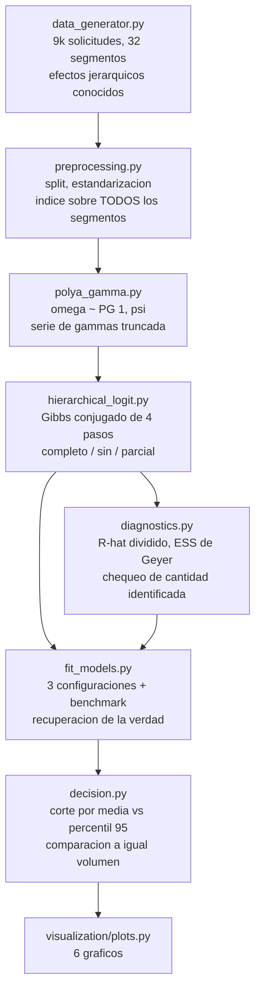

<div align="center">

# 🎲 Scorecard bayesiano jerarquico

**Pooling parcial sobre 32 segmentos comerciales, muestreado con un Gibbs escrito desde cero sobre aumentacion Polya-Gamma — cada PD sale como distribucion posterior, y la politica de aprobacion puede usar esa incertidumbre en vez de botarla**

🌐 **[English](README.md)** | **[Español](README.es.md)**

[](https://www.python.org/)
[](https://numpy.org/)
[](https://arxiv.org/abs/1205.0310)
[](https://mc-stan.org/)
[](https://scikit-learn.org/)
[](tests/)
[](../LICENSE)

</div>

---

## Por que lo construi asi

Una cartera de credito nunca es una sola poblacion. El mismo banco origina en
Santiago y en Los Lagos, a asalariados y a trabajadores informales, por
sucursal y por app — y esos segmentos efectivamente caen en default a tasas
distintas. Eso deja una decision de modelamiento que normalmente se toma por
costumbre:

- **Ignorar los segmentos** (un modelo para todos). Limpio, pero le pone a un
  credito informal digital de Los Lagos el precio del promedio de la cartera.
- **Un modelo por segmento** (o una dummy por segmento). Honesto respecto de
  las diferencias, pero un segmento con 30 casos de entrenamiento produce una
  estimacion que es casi puro ruido, y una mala racha de defaults se
  transforma en politica.

El pooling parcial es la tercera opcion, y no es un punto medio entre las
otras dos — es lo que sale del modelo cuando uno enuncia lo que ya cree:
*los segmentos difieren, pero no son ajenos entre si*. El efecto de cada
segmento se sortea de una distribucion comun cuya dispersion (`τ`) tambien se
estima de los datos. Los segmentos con harta historia se quedan con su propia
estimacion; los que casi no tienen se corren hacia el promedio de la cartera.
Nadie tiene que elegir una constante de shrinkage.

Implemente el muestreador yo mismo en vez de usar PyMC o Stan porque el
mecanismo interesante es justamente el que esas herramientas esconden. Una
verosimilitud logistica no es conjugada con una prior normal, asi que un
modelo logistico bayesiano normalmente necesita Metropolis-Hastings o HMC —
con tamanos de paso, tasas de aceptacion y tuning. La aumentacion
Polya-Gamma de Polson, Scott y Windle vuelve la verosimilitud logistica
*condicionalmente gaussiana*, y todo el muestreador colapsa a pasos de Gibbs
en forma cerrada: sin tuning, sin propuestas rechazadas. Escribir esos cuatro
pasos es el proyecto.

## Enfoque de negocio

9.000 solicitudes de credito de consumo repartidas en **32 segmentos** (8
regiones × contrato formal/informal × canal sucursal/digital), con volumen
deliberadamente desbalanceado: el segmento mas grande tiene 1.307 casos de
entrenamiento, el mas chico 30, y cinco segmentos tienen menos de 50. Los
efectos de segmento se sortean de una normal con desviacion conocida, asi que
"cual enfoque los recupera mejor" es una pregunta medible y no una
preferencia.

Y despues la parte que efectivamente llega a un cliente: un modelo bayesiano
le da a cada solicitante una *distribucion* de PD, no un numero. Dos
solicitantes pueden compartir una media posterior de 8% mientras uno esta
respaldado por miles de casos parecidos y el otro por cuarenta. .Conviene
decidir con el borde superior del intervalo creible en vez de con la media?
Esa pregunta se prueba, no se supone.

## Resultados de una corrida real

`python run_pipeline.py` — 6.300 solicitudes de train / 2.700 de test, 16,0%
de tasa de default, 4 cadenas × 3.000 draws (1.000 de warmup) por
configuracion, ~70 s por configuracion en CPU de notebook.

### Los tres enfoques de pooling, mismo muestreador, mismos datos

| Enfoque | AUC | Brier | Log-loss | RMSE efectos de segmento (todos) | RMSE (segmentos grandes) |
|---|---|---|---|---|---|
| Pooling completo (sin efectos de segmento) | 0,8254 | 0,1010 | 0,3329 | 0,4576 | 0,4209 |
| Sin pooling (efecto libre por segmento) | 0,8285 | 0,1002 | 0,3308 | 0,3873 | 0,3843 |
| **Pooling parcial (jerarquico)** | **0,8309** | **0,0995** | **0,3286** | **0,2774** | **0,2303** |
| Benchmark frecuentista: logistica + dummies | 0,8289 | 0,1001 | 0,3303 | — | — |

El pooling parcial gana en todas las metricas predictivas y reduce el error
de los efectos de segmento recuperados en un **39% frente a no hacer pooling**
y un **39% frente al pooling completo**. Los coeficientes globales tambien
vuelven cerca de la verdad: error absoluto medio de 0,0396 entre el
intercepto y las seis covariables.

`τ`, la dispersion entre segmentos que el modelo tiene que inferir, sale en
**0,515 con intervalo creible al 90% de [0,391, 0,668]**, contra un valor
verdadero de **0,450** — el intervalo lo cubre, y al modelo nunca se le dijo
que los segmentos difieren.

### Donde aterriza el shrinkage

| | Pooling completo | Sin pooling | Pooling parcial |
|---|---|---|---|
| RMSE de efectos, segmentos chicos (<50 casos) | 0,6193 | **0,4032** | 0,4539 |
| RMSE de efectos, segmentos grandes | 0,4209 | 0,3843 | **0,2303** |
| Log-loss fuera de muestra en las 83 solicitudes de test de segmentos chicos | 0,2644 | 0,2477 | **0,2454** |

Esta es la version honesta de una historia que suele contarse demasiado
limpia. El pooling parcial domina en general y en los segmentos grandes, y
predice mejor en los chicos — pero en el RMSE de *parametros* restringido a
los cinco segmentos mas chicos, no hacer pooling salio mejor en esta corrida.
Eso es el shrinkage haciendo exactamente lo suyo (cambiar varianza por sesgo)
sobre cinco puntos, que son muy pocos para que esa comparacion signifique
mucho. Reporto las dos cosas en vez de citar la que respalda la tesis.

### Convergencia: donde un diagnostico se gana el sueldo

| Configuracion | Parametros crudos | Cantidad identificada (`intercepto + b_j`) |
|---|---|---|
| Pooling completo | R̂ 1,0011, ESS 2.562 | — |
| Sin pooling | **R̂ 1,3602, ESS 9** | R̂ 1,0028, ESS 881 |
| Pooling parcial | R̂ 1,0095, ESS 453 | R̂ 1,0018, ESS 1.716 |

La configuracion sin pooling no pasa su chequeo de convergencia, y *debe* no
pasarlo. Con una prior plana sobre los efectos de segmento, el intercepto
global y los `b_j` solo estan identificados por su suma: el muestreador puede
subir uno y bajar todos los otros sin cambiar la verosimilitud, y las cadenas
se pasean por esa cresta indefinidamente. Diagnosticar la suma por separado
muestra que el modelo esta bien donde importa — la distincion entre "este
modelo esta roto" y "esta parametrizacion no es identificable". La prior
jerarquica es lo que arregla eso en el caso de pooling parcial, que es un
segundo argumento, mas callado, a su favor.

### .Paga aprobar considerando la incertidumbre?

Dos politicas sobre la misma cartera de test, comparadas **a igual volumen
aprobado** (el umbral de cada politica se fija para aprobar la misma
fraccion, ya que un percentil 95 es mecanicamente mayor que una media):

| Tasa de aprobacion | Tasa mala decidiendo con la media | Tasa mala decidiendo con el percentil 95 | Δ utilidad |
|---|---|---|---|
| 70% | 6,40% | 6,51% | −1,83% |
| 80% | 8,01% | 8,15% | −3,62% |
| 90% | 10,95% | 10,91% | +0,25% |

**La politica conservadora no paga aca.** Al 80% de aprobacion solo 14
solicitudes (0,5% de la cartera) cambian de decision, y las que la politica
cautelosa rechaza cayeron en default en 7,14% — *por debajo* del 8,01% de la
poblacion aprobada. El mecanismo si funciona como se diseno: esas 14 vienen
desproporcionadamente de segmentos delgados (21,4% contra una base de 3,1%) y
cargan 2,5 veces la desviacion posterior promedio de la cartera (0,0537
contra 0,0211). Simplemente no queda suficiente incertidumbre posterior, con
6.300 filas de entrenamiento y un modelo bien especificado, para que la
cautela compre algo.

Asi que repeti la misma comparacion con **945 filas de entrenamiento** (15%
del original), donde la desviacion posterior promedio mas que se duplica a
0,0473:

| Tasa de aprobacion | Δ tasa mala (pp) | Δ utilidad |
|---|---|---|
| 70% | −0,11 | +1,21% |
| 80% | +0,09 | −3,24% |
| 90% | −0,16 | +12,23% |

Mejor, y en la direccion esperada en dos de tres volumenes — pero no es una
victoria limpia, y esta dentro del ruido entre corridas. La conclusion
defendible es estrecha: la incertidumbre posterior es real, se concentra
justo donde los datos son delgados, y convertirla en regla de corte hay que
probarlo, no suponerlo.

## Hallazgos honestos

- **La ganancia principal del pooling parcial esta en los parametros, no en
  el AUC.** El RMSE de los efectos de segmento mejora 39%; el AUC pasa de
  0,8285 a 0,8309. La discriminacion la cargan sobre todo las seis
  covariables a nivel de solicitante, independiente del pooling, y la
  estructura de segmentos refina la calibracion y los efectos estimados.
  Quien venda los modelos jerarquicos como una mejora de AUC esta exagerando.
- **Una logistica frecuentista con dummies por segmento es un baseline
  fuerte** (AUC 0,8289, log-loss 0,3303): le gana a los dos extremos
  bayesianos y solo pierde contra el pooling parcial. Vale decirlo derecho:
  la maquinaria bayesiana compra cuantificacion de incertidumbre y mejores
  estimaciones en segmentos chicos, no un salto predictivo grande.
- **El corte con incertidumbre rindio peor en los volumenes que importan**,
  como se reporta arriba. Queda en el repo como resultado negativo medido,
  porque el mecanismo es correcto y el tamano del efecto es el hallazgo.
- **Truncar la serie Polya-Gamma sesga hacia abajo, siempre en la misma
  direccion.** Los terminos descartados son todos positivos, asi que un
  truncamiento corto subestima omega. Con los 60 terminos por defecto el
  sesgo sobre E[omega] esta acotado por 8,4e-4; un test verifica la cota y la
  direccion contra la media analitica tanh(c/2)/(2c).
- **Comparar efectos de segmento exige centrar primero.** Sin pooling, el
  nivel de los `b_j` es arbitrario, asi que una comparacion cruda contra los
  efectos verdaderos (centrados en cero) habria castigado a ese modelo por
  una constante que no cambia ninguna prediccion. Antes de centrar, el RMSE
  sin pooling marcaba 0,5818; despues, 0,3873. El primer numero habria hecho
  ver al pooling parcial mejor de lo que es.

## Arquitectura



| Modulo | Que hace |
|---|---|
| [`src/polya_gamma.py`](src/polya_gamma.py) | La variable de aumentacion: PG(1, c) por la serie truncada de gammas, mas su media y varianza analiticas y una cota del sesgo de truncamiento. |
| [`src/hierarchical_logit.py`](src/hierarchical_logit.py) | El muestreador. Cuatro pasos de Gibbs conjugados (ω, β, b, τ²), con los tres regimenes de pooling como un solo parametro, y prediccion de PD posterior con adelgazamiento. |
| [`src/diagnostics.py`](src/diagnostics.py) | R̂ dividido, tamano de muestra efectivo por la secuencia positiva inicial de Geyer, MCSE, y el diagnostico sobre la cantidad identificada `intercepto + b_j`. |
| [`src/data_generator.py`](src/data_generator.py) | Solicitudes con efectos jerarquicos de segmento sorteados de un τ conocido, y volumen deliberadamente desbalanceado. |
| [`src/preprocessing.py`](src/preprocessing.py) | Split, estandarizacion ajustada solo en train, e indice sobre todos los segmentos posibles — para que un segmento apenas visto en train igual se pueda puntuar. |
| [`src/fit_models.py`](src/fit_models.py) | Corre las tres configuraciones, el benchmark frecuentista, la recuperacion de la verdad y las metricas fuera de muestra, globales y en segmentos delgados. |
| [`src/decision.py`](src/decision.py) | Politicas de aprobacion comparadas a igual volumen, el analisis de desacuerdos, y la repeticion con datos escasos. |

## Como correrlo

```bash
python -m venv venv
venv\Scripts\activate            # Windows;  source venv/bin/activate en Linux/macOS
pip install -r requirements.txt

python run_pipeline.py           # todo end to end (~6 min)
pytest -q                        # 34 tests
```

Cada etapa corre sola, exactamente como la llama el orquestador:

```bash
python -m src.data_generator
python -m src.preprocessing
python -m src.fit_models
python -m src.decision
python -m src.visualization.plots
```

| Grafico | Que muestra |
|---|---|
| `shrinkage_por_segmento.png` | El efecto de cada segmento con y sin pooling contra su volumen en train, y la recuperacion contra la verdad |
| `posterior_vs_verdad.png` | Medias posteriores e intervalos creibles al 90% contra los coeficientes verdaderos del simulador |
| `trazas_mcmc.png` | Cadenas de τ y de dos coeficientes, anotadas con el R̂ y el ESS calculados |
| `incertidumbre_por_segmento.png` | Desviacion posterior de la PD contra el volumen del segmento — el modelo sabiendo donde no sabe |
| `frontera_decision.png` | Tasa de default realizada y utilidad por tasa de aprobacion, ambas politicas |
| `calibracion_modelos.png` | Calibracion por decil de los tres enfoques de pooling |

## Tests

34 tests (`pytest -q`) sobre las partes que fallan en silencio:

- media y varianza muestrales de la Polya-Gamma contra los momentos
  analiticos, la direccion y la cota del sesgo de truncamiento, y la simetria
  en `c`;
- recuperacion de β y τ conocidos sobre datos jerarquicos simulados;
- que el shrinkage sea mayor en segmentos chicos que en grandes, y que la
  incertidumbre posterior correlacione negativamente con el volumen;
- R̂ ≈ 1 con cadenas iid, R̂ > 1,5 con cadenas atrapadas en regiones
  distintas, R̂ > 1,2 con deriva dentro de una cadena (la razon de partirlas),
  ESS ≈ N cuando son independientes y ESS < N/5 para un AR(1) con ρ = 0,9;
- la economia de la cartera calculada a mano sobre un ejemplo de tres filas;
- que un segmento fuera del indice falle en vez de puntuar mal en silencio.

## Alcance

Datos sinteticos, a proposito: las afirmaciones de aca son sobre *recuperar*
efectos conocidos y un τ conocido, y eso solo se puede verificar cuando
existen. La economia (LGD 45%, margen 7% sobre el capital) son supuestos de
laboratorio declarados — el tema es la posterior y que hace una politica con
ella.

## Autor

Pablo Reyes — [github.com/Rxyxs](https://github.com/Rxyxs)
Codigo: MIT — ver [LICENSE](../LICENSE)
