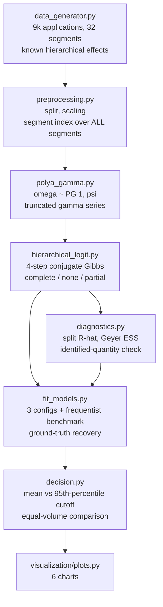

<div align="center">

# 🎲 Bayesian Hierarchical Scorecard

**Partial pooling across 32 commercial segments, sampled with a Gibbs sampler I wrote from scratch on Pólya-Gamma augmentation — every PD comes out as a posterior distribution, and the approval policy is allowed to use that uncertainty instead of throwing it away**

🌐 **[English](README.md)** | **[Español](README.es.md)**

[](https://www.python.org/)
[](https://numpy.org/)
[](https://arxiv.org/abs/1205.0310)
[](https://mc-stan.org/)
[](https://scikit-learn.org/)
[](tests/)
[](../LICENSE)

</div>

---

## Why I built it this way

Credit portfolios are never one population. The same bank originates in
Santiago and in Los Lagos, to salaried and informal-contract borrowers,
through branches and through an app — and those segments genuinely default
at different rates. That leaves a modelling decision that people usually
make by habit:

- **Ignore the segments** (one model for everyone). Clean, but it prices a
  Los Lagos informal digital loan as if it were the portfolio average.
- **One model per segment** (or a dummy per segment). Honest about the
  differences, but a segment with 30 training cases produces an estimate
  that is mostly noise, and a bad-luck run of defaults turns into policy.

Partial pooling is the third option, and it is not a compromise between the
other two — it is what falls out of the model when you say the thing everyone
already believes: *segments differ, but they are not unrelated*. Each
segment's effect is drawn from a common distribution whose spread (`τ`) is
itself estimated from the data. Segments with plenty of history keep their
own estimate; segments with almost none get pulled toward the portfolio
average. Nobody has to choose a shrinkage constant.

I implemented the sampler myself rather than reaching for PyMC or Stan
because the interesting mechanism is exactly what those hide. A logistic
likelihood is not conjugate with a normal prior, so a Bayesian logistic model
normally needs Metropolis-Hastings or HMC — with step sizes, acceptance
rates, and tuning. Polson, Scott and Windle's Pólya-Gamma augmentation makes
the logistic likelihood *conditionally Gaussian*, and the whole sampler
collapses into closed-form Gibbs steps: no tuning, no rejected proposals.
Writing those four steps is the project.

## Business framing

9,000 consumer-credit applications across **32 segments** (8 regions × formal
/ informal contract × branch / digital), with deliberately unbalanced volume:
the largest segment has 1,307 training cases, the smallest 30, and five
segments have fewer than 50. Segment effects are drawn from a normal with a
known standard deviation, so "which approach recovers them best" is a
measurable question, not a preference.

Then the part that actually reaches a customer: a Bayesian model gives every
applicant a *distribution* of PD, not a number. Two applicants can share a
posterior mean of 8% while one is pinned down by thousands of similar cases
and the other rests on forty. Does it pay to decide with the upper end of the
credible interval instead of the mean? That question gets tested, not
assumed.

## Results from an actual run

`python run_pipeline.py` — 6,300 training / 2,700 test applications,
16.0% default rate, 4 chains × 3,000 draws (1,000 warmup) per configuration,
≈70 s per configuration on a laptop CPU.

### The three pooling approaches, same sampler, same data

| Approach | AUC | Brier | Log-loss | Segment-effect RMSE (all) | RMSE (large segments) |
|---|---|---|---|---|---|
| Complete pooling (no segment effects) | 0.8254 | 0.1010 | 0.3329 | 0.4576 | 0.4209 |
| No pooling (free effect per segment) | 0.8285 | 0.1002 | 0.3308 | 0.3873 | 0.3843 |
| **Partial pooling (hierarchical)** | **0.8309** | **0.0995** | **0.3286** | **0.2774** | **0.2303** |
| Frequentist benchmark: logistic + segment dummies | 0.8289 | 0.1001 | 0.3303 | — | — |

Partial pooling wins on every predictive metric and cuts the error in the
recovered segment effects by **39% versus no pooling** and **39% versus
complete pooling**. The global coefficients also come back close to truth —
mean absolute error 0.0396 across the intercept and six covariates.

`τ`, the between-segment dispersion the model has to infer, comes out at
**0.515 with a 90% credible interval of [0.391, 0.668]**, against a true
value of **0.450** — the interval covers it, and the model was never told
that segments differ at all.

### Where the shrinkage lands

| | Complete pooling | No pooling | Partial pooling |
|---|---|---|---|
| Segment-effect RMSE, small segments (<50 cases) | 0.6193 | **0.4032** | 0.4539 |
| Segment-effect RMSE, large segments | 0.4209 | 0.3843 | **0.2303** |
| Out-of-sample log-loss on the 83 test applications in small segments | 0.2644 | 0.2477 | **0.2454** |

This is the honest version of a story that usually gets told too cleanly.
Partial pooling dominates overall and in large segments, and it predicts best
in the small ones — but on the *parameter* RMSE restricted to the five
smallest segments, no pooling scored better in this run. That is shrinkage
doing exactly what it is supposed to do (trading bias for variance) on five
data points, which is far too few for that comparison to mean much. I report
both instead of quoting whichever supports the thesis.

### Convergence: where a diagnostic earns its keep

| Configuration | Raw parameters | Identified quantity (`intercept + b_j`) |
|---|---|---|
| Complete pooling | R̂ 1.0011, ESS 2,562 | — |
| No pooling | **R̂ 1.3602, ESS 9** | R̂ 1.0028, ESS 881 |
| Partial pooling | R̂ 1.0095, ESS 453 | R̂ 1.0018, ESS 1,716 |

The no-pooling configuration fails its convergence check, and it *should*.
With a flat prior on the segment effects, the global intercept and the `b_j`
are only identified through their sum: the sampler can raise one and lower
all the others without changing the likelihood, and the chains wander along
that ridge forever. Diagnosing the sum separately shows the model is fine
where it matters — the distinction between "this model is broken" and "this
parameterisation is not identifiable". The hierarchical prior is what fixes
it in the partial-pooling case, which is a second, quieter argument for it.

### Does uncertainty-aware approval pay?

Two policies on the same test book, compared **at equal approved volume**
(each policy's threshold is set to approve the same fraction, since a 95th
percentile is mechanically higher than a mean):

| Approval rate | Bad rate, decide on the mean | Bad rate, decide on the 95th percentile | Δ profit |
|---|---|---|---|
| 70% | 6.40% | 6.51% | −1.83% |
| 80% | 8.01% | 8.15% | −3.62% |
| 90% | 10.95% | 10.91% | +0.25% |

**The conservative policy does not pay here.** At 80% approval only 14
applications (0.5% of the book) change decision, and the ones the cautious
policy rejects defaulted at 7.14% — *below* the approved population's 8.01%.
The mechanism does work as designed: those 14 come disproportionately from
thin segments (21.4% vs. a 3.1% base rate) and carry 2.5× the portfolio's
average posterior standard deviation (0.0537 vs. 0.0211). There simply isn't
enough posterior uncertainty left, with 6,300 training rows and a
well-specified model, for caution to buy anything.

So I re-ran the same comparison with **945 training rows** (15% of the
original), where average posterior SD more than doubles to 0.0473:

| Approval rate | Δ bad rate (pp) | Δ profit |
|---|---|---|
| 70% | −0.11 | +1.21% |
| 80% | +0.09 | −3.24% |
| 90% | −0.16 | +12.23% |

Better, and in the expected direction at two of three volumes — but not a
clean win, and well inside run-to-run noise. The defensible conclusion is
narrow: posterior uncertainty is real, it concentrates exactly where the data
is thin, and turning it into a cutoff rule is worth testing rather than
assuming.

## Honest findings

- **The headline gain of partial pooling is in the parameters, not the AUC.**
  Segment-effect RMSE improves by 39%; AUC moves from 0.8285 to 0.8309.
  Discrimination was mostly carried by the six applicant-level covariates
  regardless of pooling, and the segment structure refines calibration and
  the estimated effects. Anyone selling hierarchical models as an AUC upgrade
  is overselling.
- **A frequentist logistic with segment dummies is a strong baseline**
  (AUC 0.8289, log-loss 0.3303) — it beats both Bayesian extremes and only
  loses to partial pooling. Worth stating plainly: the Bayesian machinery
  buys uncertainty quantification and better small-segment estimates, not a
  large predictive jump.
- **The uncertainty-aware cutoff underperformed at the volumes that matter**,
  as reported above. It stays in the repo as a measured negative result
  because the mechanism is sound and the size of the effect is the honest
  finding.
- **Truncating the Pólya-Gamma series biases downward, always in the same
  direction.** The discarded terms are all positive, so a short truncation
  underestimates ω. With the default 60 terms the bias on E[ω] is bounded by
  8.4e-4; a test verifies both the bound and its direction against the
  analytic mean tanh(c/2)/(2c).
- **Comparing segment effects requires centring first.** Without pooling, the
  level of the `b_j` is arbitrary, so a raw comparison against the
  (zero-centred) true effects would have punished that model for a constant
  that changes no prediction. Before centring, no-pooling RMSE read 0.5818;
  after, 0.3873. The first number would have made partial pooling look better
  than it is.

## Architecture



| Module | What it does |
|---|---|
| [`src/polya_gamma.py`](src/polya_gamma.py) | The augmentation variable: PG(1, c) via the truncated gamma series, plus its analytic mean and variance and a bound on the truncation bias. |
| [`src/hierarchical_logit.py`](src/hierarchical_logit.py) | The sampler. Four conjugate Gibbs steps (ω, β, b, τ²), with the three pooling regimes as one parameter, and posterior PD prediction with thinning. |
| [`src/diagnostics.py`](src/diagnostics.py) | Split R̂, effective sample size via Geyer's initial positive sequence, MCSE, and the identified-quantity diagnostic for `intercept + b_j`. |
| [`src/data_generator.py`](src/data_generator.py) | Applications with hierarchical segment effects drawn from a known τ, and deliberately unbalanced segment volume. |
| [`src/preprocessing.py`](src/preprocessing.py) | Split, train-only scaling, and a segment index over every possible segment — so a segment barely seen in training can still be scored. |
| [`src/fit_models.py`](src/fit_models.py) | Runs the three configurations, the frequentist benchmark, ground-truth recovery, and out-of-sample metrics overall and in thin segments. |
| [`src/decision.py`](src/decision.py) | Approval policies compared at equal volume, the disagreement analysis, and the scarce-data re-run. |

## Running it

```bash
python -m venv venv
venv\Scripts\activate            # Windows;  source venv/bin/activate on Linux/macOS
pip install -r requirements.txt

python run_pipeline.py           # everything end to end (~6 min)
pytest -q                        # 34 tests
```

Stages run standalone exactly as the orchestrator calls them:

```bash
python -m src.data_generator
python -m src.preprocessing
python -m src.fit_models
python -m src.decision
python -m src.visualization.plots
```

| Chart | Shows |
|---|---|
| `shrinkage_por_segmento.png` | Each segment's effect with and without pooling against its training volume, and recovery vs. truth |
| `posterior_vs_verdad.png` | Posterior means and 90% credible intervals against the simulator's true coefficients |
| `trazas_mcmc.png` | Chains for τ and two coefficients, annotated with computed R̂ and ESS |
| `incertidumbre_por_segmento.png` | Posterior SD of PD against segment volume — the model knowing where it doesn't know |
| `frontera_decision.png` | Realized bad rate and profit by approval rate, both policies |
| `calibracion_modelos.png` | Decile calibration for the three pooling approaches |

## Tests

34 tests (`pytest -q`) covering the parts that fail quietly:

- Pólya-Gamma sample mean and variance against the analytic moments, the
  direction and bound of the truncation bias, and symmetry in `c`;
- recovery of known β and τ from simulated hierarchical data;
- that shrinkage is stronger in small segments than in large ones, and that
  posterior uncertainty correlates negatively with segment volume;
- R̂ ≈ 1 on i.i.d. chains, R̂ > 1.5 on chains stuck in different regions,
  R̂ > 1.2 on a within-chain drift (the reason for splitting), ESS ≈ N when
  independent and ESS < N/5 for an AR(1) with ρ = 0.9;
- portfolio economics computed by hand on a three-row example;
- that a segment unseen in the index raises instead of silently mis-scoring.

## Scope

Synthetic data, deliberately: the claims here are about *recovering* known
effects and a known τ, which is only checkable when they exist. The economics
(45% LGD, 7% margin on principal) are declared laboratory assumptions — the
subject is the posterior and what a policy does with it.

## Author

Pablo Reyes — [github.com/Rxyxs](https://github.com/Rxyxs)
Code: MIT — see [LICENSE](../LICENSE)
