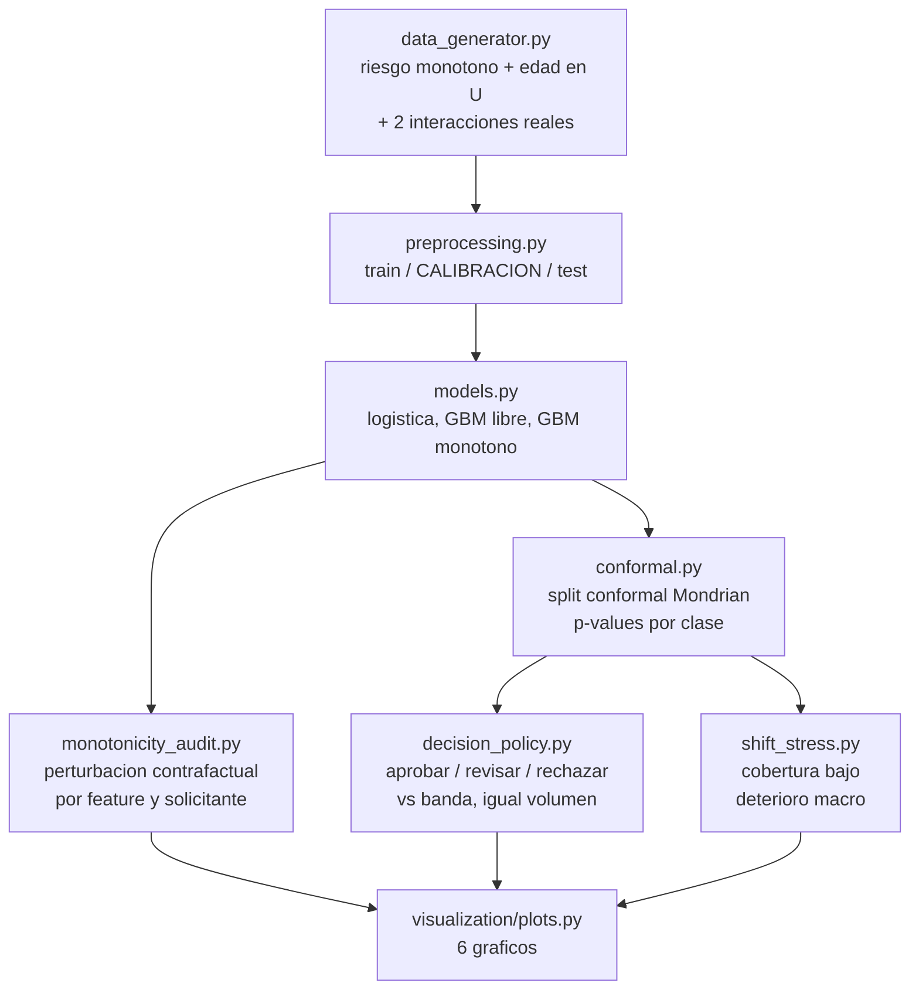

<div align="center">

# 🛡️ Restricciones monotonas + decision conforme

**Un modelo de scoring que un supervisor puede aceptar y que sabe cuando abstenerse — gradient boosting con restricciones de monotonia, auditado por perturbacion contrafactual, envuelto en un predictor conforme Mondrian que convierte la PD en aprobar / revision manual / rechazar con una garantia de error sin supuestos distribucionales**

🌐 **[English](README.md)** | **[Español](README.es.md)**

[](https://www.python.org/)
[](https://scikit-learn.org/stable/modules/ensemble.html#monotonic-cst-gbdt)
[](https://arxiv.org/abs/2107.07511)
[](src/monotonicity_audit.py)
[](tests/)
[](../LICENSE)

</div>

---

## Por que lo construi asi

Hay dos cosas que hunden un modelo de credito en la sala donde se aprueba, y
ninguna de las dos es el AUC.

La primera es un modelo que contesta mal una pregunta que cualquiera puede
hacer. *Si a este solicitante le sube la carga financiera y todo lo demas
queda igual, .el modelo dice que el riesgo es mayor?* Un gradient boosting sin
restricciones puede perfectamente decir "menor" en algun tramo de la variable
-- no por un bug, sino porque ajusto ruido local. Muestre eso en un comite de
riesgo de modelos y la conversacion se acabo.

La segunda es un modelo que no tiene forma de decir "no se". Un scorecard
entrega un numero para todos, incluidos los solicitantes sobre los que no
tiene nada que opinar, y el parche habitual -- una banda de revision manual
entre dos cortes de PD -- es un numero que alguien eligio, sin ninguna
garantia asociada a lo que se automatiza.

Este proyecto ataca las dos con las herramientas que efectivamente apuntan
ahi: **restricciones de monotonia** para que el modelo no pueda contradecir al
dominio, y **prediccion conforme** para que la regla de abstencion tenga una
garantia formal de tasa de error y no una corazonada. Y despues hace la parte
que normalmente se salta: medir cuanto cuesta cada una y donde deja de
funcionar.

## Enfoque de negocio

20.000 solicitudes de credito de consumo. El proceso de riesgo verdadero es
monotono en las siete variables donde se imponen las restricciones (carga
financiera, morosidad, utilizacion de lineas, consultas y tasa hacia arriba;
renta y antiguedad laboral hacia abajo), y genuinamente **no monotono en la
edad** (forma de U, minimo cerca de los 45), que queda sin restringir a
proposito: las restricciones van donde el dominio las respalda, no en todas
partes. En el proceso generador hay dos interacciones reales (morosidad ×
utilizacion y utilizacion × carga financiera), asi que un modelo aditivo no
puede capturarlo todo y el boosting tiene algo que ganar.

El split es en tres: train (60%) / **calibracion (20%)** / test (20%), porque
la prediccion conforme necesita un conjunto de calibracion que el modelo nunca
vio. Sin eso, la garantia no vale.

## Resultados de una corrida real

`python run_pipeline.py` — 12.000 de train / 4.000 de calibracion / 4.000 de
test, 22,7% de tasa de default.

### Cuanto cuesta la restriccion (spoiler: nada)

| Modelo | AUC | KS | Brier | Log-loss | Solicitantes con ≥1 violacion de monotonia |
|---|---|---|---|---|---|
| Regresion logistica | 0,7545 | 0,3902 | 0,1459 | 0,4571 | 0,00% |
| Gradient boosting sin restricciones | 0,7655 | 0,3888 | 0,1441 | 0,4505 | **97,15%** |
| **Gradient boosting monotono** | **0,7695** | **0,4007** | **0,1424** | **0,4467** | **0,00%** |

El modelo restringido no es un punto medio: es el mejor en todas las metricas
de esta tabla (+0,52% de AUC, +0,79 pp de Gini sobre el libre). Con un proceso
de riesgo genuinamente monotono, la restriccion actua como regularizacion:
saca exactamente la flexibilidad que estaba ajustando ruido.

### Que encontro la auditoria en el modelo libre

A cada solicitante se le mueve una variable por una grilla dejando el resto
fijo — el contrafactual que efectivamente plantearia un cliente o un
supervisor.

| Feature | Direccion esperada | Solicitantes con violacion | Peor reversion (pp de PD) |
|---|---|---|---|
| `utilizacion_lineas` | ↑ riesgo | 97,6% | 18,3 |
| `dti` | ↑ riesgo | 96,2% | 8,7 |
| `antiguedad_laboral_meses` | ↓ riesgo | 95,5% | 9,0 |
| `log_renta` | ↓ riesgo | 93,1% | 9,0 |
| `tasa_anual` | ↑ riesgo | 88,8% | 15,0 |
| `consultas_6m` | ↑ riesgo | 30,9% | 3,9 |
| `n_moras_12m` | ↑ riesgo | 11,5% | 18,7 |

El modelo monotono marca 0,00% en todas las filas, por construccion y no por
suerte.

### Cobertura conforme: por que importa que sea condicional por clase

Cobertura empirica en test, contra el objetivo 1 − α:

| α | Objetivo | Mondrian: global / paga / default | Marginal: global / paga / default |
|---|---|---|---|
| 0,05 | 0,95 | 0,9557 / 0,9544 / **0,9603** | 0,9475 / 0,9994 / **0,7704** |
| 0,10 | 0,90 | 0,9012 / 0,9043 / **0,8907** | 0,8968 / 0,9916 / **0,5728** |
| 0,20 | 0,80 | 0,7940 / 0,7967 / **0,7848** | 0,8040 / 0,9554 / **0,2870** |

La conformal marginal cumple su objetivo global en todos los niveles — y lo
hace cubriendo a la clase que paga en 99% mientras la clase de default cae a
**57%**. Con una tasa base de 23%, "90% de cobertura" calculado sobre la
poblacion agrupada es casi enteramente una afirmacion sobre la clase
mayoritaria. La variante Mondrian calibra dentro de cada clase y sostiene la
garantia donde vive el error caro.

### La decision en tres vias, contra la practica habitual

Con α = 0,10, comparada contra una banda de score calibrada para mandar **el
mismo volumen** a revision manual:

| Politica | Aprobado automatico | Revision manual | Error de las decisiones automaticas | Tasa mala entre aprobados | Utilidad realizada (CLP) |
|---|---|---|---|---|---|
| **Conjuntos conformes** | 32,7% | 50,1% | **19,79%** | 7,56% | **123,7M** |
| Banda de score (mismo volumen) | 24,1% | 50,1% | 29,41% | 6,03% | 114,6M |

Con la misma dotacion de analistas, **un tercio menos de error** en lo que se
decide automaticamente (19,79% contra 29,41%, contando tanto malos aprobados
como buenos rechazados) y 8% mas de utilidad. α es el dial operativo: el
barrido en `barrido_alpha.csv` va desde α = 0,02 (12,8% automatizado, riesgo
casi nulo de una etiqueta no cubierta) hasta α = 0,30 (99% automatizado).

### Donde se rompe la garantia

El mismo predictor calibrado, aplicado a una cartera bajo deterioro macro (mas
informalidad, menos renta, mas utilizacion; tasa de default 22,7% → 32,2%):

| Escenario | Cobertura global | Clase que paga | Clase default | Aprobado automatico | Error automatico |
|---|---|---|---|---|---|
| Poblacion normal | 0,9012 | 0,9043 | 0,8907 | 32,7% | 19,79% |
| Deterioro, calibracion vieja | 0,8577 | **0,8079** | 0,9623 | 15,9% | 29,42% |
| Deterioro, recalibrado con 2.100 casos nuevos | 0,9095 | 0,9094 | 0,9097 | 29,7% | 17,90% |

La garantia es condicional a la intercambiabilidad, y una cartera que se mueve
la rompe: la clase que paga cae nueve puntos bajo el objetivo, las
aprobaciones automaticas se desploman a la mitad, y la tasa de error
automatico sube al nivel de la banda de score. Recalibrar sobre una parte de
la poblacion nueva lo restituye por completo. Esa es la instruccion operativa
honesta: la prediccion conforme no sobrevive sola a un cambio de
distribucion, solo hace que el dano sea medible.

## Hallazgos honestos

- **La respuesta *promedio* del modelo libre se ve casi bien.** Sus curvas de
  dependencia parcial (`curvas_respuesta.png`) apenas oscilan, y por eso los
  graficos de interpretabilidad basados en promedios no alcanzan: las
  violaciones son a nivel individual, y es un individuo — un cliente, o un
  caso que elige un supervisor — quien las expone. La auditoria contrafactual
  existe porque el PDP habria aprobado a este modelo.
- **"Las restricciones cuestan precision" no se cumplio aca, y puedo decir por
  que.** El proceso verdadero es monotono en las features restringidas, asi
  que la restriccion solo saca ajuste de ruido. Con datos reales y una
  relacion genuinamente no monotona, la misma restriccion costaria desempeno
  de verdad — por eso `edad` queda libre a proposito y es justamente la que
  tiene forma de U.
- **El volumen de revision conforme es alto con α estricto.** La mitad de la
  cartera va a revision manual con α = 0,10. No es un defecto del metodo — es
  el modelo reportando honestamente que con AUC 0,77 no puede descartar
  ninguna de las dos etiquetas para la mayoria — pero cualquier afirmacion de
  negocio tiene que pagar esos analistas. El barrido de alpha y el costo de
  CLP 12.000 por revision estan en los numeros de arriba.
- **La metrica de error cuenta las dos direcciones.** La "tasa de error de las
  decisiones automaticas" incluye a los buenos rechazados automaticamente, no
  solo a los malos aprobados. Una metrica que contara unicamente malos
  aprobados habria hecho ver mucho mejor a las dos politicas y habria
  escondido el costo de rechazar de mas.
- **La politica conforme aprueba *mas* y su cartera aprobada es levemente peor**
  (7,56% contra 6,03% de tasa mala). Gana en error total y en utilidad porque
  la banda de score compra su menor tasa mala rechazando a muchos clientes
  buenos. Los dos numeros estan en la tabla; quedarse solo con la tasa mala
  daria vuelta la conclusion.

## Arquitectura



| Modulo | Que hace |
|---|---|
| [`src/data_generator.py`](src/data_generator.py) | Solicitudes cuyo riesgo verdadero es monotono donde van las restricciones, en U en la edad, y con suficientes interacciones para que los arboles le ganen a un modelo lineal. Tambien construye la cartera deteriorada. |
| [`src/preprocessing.py`](src/preprocessing.py) | El split en tres, con el conjunto de calibracion fuera del entrenamiento para que la garantia conforme se sostenga. |
| [`src/models.py`](src/models.py) | Baseline logistico mas `HistGradientBoostingClassifier` con y sin `monotonic_cst`, y la comparacion del costo de la restriccion. |
| [`src/monotonicity_audit.py`](src/monotonicity_audit.py) | La auditoria: por solicitante y por feature, mueve una variable en una grilla y cuenta reversiones, con su magnitud en puntos de PD. |
| [`src/conformal.py`](src/conformal.py) | Split conformal desde cero: scores de no conformidad, p-values condicionales por clase (Mondrian), conjuntos de prediccion y cobertura empirica — con modo marginal para comparar. |
| [`src/decision_policy.py`](src/decision_policy.py) | Conjuntos de prediccion → aprobar / revisar / rechazar, la comparacion a igual volumen contra la banda de score, y la economia de la cartera. |
| [`src/shift_stress.py`](src/shift_stress.py) | Cobertura y operacion bajo una poblacion desplazada, con y sin recalibracion. |

## Como correrlo

```bash
python -m venv venv
venv\Scripts\activate            # Windows;  source venv/bin/activate en Linux/macOS
pip install -r requirements.txt

python run_pipeline.py           # todo end to end (~2 min)
pytest -q                        # 23 tests
```

Cada etapa corre sola, exactamente como la llama el orquestador:

```bash
python -m src.data_generator
python -m src.preprocessing
python -m src.models
python -m src.conformal_run
python -m src.shift_stress
python -m src.visualization.plots
```

| Grafico | Que muestra |
|---|---|
| `auditoria_monotonia.png` | Violaciones por feature y su magnitud, con y sin restricciones |
| `curvas_respuesta.png` | Respuesta del modelo a carga financiera, utilizacion y edad — incluida la U que los dos modelos pueden conservar |
| `cobertura_conforme.png` | Cobertura empirica vs objetivo por clase, Mondrian contra marginal |
| `politicas_decision.png` | Conformal contra banda de score a igual volumen de revision, y el dial de α |
| `shift_cobertura.png` | Que le hace el cambio de poblacion a la cobertura y a la operacion |
| `mapa_decision_conforme.png` | El plano de p-values, con cada region de decision y donde cae en la escala de PD |

## Tests

23 tests (`pytest -q`), entre ellos:

- la cobertura se cumple sobre datos intercambiables **incluso con un modelo
  deliberadamente inutil** (un predictor constante): la garantia es del
  procedimiento, no del modelo, y un test que solo pasara con un buen modelo
  estaria midiendo otra cosa;
- Mondrian mantiene la cobertura de la clase 1 donde la marginal pierde mas de
  10 puntos;
- los conjuntos de prediccion estan anidados en α (subir α solo puede sacar
  etiquetas);
- un modelo construido a mano con un escalon a la baja es detectado por la
  auditoria, uno monotono marca cero violaciones, y una direccion esperada
  invertida marca el 100%;
- el GBM monotono entrenado pasa la auditoria que el libre reprueba (test de
  integracion, entrena de verdad);
- la economia de la cartera calculada a mano sobre un ejemplo de cuatro filas.

## Alcance

Datos sinteticos, a proposito: conocer la monotonia verdadera es lo que
convierte "la restriccion salio gratis aca, y esta es la razon" en una
afirmacion defendible en vez de una anecdota. La economia (LGD 45%, margen 7%,
CLP 12.000 por revision manual) son supuestos de laboratorio declarados.

## Autor

Pablo Reyes — [github.com/Rxyxs](https://github.com/Rxyxs)
Codigo: MIT — ver [LICENSE](../LICENSE)
