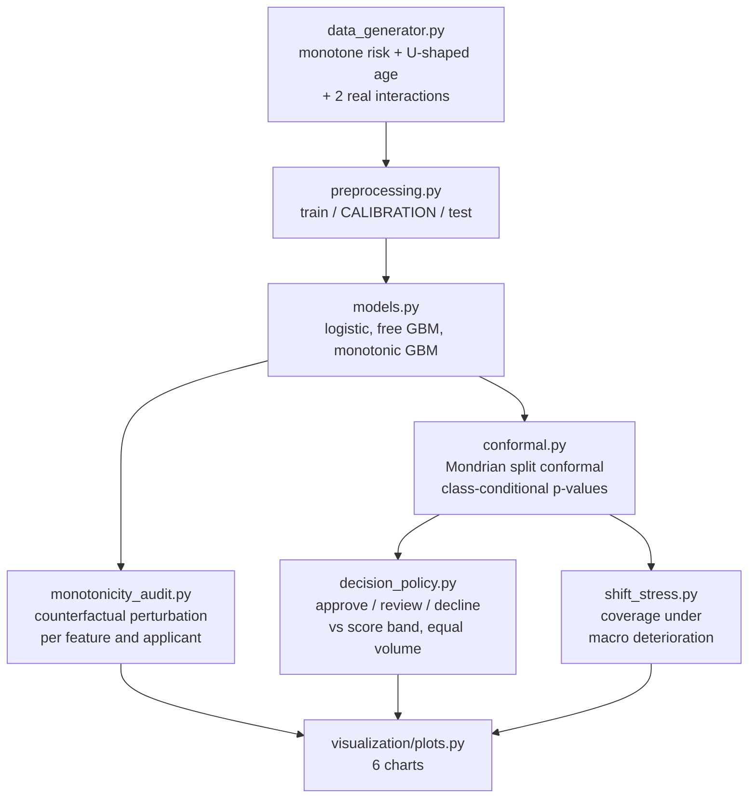

<div align="center">

# 🛡️ Monotonic Constraints + Conformal Decisioning

**A scoring model a supervisor can accept and that knows when to abstain — monotonic-constrained gradient boosting audited by counterfactual perturbation, wrapped in a Mondrian split-conformal predictor that turns PD into approve / manual review / decline with a distribution-free error guarantee**

🌐 **[English](README.md)** | **[Español](README.es.md)**

[](https://www.python.org/)
[](https://scikit-learn.org/stable/modules/ensemble.html#monotonic-cst-gbdt)
[](https://arxiv.org/abs/2107.07511)
[](src/monotonicity_audit.py)
[](tests/)
[](../LICENSE)

</div>

---

## Why I built it this way

Two things sink a credit model in the room where it gets approved, and
neither of them is AUC.

The first is a model that answers a question wrong in a way anyone can see.
*If this applicant's debt burden goes up and nothing else changes, does the
model say the risk is higher?* A gradient boosting machine with no
constraints can easily say "lower" over some stretch of the variable — not
from a bug, but because it fit local noise. Show that in a model-risk
committee and the discussion is over.

The second is a model that has no way to say "I don't know." A scorecard
returns a number for everyone, including the applicants it has no business
deciding on, and the usual fix — a manual-review band between two PD cut-offs
— is a number someone picked, with no guarantee attached to what gets
automated.

This project addresses both with the two tools that actually target them:
**monotonic constraints** so the model cannot contradict the domain, and
**conformal prediction** so the abstention rule carries a formal
error-rate guarantee rather than a hunch. Then it does the part that usually
gets skipped: measuring what each one costs and where it stops working.

## Business framing

20,000 consumer-credit applications. The true risk process is monotone in the
seven variables where the constraints are imposed (debt burden, delinquencies,
line utilisation, credit inquiries, rate up; income and job tenure down), and
genuinely **non-monotone in age** (U-shaped, minimum near 45), which is left
unconstrained on purpose — constraints go where domain knowledge supports
them, not everywhere. Two real interactions (delinquencies × utilisation and
utilisation × debt burden) are in the generating process, so an additive model
cannot capture everything and the boosting has something to win.

The split is three ways — train (60%) / **calibration (20%)** / test (20%) —
because conformal prediction needs a calibration set the model never saw. Skip
that and the guarantee is void.

## Results from an actual run

`python run_pipeline.py` — 12,000 train / 4,000 calibration / 4,000 test,
22.7% default rate.

### What the constraint costs (spoiler: nothing)

| Model | AUC | KS | Brier | Log-loss | Applicants with ≥1 monotonicity violation |
|---|---|---|---|---|---|
| Logistic regression | 0.7545 | 0.3902 | 0.1459 | 0.4571 | 0.00% |
| Gradient boosting, unconstrained | 0.7655 | 0.3888 | 0.1441 | 0.4505 | **97.15%** |
| **Gradient boosting, monotonic** | **0.7695** | **0.4007** | **0.1424** | **0.4467** | **0.00%** |

The constrained model is not a compromise — it is the best model on every
metric here (+0.52% AUC, +0.79 pp Gini over the free one). With a truly
monotone risk process, the constraint acts as regularisation: it removes
exactly the flexibility that was fitting noise.

### What the audit found in the unconstrained model

Each applicant's variable is moved along a grid while everything else is held
fixed — the counterfactual a customer or a supervisor would actually pose.

| Feature | Expected direction | Applicants with a violation | Worst reversal (pp of PD) |
|---|---|---|---|
| `utilizacion_lineas` | ↑ risk | 97.6% | 18.3 |
| `dti` | ↑ risk | 96.2% | 8.7 |
| `antiguedad_laboral_meses` | ↓ risk | 95.5% | 9.0 |
| `log_renta` | ↓ risk | 93.1% | 9.0 |
| `tasa_anual` | ↑ risk | 88.8% | 15.0 |
| `consultas_6m` | ↑ risk | 30.9% | 3.9 |
| `n_moras_12m` | ↑ risk | 11.5% | 18.7 |

The monotonic model scores 0.00% on every row, by construction rather than by
luck.

### Conformal coverage: why class-conditional matters

Empirical coverage on the test set, against the target 1 − α:

| α | Target | Mondrian: global / paid / default | Marginal: global / paid / default |
|---|---|---|---|
| 0.05 | 0.95 | 0.9557 / 0.9544 / **0.9603** | 0.9475 / 0.9994 / **0.7704** |
| 0.10 | 0.90 | 0.9012 / 0.9043 / **0.8907** | 0.8968 / 0.9916 / **0.5728** |
| 0.20 | 0.80 | 0.7940 / 0.7967 / **0.7848** | 0.8040 / 0.9554 / **0.2870** |

Marginal conformal meets its global target at every level — and does it by
covering the paying class at 99% while the default class falls to **57%**.
With a 23% base rate, "90% coverage" computed over the pooled population is
almost entirely a statement about the majority class. The Mondrian variant
calibrates within each class and holds the guarantee where the expensive
error lives.

### The three-way decision, against the usual practice

At α = 0.10, compared to a score band calibrated to send **the same volume**
to manual review:

| Policy | Auto-approved | Manual review | Error rate on automated decisions | Bad rate among approved | Realized profit (CLP) |
|---|---|---|---|---|---|
| **Conformal sets** | 32.7% | 50.1% | **19.79%** | 7.56% | **123.7M** |
| Score band (same review volume) | 24.1% | 50.1% | 29.41% | 6.03% | 114.6M |

Same analyst headcount, **a third less error** in what gets decided
automatically (19.79% vs. 29.41%, counting both defaulters approved and good
customers declined), and 8% more profit. α is the operating dial: the sweep in
`barrido_alpha.csv` runs from α = 0.02 (12.8% automated, near-zero risk of an
uncovered label) to α = 0.30 (99% automated).

### Where the guarantee breaks

The same calibrated predictor applied to a macro-deterioration portfolio
(more informality, lower income, more utilisation; default rate 22.7% → 32.2%):

| Scenario | Global coverage | Paid class | Default class | Auto-approved | Automated error |
|---|---|---|---|---|---|
| Normal population | 0.9012 | 0.9043 | 0.8907 | 32.7% | 19.79% |
| Deterioration, stale calibration | 0.8577 | **0.8079** | 0.9623 | 15.9% | 29.42% |
| Deterioration, recalibrated on 2,100 new cases | 0.9095 | 0.9094 | 0.9097 | 29.7% | 17.90% |

The guarantee is conditional on exchangeability, and a shifting portfolio
breaks it: the paying class drops nine points below target, automatic
approvals collapse by half, and the automated error rate rises to the level of
the score band. Recalibrating on a slice of the new population restores it
completely. That's the honest operating instruction — conformal prediction
does not survive a distribution shift on its own, it just makes the damage
measurable.

## Honest findings

- **The unconstrained model's *average* response looks almost fine.** Its
  partial-dependence curves (`curvas_respuesta.png`) barely wobble, which is
  why average-based interpretability plots are not enough: the violations are
  individual-level, and it is an individual — a customer, or a case picked out
  by a supervisor — who exposes them. The counterfactual audit exists because
  the PDP would have passed this model.
- **"Constraints cost accuracy" did not hold here, and I can say why.** The
  true process is monotone in the constrained features, so the constraint
  removes only noise-fitting. On real data with a genuinely non-monotone
  relationship, the same constraint would cost real performance — which is why
  `edad` is deliberately left free and is the U-shaped one.
- **Conformal review volume is high at strict α.** Half the book goes to
  manual review at α = 0.10. That is not a defect of the method — it is the
  model honestly reporting that with AUC 0.77 it cannot rule out either label
  for most applicants — but any business claim has to price those analysts.
  The alpha sweep and the CLP 12,000 per-review cost are in the numbers above.
- **The error metric counts both directions.** "Error rate on automated
  decisions" includes good customers automatically declined, not just
  defaulters approved. A metric that only counted approved bads would have
  made both policies look far better and would have hidden the cost of
  over-declining.
- **The conformal policy approves *more* and its approved book is slightly
  worse** (7.56% vs. 6.03% bad rate). It wins on total error and profit
  because the score band buys its lower bad rate by declining a large number
  of good customers. Both numbers are in the table; picking only the bad rate
  would flip the conclusion.

## Architecture



| Module | What it does |
|---|---|
| [`src/data_generator.py`](src/data_generator.py) | Applications whose true risk is monotone where the constraints go, U-shaped in age, and interactive enough that trees beat a linear model. Also builds the deteriorated portfolio. |
| [`src/preprocessing.py`](src/preprocessing.py) | The three-way split, with the calibration set kept out of training so the conformal guarantee holds. |
| [`src/models.py`](src/models.py) | Logistic baseline plus `HistGradientBoostingClassifier` with and without `monotonic_cst`, and the cost-of-constraint comparison. |
| [`src/monotonicity_audit.py`](src/monotonicity_audit.py) | The audit: per applicant and per feature, move one variable along a grid and count reversals, with their magnitude in PD points. |
| [`src/conformal.py`](src/conformal.py) | Split conformal from scratch: non-conformity scores, class-conditional (Mondrian) p-values, prediction sets, empirical coverage — with a marginal mode for comparison. |
| [`src/decision_policy.py`](src/decision_policy.py) | Prediction sets → approve / review / decline, the equal-volume score-band comparison, and the portfolio economics. |
| [`src/shift_stress.py`](src/shift_stress.py) | Coverage and operations under a shifted population, with and without recalibration. |

## Running it

```bash
python -m venv venv
venv\Scripts\activate            # Windows;  source venv/bin/activate on Linux/macOS
pip install -r requirements.txt

python run_pipeline.py           # everything end to end (~2 min)
pytest -q                        # 23 tests
```

Stages run standalone exactly as the orchestrator calls them:

```bash
python -m src.data_generator
python -m src.preprocessing
python -m src.models
python -m src.conformal_run
python -m src.shift_stress
python -m src.visualization.plots
```

| Chart | Shows |
|---|---|
| `auditoria_monotonia.png` | Violations per feature and their magnitude, constrained vs. free |
| `curvas_respuesta.png` | Model response to debt burden, utilisation and age — including the U-shape both models are allowed to keep |
| `cobertura_conforme.png` | Empirical vs. target coverage by class, Mondrian vs. marginal |
| `politicas_decision.png` | Conformal vs. score band at equal review volume, and the α dial |
| `shift_cobertura.png` | What the population shift does to coverage and to operations |
| `mapa_decision_conforme.png` | The p-value plane, with each decision region and where it sits on the PD scale |

## Tests

23 tests (`pytest -q`), including:

- coverage holds on exchangeable data **even with a deliberately useless
  model** (a constant predictor) — the guarantee belongs to the procedure, not
  the model, and a test that only passed with a good model would be testing
  something else;
- Mondrian keeps class-1 coverage where marginal loses more than 10 points;
- prediction sets are nested in α (raising α can only remove labels);
- a hand-built model with a downward step is caught by the audit, a monotone
  one scores zero violations, and a reversed expected direction flags 100%;
- the trained monotonic GBM passes the audit while the free one fails it
  (integration test, trains for real);
- portfolio economics computed by hand on a four-row example.

## Scope

Synthetic data, deliberately: knowing the true monotonicity is what makes
"the constraint was free here, and here's why" a defensible statement rather
than an anecdote. Economics (45% LGD, 7% margin, CLP 12,000 per manual review)
are declared laboratory assumptions.

## Author

Pablo Reyes — [github.com/Rxyxs](https://github.com/Rxyxs)
Code: MIT — see [LICENSE](../LICENSE)
