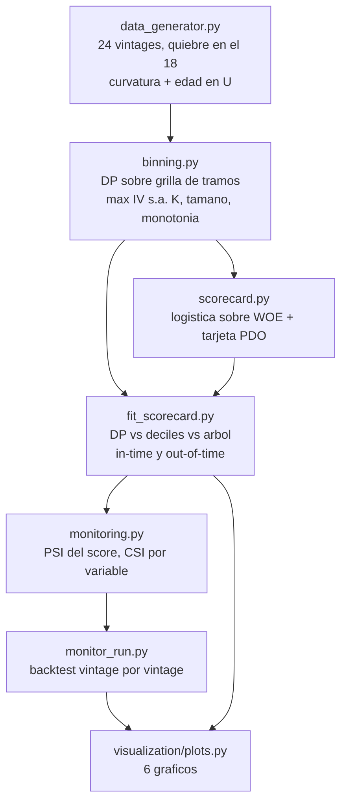

<div align="center">

# 📐 Scorecard con binning optimo

**El scorecard clasico de puntos, construido a mano — bins elegidos por una programacion dinamica que maximiza demostrablemente el Information Value bajo restricciones de monotonia y tamano (verificada contra busqueda exhaustiva), una tarjeta PDO que cualquiera puede sumar, y monitoreo PSI/CSI que detecta un cambio de poblacion en la misma cohorte en que ocurre**

🌐 **[English](README.md)** | **[Español](README.es.md)**

[](https://www.python.org/)
[](https://numpy.org/)
[](src/binning.py)
[](src/scorecard.py)
[](src/monitoring.py)
[](tests/)
[](../LICENSE)

</div>

---

## Por que lo construi asi

El scorecard es el modelo menos glamoroso del riesgo de credito y sigue siendo
sobre el que corren la mayoria de las decisiones. Su calidad la define casi
por completo un paso que se trata como plomeria: **donde se corta cada
variable**. Las dos respuestas habituales son deciles (rapido, pero ciego a la
etiqueta) y un arbol de decision (usa la etiqueta, pero es un heuristico
greedy sin garantia de optimalidad y ninguna de monotonia).

El binning no es plomeria: es un problema de optimizacion con restricciones y
un enunciado limpio:

> particionar un eje ordenado maximizando el Information Value total, sujeto a
> a lo mas K bins, un minimo de poblacion y de eventos por bin, y una
> secuencia de WOE monotona.

Planteado asi tiene solucion exacta por programacion dinamica, y eso es lo que
implementa este proyecto. La restriccion de monotonia es lo que hace que la DP
sea la herramienta correcta y no un adorno: un corte greedy que toma la mejor
ganancia local no puede prometer que la secuencia de WOE resultante sea
monotona, y un scorecard donde el riesgo *baja* cuando sube la carga
financiera es exactamente el hallazgo que termina una validacion de modelos.

Y despues la segunda mitad, que es donde los scorecards realmente mueren:
**el monitoreo**. La cartera se genera como 24 cohortes mensuales con un
quiebre de poblacion deliberado en las ultimas seis, para poder contrastar el
PSI y el CSI contra una verdad conocida en vez de mostrarlos en un dashboard
que nadie ha visto gatillarse nunca.

## Enfoque de negocio

24.000 solicitudes de credito de consumo en 24 cohortes mensuales. Once
variables: ocho numericas y tres categoricas. El proceso generador tiene
curvatura real (un quiebre en la carga financiera, rendimientos decrecientes
de la renta, un efecto de edad en U) para que la eleccion de cortes tenga algo
que encontrar. Desde el vintage 18 la poblacion se deteriora: mas contratos
informales, menos renta, mayor utilizacion de lineas.

La validacion se parte como la reporta un area de riesgo de verdad:
**in-time** (un holdout del 30% de las cohortes estables) y **out-of-time**
(las seis cohortes deterioradas). La distancia entre esos dos numeros dice mas
sobre un scorecard que cualquiera de los dos por separado.

## Resultados de una corrida real

`python run_pipeline.py` — 12.570 de train / 5.430 in-time / 6.000
out-of-time, tasa de default 19,6% estable contra 29,3% deteriorada.

### Cuatro formas de cortar las mismas variables

| Metodo de binning | IV total | Variables no monotonas | AUC in-time | KS in-time | AUC out-of-time |
|---|---|---|---|---|---|
| **DP optimo, monotono** | 2,1237 | **0** | 0,7641 | 0,4066 | 0,7743 |
| DP optimo, sin restringir | 2,1462 | 4 | 0,7633 | 0,3975 | 0,7754 |
| Equifrecuente (deciles) | 1,8755 | 3 | 0,7551 | 0,3874 | 0,7614 |
| Arbol de decision | 2,1604 | 4 | 0,7693 | 0,4069 | **0,7811** |

Leyendo esa tabla con honestidad: la DP recupera **13% mas IV que el binning
equifrecuente** y con eso alrededor de un punto de AUC, y es el unico metodo
que entrega una tarjeta con cero variables no monotonas. No le gana al arbol
de decision — mas abajo se desarma esa brecha.

### La tarjeta, y lo que separa

La transformacion a puntos es la estandar, escrita en el codigo y no heredada
de una libreria: `factor = PDO / ln(2)`, `offset = base − factor·ln(odds
base)`, con PDO 20 y base 600 a odds 50:1. Las bandas son los quintiles de la
distribucion del puntaje:

| Banda | Rango de puntaje | Poblacion | Tasa de default observada |
|---|---|---|---|
| E | 423 – 507 | 20% | **47,79%** |
| D | 507 – 528 | 20% | 26,61% |
| C | 528 – 545 | 20% | 16,11% |
| B | 545 – 563 | 20% | 8,29% |
| A | 563 – 608 | 20% | **5,16%** |

Una separacion de **9,3x** entre la peor y la mejor banda, sobre una tarjeta
cuyas filas puede leer un ejecutivo de sucursal: 57,1 puntos si la carga
financiera es menor a 0,03, 25,4 puntos si supera 0,31, y el puntaje del
cliente es la suma.

### Monitoreo: la alarma suena en el mes correcto

PSI del puntaje contra la poblacion de desarrollo, vintage por vintage:

| Vintages | Rango de PSI | Estado |
|---|---|---|
| 0 – 17 (estables) | 0,0033 – 0,0244 | estable, **sin falsas alarmas en 18 cohortes** |
| 18 – 23 (deteriorados) | 0,2582 – 0,3568 | critico, desde la primera cohorte afectada |

El CSI ademas apunta al culpable en vez de solo levantar la bandera:
`utilizacion_lineas` con 1,1753, un orden de magnitud sobre la siguiente
variable (`tasa_anual`, 0,19), que es justamente la que el simulador movio con
mas fuerza.

## Hallazgos honestos

- **El PSI marco un cambio de poblacion, no un modelo roto — y distinguir esas
  dos cosas es todo el punto.** La alarma es inequivoca (PSI 0,36, catorce
  veces el umbral de alerta), pero el modelo aguanto: el AUC incluso subio
  levemente en las cohortes deterioradas (0,7689 → 0,7743) y la calibracion
  quedo casi exacta (PD predicha 29,44% contra 29,32% observada, +0,12 pp).
  Los clientes empeoraron, el puntaje lo dijo correctamente, y el modelo no
  necesitaba intervencion. Leer el PSI como "el modelo esta roto" habria
  gatillado un redesarrollo caro que la evidencia no respalda.
- **El arbol le gana a la DP por 0,7 pp de AUC out-of-time, y puedo decir
  exactamente por que.** La DP es exacta *sobre su grilla de pre-binning* —
  los cortes solo pueden caer en bordes de cuantil — mientras que un arbol
  corta donde quiera. El barrido de `convergencia_grilla.png` muestra el IV de
  `dti` subiendo 0,0588 → 0,0723 → 0,0745 → 0,0748 → 0,0765 al pasar de 10 a
  160 prebins, convergiendo a los cortes del arbol (la DP recupera 0,179 /
  0,357 / 0,413 / 0,703 contra 0,179 / 0,356 / 0,412 / 0,704 del arbol). Parte
  de la brecha restante es la restriccion de monotonia que el arbol
  simplemente ignora: produce cuatro variables no monotonas, incluida una
  utilizacion de lineas cuyo WOE baja, sube, baja y sube entre bins
  consecutivos.
- **O sea que el resumen honesto es un canje, no una victoria**: alrededor de
  0,5-0,7 pp de AUC a cambio de una tarjeta monotona en todas sus variables y
  defendible linea por linea. Si eso conviene o no es una decision de
  gobierno de modelos, no de modelamiento — pero hay que tomarla con el numero
  a la vista.
- **El binning equifrecuente es el unico perdedor claro** (IV 1,8755, AUC
  0,7551 in-time, y aun asi tres variables no monotonas). Tambien es el metodo
  mas usado, precisamente porque ignora la etiqueta y por lo tanto "no puede
  sobreajustar". Ese consuelo cuesta cerca de un punto de AUC.
- **El puntaje de un scorecard es discreto, y eso aparece en las bandas.** Con
  once variables los quintiles salen limpios, pero un test unitario con solo
  dos variables de cinco bins puede producir a lo mas 25 puntajes distintos,
  asi que los quintiles exactos son inalcanzables. El test declara la
  tolerancia alcanzable y explica por que, en vez de aflojarse en silencio
  hasta pasar.

## Arquitectura



| Modulo | Que hace |
|---|---|
| [`src/binning.py`](src/binning.py) | La programacion dinamica: WOE/IV de todos los tramos via sumas de prefijos, factibilidad por restricciones de tamano y eventos, busqueda vectorizada del predecesor, monotona o libre, probando las dos direcciones; mas los baselines equifrecuente y de arbol produciendo la misma tabla para que la comparacion sea pareja. |
| [`src/scorecard.py`](src/scorecard.py) | Transformacion a WOE, ajuste logistico, la escala de puntos PDO/base/odds escrita explicitamente, la tarjeta imprimible y las bandas por cuantiles. |
| [`src/monitoring.py`](src/monitoring.py) | PSI del puntaje con los cortes de la poblacion de desarrollo, CSI por variable sobre los propios bins del scorecard, umbrales, y el backtest por vintage. |
| [`src/fit_scorecard.py`](src/fit_scorecard.py) | Corre los cuatro metodos de binning de punta a punta y el barrido de resolucion de grilla. |
| [`src/monitor_run.py`](src/monitor_run.py) | Reproduce cada vintage contra la poblacion de desarrollo y separa la deriva poblacional de la degradacion del modelo. |

## Como correrlo

```bash
python -m venv venv
venv\Scripts\activate            # Windows;  source venv/bin/activate en Linux/macOS
pip install -r requirements.txt

python run_pipeline.py           # todo end to end (~2 min)
pytest -q                        # 34 tests
```

Cada etapa corre sola, exactamente como la llama el orquestador:

```bash
python -m src.data_generator
python -m src.fit_scorecard
python -m src.monitor_run
python -m src.visualization.plots
```

| Grafico | Que muestra |
|---|---|
| `woe_por_metodo.png` | La curva de WOE que produce cada metodo — y donde zigzaguea el arbol |
| `comparacion_metodos.png` | IV, AUC in-time / out-of-time y cantidad de variables no monotonas, lado a lado |
| `tarjeta_puntos.png` | La tarjeta de puntos: cuanto suma o resta cada bin |
| `bandas_y_distribucion.png` | Tasa mala por banda, y como el deterioro corre la distribucion del puntaje |
| `psi_csi_por_vintage.png` | PSI por vintage contra sus umbrales, mas un heatmap de CSI que nombra la variable |
| `convergencia_grilla.png` | IV contra la resolucion del pre-binning — la exactitud de la DP es relativa a su grilla |

## Tests

34 tests (`pytest -q`). El que sostiene todo el modulo es el primero: sobre
instancias chicas se enumeran **todas** las particiones factibles y se compara
el mejor IV con la respuesta de la DP, con y sin restriccion de monotonia,
sobre varias instancias aleatorias. Sin eso, "optimo" es solo una palabra en
un README. Tambien se cubren: las restricciones de tamano y eventos, WOE/IV
contra un ejemplo calculado a mano, que la DP no puede perder contra una
particion equifrecuente cuando la grilla esta alineada, que una categoria no
vista cae al bin mas poblado, que duplicar los odds mueve el puntaje
exactamente un PDO, que el PSI da cero para distribuciones identicas y calza
con un calculo a mano en un caso de dos bins, y que el CSI nombra la variable
que efectivamente se movio.

## Alcance

Datos sinteticos, a proposito: un quiebre de poblacion conocido en un vintage
conocido es lo que convierte "el monitoreo funciona" en algo verificable. Las
constantes de la escala de puntos (PDO 20, base 600, odds 50:1) son las
convencionales y estan declaradas en el codigo.

## Autor

Pablo Reyes — [github.com/Rxyxs](https://github.com/Rxyxs)
Codigo: MIT — ver [LICENSE](../LICENSE)
