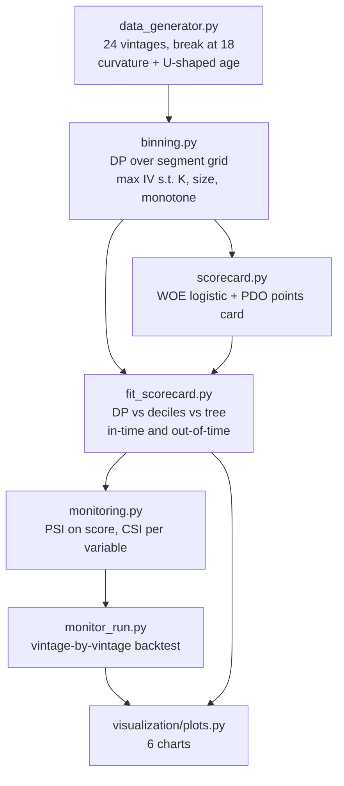

<div align="center">

# 📐 Optimal Binning Scorecard

**The classic points-based scorecard, built by hand — bins chosen by a dynamic program that provably maximises Information Value under monotonicity and size constraints (verified against exhaustive search), a PDO points card anyone can add up, and PSI/CSI monitoring that catches a population shift in the vintage it happens**

🌐 **[English](README.md)** | **[Español](README.es.md)**

[](https://www.python.org/)
[](https://numpy.org/)
[](src/binning.py)
[](src/scorecard.py)
[](src/monitoring.py)
[](tests/)
[](../LICENSE)

</div>

---

## Why I built it this way

The scorecard is the least glamorous model in credit risk and still the one
most decisions actually run on. Its quality is decided almost entirely by a
step people treat as plumbing: **where each variable gets cut**. The two
usual answers are deciles (fast, but blind to the label) and a decision tree
(uses the label, but it is a greedy heuristic with no guarantee of
optimality and none at all of monotonicity).

Binning is not plumbing, though — it is a constrained optimisation problem
with a clean statement:

> partition an ordered axis to maximise total Information Value, subject to at
> most K bins, a minimum population and event count per bin, and a monotone
> WOE sequence.

Stated that way it has an exact solution by dynamic programming, and that is
what this project implements. The monotonicity constraint is what makes the
DP the right tool rather than a flourish: a greedy split that takes the best
local gain cannot promise the resulting WOE sequence is monotone, and a
scorecard whose risk *falls* as debt burden rises is exactly the finding that
ends a model validation.

Then the second half, which is where scorecards actually die: **monitoring**.
The book is generated as 24 monthly vintages with a deliberate population
break in the last six, so PSI and CSI can be checked against a known truth
instead of being displayed on a dashboard nobody has ever seen fire.

## Business framing

24,000 consumer-credit applications across 24 monthly cohorts. Eleven
variables — eight numeric, three categorical. The generating process has real
curvature (a kink in debt burden, diminishing returns to income, a U-shaped
age effect) so the choice of cut points has something to find. From vintage 18
onward the population deteriorates: more informal contracts, lower income,
higher line utilisation.

Validation is split the way a risk team actually reports it: **in-time**
(a 30% holdout of the stable cohorts) and **out-of-time** (the six
deteriorated cohorts). The gap between those two numbers says more about a
scorecard than either alone.

## Results from an actual run

`python run_pipeline.py` — 12,570 train / 5,430 in-time / 6,000 out-of-time,
default rate 19.6% stable vs 29.3% deteriorated.

### Four ways to cut the same variables

| Binning method | Total IV | Non-monotone variables | AUC in-time | KS in-time | AUC out-of-time |
|---|---|---|---|---|---|
| **DP optimal, monotone** | 2.1237 | **0** | 0.7641 | 0.4066 | 0.7743 |
| DP optimal, unconstrained | 2.1462 | 4 | 0.7633 | 0.3975 | 0.7754 |
| Equal-frequency (deciles) | 1.8755 | 3 | 0.7551 | 0.3874 | 0.7614 |
| Decision tree | 2.1604 | 4 | 0.7693 | 0.4069 | **0.7811** |

Reading that table honestly: the DP recovers **13% more IV than
equal-frequency binning** and about a point of AUC with it, and it is the only
method that delivers a card with zero non-monotone variables. It does not beat
the decision tree — see the findings below, where that gap is taken apart.

### The card, and what it separates

The points transformation is the standard one, stated in code rather than
inherited: `factor = PDO / ln(2)`, `offset = base − factor·ln(base odds)`,
with PDO 20, base 600 at 50:1 odds. Score bands are the quintiles of the
score distribution:

| Band | Score range | Population | Observed default rate |
|---|---|---|---|
| E | 423 – 507 | 20% | **47.79%** |
| D | 507 – 528 | 20% | 26.61% |
| C | 528 – 545 | 20% | 16.11% |
| B | 545 – 563 | 20% | 8.29% |
| A | 563 – 608 | 20% | **5.16%** |

A **9.3× separation** between the worst and best band, on a card whose every
row a branch executive can read: 57.1 points for debt burden under 0.03, 25.4
for debt burden over 0.31, and the customer's score is the sum.

### Monitoring: the alarm fires in the right month

PSI of the score against the development population, vintage by vintage:

| Vintages | PSI range | Status |
|---|---|---|
| 0 – 17 (stable) | 0.0033 – 0.0244 | stable, **no false alarms in 18 cohorts** |
| 18 – 23 (deteriorated) | 0.2582 – 0.3568 | critical, from the very first affected cohort |

CSI points at the culprit rather than just raising a flag: `utilizacion_lineas`
at 1.1753, an order of magnitude above the next variable (`tasa_anual`, 0.19),
which is exactly the variable the simulator shifted hardest.

## Honest findings

- **PSI flagged a population change, not a broken model — and telling those
  apart is the whole point.** The alarm is unambiguous (PSI 0.36, fourteen
  times the alert threshold), yet the model held up: AUC actually rose
  slightly on the deteriorated cohorts (0.7689 → 0.7743) and calibration
  stayed nearly exact (predicted PD 29.44% vs. observed 29.32%, +0.12 pp).
  The customers got worse, the score correctly said so, and the model needed
  no intervention. Reading PSI as "the model is broken" would have triggered a
  costly redevelopment that the evidence does not support.
- **The decision tree beats the DP by 0.7 pp of out-of-time AUC, and I can
  say exactly why.** The DP is exact *over its pre-binning grid* — cut points
  can only land on quantile boundaries — while a tree cuts anywhere. The grid
  sweep in `convergencia_grilla.png` shows IV on `dti` climbing 0.0588 →
  0.0723 → 0.0745 → 0.0748 → 0.0765 as the grid goes from 10 to 160 prebins,
  converging toward the tree's cut points (the DP recovers 0.179 / 0.357 /
  0.413 / 0.703 vs. the tree's 0.179 / 0.356 / 0.412 / 0.704). Part of the
  remaining gap is the monotonicity constraint the tree simply ignores: it
  produces four non-monotone variables, including a WOE for line utilisation
  that goes down, up, down, up across consecutive bins.
- **So the honest summary is a trade, not a win**: roughly 0.5–0.7 pp of AUC
  for a card that is monotone everywhere and defensible line by line. Whether
  that is worth it is a governance decision, not a modelling one — but it
  should be made with the number in hand.
- **Equal-frequency binning is the one clear loser** (IV 1.8755, AUC 0.7551
  in-time, and still three non-monotone variables). It is also the most
  commonly used method, precisely because it ignores the label and therefore
  "can't overfit". It gives up about a point of AUC for that comfort.
- **A scorecard's score is discrete, and it shows up in the bands.** With
  eleven variables the quintiles come out clean, but a unit test with only two
  five-bin variables can produce at most 25 distinct scores, so exact quintiles
  are unattainable. The test asserts the achievable tolerance and says why —
  rather than loosening silently until it passes.

## Architecture



| Module | What it does |
|---|---|
| [`src/binning.py`](src/binning.py) | The dynamic program: all-segment WOE/IV via prefix sums, feasibility from size and event constraints, a vectorised predecessor search, monotone or free, both directions tried; plus equal-frequency and tree baselines producing the same table so comparisons are apples to apples. |
| [`src/scorecard.py`](src/scorecard.py) | WOE transform, logistic fit, the PDO/base/odds points transformation stated explicitly, the printable card, and quantile risk bands. |
| [`src/monitoring.py`](src/monitoring.py) | PSI on the score with development-set cut points, CSI per variable over the scorecard's own bins, thresholds, and the per-vintage backtest. |
| [`src/fit_scorecard.py`](src/fit_scorecard.py) | Runs the four binning methods end to end and the grid-resolution sweep. |
| [`src/monitor_run.py`](src/monitor_run.py) | Replays every vintage against the development population and separates population drift from model degradation. |

## Running it

```bash
python -m venv venv
venv\Scripts\activate            # Windows;  source venv/bin/activate on Linux/macOS
pip install -r requirements.txt

python run_pipeline.py           # everything end to end (~2 min)
pytest -q                        # 34 tests
```

Stages run standalone exactly as the orchestrator calls them:

```bash
python -m src.data_generator
python -m src.fit_scorecard
python -m src.monitor_run
python -m src.visualization.plots
```

| Chart | Shows |
|---|---|
| `woe_por_metodo.png` | The WOE curve each method produces — and where the tree zig-zags |
| `comparacion_metodos.png` | IV, AUC in-time / out-of-time, and non-monotone variable count side by side |
| `tarjeta_puntos.png` | The points card: what each bin adds or subtracts |
| `bandas_y_distribucion.png` | Bad rate by band, and how the deterioration moves the score distribution |
| `psi_csi_por_vintage.png` | PSI by vintage against its thresholds, plus a CSI heatmap naming the variable |
| `convergencia_grilla.png` | IV against pre-binning resolution — the DP's exactness is relative to its grid |

## Tests

34 tests (`pytest -q`). The one holding up the whole module is the first: on
small instances, **every** feasible partition is enumerated and the best IV is
compared with the DP's answer, with and without the monotonicity constraint,
across several random instances. Without that, "optimal" is just a word in a
README. Also covered: the size and event constraints, WOE/IV against a
hand-computed example, that the DP cannot lose to an equal-frequency partition
when the grid is aligned to it, that an unseen category falls back to the most
populated bin, that doubling the odds moves the score by exactly one PDO, that
PSI is zero for identical distributions and matches a hand calculation on a
two-bin case, and that CSI names the variable that actually moved.

## Scope

Synthetic data, deliberately: a known population break at a known vintage is
what turns "the monitoring works" into something checkable. The points
transformation constants (PDO 20, base 600, odds 50:1) are the conventional
ones and are declared in code.

## Author

Pablo Reyes — [github.com/Rxyxs](https://github.com/Rxyxs)
Code: MIT — see [LICENSE](../LICENSE)
