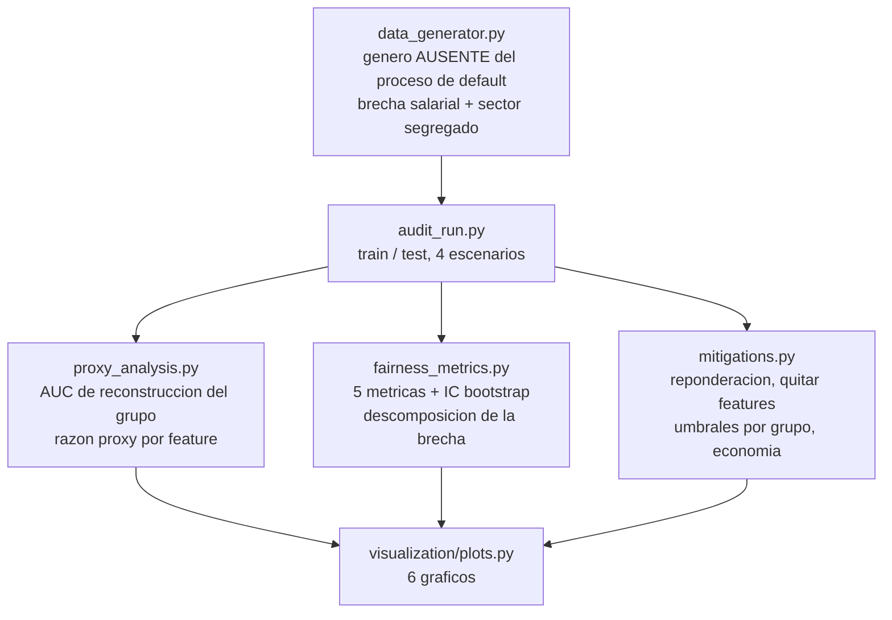

<div align="center">

# ⚖️ Auditoria de trato justo en credito

**Un modelo que nunca ve el genero — y aun asi puede reconstruirlo desde sus propias features con AUC 0,77. Cinco metricas de equidad con intervalos por bootstrap, un detector de proxies que separa senal de riesgo de senal de grupo, y cuatro mitigaciones con su precio en AUC y en pesos, incluida la que empeoro las cosas**

🌐 **[English](README.md)** | **[Español](README.es.md)**

[](https://www.python.org/)
[](https://scikit-learn.org/)
[](src/fairness_metrics.py)
[](src/fairness_metrics.py)
[](src/fairness_metrics.py)
[](tests/)
[](../LICENSE)

</div>

---

## Por que lo construi asi

Todo modelo de credito que he construido parte de la misma regla: el atributo
protegido no entra al modelo. Esa regla es necesaria, es exigible legalmente
en casi cualquier jurisdiccion, y como garantia de equidad vale, por si sola,
bastante poco. Si las features correlacionan lo suficiente con el grupo
protegido, el modelo lo reconstruye haya o no intencion de por medio. La
"equidad por desconocimiento" no es una defensa: es el punto de partida de la
auditoria.

Asi que arme la auditoria como un problema de medicion con tres preguntas que
hay que contestar en orden:

1. **.Hay disparidad?** Cinco metricas, cada una formalizando una idea
   distinta de justicia, reportadas juntas y con intervalos de confianza por
   bootstrap. No un solo numero, porque no hay una sola definicion — y cuando
   las tasas base difieren entre grupos, las definiciones son
   demostrablemente incompatibles entre si (Kleinberg et al., Chouldechova).
2. **.De donde viene?** Un factor de riesgo legitimo que correlaciona con el
   grupo es un problema muy distinto de una variable que principalmente
   transmite pertenencia al grupo. Las dos producen impacto dispar; solo una
   se arregla tocando el modelo.
3. **.Cuanto cuesta arreglarla?** Cuatro mitigaciones, cada una con su precio
   en AUC y en pesos, comparadas a igual volumen de aprobacion para que la
   comparacion no venga arreglada.

El simulador esta disenado para que esas preguntas tengan respuestas
verificables: **el genero no aparece en ninguna parte del proceso que genera
el default**. Si correlaciona con la renta y la antiguedad laboral (una brecha
salarial y trayectorias mas interrumpidas — hechos de un mercado laboral, no
afirmaciones sobre las personas), y el sector laboral esta fuertemente
segregado por genero mientras aporta casi nada de senal de riesgo propia.
Cualquier disparidad que aparezca despues es, entonces, o correlacion legitima
o artefacto del modelo, nunca causalidad.

## Enfoque de negocio

20.000 solicitudes de credito de consumo, 47,5% mujeres. Default observado:
18,01% en mujeres contra 16,50% en hombres — una brecha de 1,51 pp producida
enteramente por las diferencias de renta y antiguedad, ya que el genero no
esta en el proceso generador. Ocho features alimentan el modelo, incluido
`sector`, que va desde 80% de mujeres (salud) hasta 14% (mineria) mientras su
tasa de default se mueve apenas entre 15,9% y 19,0%.

Todas las politicas se comparan al **80% de aprobacion**, porque una
mitigacion que simplemente aprueba a menos gente se ve mas equitativa por
razones que no tienen nada que ver con la equidad.

## Resultados de una corrida real

`python run_pipeline.py` — 14.000 de train / 6.000 de test.

### 1. El desconocimiento no basta, y este es el numero

El modelo se entrena sin el atributo protegido. Un segundo modelo, entrenado
**solo con las features del primero**, predice el genero con **AUC 0,7682**:
el grupo es recuperable desde los insumos.

Por variable, separando senal de grupo de senal de riesgo:

| Feature | AUC prediciendo genero | AUC prediciendo default | Razon proxy | Marcada |
|---|---|---|---|---|
| `sector` | **0,7579** | 0,5235 | **10,98x** | ✅ |
| `antiguedad_laboral_meses` | 0,5422 | 0,5514 | 0,82x | |
| `log_renta` | 0,5782 | 0,6072 | 0,73x | |
| `utilizacion_lineas` | 0,5068 | 0,5542 | 0,13x | |
| `dti` | 0,5076 | 0,5668 | 0,11x | |
| `n_moras_12m` | 0,5079 | 0,6192 | 0,07x | |

Una variable carga once veces mas senal de grupo que de riesgo. La renta y la
antiguedad, en cambio, cargan *mas* senal de riesgo que de grupo: correlacionan
con el genero, pero se estan ganando su lugar en el modelo.

### 2. De donde viene la brecha

| | Brecha de PD predicha (mujeres − hombres) |
|---|---|
| Bruta | **+1,430 pp** |
| Entre perfiles comparables (estratificando por renta y carga financiera) | **+0,120 pp** |
| **Explicado por factores de riesgo legitimos** | **91,6%** |

Nueve decimos de la disparidad es el modelo poniendo correctamente el precio a
solicitantes cuya renta efectivamente es menor. Eso no hace desaparecer la
disparidad como problema de negocio o de politica — las mujeres de esta
cartera si son aprobadas menos — pero cambia por completo que se puede hacer
al respecto dentro del modelo.

### 3. Las cinco metricas, con barras de error

Modelo base al 80% de aprobacion:

| Metrica | Estimacion | IC 95% por bootstrap |
|---|---|---|
| Ratio de impacto adverso (regla 4/5) | 0,9688 | [0,9462, 0,9971] |
| Paridad demografica | −2,53 pp | [−4,39, −0,23] |
| Igualdad de oportunidad | −3,04 pp | [−4,87, −0,91] |
| Odds igualados | 3,04 pp | [1,52, 7,08] |
| Brecha de calibracion | +1,08 pp | [−0,77, +2,88] |

El ratio de impacto adverso queda comodamente sobre el umbral regulatorio de
0,80. Las brechas de paridad y de oportunidad son chicas pero sus intervalos
excluyen el cero: reales y moderadas. La brecha de calibracion **no** se
distingue de cero: el modelo esta tan bien calibrado para un grupo como para
el otro, que es justamente el criterio de equidad que una disparidad de
resultados no viola por si sola.

### 4. Lo que cuesta cada mitigacion

| Escenario | AUC | Ratio impacto adverso | Paridad demografica | Igualdad de oportunidad | Utilidad (CLP) |
|---|---|---|---|---|---|
| Base (ciego al genero) | 0,7091 | 0,9688 | −2,53 pp | −3,04 pp | 128,7M |
| Sacar el proxy (`sector`) | 0,7110 | **0,9495** | **−4,14 pp** | −4,03 pp | 124,0M |
| Reponderacion (Kamiran & Calders) | 0,7071 | 0,9648 | −2,86 pp | −3,06 pp | 126,5M |
| Umbrales por grupo | 0,7091 | **1,0002** | **+0,01 pp** | −2,78 pp | 120,9M |

## Hallazgos honestos

- **Sacar el proxy empeoro la disparidad en 1,6 pp.** Es el resultado que no
  esperaba y el mas util del proyecto. `sector` es un proxy genuino del genero
  (once veces mas senal de grupo que de riesgo), pero la informacion de grupo
  que transmite es *favorable*: los sectores mayoritariamente femeninos (salud,
  educacion) tienen riesgo levemente menor en el proceso generador, asi que
  incluir el sector estaba compensando en parte la brecha de renta. Al
  eliminarlo, se va tambien la compensacion. La leccion generaliza: un proxy no
  es automaticamente danino, y "saquen las variables correlacionadas" es una
  regla de dedo que puede mover la equidad en cualquiera de las dos
  direcciones. Hay que medirlo, variable por variable, sobre la cartera real.
- **Los umbrales por grupo son la unica mitigacion que logra paridad — y la
  que en general es ilegal.** Llegan a un ratio de 1,0002 y cuestan 6,1% de la
  utilidad (128,7M → 120,9M). Usar el atributo protegido en la decision es
  precisamente lo que la normativa de credito prohibe en casi cualquier
  jurisdiccion, asi que ese escenario esta en el repo como cota analitica —
  cuanta paridad se podria comprar y a que precio — y no como politica
  desplegable.
- **La reponderacion casi no movio nada** (ratio 0,9648 contra 0,9688,
  paridad −2,86 contra −2,53 pp, a un costo de 0,002 de AUC). Iguala grupo y
  etiqueta en la distribucion de *entrenamiento*, pero la disparidad aca no la
  produce un desbalance de etiquetas entre grupos: la produce una diferencia
  real en los factores de riesgo. Una tecnica de preproceso no puede arreglar
  un problema que vive fuera del modelo.
- **El sesgo es real, chico, y en su mayoria no es obra del modelo.**
  Reportado sin adornos: alrededor de un cuarto de punto de ratio de impacto
  adverso por debajo de la paridad, estadisticamente distinguible de cero, y
  91,6% atribuible a diferencias de renta y carga financiera que el modelo
  hace bien en cobrar. La intervencion con mayor efecto sobre la equidad no
  esta en este repositorio: esta en la brecha salarial.
- **El AUC es practicamente constante en los cuatro escenarios**
  (0,7071-0,7110). El clasico canje "la equidad cuesta precision" no aparece
  aca, y eso tambien vale la pena decirlo: el costo de estas mitigaciones cayo
  sobre la *utilidad* (hasta −6,1%) y sobre como se reparte el volumen
  aprobado, no sobre la capacidad del modelo de ordenar riesgo.

## Arquitectura



| Modulo | Que hace |
|---|---|
| [`src/fairness_metrics.py`](src/fairness_metrics.py) | Tasas de seleccion, ratio de impacto adverso, paridad demografica, igualdad de oportunidad, odds igualados, calibracion y AUC por grupo, intervalos por bootstrap, y la descomposicion estratificada que separa correlacion legitima del resto. |
| [`src/proxy_analysis.py`](src/proxy_analysis.py) | AUC de reconstruccion del grupo desde las features del propio modelo, y la razon entre senal de grupo y senal de riesgo por variable, tratando categoricas en la misma escala que las numericas. |
| [`src/mitigations.py`](src/mitigations.py) | Reponderacion de Kamiran-Calders, umbrales por grupo, economia de la cartera, y la frontera equidad-utilidad segun la tasa de aprobacion. |
| [`src/audit_run.py`](src/audit_run.py) | Corre los cuatro escenarios a igual volumen de aprobacion y escribe todas las tablas que cita este README. |

## Como correrlo

```bash
python -m venv venv
venv\Scripts\activate            # Windows;  source venv/bin/activate en Linux/macOS
pip install -r requirements.txt

python run_pipeline.py           # todo end to end (~2 min)
pytest -q                        # 22 tests
```

| Grafico | Que muestra |
|---|---|
| `deteccion_de_proxies.png` | Senal de grupo contra senal de riesgo de cada feature, y la razon proxy en escala log |
| `escenarios_de_mitigacion.png` | Impacto adverso, paridad, igualdad de oportunidad, utilidad y AUC de los cuatro escenarios |
| `descomposicion_de_la_brecha.png` | Brecha bruta contra brecha entre perfiles comparables, y su distribucion por estrato |
| `frontera_equidad_utilidad.png` | Como se mueven el impacto adverso y la utilidad con la tasa de aprobacion |
| `calibracion_y_distribucion.png` | Curva de calibracion por grupo y la distribucion de PD que enfrenta cada uno |
| `intervalos_bootstrap.png` | Las brechas con sus intervalos — una brecha sin barra de error no es un hallazgo |

## Tests

22 tests (`pytest -q`), la mayoria escenarios construidos a mano con respuesta
conocida, porque un error de signo en una metrica de equidad invierte quien
esta siendo perjudicado mientras el numero sigue pareciendo plausible: tasas
de seleccion calculadas a mano sobre un ejemplo de ocho filas, intercambiar
los grupos invierte todos los signos, la igualdad de oportunidad mira solo a
los clientes que pagaron, el detector separa un proxy puro de un factor de
riesgo puro, la reponderacion iguala demostrablemente la tasa mala ponderada
entre grupos (y no hace nada si ya son independientes), los umbrales por grupo
aterrizan en la tasa de aprobacion pedida en ambos grupos, y la garantia del
propio simulador — que condicional a los factores de riesgo la PD verdadera no
depende del grupo — se verifica directamente.

## Alcance

Datos sinteticos, a proposito: la afirmacion central ("91,6% de la brecha es
correlacion legitima") solo es verificable cuando uno sabe que contiene el
proceso generador. Se usa `genero` como atributo protegido en un marco de
credito de consumo chileno; las metricas y la auditoria aplican igual a
cualquier clase protegida. El escenario de umbrales por grupo es una cota
analitica, no una recomendacion.

## Autor

Pablo Reyes — [github.com/Rxyxs](https://github.com/Rxyxs)
Codigo: MIT — ver [LICENSE](../LICENSE)
