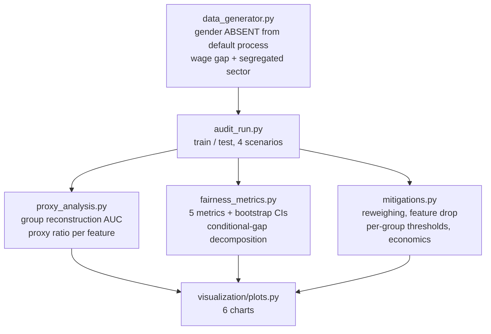

<div align="center">

# ⚖️ Fair Lending Bias Audit

**A credit model that never sees gender — and can still reconstruct it from its own features with AUC 0.77. Five fairness metrics with bootstrap intervals, a proxy detector that separates risk signal from group signal, and four mitigations priced in AUC and CLP, including the one that made things worse**

🌐 **[English](README.md)** | **[Español](README.es.md)**

[](https://www.python.org/)
[](https://scikit-learn.org/)
[](src/fairness_metrics.py)
[](src/fairness_metrics.py)
[](src/fairness_metrics.py)
[](tests/)
[](../LICENSE)

</div>

---

## Why I built it this way

Every credit model I have built starts from the same rule: the protected
attribute does not go into the model. That rule is necessary, legally
required in most jurisdictions, and — as a fairness guarantee — close to
worthless on its own. If the features carry enough correlation with the
protected group, the model reconstructs it whether or not anyone intended
that. "Fairness through unawareness" is not a defence; it is the starting
point of the audit.

So I built the audit as a measurement problem with three questions that have
to be answered in order:

1. **Is there a disparity?** Five metrics, each formalising a different idea
   of fairness, reported together and with bootstrap confidence intervals.
   No single number, because there is no single definition — and when base
   rates differ between groups, the definitions are provably incompatible
   with each other (Kleinberg et al., Chouldechova).
2. **Where does it come from?** A legitimate risk factor that happens to
   correlate with the group is a very different problem from a variable that
   mostly transmits group membership. Both produce disparate impact; only one
   of them is fixable by touching the model.
3. **What does fixing it cost?** Four mitigations, each priced in AUC and in
   pesos, at equal approval volume so the comparison is not rigged.

The simulator is designed so those questions have checkable answers: **gender
does not appear anywhere in the process that generates default**. It
correlates with income and job tenure (a wage gap and more interrupted
careers — facts about a labour market, not claims about people), and the
labour sector is strongly gender-segregated while carrying almost no risk
signal of its own. Any disparity found downstream is therefore either
legitimate correlation or a model artefact, never causation.

## Business framing

20,000 consumer-credit applications, 47.5% women. Observed default: 18.01% for
women, 16.50% for men — a 1.51 pp gap produced entirely by income and tenure
differences, since gender is absent from the generating process. Eight
features feed the model, including `sector`, which ranges from 80% women
(health) to 14% (mining) while its default rate moves only between 15.9% and
19.0%.

All policies are compared at **80% approval**, because a mitigation that
merely approves fewer people looks fairer for reasons that have nothing to do
with fairness.

## Results from an actual run

`python run_pipeline.py` — 14,000 train / 6,000 test.

### 1. Unawareness fails, and here is the number

The model is trained without the protected attribute. A second model, trained
on **only the first model's features**, predicts gender with **AUC 0.7682** —
the group is effectively recoverable from the inputs.

Per-feature, splitting group signal from risk signal:

| Feature | AUC predicting gender | AUC predicting default | Proxy ratio | Flagged |
|---|---|---|---|---|
| `sector` | **0.7579** | 0.5235 | **10.98×** | ✅ |
| `antiguedad_laboral_meses` | 0.5422 | 0.5514 | 0.82× | |
| `log_renta` | 0.5782 | 0.6072 | 0.73× | |
| `utilizacion_lineas` | 0.5068 | 0.5542 | 0.13× | |
| `dti` | 0.5076 | 0.5668 | 0.11× | |
| `n_moras_12m` | 0.5079 | 0.6192 | 0.07× | |

One variable carries eleven times more group signal than risk signal. Income
and tenure, by contrast, carry *more* risk signal than group signal — they
correlate with gender, but they are earning their place in the model.

### 2. Where the gap comes from

| | Predicted-PD gap (women − men) |
|---|---|
| Raw | **+1.430 pp** |
| Between comparable profiles (stratified by income and debt burden) | **+0.120 pp** |
| **Explained by legitimate risk factors** | **91.6%** |

Nine tenths of the disparity is the model correctly pricing applicants whose
income is genuinely lower. That does not make the disparity disappear as a
business or policy issue — the women in this book do get approved less — but
it changes completely what can be done about it inside the model.

### 3. The five metrics, with error bars

Base model at 80% approval:

| Metric | Estimate | 95% bootstrap CI |
|---|---|---|
| Adverse impact ratio (4/5 rule) | 0.9688 | [0.9462, 0.9971] |
| Demographic parity | −2.53 pp | [−4.39, −0.23] |
| Equal opportunity | −3.04 pp | [−4.87, −0.91] |
| Equalized odds | 3.04 pp | [1.52, 7.08] |
| Calibration gap | +1.08 pp | [−0.77, +2.88] |

The adverse impact ratio sits comfortably above the 0.80 regulatory
threshold. The parity and equal-opportunity gaps are small but their intervals
exclude zero — real, and modest. The calibration gap is **not** distinguishable
from zero: the model is about as well calibrated for one group as the other,
which is exactly the fairness criterion that a disparity in outcomes does not
by itself violate.

### 4. What each mitigation costs

| Scenario | AUC | Adverse impact ratio | Demographic parity | Equal opportunity | Profit (CLP) |
|---|---|---|---|---|---|
| Base (blind to gender) | 0.7091 | 0.9688 | −2.53 pp | −3.04 pp | 128.7M |
| Drop the proxy (`sector`) | 0.7110 | **0.9495** | **−4.14 pp** | −4.03 pp | 124.0M |
| Reweighing (Kamiran & Calders) | 0.7071 | 0.9648 | −2.86 pp | −3.06 pp | 126.5M |
| Per-group thresholds | 0.7091 | **1.0002** | **+0.01 pp** | −2.78 pp | 120.9M |

## Honest findings

- **Removing the proxy made the disparity worse — by 1.6 pp.** This is the
  result I did not expect and the most useful one in the project. `sector` is
  a genuine proxy for gender (11× more group signal than risk signal), but the
  group information it transmits is *favourable*: female-dominated sectors
  (health, education) carry slightly lower risk in the generating process, so
  including sector was partially offsetting the income gap. Delete it and the
  offset goes with it. The lesson generalises: a proxy is not automatically
  harmful, and "drop the correlated variables" is a rule of thumb that can
  move fairness in either direction. It has to be measured, per variable, on
  the actual book.
- **Per-group thresholds are the only mitigation that achieves parity — and
  the one that is generally illegal.** They land at a 1.0002 ratio, and cost
  6.1% of profit (128.7M → 120.9M). Using the protected attribute in the
  decision is precisely what fair-lending regulation prohibits in most
  jurisdictions, so this scenario is in the repo as an analytical bound — the
  most parity that could be bought and its price — not as a deployable policy.
- **Reweighing barely moved anything** (ratio 0.9648 vs. 0.9688, parity −2.86
  vs. −2.53 pp, at a cost of 0.002 AUC). It equalises group and label in the
  *training* distribution, but the disparity here is not driven by label
  imbalance across groups — it is driven by a real difference in the risk
  factors. A pre-processing technique cannot fix a problem that lives outside
  the model.
- **The bias is real, small, and mostly not the model's doing.** Reported
  plainly: about a quarter of a point of adverse impact ratio away from
  parity, statistically distinguishable from zero, 91.6% attributable to
  income and debt-burden differences the model is right to price. The
  intervention with the largest fairness effect is not in this repo — it is in
  the wage gap.
- **AUC is nearly constant across all four scenarios** (0.7071–0.7110). The
  usual "fairness costs accuracy" trade-off does not show up here, which is
  itself worth stating: the cost of these mitigations landed on *profit* (up
  to −6.1%) and on approval volume distribution, not on the model's ability to
  rank risk.

## Architecture



| Module | What it does |
|---|---|
| [`src/fairness_metrics.py`](src/fairness_metrics.py) | Selection rates, adverse impact ratio, demographic parity, equal opportunity, equalized odds, per-group calibration and AUC, bootstrap intervals, and the stratified decomposition that separates legitimate correlation from the rest. |
| [`src/proxy_analysis.py`](src/proxy_analysis.py) | Group reconstruction AUC from the model's own features, and the per-feature ratio of group signal to risk signal, handling categoricals on the same scale as numerics. |
| [`src/mitigations.py`](src/mitigations.py) | Kamiran-Calders reweighing, per-group thresholds, portfolio economics, and the fairness-profit frontier by approval rate. |
| [`src/audit_run.py`](src/audit_run.py) | Runs the four scenarios at equal approval volume and writes every table the README quotes. |

## Running it

```bash
python -m venv venv
venv\Scripts\activate            # Windows;  source venv/bin/activate on Linux/macOS
pip install -r requirements.txt

python run_pipeline.py           # everything end to end (~2 min)
pytest -q                        # 22 tests
```

| Chart | Shows |
|---|---|
| `deteccion_de_proxies.png` | Each feature's group signal against its risk signal, and the proxy ratio on a log scale |
| `escenarios_de_mitigacion.png` | Adverse impact, parity, equal opportunity, profit and AUC for the four scenarios |
| `descomposicion_de_la_brecha.png` | Raw gap vs. gap between comparable profiles, and its distribution across strata |
| `frontera_equidad_utilidad.png` | How adverse impact and profit move with the approval rate |
| `calibracion_y_distribucion.png` | Calibration curve per group and the PD distribution each group faces |
| `intervalos_bootstrap.png` | The gaps with their confidence intervals — a gap without error bars is not a finding |

## Tests

22 tests (`pytest -q`), most of them hand-built scenarios with a known answer,
because a sign error in a fairness metric inverts who is being harmed while
the number still looks plausible: selection rates computed by hand on an
eight-row example, swapping the groups flips every sign, equal opportunity
looks only at the customers who repaid, the proxy detector separates a pure
proxy from a pure risk factor, reweighing provably equalises the weighted bad
rate across groups (and is a no-op when they are already independent),
per-group thresholds land on the requested approval rate in both groups, and
the simulator's own guarantee — that conditional on the risk factors the true
PD does not depend on the group — is asserted directly.

## Scope

Synthetic data, deliberately: the central claim ("91.6% of the gap is
legitimate correlation") is only checkable when you know what the generating
process contains. `genero` is used as the protected attribute in a
Chilean-consumer-credit framing; the metrics and the audit apply unchanged to
any protected class. The per-group-threshold scenario is an analytical
benchmark, not a recommendation.

## Author

Pablo Reyes — [github.com/Rxyxs](https://github.com/Rxyxs)
Code: MIT — see [LICENSE](../LICENSE)
