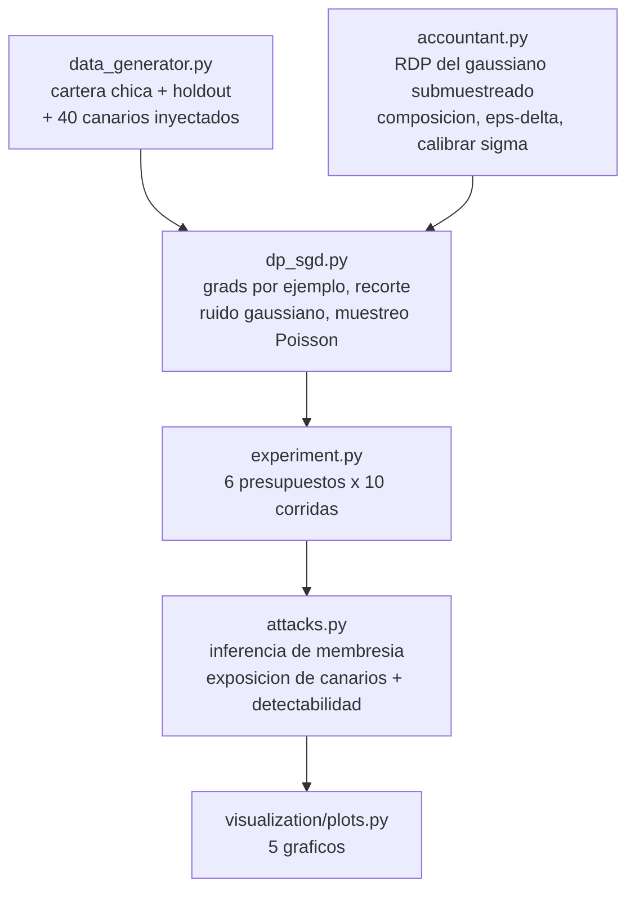

<div align="center">

# 🔐 Scoring crediticio con privacidad diferencial

**DP-SGD y un contador RDP escritos desde cero, y despues atacados para ver si la garantia formal significa algo — un experimento de canarios que muestra exactamente donde la fuga deja de ser detectable, y cuanto cuesta eso en AUC**

🌐 **[English](README.md)** | **[Español](README.es.md)**

[](https://www.python.org/)
[](https://numpy.org/)
[](src/accountant.py)
[](src/attacks.py)
[](https://scipy.org/)
[](tests/)
[](../LICENSE)

</div>

---

## Por que lo construi asi

Un modelo de credito se entrena con los datos mas sensibles que una persona
entrega: cuanto gana, cuanto debe, si dejo de pagar. Y despues el modelo sale
de la sala — se va a un proveedor, a una API, a veces a un paper. Anonimizar
la tabla de entrenamiento no zanja el asunto, porque el modelo mismo carga
informacion sobre las personas que lo entrenaron.

La privacidad diferencial es el unico marco que le pone un numero a esa
preocupacion. Dice: cualquiera sea la salida del entrenamiento, habria sido
*casi igual de probable* si se quitara a una sola persona de los datos — donde
"casi" es epsilon, una cantidad que uno elige y paga.

Implemente las dos mitades yo mismo en vez de importar Opacus:

- **DP-SGD** — gradientes por ejemplo, recorte de norma, ruido gaussiano,
  submuestreo de Poisson — porque cada uno de esos tres pasos existe por una
  razon facil de enunciar y facil de equivocar sutilmente.
- **El contador** — RDP del gaussiano submuestreado, compuesto sobre los pasos
  de entrenamiento y convertido a (epsilon, delta) — porque es la parte que
  convierte decisiones de ingenieria en una garantia, y una libreria que
  reporta el epsilon por uno es justamente la parte que no conviene tratar
  como caja negra. (Error silencioso frecuente: lotes barajados de tamano fijo
  contabilizados como si fueran muestreo de Poisson, lo que reporta menos
  epsilon del que efectivamente se gasto.)

Y despues la parte que casi todo escrito sobre DP se salta: **atacar el
resultado**. Epsilon es una cota superior de lo que un adversario *podria*
aprender; no dice nada de lo que un adversario efectivamente aprende sobre tus
datos. Dos ataques lo miden directo.

## Enfoque de negocio

1.200 solicitudes de credito de consumo para entrenar — una cartera
deliberadamente chica, porque ese es el regimen donde la memorizacion es real:
un producto nuevo, un segmento delgado, un piloto. Mas un holdout de 1.200 de
la misma distribucion (los "no miembros" contra los que compara el ataque de
membresia) y un test de 4.000 filas.

Inyectados en el entrenamiento: **40 canarios** — solicitantes con perfil
impecable (renta cercana a CLP 6,6M, sin morosidad, carga financiera de 0,2%)
etiquetados como default. Nada en el patron general justifica esa etiqueta, asi
que cualquier PD elevada que el modelo les asigne es memorizacion, medible
comparando contra 40 canarios estadisticamente identicos que nunca se
entrenaron.

## Resultados de una corrida real

`python run_pipeline.py` — 2.500 pasos de DP-SGD, lote esperado 128
(q = 0,103), norma de recorte C = 3,0, delta = 1e-5. **Cada fila es el promedio
de 10 corridas independientes**, porque DP-SGD es un mecanismo aleatorio y una
sola semilla confunde el ruido con la suerte.

| Escenario | σ | ε | AUC en test | Exposicion de canarios | t | .Fuga detectable? |
|---|---|---|---|---|---|---|
| Sin privacidad | 0,00 | ∞ | **0,6388** ±0,0130 | **+2,50 pp** ±0,18 | 44,8 | **si** |
| ε = 8 | 3,67 | 8,00 | 0,6118 ±0,0425 | +2,20 pp ±1,19 | 5,8 | si |
| ε = 4 | 6,76 | 4,00 | 0,5729 ±0,0714 | +2,03 pp ±1,81 | 3,5 | si |
| ε = 2 | 12,96 | 2,00 | 0,5358 ±0,0875 | +1,97 pp ±2,95 | 2,1 | marginal |
| ε = 1 | 25,35 | 1,00 | 0,5215 ±0,0911 | +2,99 pp ±5,46 | 1,7 | **no** |
| ε = 0,5 | 50,12 | 0,50 | 0,5285 ±0,0827 | −0,97 pp ±2,92 | −1,1 | **no** |

El titular, enunciado con la precision que la evidencia permite:

- **Sin DP la fuga es real e inequivoca.** Los 40 canarios reciben una PD 2,50
  puntos mas alta que solicitantes identicos que el modelo nunca vio, y ese
  efecto se reproduce en las diez corridas (t = 44,8). El modelo memorizo
  registros que contradicen todos los patrones de los datos.
- **El presupuesto que la vuelve indetectable es ε = 1**, y cuesta **18,4% del
  AUC** (0,6388 → 0,5215): un modelo que apenas ordena mejor que una moneda.
- **Con ε = 8 sobrevive casi toda la precision** (0,6118, −4,2%) pero la fuga
  sigue siendo claramente detectable (t = 5,8). Aca la privacidad debil no es
  un punto medio: contra este ataque es casi lo mismo que no tener ninguna.

Con 1.200 filas no hay un medio comodo. Ese es el hallazgo.

### El ataque de inferencia de membresia no encontro nada — en ningun escenario

El AUC del ataque quedo entre 0,4959 y 0,5142 en los seis modelos, incluido el
que no tiene privacidad alguna. Una regresion logistica de 8 parametros sobre
1.240 filas no sobreajusta lo suficiente como para que un ataque por umbral de
perdida funcione, asi que el MIA clasico reporta "sin filtracion" para un
modelo que demostrablemente memorizo 40 registros. **Esa brecha entre los dos
ataques es la razon de que los dos esten en el repo**: un MIA negativo es
evidencia debil de privacidad, y se presenta rutinariamente como evidencia
fuerte.

### Calibrar el ruido es administrar un presupuesto, y cada paso lo gasta

`calibrar_sigma` invierte el contador: dada la tasa de muestreo y el numero de
pasos, encuentra el sigma mas chico que cumple el epsilon objetivo (mas ruido
del necesario es utilidad regalada). El costo de entrenar mas queda explicito:
con q = 0,103 y ε = 1, pasar de 500 a 2.500 y a 10.000 pasos sube el sigma
requerido de forma pronunciada, que es la razon por la que "entrenar mas epocas
para recuperar precision" no funciona bajo DP.

## Hallazgos honestos

- **El efecto de los canarios bajo DP *no* es cero limpio: esta dominado por
  el ruido, y decirlo importa.** Con ε = 1 la exposicion media es +2,99 pp,
  mayor que los +2,50 sin privacidad; pero su desviacion entre corridas es de
  ±5,46, lo que da t = 1,7. La afirmacion honesta es "ya no se distingue de
  cero", no "se elimino". Reportar solo la media habria sugerido que DP empeora
  la memorizacion; reportar solo el t del modelo sin privacidad habria
  sugerido una solucion limpia. El estadistico de detectabilidad esta en el
  pipeline porque los numeros crudos son genuinamente ambiguos sin el.
- **La curva privacidad-utilidad no es monotona en el extremo fuerte.** ε = 0,5
  marco un AUC levemente *mejor* (0,5285) que ε = 1 (0,5215). Los dos estan a
  menos de una desviacion entre si y de 0,5 — con ese nivel de ruido el modelo
  es esencialmente aleatorio y el orden es suerte. Promediar diez corridas es
  lo que vuelve esto visible en vez de reportable como resultado.
- **La norma de recorte peso mas de lo que esperaba, y salio gratis
  corregirla.** Con C = 1,0 el sesgo del recorte por si solo costaba 4 puntos
  de AUC incluso con ruido cero (0,6081 contra 0,6524), porque se estaba
  recortando el 23% de los gradientes por ejemplo. Subir C a 3,0 bajo el
  recorte a 1,8% y no costo nada de privacidad: el contador depende de sigma,
  no de C, y el ruido escala como sigma·C, asi que la razon senal-ruido no
  cambia. La forma correcta de fijar C es mirar la fraccion recortada, no
  heredar un default.
- **El ataque de membresia necesitaba estratificacion para no mentir.** En su
  primera version reportaba un AUC *creciente* a medida que la privacidad se
  hacia mas fuerte — lo contrario de lo que deberia pasar. La causa: train y
  holdout difieren levemente en tasa base (20,5% contra 21,5%), y en un modelo
  muy ruidoso la perdida por ejemplo depende casi enteramente de la etiqueta,
  asi que el "ataque" estaba detectando la tasa base. Evaluar dentro de cada
  clase lo corrige, y un test unitario fija ese comportamiento con un modelo
  constante y tasas base deliberadamente distintas.
- **Este es un resultado de datos escasos y no hay que generalizarlo hacia
  arriba.** Con 100.000 filas el mismo epsilon costaria mucho menos, porque el
  ruido se agrega a una suma sobre un lote mucho mas grande mientras la senal
  crece con el. El precio de 18,4% de AUC pertenece a este regimen, y el
  regimen esta declarado en la tabla.

## Arquitectura



| Modulo | Que hace |
|---|---|
| [`src/accountant.py`](src/accountant.py) | RDP del gaussiano submuestreado via un log-sum-exp sobre la expansion binomial, composicion entre pasos, la conversion a (epsilon, delta) minimizada sobre ordenes de Renyi, y una busqueda binaria que calibra sigma al presupuesto objetivo. |
| [`src/dp_sgd.py`](src/dp_sgd.py) | El loop de entrenamiento: gradientes por ejemplo, recorte L2 con seguimiento de la fraccion recortada, ruido gaussiano sobre el gradiente sumado, lotes por muestreo de Poisson, y el presupuesto que la corrida efectivamente gasto. |
| [`src/attacks.py`](src/attacks.py) | Inferencia de membresia por umbral de perdida evaluada dentro de cada estrato de etiqueta, exposicion de canarios contra canarios sombra nunca vistos, y la traduccion de ventaja del atacante a precision del atacante. |
| [`src/experiment.py`](src/experiment.py) | El barrido: calibrar sigma por presupuesto, entrenar diez veces, medir utilidad y los dos ataques, y calcular el estadistico de detectabilidad. |

## Como correrlo

```bash
python -m venv venv
venv\Scripts\activate            # Windows;  source venv/bin/activate en Linux/macOS
pip install -r requirements.txt

python run_pipeline.py           # todo end to end (~3 min)
pytest -q                        # 43 tests
```

| Grafico | Que muestra |
|---|---|
| `privacidad_vs_utilidad.png` | AUC y exposicion de canarios contra epsilon, con barras de error sobre las diez corridas |
| `detectabilidad_de_la_fuga.png` | El estadistico t por presupuesto — donde la fuga deja de distinguirse de cero |
| `calibracion_de_ruido.png` | Sigma requerido por presupuesto para distintos largos de entrenamiento, y epsilon gastado a medida que se acumulan pasos |
| `entrenamiento_y_coeficientes.png` | Perdida de entrenamiento bajo cada nivel de ruido, y cuanto se alejan los coeficientes del modelo sin privacidad |
| `ataque_de_membresia.png` | Distribuciones de perdida de miembros y no miembros, y la brecha de PD entre canarios entrenados y no entrenados |

## Tests

43 tests (`pytest -q`). El contador esta anclado a resultados analiticos — con
q = 1 el RDP del mecanismo gaussiano tiene que dar exactamente α/(2σ²),
verificado sobre varios ordenes y niveles de ruido — mas las propiedades que
cualquier contabilidad correcta debe cumplir: el submuestreo amplifica la
privacidad, componer T pasos es T veces un paso, epsilon sube con los pasos y
baja con el ruido, un delta mas estricto cuesta epsilon, y el sigma calibrado
alcanza su objetivo mientras que un 10% menos de ruido ya no. DP-SGD se
verifica contra la regresion logistica de scikit-learn cuando se desactivan
ruido y recorte (AUC dentro de 0,01, coseno de coeficientes > 0,98), el recorte
se verifica acotando todos los gradientes por ejemplo y dejando intactos los
que ya cumplian, y el muestreo de Poisson se verifica produciendo lotes de
tamano variable. Los ataques se testean en las dos direcciones: sin senal
cuando no hay nada que encontrar, AUC > 0,70 contra un modelo con tantos
parametros como filas entrenado sobre etiquetas aleatorias, y la
estratificacion queda fijada con un modelo constante y tasas base disparejas.

## Alcance

Datos sinteticos, a proposito: los canarios solo funcionan como instrumento de
medicion si uno controla que entro al entrenamiento. Los epsilon reportados son
cotas superiores calculadas con la conversion clasica RDP→(epsilon, delta), que
es algo conservadora — el presupuesto informado nunca subestima la perdida de
privacidad.

## Autor

Pablo Reyes — [github.com/Rxyxs](https://github.com/Rxyxs)
Codigo: MIT — ver [LICENSE](../LICENSE)
