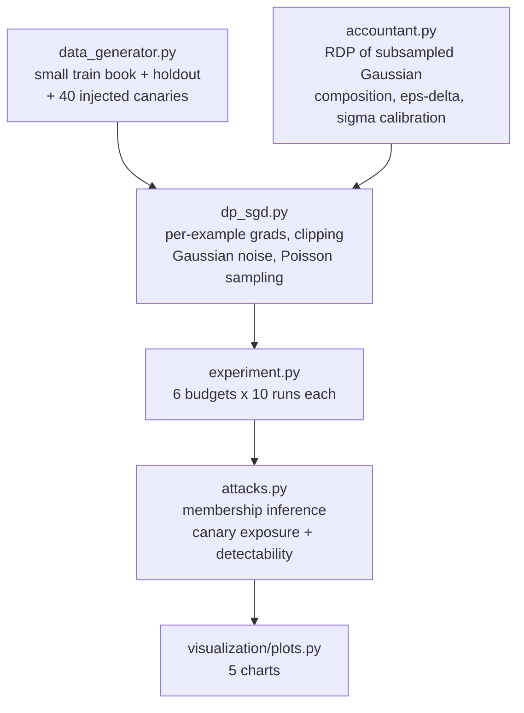

<div align="center">

# 🔐 Differentially Private Credit Scoring

**DP-SGD and an RDP accountant written from scratch, then attacked to see whether the formal guarantee means anything — a canary experiment that shows exactly where the leak becomes undetectable, and what that costs in AUC**

🌐 **[English](README.md)** | **[Español](README.es.md)**

[](https://www.python.org/)
[](https://numpy.org/)
[](src/accountant.py)
[](src/attacks.py)
[](https://scipy.org/)
[](tests/)
[](../LICENSE)

</div>

---

## Why I built it this way

A credit model is trained on the most sensitive data a person hands over: what
they earn, what they owe, whether they have missed payments. The model then
leaves the room — it goes to a vendor, into an API, sometimes into a paper.
Anonymising the training table does not settle the question, because the model
itself carries information about the people in it.

Differential privacy is the only framework that gives that concern a number.
It says: whatever the output of training, it would have been *almost as
likely* had any single person been removed from the data — with "almost" being
ε, a quantity you choose and pay for.

I implemented both halves myself rather than importing Opacus:

- **DP-SGD** — per-example gradients, norm clipping, Gaussian noise, Poisson
  subsampling — because each of those three steps exists for a reason that is
  easy to state and easy to get subtly wrong.
- **The accountant** — Rényi DP for the subsampled Gaussian mechanism, composed
  over training steps and converted to (ε, δ) — because it is the part that
  turns engineering choices into a guarantee, and a library that reports ε for
  you is exactly the part you should not treat as a black box. (A common,
  silent error: shuffled fixed-size batches accounted for as if they were
  Poisson sampled, which reports less ε than you actually spent.)

And then the part that most DP write-ups skip: **attacking the result.** ε is
an upper bound on what an adversary could learn; it says nothing about what an
adversary *does* learn on your data. Two attacks measure that directly.

## Business framing

1,200 consumer-credit applications for training — a deliberately small book,
because that is the regime where memorisation is real: a new product, a thin
segment, a pilot. Plus a same-distribution holdout of 1,200 (the "non-members"
the membership attack compares against) and a 4,000-row test set.

Injected into training: **40 canaries** — applicants with pristine profiles
(income around CLP 6.6M, no delinquencies, debt burden of 0.2%) labelled as
defaults. Nothing in the general pattern justifies that label, so any elevated
PD the model assigns them is memorisation, measurable by comparing against 40
statistically identical canaries that were never trained on.

## Results from an actual run

`python run_pipeline.py` — 2,500 DP-SGD steps, expected batch 128 (q = 0.103),
clipping norm C = 3.0, δ = 1e-5. **Every row is the mean of 10 independent
runs**, because DP-SGD is a random mechanism and a single seed confuses noise
with luck.

| Scenario | σ | ε | Test AUC | Canary exposure | t | Leak detectable? |
|---|---|---|---|---|---|---|
| No privacy | 0.00 | ∞ | **0.6388** ±0.0130 | **+2.50 pp** ±0.18 | 44.8 | **yes** |
| ε = 8 | 3.67 | 8.00 | 0.6118 ±0.0425 | +2.20 pp ±1.19 | 5.8 | yes |
| ε = 4 | 6.76 | 4.00 | 0.5729 ±0.0714 | +2.03 pp ±1.81 | 3.5 | yes |
| ε = 2 | 12.96 | 2.00 | 0.5358 ±0.0875 | +1.97 pp ±2.95 | 2.1 | marginal |
| ε = 1 | 25.35 | 1.00 | 0.5215 ±0.0911 | +2.99 pp ±5.46 | 1.7 | **no** |
| ε = 0.5 | 50.12 | 0.50 | 0.5285 ±0.0827 | −0.97 pp ±2.92 | −1.1 | **no** |

The headline, stated as precisely as the evidence allows:

- **The leak is real and unambiguous without DP.** The 40 canaries get a PD
  2.50 points higher than identical applicants the model never saw, and that
  effect reproduces across all ten runs (t = 44.8). The model memorised
  records that contradict every pattern in the data.
- **The budget that makes it undetectable is ε = 1**, and it costs **18.4% of
  AUC** (0.6388 → 0.5215) — a model that barely ranks better than a coin flip.
- **At ε = 8, most of the accuracy survives** (0.6118, −4.2%) but the leak is
  still plainly detectable (t = 5.8). Weak privacy is not a compromise here;
  it is close to no privacy at all against this attack.

There is no comfortable middle on 1,200 rows. That is the finding.

### The membership inference attack found nothing — in every scenario

Attack AUC ranged from 0.4959 to 0.5142 across all six models, including the
one with no privacy at all. A logistic regression with 8 parameters on 1,240
rows does not overfit enough for a loss-threshold attack to work, so the
classic MIA reports "no leakage" for a model that demonstrably memorised 40
records. **That gap between the two attacks is the reason both are in the
repo**: a negative MIA result is weak evidence of privacy, and it is routinely
presented as strong evidence.

### Noise calibration is a budget, and every step spends it

`calibrar_sigma` inverts the accountant: given the sampling rate and the number
of steps, it finds the smallest σ that meets a target ε (more noise than
necessary is utility given away for nothing). The cost of training longer is
explicit — at q = 0.103 and ε = 1, going from 500 to 2,500 to 10,000 steps
raises the required σ steeply, which is why "just train more epochs to recover
accuracy" does not work under DP.

## Honest findings

- **The canary effect under DP is *not* clean zero — it is noise-dominated,
  and saying so matters.** At ε = 1 the mean exposure is +2.99 pp, larger than
  the non-private +2.50; but its standard deviation across runs is ±5.46,
  giving t = 1.7. The honest statement is "no longer distinguishable from
  zero", not "eliminated". Reporting only the mean would have suggested DP made
  memorisation *worse*; reporting only the non-private t would have suggested a
  clean fix. The detectability statistic is in the pipeline because the raw
  numbers are genuinely ambiguous without it.
- **The privacy-utility curve is not monotone at the strong end.** ε = 0.5
  scored a slightly *better* AUC (0.5285) than ε = 1 (0.5215). Both are within
  a standard deviation of each other and of 0.5 — at that noise level the model
  is essentially random and the ordering is luck. Averaging over ten runs is
  what makes this visible rather than reportable as a result.
- **Clipping norm turned out to matter more than I expected, and for free.**
  With C = 1.0 the clipping bias alone cost 4 points of AUC even with zero
  noise (0.6081 vs. 0.6524), because 23% of per-example gradients were being
  clipped. Raising C to 3.0 dropped clipping to 1.8% and cost nothing in
  privacy: the accountant depends on σ, not C, and noise scales as σ·C, so the
  signal-to-noise ratio is unchanged. The right way to set C is to look at the
  clipped fraction, not to inherit a default.
- **The membership attack needed stratification to not lie.** In its first
  version the attack reported *rising* AUC as privacy got stronger — the
  opposite of what should happen. The cause: train and holdout differ slightly
  in base rate (20.5% vs. 21.5%), and a heavily noised model's per-example loss
  depends almost entirely on the label, so the "attack" was detecting the base
  rate. Evaluating within each label class fixes it, and a unit test pins the
  behaviour with a constant model on deliberately mismatched base rates.
- **This is a small-data result and should not be generalised upward.** On
  100,000 rows the same ε would cost far less, because the noise is added to a
  sum over a much larger batch while the signal grows with it. The 18.4% AUC
  price tag belongs to this regime, and the regime is stated in the table.

## Architecture



| Module | What it does |
|---|---|
| [`src/accountant.py`](src/accountant.py) | RDP of the subsampled Gaussian mechanism via a log-sum-exp over the binomial expansion, composition across steps, the (ε, δ) conversion minimised over Rényi orders, and a binary search that calibrates σ to a target budget. |
| [`src/dp_sgd.py`](src/dp_sgd.py) | The training loop: per-example gradients, L2 clipping with the clipped fraction tracked, Gaussian noise on the summed gradient, Poisson-sampled batches, and the privacy budget the run actually spent. |
| [`src/attacks.py`](src/attacks.py) | Loss-threshold membership inference evaluated within label strata, canary exposure against never-seen shadow canaries, and the translation from attacker advantage to attacker precision. |
| [`src/experiment.py`](src/experiment.py) | The sweep: calibrate σ per budget, train ten times, measure utility and both attacks, and compute the detectability statistic. |

## Running it

```bash
python -m venv venv
venv\Scripts\activate            # Windows;  source venv/bin/activate on Linux/macOS
pip install -r requirements.txt

python run_pipeline.py           # everything end to end (~3 min)
pytest -q                        # 43 tests
```

| Chart | Shows |
|---|---|
| `privacidad_vs_utilidad.png` | AUC and canary exposure against ε, with error bars over the ten runs |
| `detectabilidad_de_la_fuga.png` | The t statistic per budget — where the leak stops being distinguishable from zero |
| `calibracion_de_ruido.png` | σ required per budget for different training lengths, and ε spent as steps accumulate |
| `entrenamiento_y_coeficientes.png` | Training loss under each noise level, and how far the coefficients drift from the non-private model |
| `ataque_de_membresia.png` | Member vs. non-member loss distributions, and the PD gap between trained and untrained canaries |

## Tests

43 tests (`pytest -q`). The accountant is anchored to analytic results — with
q = 1 the RDP of the Gaussian mechanism must equal exactly α/(2σ²), checked
across orders and noise levels — plus the properties any correct accounting
must satisfy: subsampling amplifies privacy, composition over T steps is
T× one step, ε rises with steps and falls with noise, a stricter δ costs ε, and
the calibrated σ hits its target while 10% less noise misses it. DP-SGD is
checked against scikit-learn's logistic regression when noise and clipping are
disabled (AUC within 0.01, coefficient cosine > 0.98), clipping is verified to
bound every per-example gradient and to leave compliant ones untouched, and
Poisson sampling is verified to produce variable batch sizes. The attacks are
tested in both directions: no signal when there is nothing to find, AUC > 0.70
against a model with as many parameters as rows trained on random labels, and
the stratification is pinned with a constant model on mismatched base rates.

## Scope

Synthetic data, deliberately: the canaries only work as a measurement
instrument if you control what went into training. The ε values here are upper
bounds computed with the classic RDP→(ε, δ) conversion, which is slightly
conservative — the reported budget never understates the privacy loss.

## Author

Pablo Reyes — [github.com/Rxyxs](https://github.com/Rxyxs)
Code: MIT — see [LICENSE](../LICENSE)
