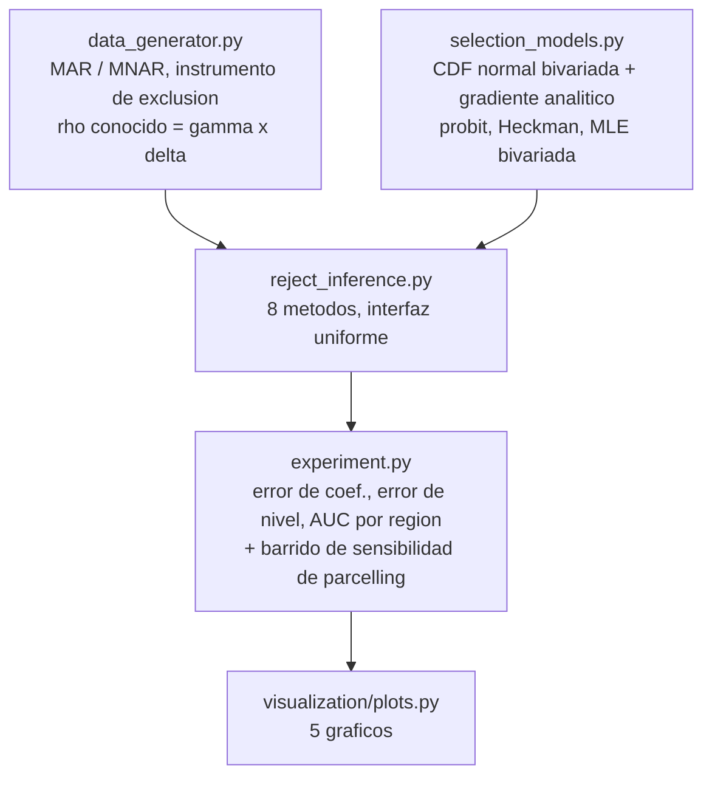

<div align="center">

# 🕳️ Reject inference y sesgo de seleccion

**El experimento que ningun banco puede correr: un simulador que conoce el desenlace real de cada solicitante rechazado, usado para medir que metodo de reject inference recupera de verdad la realidad — y para probar, con gradiente analitico y una comparacion controlada, que la correccion estandar vale lo que valga su variable de exclusion**

🌐 **[English](README.md)** | **[Español](README.es.md)**

[](https://www.python.org/)
[](https://scipy.org/)
[](src/selection_models.py)
[](src/selection_models.py)
[](tests/)
[](../LICENSE)

</div>

---

## Por que lo construi asi

Todo scorecard se entrena sobre una omision. El banco solo observa el pago de
los solicitantes que una politica *anterior* aprobo — los rechazados nunca
recibieron el credito, asi que su desenlace no existe en ninguna base. El
modelo nuevo que se entrene hereda ese hueco, y nadie dentro del banco puede
verificar cuanto se equivoca sobre la poblacion que efectivamente va a tener
que puntuar, porque la verdad necesaria para verificarlo nunca se recolecto.

Este proyecto elimina esa restriccion de la unica forma en que se puede
eliminar: el simulador genera el desenlace de **todos**, solicitantes que
habrian sido aprobados y solicitantes que habrian sido rechazados, y solo
despues aplica la politica historica de aprobacion. Eso convierte "este
metodo de reject inference funciona" de un articulo de fe en algo con un
numero encima.

La literatura sobre reject inference casi siempre mezcla dos problemas muy
distintos en uno. Por eso el simulador genera dos regimenes separados:

- **MAR (seleccion sobre observables)** — la politica historica aprobaba
  mirando solo las mismas variables que tiene el modelo nuevo. La
  correlacion entre el error de seleccion y el error de desenlace, ρ, es
  exactamente cero.
- **MNAR (seleccion sobre no observables)** — el ejecutivo tambien usaba
  informacion blanda que nunca llego a ninguna base: la impresion de la
  entrevista, el conocimiento personal del cliente. Esa informacion
  efectivamente predice el pago, asi que ρ ≠ 0, y ninguna feature disponible
  para el modelo nuevo puede corregirlo.

Distinguir estos dos casos no es un detalle academico. De eso depende si el
problema tiene arreglo.

## Que construye el proyecto

Un probit bivariado con seleccion escrito desde cero — el modelo
econometricamente correcto para un desenlace *binario* bajo seleccion
muestral — estimado por maxima verosimilitud con **gradiente analitico**.
Ese gradiente no es un lujo: una version temprana de este proyecto usaba
diferenciacion numerica sobre los siete parametros conjuntos, y convergia en
silencio a una estimacion de ρ confiadamente equivocada, con `success: True`
y una norma de gradiente que el optimizador creia cero. Derivar las
derivadas parciales en forma cerrada de la CDF normal bivariada (la formula
de Plackett para ∂Φ₂/∂ρ, mas las dos identidades de probabilidad
condicional para ∂Φ₂/∂a y ∂Φ₂/∂b) arreglo el optimizador — pero tambien
expuso un problema real y mas profundo, que se convirtio en el hallazgo
central del proyecto.

Se comparan ocho metodos, en orden creciente de lo que suponen sobre *por
que* alguien fue rechazado: ignorar el problema, reponderacion inversa a la
propension, parcelling de la industria, aumentacion por EM, Heckman en dos
etapas, y el probit bivariado por MLE completa — los dos ultimos corridos
dos veces cada uno, con y sin una **variable de exclusion**: algo que mueve
la aprobacion y demostrablemente no mueve el riesgo real.

## Resultados de una corrida real

`python run_pipeline.py` — 30.000 solicitantes por regimen, ~50% aprobados
historicamente.

### El hallazgo central: identificar exige un instrumento

El probit bivariado y la correccion de Heckman valen lo que valga su
variable de exclusion. Alimentados con las mismas features en la ecuacion de
seleccion y en la de desenlace, quedan *tecnicamente* identificados solo por
la curvatura de la normal bivariada — y en la practica esa identificacion es
tan debil que produce una respuesta confiadamente equivocada en **las dos
direcciones**:


*Gris es la verdad. Sin variable de exclusion (rojo), el modelo encuentra un
ρ espurio de +0,36 en MAR — inventando un sesgo de seleccion que no existe —
y ρ ≈ 0 en MNAR — sin detectar un sesgo que es muy real (ρ verdadero =
−0,42). Con un instrumento genuino (verde), el mismo estimador recupera
−0,017 y −0,439: los dos a menos de 0,02 de la verdad.*

El instrumento usado es una variable de **presion de meta comercial** por
sucursal-mes: cuando una sucursal esta bajo presion por cumplir volumen de
originacion, los ejecutivos aprueban a mas solicitantes marginales —
moviendo la ecuacion de seleccion — pero esa presion comercial no tiene
ningun camino causal hacia si el solicitante efectivamente paga, asi que por
construccion nunca entra a la ecuacion de desenlace.

### Que recupera cada metodo, contra los coeficientes que generaron los datos

| Metodo | MAR: error de coef. | MNAR: error de coef. | MNAR: error de nivel (pp) |
|---|---|---|---|
| Solo aprobados (ignorar el problema) | 0,0311 | 0,0816 | −7,59 |
| IPW (propension inversa) | 0,0876 | 0,1535 | −10,58 |
| Parcelling (factor = 2,0) | 0,1976 | 0,0420 | +0,81 |
| Aumentacion EM | 0,0311 | 0,0816 | −7,59 |
| Heckman, sin instrumento | 0,1661 | 0,0781 | −7,32 |
| Probit bivariado, sin instrumento | 0,1159 | 0,0780 | −7,31 |
| Heckman, **con instrumento** | 0,0300 | 0,0379 | +0,89 |
| **Probit bivariado, con instrumento** | **0,0300** | **0,0063** | **+0,73** |
| Oraculo (imposible en la practica) | 0,0110 | 0,0110 | 0,00 |

En MNAR, el probit bivariado correctamente identificado queda a 0,0063 de
los coeficientes verdaderos — cerca del 0,0110 del oraculo — mientras que
todo metodo sin variable de exclusion, incluidos los modelos de seleccion
"correctos" corridos sin ella, queda peor que simplemente ignorar a los
rechazados.

### El dial de parcelling no se puede ajustar sin la respuesta que busca encontrar


*El factor de castigo que la practica de la industria elige a mano. En 2,0
el error de nivel es +0,81 pp; en 1,0 es −8,21 pp; en 4,0 es +15,51 pp. El
factor que resulta funcionar aca no se puede derivar de nada disponible en
produccion — solo se ve validado porque este proyecto tiene la verdad de
terreno contra la cual contrastarlo.*

## Hallazgos honestos

- **Que converja estadisticamente no es lo mismo que encontrar la respuesta
  correcta.** El probit bivariado sin instrumento reporta `converged: True`
  con una norma de gradiente de 8×10⁻⁵ — no esta atascado, encontro un
  optimo local genuino con verosimilitud *mayor* que la de los parametros
  verdaderos. Es la falla de manual de "identificacion solo por forma
  funcional" de los modelos tipo Heckman, reproducida aca a proposito y
  medida en vez de citada de un libro.
- **La aumentacion EM casi no se mueve**, y la razon es estructural, no un
  bug: imputar la etiqueta de un rechazado con la probabilidad que el propio
  modelo actual predice esta muy cerca de un punto fijo de la verosimilitud
  probit — la primera iteracion cambia los coeficientes en 6×10⁻⁵, y cuatro
  iteraciones mas no cambian nada adicional. Auto-entrenarse con las propias
  predicciones confiadas de un modelo no inyecta informacion nueva: solo
  reproduce lo que el modelo ya creia.
- **Parcelling puede verse bien o terrible segun un numero que nadie puede
  validar en produccion.** El factor 2,0 resulta quedar a un punto de la
  tasa de default verdadera aca; el factor 1,0 o 3,0 fallan por 8 a 10
  puntos. Reportar un buen resultado de parcelling sin el barrido de
  sensibilidad habria sido reportar una coincidencia como si fuera un
  metodo.
- **La correccion de Heckman en dos etapas es mas ruidosa que la MLE
  completa.** Una sola muestra aleatoria puede hacer que la version de dos
  etapas se vea peor con el instrumento que sin el — solo mejora de forma
  confiable al promediar sobre varias muestras independientes, que es
  exactamente lo que hace la suite de tests en vez de elegir a dedo una
  semilla que funcione.
- **Ignorar a los rechazados por completo no siempre es la peor opcion.** En
  MAR, solo-aprobados recupera los coeficientes casi tan bien como el modelo
  completamente corregido (0,0311 contra 0,0300) — porque cuando la
  seleccion depende solo de observables, la relacion condicional dentro de
  la muestra aprobada ya es correcta. La falla es especifica de MNAR, y hay
  que distinguir los dos casos antes de salir a corregir.

## Arquitectura



| Modulo | Que hace |
|---|---|
| [`src/selection_models.py`](src/selection_models.py) | La CDF normal bivariada por cuadratura de Gauss-Legendre, sus tres derivadas parciales en forma cerrada, un probit ponderado, la correccion de Heckman en dos etapas, y el probit bivariado por MLE completa con gradiente conjunto analitico. |
| [`src/data_generator.py`](src/data_generator.py) | Solicitantes con una estructura latente de errores correlacionados conocida, en los regimenes MAR y MNAR, mas el instrumento de exclusion. |
| [`src/reject_inference.py`](src/reject_inference.py) | Los ocho metodos detras de una sola interfaz: ignorar, IPW, parcelling, aumentacion EM, Heckman y probit bivariado (cada uno con y sin el instrumento), y el oraculo. |
| [`src/experiment.py`](src/experiment.py) | Corre los ocho sobre los dos regimenes, los evalua contra la verdad de terreno en cuatro metricas, y barre el factor de parcelling. |

## Como correrlo

```bash
python -m venv venv
venv\Scripts\activate            # Windows;  source venv/bin/activate en Linux/macOS
pip install -r requirements.txt

python run_pipeline.py           # todo end to end (~1 min)
pytest -q                        # 64 tests
```

| Grafico | Que muestra |
|---|---|
| `recuperacion_de_rho.png` | ρ recuperado con y sin el instrumento, contra la verdad, en ambos regimenes |
| `comparacion_metodos.png` | Error de coeficientes de cada metodo, lado a lado |
| `sesgo_de_nivel_mnar.png` | El numero con el que realmente corre la provision: tasa de default estimada contra real |
| `sensibilidad_parcelling.png` | Cuanto cambia la respuesta el factor de castigo |
| `auc_aprobados_vs_rechazados.png` | Discriminacion dentro de la region comoda contra la region que importa |

## Tests

64 tests (`pytest -q`). La CDF normal bivariada se verifica contra
`scipy.stats.multivariate_normal` — una implementacion independiente — sobre
siete correlaciones y cinco pares de coordenadas; sus tres derivadas
analiticas se verifican contra diferencias finitas de esa misma CDF. El
hallazgo de identificacion queda fijado directamente: con el instrumento, ρ
se recupera a menos de 0,08 sobre un rango de valores verdaderos que incluye
cero; sin el, el error tiene que superar 0,15, asi que un cambio futuro que
"arregle" el caso sin instrumento sin darle uno haria fallar la suite en vez
de pasar en silencio.

## Alcance

Datos sinteticos, a proposito: recuperar un ρ conocido contra un conjunto de
coeficientes conocido solo se puede verificar cuando el proceso generador es
conocido. El instrumento de exclusion (presion de originacion por
sucursal-mes) es un mecanismo plausible, no una afirmacion sobre los datos de
ningun banco real.

## Autor

Pablo Reyes — [github.com/Rxyxs](https://github.com/Rxyxs)
Codigo: MIT — ver [LICENSE](../LICENSE)
