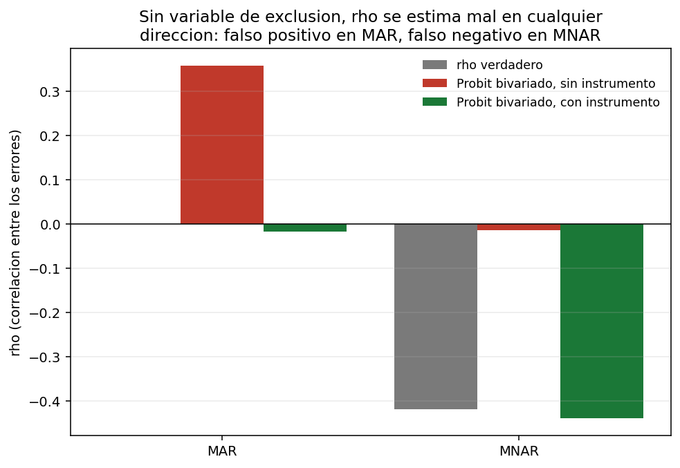
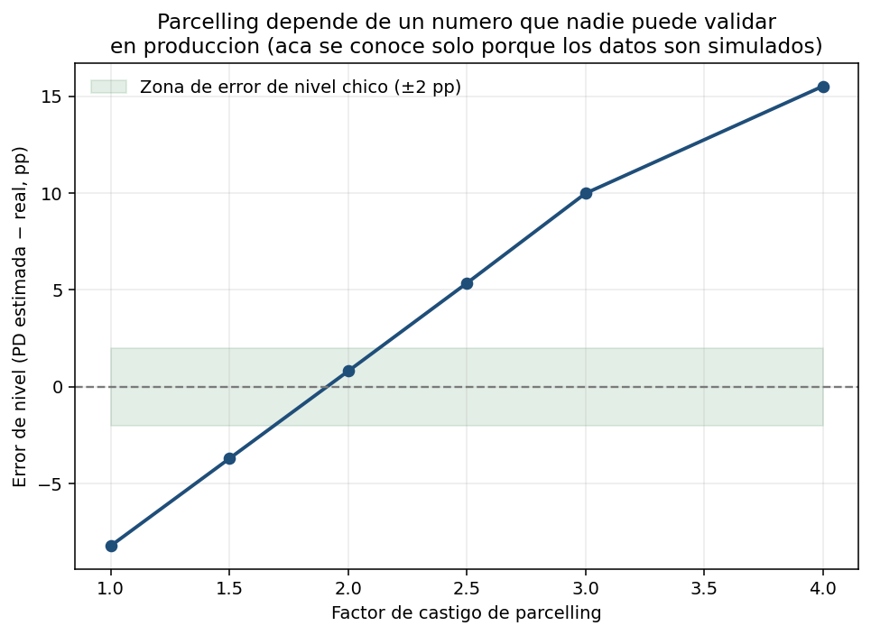
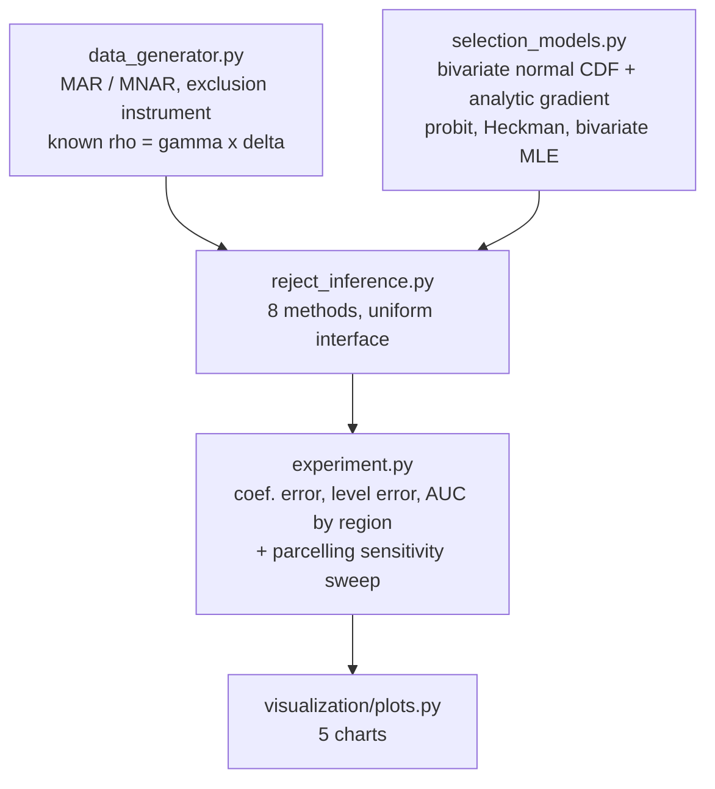

<div align="center">

# 🕳️ Reject Inference & Selection Bias

**The experiment no bank can run: a simulator that knows the true outcome of every rejected applicant, used to measure which reject-inference method actually recovers the truth — and to prove, with an analytic gradient and a controlled comparison, that the standard correction is only as good as its exclusion restriction**

🌐 **[English](README.md)** | **[Español](README.es.md)**

[](https://www.python.org/)
[](https://scipy.org/)
[](src/selection_models.py)
[](src/selection_models.py)
[](tests/)
[](../LICENSE)

</div>

---

## Why I built it this way

Every scorecard is trained on a lie of omission. The bank only observes
repayment for the applicants a *previous* policy approved — the rejected ones
never got the loan, so their outcome never exists in any database. Whatever
new model gets trained inherits that hole, and nobody inside the bank can
check how wrong it is on the population it will actually have to score,
because the ground truth needed to check it was never collected.

This project removes that constraint the only way it can be removed: the
simulator generates the outcome of **everyone**, applicants who would have
been approved and applicants who would have been rejected, and only
afterwards applies the historical approval policy. That turns "does this
reject-inference method work" from an article of faith into something with a
number attached.

The literature on reject inference almost always collapses two very
different problems into one. So the simulator generates two distinct
regimes:

- **MAR (selection on observables)** — the historical policy approved people
  looking only at the same variables the new model has. The correlation
  between the selection error and the outcome error, ρ, is exactly zero.
- **MNAR (selection on unobservables)** — the loan officer also used soft
  information that never made it into any database: the impression from the
  interview, personal knowledge of the client. That information genuinely
  predicts repayment, so ρ ≠ 0, and no feature available to the new model can
  correct for it.

Distinguishing these two is not academic. It determines whether the problem
has a fix at all.

## What the project builds

A from-scratch bivariate probit with selection — the econometrically correct
model for a *binary* outcome under sample selection — estimated by maximum
likelihood with an **analytic gradient**. That gradient is not a nicety: an
early version of this project used numerical differentiation over the seven
joint parameters, and it silently converged to a confidently wrong estimate
of ρ, with `success: True` and a gradient norm the optimizer believed was
zero. Deriving the closed-form partial derivatives of the bivariate normal
CDF (Plackett's formula for ∂Φ₂/∂ρ, plus the two conditional-probability
identities for ∂Φ₂/∂a and ∂Φ₂/∂b) fixed the optimizer — but it also exposed a
deeper, real problem, which turned into the central finding of this project.

Eight methods are compared, in increasing order of what they assume about
*why* someone was rejected: ignore the problem, inverse-propensity
reweighting, industry-standard parcelling, EM-based augmentation, two-stage
Heckman, and the full bivariate probit MLE — each of the last two run twice,
with and without an **exclusion restriction**: a variable that moves approval
but provably does not move true risk.

## Results from an actual run

`python run_pipeline.py` — 30,000 applicants per regime, ~50% historically
approved.

### The central finding: identification needs an instrument

The bivariate probit and Heckman correction are only as good as their
exclusion restriction. Fed the same features in the selection and the
outcome equation, they are *technically* identified through the curvature of
the bivariate normal alone — and in practice that identification is so weak
it produces a confidently wrong answer in **both directions**:



*Grey is the truth. Without an exclusion restriction (red), the model finds
a spurious ρ = +0.36 in MAR — inventing selection bias that does not
exist — and ρ ≈ 0 in MNAR — missing bias that is very real (true ρ = −0.42).
Given a genuine instrument (green), the same estimator recovers −0.017 and
−0.439: both within 0.02 of the truth.*

The instrument used is a branch-month **origination-quota pressure**
variable: when a branch is under pressure to hit volume targets, loan
officers approve more marginal applicants — moving the selection equation —
but that commercial pressure has no causal path to whether the applicant
actually repays, so by construction it never enters the outcome equation.

### What each method recovers, against the coefficients that generated the data

| Method | MAR: coef. error | MNAR: coef. error | MNAR: level error (pp) |
|---|---|---|---|
| Approved-only (ignore the problem) | 0.0311 | 0.0816 | −7.59 |
| IPW (inverse propensity) | 0.0876 | 0.1535 | −10.58 |
| Parcelling (factor = 2.0) | 0.1976 | 0.0420 | +0.81 |
| EM augmentation | 0.0311 | 0.0816 | −7.59 |
| Heckman, no instrument | 0.1661 | 0.0781 | −7.32 |
| Bivariate probit, no instrument | 0.1159 | 0.0780 | −7.31 |
| Heckman, **with instrument** | 0.0300 | 0.0379 | +0.89 |
| **Bivariate probit, with instrument** | **0.0300** | **0.0063** | **+0.73** |
| Oracle (impossible in practice) | 0.0110 | 0.0110 | 0.00 |

In MNAR, the properly identified bivariate probit gets within 0.0063 of the
true coefficients — close to the oracle's 0.0110 — while every method that
lacks an exclusion restriction, including the "correct" selection models run
without one, lands worse than simply ignoring the rejects.

### Parcelling's dial can't be tuned without the answer it's trying to find



*The punishment factor that industry practice picks by hand. At 2.0 the
level error is +0.81 pp; at 1.0 it's −8.21 pp; at 4.0 it's +15.51 pp. The
factor that happens to work here is not derivable from anything available
in production — it only looks validated because this project has the
ground truth to check it against.*

## Honest findings

- **Statistical convergence is not the same as finding the right answer.**
  The bivariate probit without an instrument reports `converged: True` with
  a gradient norm of 8×10⁻⁵ — it is not stuck, it found a genuine local
  optimum with *higher* likelihood than the true parameters. This is the
  textbook "identification by functional form alone" failure of Heckman-type
  models, reproduced here on purpose and measured rather than cited from a
  textbook.
- **EM augmentation barely moves at all**, and the reason is structural, not
  a bug: imputing a rejected applicant's label with the current model's own
  predicted probability is very close to a fixed point of the probit
  likelihood — the very first iteration changes the coefficients by 6×10⁻⁵,
  and four more iterations change nothing further. Self-training with a
  model's own confident predictions doesn't inject new information; it just
  reproduces what the model already believed.
- **Parcelling can look good or terrible depending on a number nobody can
  validate in production.** Factor 2.0 happens to land within a point of the
  true default rate here; factor 1.0 or 3.0 miss by 8 to 10 points. Reporting
  a good result from parcelling without the sensitivity sweep would have
  been reporting a coincidence as a method.
- **Heckman's two-step correction is noisier than the full MLE.** A single
  random draw can make the two-step version look worse with the instrument
  than without it — it only reliably improves once averaged over several
  independent samples, which the test suite does explicitly rather than
  cherry-picking a seed.
- **Ignoring the rejects entirely is not always the worst choice.** In MAR,
  approved-only recovers the coefficients almost as well as the fully
  corrected model (0.0311 vs. 0.0300) — because when selection only depends
  on observables, the conditional relationship inside the approved sample is
  already correct. The failure mode is specific to MNAR, and the two need to
  be distinguished before reaching for a correction.

## Architecture



| Module | What it does |
|---|---|
| [`src/selection_models.py`](src/selection_models.py) | The bivariate normal CDF by Gauss-Legendre quadrature, its three closed-form partial derivatives, a weighted probit, the Heckman two-step correction, and the full bivariate probit MLE with an analytic joint gradient. |
| [`src/data_generator.py`](src/data_generator.py) | Applicants with a known, correlated-error latent structure, in the MAR and MNAR regimes, plus the exclusion-restriction instrument. |
| [`src/reject_inference.py`](src/reject_inference.py) | The eight methods behind one interface: ignore, IPW, parcelling, EM augmentation, Heckman and bivariate probit (each with and without the instrument), and the oracle. |
| [`src/experiment.py`](src/experiment.py) | Runs all eight on both regimes, scores against ground truth on four metrics, and sweeps the parcelling factor. |

## Running it

```bash
python -m venv venv
venv\Scripts\activate            # Windows;  source venv/bin/activate on Linux/macOS
pip install -r requirements.txt

python run_pipeline.py           # everything end to end (~1 min)
pytest -q                        # 64 tests
```

| Chart | Shows |
|---|---|
| `recuperacion_de_rho.png` | ρ recovered with and without the instrument, against the truth, in both regimes |
| `comparacion_metodos.png` | Coefficient error for every method, side by side |
| `sesgo_de_nivel_mnar.png` | The number provisioning actually runs on: estimated vs. real portfolio default rate |
| `sensibilidad_parcelling.png` | How much the punishment factor changes the answer |
| `auc_aprobados_vs_rechazados.png` | Discrimination inside the comfortable region vs. the region that matters |

## Tests

64 tests (`pytest -q`). The bivariate normal CDF is checked against
`scipy.stats.multivariate_normal` — an independent implementation — across
seven correlations and five coordinate pairs; its three analytic partials are
checked against finite differences of that same CDF. The identification
finding is pinned directly: with the instrument, ρ is recovered to within
0.08 of a range of true values including zero; without it, the error is
required to exceed 0.15, so a future change that "fixes" the unidentified
case without an instrument would fail the suite rather than pass silently.

## Scope

Synthetic data, deliberately: recovering a known ρ against a known set of
coefficients is only checkable when the generating process is known. The
exclusion-restriction instrument (branch-month origination pressure) is a
plausible mechanism, not a claim about any real bank's data.

## Author

Pablo Reyes — [github.com/Rxyxs](https://github.com/Rxyxs)
Code: MIT — see [LICENSE](../LICENSE)
