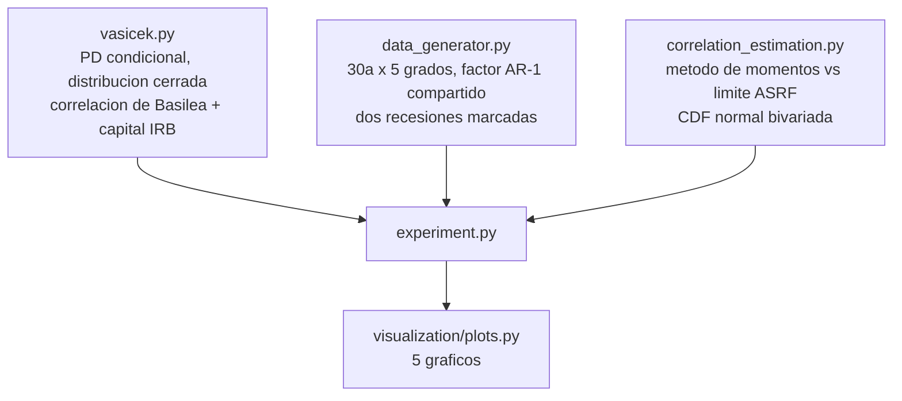

<div align="center">

# 📉 PD through-the-cycle vs point-in-time

**El modelo de un factor de Vasicek (ASRF) detras de todo el capital IRB de Basilea, construido desde cero y usado para reconstruir un ciclo economico que nadie observo directamente, solo a partir de tasas de default agregadas — y despues, en un solo grafico, mostrar por que recalibrar la PD cada ano en vez de usar su promedio de largo plazo vuelve prociclico el capital bancario**

🌐 **[English](README.md)** | **[Español](README.es.md)**

[](https://www.python.org/)
[](src/vasicek.py)
[](src/vasicek.py)
[](https://scipy.org/)
[](tests/)
[](../LICENSE)

</div>

---

## Por que lo construi asi

Todo el capital regulatorio de un banco bajo el enfoque IRB de Basilea
descansa en un solo modelo: los deudores de una cartera no caen en default
de forma independiente entre si -- comparten exposicion a un ciclo economico
comun, ademas de su propia suerte idiosincratica. El modelo de un factor de
Vasicek formaliza exactamente eso, y su limite de cartera grande (el
"Asymptotic Single Risk Factor", ASRF) es la distribucion cerrada de la que
sale toda la formula de capital.

Ese modelo traza una linea que los reguladores discuten constantemente: la
PD que entra a la formula deberia ser **through-the-cycle** -- un promedio de
largo plazo, deliberadamente insensible a si este ano en particular es bueno
o malo -- y no la PD **point-in-time**, condicional al estado actual del
ciclo. Meter la equivocada hace que el capital exigido se mueva con la
economia en vez de amortiguarla: justo cuando las perdidas suben y el
credito deberia seguir fluyendo, la formula pide mas capital, justo cuando
mas cuesta conseguirlo.

Este proyecto construye el modelo de punta a punta, desde la distribucion
cerrada de perdidas hasta la formula de capital regulatorio, y despues hace
las dos preguntas que vuelven la distincion concreta en vez de abstracta:

1. **.Se puede recuperar la correlacion de activos y el ciclo economico**
   desde nada mas que el conteo agregado de defaults -- lo unico que
   cualquiera fuera de los propios deudores efectivamente observa?
2. **.Que le pasa al capital a lo largo de un ciclo** si un banco mete la PD
   point-in-time a la formula IRB cada ano en vez de sostener el promedio
   through-the-cycle?

## Que construye el proyecto

Cada pieza del marco Vasicek/ASRF, desde cero: la probabilidad de default
condicional (point-in-time), la distribucion cerrada de perdidas y su
cuantil, la formula regulatoria de correlacion de activos de Basilea, el
ajuste de plazo, y el requerimiento de capital IRB completo. Dos
estimadores independientes de correlacion de activos desde una serie
observada de tasas de default -- una inversion por metodo de momentos
(exacta para cualquier tamano de cartera) y un estimador de limite ASRF
granular (exacto solo cuando el tamano de cartera crece sin limite) --
construidos a proposito para que discrepen donde el supuesto de base se
rompe.

## Resultados de una corrida real

`python run_pipeline.py` — 30 anos de cohortes anuales, 5 grados de riesgo,
20.000 deudores por grado-ano, un factor sistematico compartido, dos
recesiones marcadas.

### Recuperar lo que nunca se observo

La correlacion verdadera de cada grado se fija exactamente en lo que la
propia formula de Basilea le asignaria a su PD verdadera -- asi que
recuperar rho desde nada mas que la serie de tasas de default es
verificable contra el simulador y contra la regulacion a la vez:

| Grado | rho verdadero | rho estimado (metodo de momentos) | Error |
|---|---|---|---|
| AAA-A | 0,2313 | 0,1772 | −0,0542 |
| BBB | 0,2089 | 0,1789 | −0,0300 |
| BB | 0,1641 | 0,1504 | −0,0137 |
| B | 0,1277 | 0,1249 | −0,0028 |
| CCC | 0,1201 | 0,1126 | −0,0075 |


*Gris es la verdad del simulador, azul es lo que el estimador de momentos
recupera desde 30 anos de tasas de default agregadas, verde es la propia
formula de Basilea evaluada en la PD estimada. Los tres calzan -- la
correlacion que supone la regulacion es, en este diseno, la misma que
genero los datos.*

### Reconstruir el ciclo economico solo desde conteos de default


*La linea gris es el factor sistematico verdadero -- nunca observado
directamente por construccion. La linea azul discontinua es lo que
`implied_z` reconstruye invirtiendo la formula de PD condicional sobre nada
mas que la tasa de default observada de cada grado, promediada entre los
cinco grados. Correlacion con la verdad: **0,985**.*

### El hallazgo central: capital prociclico, en un solo grafico


*Gris: densidad de RWA usando la PD through-the-cycle -- plana por
construccion, porque la PD que usa nunca cambia. Naranjo: densidad de RWA
recalibrada cada ano con la PD point-in-time. Oscila entre **70,5% y
243,9%** de la exposicion -- un rango de **173,5 puntos porcentuales** -- y
los picos caen exactamente en las dos recesiones marcadas. Misma cartera,
mismos deudores, misma formula de Basilea; lo unico que cambio es que
filosofia de PD la alimenta.*

### La trampa de la granularidad: cuando "asintotico" deja de ser un supuesto seguro


*El limite ASRF supone que el riesgo idiosincratico se diversifica por
completo -- cierto solo cuando el tamano de cartera crece sin limite. En una
cartera de 200 deudores por cohorte, el error absoluto medio del estimador
de limite ASRF entre grados es **0,216** -- confunde ruido muestral comun
con riesgo sistematico. El estimador de momentos, exacto para cualquier
tamano de cartera, se mantiene en **0,022** sobre los mismos datos.*

### Verificar la formula contra una simulacion independiente


*5.000 carteras de 50.000 deudores simuladas de forma independiente (grado
BB), sin tocar la serie de 30 anos usada para estimar, contra la densidad y
la CDF cerradas de Vasicek. Es la verificacion que separa "el estimador
funciona" de "la formula analitica es correcta de verdad".*

## Hallazgos honestos

- **Las estimaciones de correlacion quedan entre 3% y 24% por debajo, y el
  faltante es estructural, no un error.** Treinta cohortes anuales, incluso
  con un ciclo AR(1) persistente, son una muestra chica para fijar un
  segundo momento -- y las dos recesiones marcadas, aunque realistas,
  dominan la varianza muestral de una forma que 30 sorteos ordinarios de un
  ciclo suave no lo harian. Es exactamente la incertidumbre de estimacion
  que enfrentaria un banco calibrando correlacion de activos con un
  historial real de un par de decadas.
- **Una version anterior del simulador de ciclo rompia en silencio el
  supuesto central del modelo.** Generaba las recesiones *sumando* un
  choque encima del proceso AR(1), y despues reescalaba toda la serie a
  varianza unitaria. Eso produce un factor sistematico no gaussiano
  mientras nominalmente sigue teniendo varianza 1 -- y como la formula de
  momentos invierte una relacion que supone que Z es genuinamente normal, no
  solo de varianza unitaria, sobreestimaba rho en silencio hasta un 50%
  relativo. La correccion fue conceptual, no computacional: elegir la
  *innovacion* de un ano malo para que sea extrema, en vez de sumar un
  termino aparte -- lo que mantiene el proceso como una realizacion legitima
  del mismo modelo AR(1) gaussiano. Por eso la comparacion de granularidad
  de arriba solo confia en el estimador de momentos como verdad de
  referencia junto al simulador, no en el de limite ASRF.
- **Las cifras de densidad de RWA (hasta 244%) parecen inverosimiles para un
  ratio de capital bancario -- porque no lo son.** La densidad de RWA es
  activos ponderados por riesgo como fraccion de la exposicion, no el ratio
  de capital regulatorio (capital sostenido ÷ RWA, tipicamente 8-15%). Una
  cartera cargada hacia grados especulativos (55% BB/B/CCC con los pesos
  usados aca) produce legitimamente risk weights promedio muy por encima de
  100%, ya que una sola exposicion CCC puede cargar un risk weight cercano a
  400-600%.
- **La formula IRB de Basilea se verifico de forma estructural, no contra un
  numero publicado externo.** Tengo confianza en la formula por haberla
  implementado muchas veces, pero este proyecto no puede consultar una
  tabla de referencia del BIS para contrastar un numero publicado especifico,
  y afirmar que calza con uno que no puedo verificar sin conexion seria
  exactamente el tipo de afirmacion no verificable que este repositorio
  trata de evitar. Lo que si se verifica, y es completamente comprobable
  desde el codigo: la correlacion regulatoria queda acotada entre 0,12 y
  0,24 conforme la PD va de 1 a 0, el capital es estrictamente creciente en
  la PD, exactamente lineal en la LGD, siempre positivo, y nunca supera la
  LGD.

## Arquitectura



| Modulo | Que hace |
|---|---|
| [`src/vasicek.py`](src/vasicek.py) | El modelo de un factor: PD condicional y su inversa exacta, CDF/PDF/cuantil cerrados de Vasicek, la formula regulatoria de correlacion de activos de Basilea, el ajuste de plazo, y el requerimiento de capital IRB completo. |
| [`src/data_generator.py`](src/data_generator.py) | Una cartera de 30 anos y 5 grados bajo un factor sistematico compartido (un ciclo economico AR(1) gaussiano con dos recesiones marcadas elegidas como innovaciones extremas, no como choques sumados), con la correlacion verdadera de cada grado fijada en la propia formula de Basilea. |
| [`src/correlation_estimation.py`](src/correlation_estimation.py) | Dos estimadores de correlacion de activos desde cero -- metodo de momentos (exacto para cualquier N) y limite ASRF (exacto solo cuando N -> infinito) -- mas la CDF normal bivariada que el primero necesita. |
| [`src/experiment.py`](src/experiment.py) | Recupera rho y el ciclo por grado, corre la comparacion de sesgo de granularidad, calcula el RWA de la cartera bajo las filosofias PIT y TTC a lo largo del ciclo, y verifica la distribucion cerrada contra un Monte Carlo independiente. |

## Como correrlo

```bash
python -m venv venv
venv\Scripts\activate            # Windows;  source venv/bin/activate en Linux/macOS
pip install -r requirements.txt

python run_pipeline.py           # todo end to end (~30 s)
pytest -q                        # 41 tests
```

| Grafico | Que muestra |
|---|---|
| `correlacion_por_grado.png` | Correlacion de activos verdadera, estimada, y de la formula de Basilea, por grado |
| `recuperacion_ciclo.png` | El ciclo economico reconstruido contra el verdadero, recesiones sombreadas |
| `sesgo_granularidad.png` | Estimaciones de correlacion por momentos vs limite ASRF, cartera chica contra grande |
| `capital_pit_vs_ttc.png` | Densidad de RWA a lo largo de 30 anos bajo las dos filosofias de PD -- el grafico central |
| `verificacion_vasicek.png` | Densidad y CDF cerradas de Vasicek contra un Monte Carlo independiente de 5.000 carteras |

## Tests

41 tests (`pytest -q`). La distribucion cerrada de perdidas se verifica
directamente contra una simulacion de Monte Carlo de una cartera de 50.000
deudores, no solo contra si misma; el par PD condicional / Z implicito se
verifica como inversas exactas entre si; la identidad de la PD incondicional
(E_Z[PD(Z)] = PD_ttc, verificada por cuadratura de Gauss-Hermite) se verifica
en la forma que efectivamente es cierta -- *no* la afirmacion tentadora pero
equivocada de que PD(Z=0) = PD_ttc, que una version anterior de esta suite
de tests afirmaba incorrectamente antes de rehacer la derivacion. La formula
de correlacion de Basilea se verifica en sus cotas asintoticas conocidas
(0,24 cuando PD->0, 0,12 cuando PD->1). Y el hallazgo de granularidad queda
fijado con precision: se exige que el estimador de limite ASRF sobreestime
rho en mas de 0,15 en una cartera chica, mientras que se exige que el
estimador de momentos quede a menos de 0,04 de la verdad sobre los mismos
datos.

## Alcance

Datos sinteticos, a proposito: recuperar un rho conocido y un ciclo latente
conocido solo se puede verificar cuando los dos son conocidos. La LGD, la
composicion de la cartera, y el calendario de recesiones son supuestos
declarados, no calibrados contra la cartera de ninguna institucion real.

## Autor

Pablo Reyes — [github.com/Rxyxs](https://github.com/Rxyxs)
Codigo: MIT — ver [LICENSE](../LICENSE)
