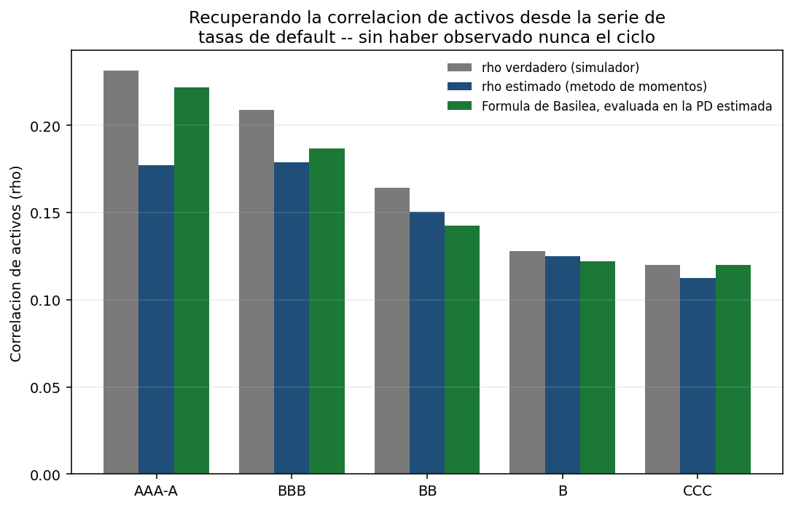
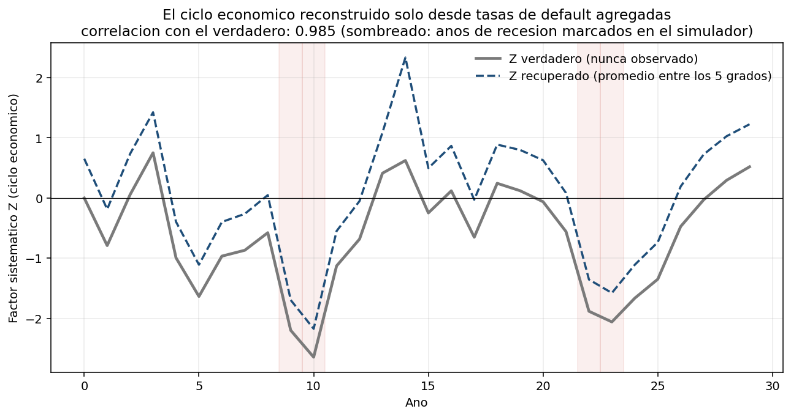
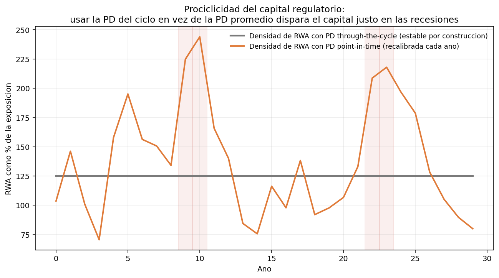
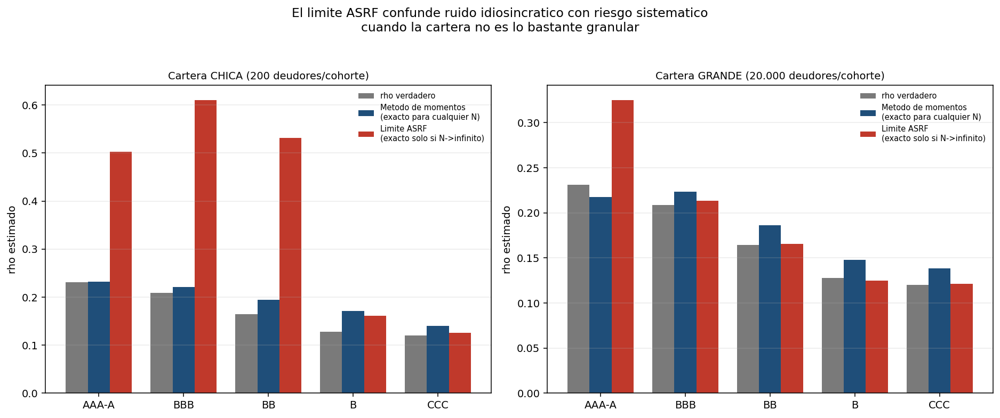
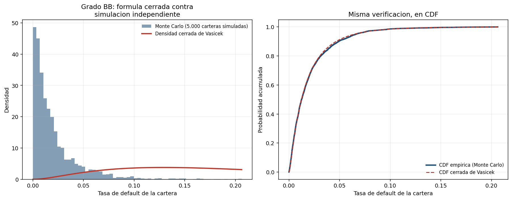
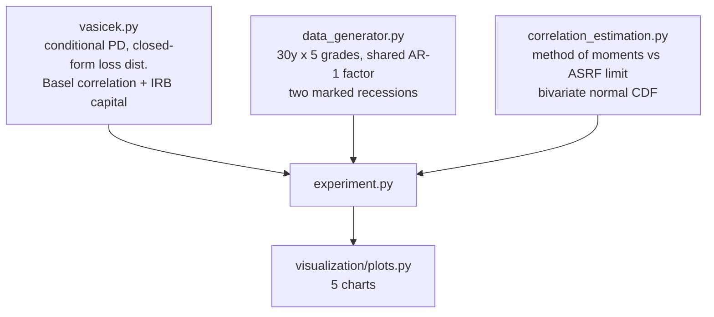

<div align="center">

# 📉 Through-the-Cycle vs Point-in-Time PD

**The Vasicek single-factor (ASRF) model behind all of Basel's IRB capital, built from scratch and used to reconstruct a business cycle nobody observed directly from aggregate default rates alone — then to show, in one chart, why recalibrating PD every year instead of using its long-run average turns bank capital procyclical**

🌐 **[English](README.md)** | **[Español](README.es.md)**

[](https://www.python.org/)
[](src/vasicek.py)
[](src/vasicek.py)
[](https://scipy.org/)
[](tests/)
[](../LICENSE)

</div>

---

## Why I built it this way

Every bank's regulatory capital under the Basel IRB approach rests on one
model: a portfolio's obligors don't default independently — they share
exposure to a common business cycle, plus their own idiosyncratic luck. The
Vasicek single-factor model states that precisely, and its large-portfolio
limit (the "Asymptotic Single Risk Factor", ASRF) is the closed-form
distribution the entire capital formula is derived from.

That model draws a sharp line policymakers argue about constantly: the PD
that goes into the formula should be **through-the-cycle** — a long-run
average, deliberately insensitive to whether this particular year is good or
bad — not the **point-in-time** PD conditional on the current state of the
cycle. Plug the wrong one in and capital requirements swing with the economy
instead of dampening it: exactly when losses are rising and lending should
keep flowing, the formula demands more capital, right when it's hardest to
raise.

This project builds the model end to end, from the closed-form loss
distribution to the regulatory capital formula, and then asks the two
questions that make the distinction concrete instead of abstract:

1. **Can the asset correlation and the business cycle be recovered from
   nothing but aggregate default counts** — the only thing anyone outside
   the obligors themselves ever actually observes?
2. **What does capital actually do across a cycle** if a bank plugs the PIT
   PD into the IRB formula every year instead of holding the TTC average?

## What the project builds

Every piece of the Vasicek/ASRF framework, from scratch: the conditional
(point-in-time) default probability, the closed-form loss distribution and
its quantile, Basel's regulatory asset-correlation formula, the maturity
adjustment, and the full IRB capital requirement. Two independent estimators
of asset correlation from an observed default-rate time series — a
method-of-moments inversion (exact for any portfolio size) and a granular
ASRF-limit estimator (exact only as the portfolio size grows without
bound) — deliberately built to disagree where the underlying assumption
breaks.

## Results from an actual run

`python run_pipeline.py` — 30 years of annual cohorts, 5 rating grades,
20,000 obligors per grade-year, one shared systematic factor, two marked
recessions.

### Recovering what was never observed

Each grade's true asset correlation is set to exactly what Basel's own
formula would assign at its true PD — so recovering ρ from nothing but the
default-rate series is checkable against both the simulator and the
regulation at once:

| Grade | True ρ | Estimated ρ (method of moments) | Error |
|---|---|---|---|
| AAA-A | 0.2313 | 0.1772 | −0.0542 |
| BBB | 0.2089 | 0.1789 | −0.0300 |
| BB | 0.1641 | 0.1504 | −0.0137 |
| B | 0.1277 | 0.1249 | −0.0028 |
| CCC | 0.1201 | 0.1126 | −0.0075 |



*Grey is the simulator's truth, blue is what the method-of-moments estimator
recovers from 30 years of aggregate default rates alone, green is Basel's
own formula evaluated at the estimated PD. The three line up — the
correlation the regulation assumes is, in this design, the same one that
generated the data.*

### Reconstructing the business cycle from default counts alone



*The grey line is the true systematic factor — never observed directly by
construction. The blue dashed line is what `implied_z` reconstructs by
inverting the conditional-PD formula on nothing but each grade's observed
default rate, averaged across the five grades. Correlation with the truth:
**0.985**.*

### The central finding: procyclical capital, in one chart



*Grey: RWA density using the through-the-cycle PD — flat by construction,
because the PD it uses never changes. Orange: RWA density recalibrated every
year with the point-in-time PD. It swings from **70.5% to 243.9%** of
exposure — a **173.5 percentage-point** range — and the peaks land exactly
on the two marked recessions. Same portfolio, same obligors, same Basel
formula; the only thing that changed is which PD philosophy feeds it.*

### The granularity trap: when "asymptotic" stops being a safe assumption



*The ASRF limit assumes idiosyncratic risk fully diversifies away — true
only as portfolio size grows without bound. On a 200-obligor-per-cohort
portfolio, the ASRF-limit estimator's mean absolute error across grades is
**0.216** — it mistakes ordinary sampling noise for systematic risk. The
method-of-moments estimator, exact for any portfolio size, holds at
**0.022** on the same data.*

### Verifying the formula against an independent simulation



*5,000 independently simulated 50,000-obligor portfolios (grade BB), never
touching the 30-year time series used for estimation, against the closed-form
Vasicek density and CDF. This is the check that separates "the estimator
works" from "the analytic formula is actually correct."*

## Honest findings

- **The correlation estimates run 3–24% low, and the shortfall is
  structural, not a bug.** Thirty annual cohorts, even with a persistent
  AR(1) cycle, is a small sample for pinning down a second moment — and the
  two marked recessions, while realistic, dominate the sample variance in a
  way 30 ordinary draws from a smooth cycle would not. This is exactly the
  estimation uncertainty a bank calibrating asset correlation off a real,
  couple-of-decades default history would actually face.
- **An earlier version of the cycle simulator silently broke the model's
  central assumption.** It generated recessions by *adding* a shock on top
  of the AR(1) process, then rescaled the whole series to unit variance.
  That produces a non-Gaussian systematic factor while still nominally
  having variance 1 — and since the method-of-moments formula inverts a
  relationship that assumes Z is genuinely normal, not just unit-variance,
  it silently overestimated ρ by as much as 50% relative. The fix was
  conceptual, not computational: choose a bad year's *innovation* to be
  extreme, rather than adding an extra term — which keeps the process a
  legitimate realization of the same AR(1) Gaussian model. This is why the
  granularity comparison above only trusts the method-of-moments estimator
  as ground truth alongside the simulator, not the ASRF-limit one.
- **The RWA density figures (up to 244%) look implausible for a bank capital
  ratio — because they are not one.** RWA density is risk-weighted assets as
  a share of exposure, not the regulatory capital ratio (capital held ÷ RWA,
  typically 8–15%). A book skewed toward speculative grades (55% BB/B/CCC by
  the portfolio weights used here) legitimately produces average risk
  weights well above 100%, since a single CCC exposure alone can carry a
  risk weight near 400–600%.
- **Basel's own IRB formula was verified structurally, not against an
  external published benchmark.** I'm confident in the formula from having
  implemented it many times, but this project can't fetch a BIS reference
  table to check a specific published number against, and stating a match to
  one I can't verify offline would be exactly the kind of unverifiable claim
  this repository tries not to make. What's checked instead, and is fully
  checkable from the code alone: the regulatory correlation is bounded
  between 0.12 and 0.24 as PD ranges from 1 to 0, capital is strictly
  increasing in PD, exactly linear in LGD, always positive, and never
  exceeds LGD.

## Architecture



| Module | What it does |
|---|---|
| [`src/vasicek.py`](src/vasicek.py) | The single-factor model: conditional PD and its exact inverse, the closed-form Vasicek loss CDF/PDF/quantile, Basel's regulatory asset-correlation formula, the maturity adjustment, and the full IRB capital requirement. |
| [`src/data_generator.py`](src/data_generator.py) | A 30-year, 5-grade portfolio under one shared systematic factor (a Gaussian AR(1) business cycle with two marked recessions chosen as extreme innovations, not added shocks), with each grade's true correlation set to Basel's own formula. |
| [`src/correlation_estimation.py`](src/correlation_estimation.py) | Two from-scratch asset-correlation estimators — method of moments (exact for any N) and the ASRF limit (exact only as N → ∞) — plus the bivariate normal CDF the first one needs. |
| [`src/experiment.py`](src/experiment.py) | Recovers ρ and the cycle per grade, runs the granularity-bias comparison, computes portfolio RWA under PIT vs. TTC philosophies across the cycle, and verifies the closed-form distribution against an independent Monte Carlo. |

## Running it

```bash
python -m venv venv
venv\Scripts\activate            # Windows;  source venv/bin/activate on Linux/macOS
pip install -r requirements.txt

python run_pipeline.py           # everything end to end (~30 s)
pytest -q                        # 41 tests
```

| Chart | Shows |
|---|---|
| `correlacion_por_grado.png` | True vs. estimated vs. Basel-formula asset correlation, per grade |
| `recuperacion_ciclo.png` | The reconstructed business cycle against the true one, recessions shaded |
| `sesgo_granularidad.png` | Method of moments vs. ASRF-limit correlation estimates, small vs. large portfolio |
| `capital_pit_vs_ttc.png` | RWA density across 30 years under both PD philosophies — the central chart |
| `verificacion_vasicek.png` | Closed-form Vasicek density and CDF against an independent 5,000-portfolio Monte Carlo |

## Tests

41 tests (`pytest -q`). The closed-form loss distribution is checked directly
against Monte Carlo simulation of a 50,000-obligor portfolio, not just against
itself; the conditional-PD/implied-Z pair is checked to be exact inverses of
each other; the unconditional-PD identity (E_Z[PD(Z)] = PD_ttc, verified by
Gauss-Hermite quadrature) is checked in the form that's actually true —
*not* the tempting-but-wrong claim that PD(Z=0) = PD_ttc, which an earlier
draft of this test suite asserted incorrectly before the derivation was
redone. Basel's correlation formula is checked at its known asymptotic bounds
(0.24 as PD→0, 0.12 as PD→1). And the granularity finding is pinned exactly:
the ASRF-limit estimator is required to overestimate ρ by more than 0.15 on a
small portfolio while the method-of-moments estimator is required to land
within 0.04 of the truth on the same data.

## Scope

Synthetic data, deliberately: recovering a known ρ and a known latent cycle
is only checkable when both are known. LGD, portfolio composition, and the
recession timing are declared assumptions, not calibrated to any real
institution's book.

## Author

Pablo Reyes — [github.com/Rxyxs](https://github.com/Rxyxs)
Code: MIT — see [LICENSE](../LICENSE)
