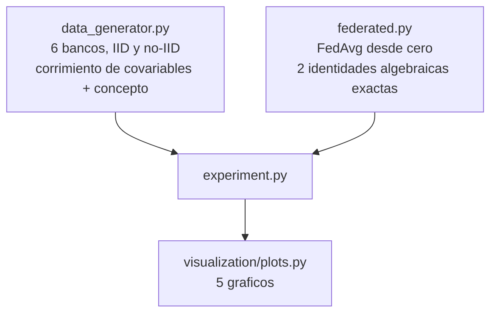

<div align="center">

# 🤝 Scoring crediticio federado

**FedAvg escrito desde cero y anclado a dos identidades algebraicas exactas, usado para responder la pregunta que en riesgo de credito importa mas que el ranking: no "mi modelo ordena bien a los solicitantes", sino "sabe el NIVEL de riesgo correcto para una poblacion que nunca vio" -- y no lo sabe, a menos que algo como la federacion le permita aprender de mas que sus propios clientes**

🌐 **[English](README.md)** | **[Español](README.es.md)**

[](https://www.python.org/)
[](src/federated.py)
[](src/federated.py)
[](https://scikit-learn.org/)
[](tests/)
[](../LICENSE)

</div>

---

## Por que lo construi asi

El secreto bancario no es un tecnicismo que un modelo de riesgo de credito
pueda rodear. Un banco regional especializado en microcreditos a
solicitantes informales no puede pasarle su base de clientes a un banco de
la zona minera, ni a un consorcio que quiera construir un mejor scorecard
nacional -- y tampoco deberia querer hacerlo. Cada banco queda entrenando
con su propia porcion del mercado, y esa porcion nunca es representativa de
la poblacion sobre la que su modelo terminara decidiendo.

El aprendizaje federado es la respuesta que respeta la restriccion en vez de
desearla lejos: los bancos nunca comparten datos, solo actualizaciones del
modelo, agregadas por un coordinador que jamas ve un registro crudo. Este
proyecto implementa **FedAvg** (McMahan et al., 2017) desde cero para un
scorecard de regresion logistica, y despues hace la pregunta que una demo
rara vez se molesta en verificar: .funciona de verdad?, y .cuanto cuesta "no
compartir datos"?, medido contra las dos cosas que importan en la practica
-- que tan bien el modelo ordena a los solicitantes, y si acierta el NIVEL de
su riesgo.

## Que construye el proyecto

Descenso de gradiente local del lado del cliente, agregacion ponderada del
lado del servidor sobre rondas de comunicacion -- y dos identidades a las
que la implementacion queda anclada de forma exacta, no aproximada:

- **Un solo cliente**: promediar una sola cosa no hace nada, asi que FedAvg
  con `E` epocas locales sobre `R` rondas tiene que dar igual que descenso
  de gradiente comun por `R×E` epocas sobre los datos de ese cliente.
- **`E = 1`**: cuando cada cliente da exactamente un paso de gradiente antes
  de que el servidor promedie, el promedio ponderado por tamano de los
  gradientes de cada cliente es algebraicamente identico al gradiente sobre
  los datos agrupados -- asi que FedAvg con un solo paso local por ronda
  tiene que coincidir con descenso de gradiente centralizado sobre los
  datos de todos juntos, sin importar cuan desiguales sean los tamanos.

Seis bancos simulados, dos regimenes de heterogeneidad (IID y no-IID, el
segundo combinando corrimiento de covariables realista -- distintas
regiones, distintos clientes -- con un corrimiento de concepto moderado y
plausible en como la carga financiera de cada banco se traduce en riesgo),
y tres politicas de entrenamiento comparadas en igualdad de condiciones:
**solo local** (cada banco entrena unicamente con su propia cartera),
**federado** (FedAvg, los datos crudos nunca se centralizan), y un
**oraculo centralizado** (como si los datos se pudieran juntar --
imposible bajo la ley que este proyecto toma en serio, presente solo como
cota superior).

## Resultados de una corrida real

`python run_pipeline.py` — 7.000 solicitantes repartidos en 6 bancos, 200
epocas locales de presupuesto de computo por politica, para que toda
comparacion use la misma cantidad de trabajo.

### El hallazgo: el ranking casi no se mueve, la calibracion se rompe


*Izquierda: el modelo *propio* de cada banco, entrenado solo con sus
clientes, aplicado a la poblacion **nacional** que nunca vio. Derecha: la
misma comparacion promediada entre bancos, por politica. El sesgo de
calibracion de un banco se sale del grafico.*

| Politica | AUC nacional | Brier | Sesgo de calibracion |
|---|---|---|---|
| Solo local (promedio) | 0,7757 | 0,1715 | **+4,45 pp** |
| **Federado (FedAvg)** | **0,7797** | **0,1582** | **+0,18 pp** |
| Oraculo centralizado | 0,7795 | 0,1582 | +0,46 pp |

La brecha de AUC entre solo-local y federado es real pero chica (0,7757
contra 0,7797) -- un modelo entrenado con 1.000 clientes propios de un banco
igual ordena razonablemente bien a nivel nacional, porque los factores de
riesgo dominantes (historial de mora, utilizacion) apuntan en la misma
direccion en todas partes. **La calibracion es donde solo-local
efectivamente se rompe**: en promedio sobreestima el riesgo nacional en 4,45
puntos, y un solo banco explica casi todo eso --
`Banco_Microcredito_Informal`, entrenado con una poblacion de microcredito
de alta informalidad y alto riesgo, predice una **PD media de 52,22% para
la poblacion nacional**, cuya tasa real es 27,6%: una descalibracion de
**24,6 puntos porcentuales**. Su AUC sobre esa misma poblacion nacional es
0,7677 -- perfectamente razonable a simple vista. **El AUC por si solo
jamas detectaria esto.** Para provision o para precio, donde el nivel real
de PD es lo que entra a la formula, esa brecha es toda la diferencia entre
un numero defendible y uno gravemente equivocado.

### Las actualizaciones filtran informacion, aunque los datos nunca lo hagan


*Similitud coseno entre la primera actualizacion de cada banco, antes de
que se compartiera ningun dato crudo. En IID (izquierda), todos los pares
quedan sobre 0,98 -- ningun banco se destaca. En no-IID (derecha), la
actualizacion de `Banco_Microcredito_Informal` tiene similitud coseno
**negativa** con la de todos los demas bancos -- su gradiente apunta
esencialmente en la direccion opuesta. Un coordinador curioso, sin tocar
nunca los datos de ese banco, podria saber desde la primera ronda que ese
participante sirve a una poblacion fundamentalmente distinta.*

### El dial de comunicacion: mas computo local no sale gratis


*Mismo presupuesto total de computo, redistribuido en rondas mas pesadas y
menos frecuentes de entrenamiento local antes de cada sincronizacion. El
AUC (izquierda) queda casi plano. El sesgo de calibracion (derecha) no: toca
su minimo cerca de 10 epocas locales por ronda y casi se triplica hacia 40
-- client drift, exactamente como lo describe la literatura de aprendizaje
federado, apareciendo como un NIVEL descalibrado y no como una falla de
ranking.*

## Hallazgos honestos

- **El corrimiento puro de covariables por si solo no producia una brecha
  dramatica.** Una version anterior de este proyecto le daba a cada banco
  una *poblacion* distinta pero mantenia identica la relacion verdadera de
  riesgo en todas partes, razonando que el caso dificil del aprendizaje
  federado es la heterogeneidad entre silos de datos. No fue lo bastante
  dificil: un modelo logistico bien especificado, entrenado con unos pocos
  miles de casos suficientemente variados de una poblacion con corrimiento
  de covariables, sigue estimando consistentemente los *mismos*
  coeficientes subyacentes -- solo-local y federado salian
  estadisticamente indistinguibles. El caso revelador necesitaba tambien
  **corrimiento de concepto** (el coeficiente de carga financiera y la
  tasa base de cada banco difiriendo de verdad, reflejando diferencias
  reales de politica de garantias y cultura de originacion) -- que ademas
  es la descripcion mas realista de por que los modelos de credito
  difieren entre instituciones en la practica.
- **El AUC es el lente equivocado para este problema, y hizo falta
  construir primero el grafico equivocado para verlo.** La primera version
  de esta comparacion solo reportaba metricas de discriminacion y
  encontraba a federado apenas adelante de solo-local. El sesgo de
  calibracion -- el numero que efectivamente consumen las formulas de
  provision y de precio -- mostro el efecto real y dramatico que la
  metrica de ranking estaba escondiendo.
- **El patron de client drift en el barrido de epocas no es monotono, no
  es un limpio "mas computo local siempre es peor".** El sesgo de
  calibracion es minimo cerca de 10 epocas locales por ronda, no en la
  sincronizacion mas frecuente (E=1, 0,461 pp) -- este proyecto no tiene
  una explicacion cerrada de por que, y reporta la curva tal como se midio
  en vez de suavizarla hacia una historia mas prolija de lo que los datos
  respaldan.
- **Un servidor curioso puede perfilar a un participante solo con sus
  actualizaciones.** Esto no es una garantia formal de privacidad -- es una
  demostracion medida de que "los datos nunca salieron del cliente" no es
  la misma afirmacion que "no se filtro nada sobre el cliente". Combinar
  el entrenamiento federado con el tipo de privacidad diferencial por
  ejemplo construida en el proyecto 08 es la capa natural siguiente; este
  proyecto mide la brecha que la privacidad diferencial tendria que
  cerrar, en vez de cerrarla.

## Arquitectura



| Modulo | Que hace |
|---|---|
| [`src/federated.py`](src/federated.py) | Descenso de gradiente local de lote completo, agregacion del servidor de FedAvg ponderada por tamano, y las dos identidades (un cliente y E=1) que anclan la implementacion a algo verificable en vez de meramente plausible. |
| [`src/data_generator.py`](src/data_generator.py) | Seis bancos con poblaciones regionales/de segmento distintas, versiones IID y no-IID, la segunda combinando corrimiento de covariables con un corrimiento de concepto declarado y moderado por banco. |
| [`src/experiment.py`](src/experiment.py) | Comparacion solo-local vs federado vs oraculo centralizado, evaluada a nivel nacional tanto en AUC como en calibracion, el barrido de epocas locales, y la huella de similitud de actualizaciones de la primera ronda. |

## Como correrlo

```bash
python -m venv venv
venv\Scripts\activate            # Windows;  source venv/bin/activate en Linux/macOS
pip install -r requirements.txt

python run_pipeline.py           # todo end to end (~15 s)
pytest -q                        # 26 tests
```

| Grafico | Que muestra |
|---|---|
| `calibracion_por_banco.png` | El sesgo de calibracion nacional del modelo propio de cada banco, y la comparacion de las tres politicas |
| `comparacion_politicas.png` | AUC y Brier score, IID contra no-IID, las tres politicas |
| `similitud_updates.png` | Similitud coseno de la primera ronda de actualizaciones, IID contra no-IID |
| `barrido_epocas_locales.png` | AUC y sesgo de calibracion contra epocas locales por ronda |
| `historia_convergencia.png` | Cuanto se alejan los modelos locales del modelo global en cada ronda, IID contra no-IID |

## Tests

26 tests (`pytest -q`). Las dos identidades exactas se verifican con
tolerancia absoluta de `1e-9`-`1e-10`, incluso con tamanos de cliente
deliberadamente desiguales y con todos los clientes teniendo datos
identicos (las dos reducen FedAvg a descenso de gradiente comun, y los
tests lo exigen exacto, no aproximado). El gradiente analitico se verifica
contra diferencias finitas. Los hallazgos centrales quedan fijados
directamente: las tasas de default y la relacion DTI-riesgo del escenario
IID tienen que mantenerse parecidas entre bancos mientras que las del
escenario no-IID tienen que diferir mas de 3 veces la dispersion de IID; el
sesgo de calibracion federado tiene que ser menor que el de solo-local; el
banco peor calibrado localmente tiene que ser `Banco_Microcredito_Informal`;
y su similitud de actualizacion de la primera ronda con cada otro banco
tiene que ser menor que la similitud de los demas bancos entre si -- solo en
no-IID, no en IID.

## Alcance

Datos sinteticos, a proposito: la afirmacion "federado recupera calibracion
cercana al oraculo" y las identidades exactas de gradiente solo se pueden
verificar contra un proceso generador conocido. Las magnitudes de
corrimiento de concepto (`DESVIO_CONCEPTO_NO_IID`) son supuestos declarados
y plausibles sobre como difiere la originacion entre instituciones, no una
afirmacion sobre ningun banco real.

## Autor

Pablo Reyes — [github.com/Rxyxs](https://github.com/Rxyxs)
Codigo: MIT — ver [LICENSE](../LICENSE)
