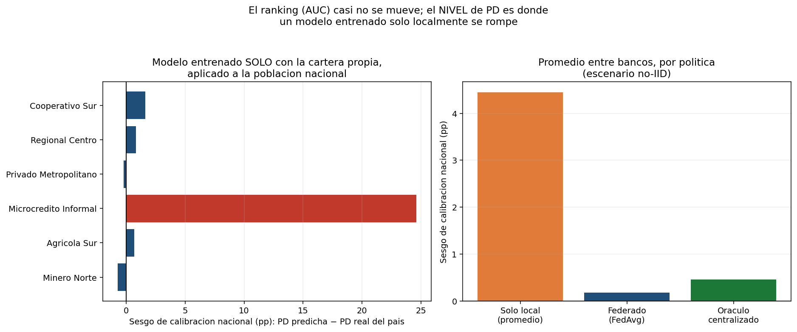
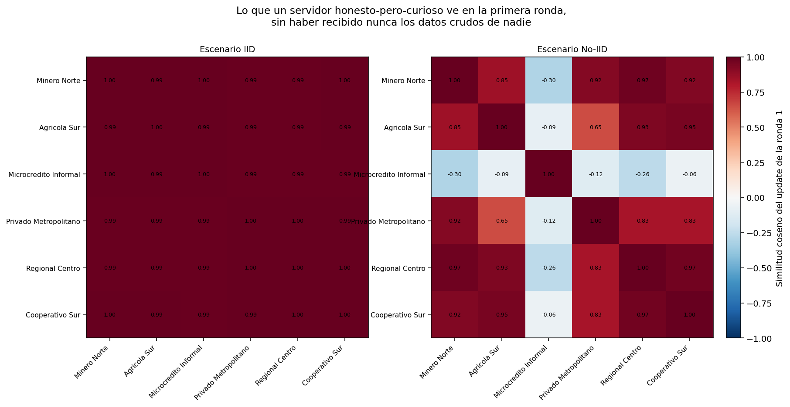
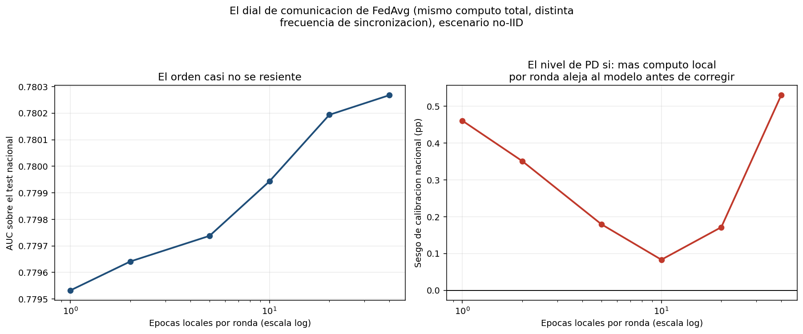
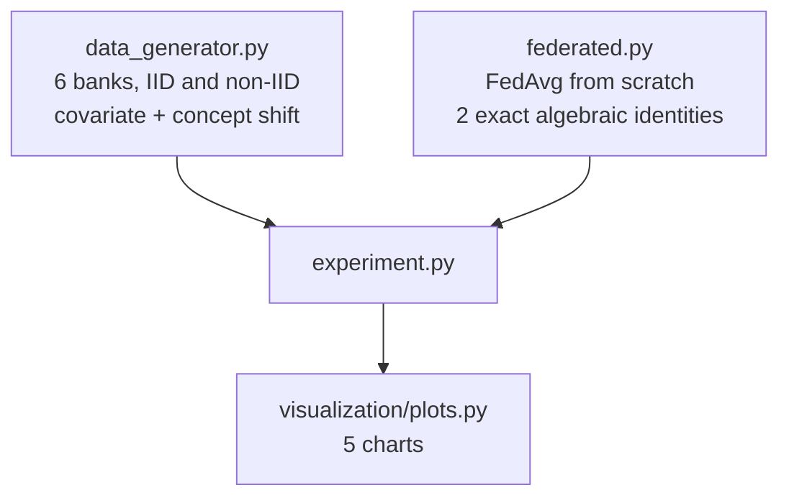

<div align="center">

# 🤝 Federated Credit Scoring

**FedAvg written from scratch and pinned to two exact algebraic identities, used to answer the question that matters more than ranking in credit risk: not "does my model order applicants correctly", but "does it know the right *level* of risk for a population it never saw" — and it doesn't, unless something like federation lets it learn from more than its own customers**

🌐 **[English](README.md)** | **[Español](README.es.md)**

[](https://www.python.org/)
[](src/federated.py)
[](src/federated.py)
[](https://scikit-learn.org/)
[](tests/)
[](../LICENSE)

</div>

---

## Why I built it this way

Bank secrecy law is not a technicality a credit-risk model can route around.
A regional bank specialising in micro-loans to informal-sector borrowers
cannot hand its customer data to a mining-region bank, or to a consortium
trying to build a better national scorecard — and neither should want to.
Each bank is left training on its own slice of the market, and that slice is
never representative of the population its model will eventually score.

Federated learning is the answer that respects the constraint instead of
wishing it away: banks never share data, only model updates, aggregated by a
coordinator that never sees a single raw record. This project implements
**FedAvg** (McMahan et al., 2017) from scratch for a logistic-regression
scorecard, and then asks the question a demo rarely bothers to check: *does
it actually work*, and *what does "not sharing data" cost*, measured against
the two things that matter in practice — how well the model ranks applicants,
and whether it gets their risk *level* right.

## What the project builds

Client-side local gradient descent, server-side weighted aggregation over
communication rounds — and two identities the implementation is pinned to
exactly, not approximately:

- **One client**: averaging one thing does nothing, so FedAvg with `E` local
  epochs over `R` rounds has to equal plain gradient descent for `R×E`
  epochs on that client's own data.
- **`E = 1`**: when every client takes exactly one gradient step before the
  server averages, the size-weighted average of per-client gradients is
  algebraically identical to the gradient on the pooled data — so FedAvg
  with one local step per round has to equal centralized gradient descent on
  everyone's data combined, regardless of how unevenly sized the clients are.

Six simulated banks, two heterogeneity regimes (IID and non-IID, the second
combining realistic covariate shift — different regions, different
customers — with a moderate, plausible concept shift in how each bank's debt
burden translates into risk), and three training policies compared on the
same footing: **local-only** (each bank trains on nothing but its own book),
**federated** (FedAvg, raw data never centralized), and a **centralized
oracle** (as if the data could be pooled — impossible under the law this
project takes seriously, kept only as an upper bound).

## Results from an actual run

`python run_pipeline.py` — 7,000 applicants across 6 banks, 200 local
epochs of computation budget per policy so every comparison uses the same
amount of work.

### The finding: ranking barely moves, calibration breaks



*Left: each bank's *own* model, trained only on its own customers, applied to
the **national** population it never saw. Right: the same comparison averaged
across banks, by policy. One bank's calibration bias is off the chart.*

| Policy | National AUC | Brier | Calibration bias |
|---|---|---|---|
| Local-only (average) | 0.7757 | 0.1715 | **+4.45 pp** |
| **Federated (FedAvg)** | **0.7797** | **0.1582** | **+0.18 pp** |
| Centralized oracle | 0.7795 | 0.1582 | +0.46 pp |

The AUC gap between local-only and federated is real but small (0.7757 vs.
0.7797) — a model trained on 1,000 of a bank's own customers still ranks
reasonably well nationally, because the dominant risk drivers (delinquency
history, utilisation) point the same direction everywhere. **Calibration is
where local-only actually breaks**: on average it overstates national risk by
4.45 points, and one bank alone accounts for most of it —
`Banco_Microcredito_Informal`, trained on a high-informality, high-risk
micro-loan population, predicts a **52.22% average PD for the national
population** whose true rate is 27.6%: a **24.6-percentage-point**
miscalibration. Its AUC on that same national population is 0.7677 —
perfectly reasonable-looking. **AUC alone would never catch this.** For
provisioning or pricing, where the actual PD level is what enters the
formula, that gap is the entire difference between a defensible number and a
badly wrong one.

### Updates leak information, even though data never does



*Cosine similarity between each bank's very first model update, before any
raw data was ever shared. In IID (left), every pair sits above 0.98 — no
bank stands out. In non-IID (right), `Banco_Microcredito_Informal`'s update
has **negative** cosine similarity with every other bank's — its gradient
points in essentially the opposite direction. A curious coordinator, without
ever touching that bank's data, could tell from the first round alone that
this participant serves a fundamentally different population.*

### The communication dial: more local computation isn't free



*Same total computation budget, redistributed across fewer, heavier rounds
of local training before each synchronisation. AUC (left) is nearly flat.
Calibration bias (right) is not: it bottoms out around 10 local epochs per
round and roughly triples by 40 — client drift, exactly as the federated
learning literature describes it, showing up as a miscalibrated *level*
rather than a ranking failure.*

## Honest findings

- **Pure covariate shift alone did not produce a dramatic gap.** An earlier
  version of this project gave every bank a different *population* but kept
  the true risk relationship identical everywhere, reasoning that federated
  learning's hard case is heterogeneity across data silos. It wasn't hard
  enough: a correctly specified logistic model trained on any sufficiently
  varied few thousand cases from a covariate-shifted population still
  consistently estimates the *same* underlying coefficients — local-only and
  federated came out statistically indistinguishable. The revealing case
  needed **concept shift** too (each bank's debt-burden coefficient and base
  rate genuinely differing, reflecting real differences in collateral
  policy and underwriting culture) — which is also the more realistic
  description of why credit models differ across institutions in practice.
- **AUC is the wrong lens for this problem, and it took building the wrong
  chart first to see that.** The first version of this comparison reported
  only discrimination metrics and found federated barely ahead of
  local-only. Calibration bias — the number provisioning and pricing
  formulas actually consume — showed the real, dramatic effect the ranking
  metric was hiding.
- **The client-drift pattern in the epochs sweep is non-monotone, not a
  clean "more local computation is always worse".** Calibration bias is
  lowest around 10 local epochs per round, not at the most frequent
  synchronization (E=1, 0.461 pp) — this project doesn't have a settled
  account of why, and reports the curve as measured rather than smoothing it
  into a tidier story than the data supports.
- **A curious server can profile a participant from its updates alone.**
  This isn't a formal privacy guarantee — it's a measured demonstration that
  "the data never left the client" is not the same claim as "nothing about
  the client leaked." Combining federated training with the kind of
  per-example differential privacy built in project 08 is the natural next
  layer; this project measures the gap DP would need to close, rather than
  closing it.

## Architecture



| Module | What it does |
|---|---|
| [`src/federated.py`](src/federated.py) | Local full-batch gradient descent, FedAvg's size-weighted server aggregation, and the two identities (single-client and E=1) that pin the implementation to something checkable rather than merely plausible. |
| [`src/data_generator.py`](src/data_generator.py) | Six banks with distinct regional/segment populations, IID and non-IID versions, the latter combining covariate shift with a declared, moderate concept shift per bank. |
| [`src/experiment.py`](src/experiment.py) | Local-only vs. federated vs. centralized-oracle comparison, evaluated nationally on both AUC and calibration, the local-epochs sweep, and the first-round update-similarity fingerprint. |

## Running it

```bash
python -m venv venv
venv\Scripts\activate            # Windows;  source venv/bin/activate on Linux/macOS
pip install -r requirements.txt

python run_pipeline.py           # everything end to end (~15 s)
pytest -q                        # 26 tests
```

| Chart | Shows |
|---|---|
| `calibracion_por_banco.png` | Each bank's own model's national calibration bias, and the three-policy comparison |
| `comparacion_politicas.png` | AUC and Brier score, IID vs. non-IID, all three policies |
| `similitud_updates.png` | First-round update cosine similarity, IID vs. non-IID |
| `barrido_epocas_locales.png` | AUC and calibration bias against local epochs per round |
| `historia_convergencia.png` | How far local models drift from the global model each round, IID vs. non-IID |

## Tests

26 tests (`pytest -q`). The two exact identities are checked to `1e-9`–`1e-10`
absolute tolerance, including with deliberately unequal client sizes and with
all clients holding identical data (both reduce FedAvg to plain gradient
descent, and the tests require it exactly, not approximately). The analytic
gradient is checked against finite differences. The central findings are
pinned directly: the IID scenario's default rates and DTI-risk relationship
must stay close across banks while the non-IID scenario's must differ by more
than 3× the IID spread; federated calibration bias must be smaller than
local-only's; the worst-calibrated local bank must be
`Banco_Microcredito_Informal`; and its first-round update similarity to every
other bank must be lower than the other banks' similarity to each other — in
non-IID only, not in IID.

## Scope

Synthetic data, deliberately: the "federated recovers near-oracle
calibration" claim and the exact gradient identities are only checkable
against a known generating process. The concept-shift magnitudes
(`DESVIO_CONCEPTO_NO_IID`) are declared, plausible assumptions about how
underwriting differs across institutions, not a claim about any real bank.

## Author

Pablo Reyes — [github.com/Rxyxs](https://github.com/Rxyxs)
Code: MIT — see [LICENSE](../LICENSE)
