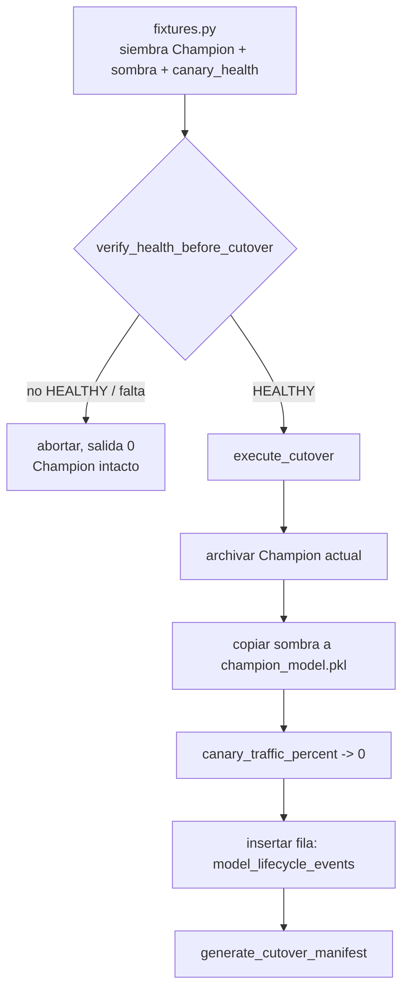

<div align="center">

# 🚦 Conmutación Completa a Champion

**El último paso del ciclo de vida de un modelo, construido para que un cutover fallido nunca deje el sistema en un estado ambiguo: orden archivar-antes-de-sobrescribir, un rastro de auditoría inmutable en DuckDB, y un CLI que trata "no habia nada que promover" como una salida limpia, no un error**

🌐 **[English](README.md)** | **[Español](README.es.md)**

[](https://www.python.org/)
[](https://duckdb.org/)
[](tests/)
[](../LICENSE)

</div>

---

## Por qué lo construí así

Un cutover es la operación del ciclo de vida de un modelo donde "funcionó
a medias" es peor que funcionar por completo o negarse por completo a
correr. Si sobrescribe el Champion activo antes de archivar el anterior,
un paso de copia que falla destruye el único modelo conocido-bueno sin
nada a lo cual volver. Si escribe el modelo nuevo pero olvida bajar el
porcentaje de tráfico canario a cero, el laboratorio queda enrutando
tráfico de producción hacia un modelo que ya no existe en la versión que
la config espera. Y si no puede distinguir "el candidato todavia no esta
sano" de "el programa de promoción se cayó", cada cutover fallido empieza
a parecer un incidente.

`CutoverManager` se construye alrededor de una sola regla: nada se
sobrescribe antes de que lo que reemplaza este archivado de forma segura o
demostrablemente no se necesite en otro lado, y cada promoción — exitosa o
abortada limpiamente — es algo que una persona puede reconstruir despues a
partir del estado en disco y un registro inmutable, sin tener que confiar
en que "imprimio un mensaje de exito" fue toda la verdad.

## Qué construye el proyecto

Dos métodos, deliberadamente separados para que el riesgoso nunca sea
alcanzable por accidente:

- **`verify_health_before_cutover`** es una puerta pura. Lee un reporte
  `canary_health_<timestamp>.json` y retorna `True` solo si
  `status == "HEALTHY"`. No toca nada más — ni el sistema de archivos, ni
  la base de datos — asi que llamarlo especulativamente siempre es seguro.
- **`execute_cutover`** hace la promoción real, en un orden elegido para
  que una caida a mitad de camino deje un estado reconstruible en vez de
  una pérdida silenciosa: archivar el Champion existente (si hay uno) →
  copiar el candidato sombra a la posición de Champion → bajar el
  porcentaje de tráfico canario a cero → escribir una fila inmutable en
  `model_lifecycle_events` en DuckDB.
- **`generate_cutover_manifest`** serializa exactamente lo que
  `execute_cutover` acaba de hacer — el mismo diccionario que entró a la
  base de datos — en `cutover_manifest_<timestamp>.json`, para que el
  rastro de auditoría exista tanto como tabla consultable como archivo
  plano al lado.

`run_cutover.py` envuelve ambos en un script que un scheduler podria llamar
sin supervisión: si la cohorte canaria no esta `HEALTHY`, o falta el
reporte, o no hay un modelo sombra activo para promover, registra por qué
y termina con código `0` — "no habia nada que conmutar" es un resultado
esperado, no una falla que requiera despertar a alguien.

Esta técnica es autocontenida, como todas las demás en este laboratorio:
no existe una carpeta `19-canary-monitoring/` de la cual depender, asi que
[`src/fixtures.py`](src/fixtures.py) genera ella misma el estado previo —
un Champion sembrado, un modelo candidato sombra, y un reporte
`canary_health` en cualquiera de los dos estados — para que la lógica del
cutover se pueda ejercitar y verificar de punta a punta sin inventar una
dependencia hacia técnicas que no son parte de este proyecto.

## Resultados de una corrida real

```bash
python run_cutover.py
```

contra un estado `HEALTHY` recien sembrado produce:

```json
{
  "event_id": "d9a6bc24-050a-4296-9808-d1e3871d58d8",
  "event_type": "FULL_CUTOVER",
  "previous_champion": "champion_archive_20260930T013708757020Z.pkl",
  "new_champion": "champion_model.pkl",
  "promoted_at": "2026-09-30T01:37:08.757020+00:00",
  "champion_path": ".../models/champion/champion_model.pkl",
  "archived_path": ".../models/archive/champion_archive_20260930T013708757020Z.pkl",
  "shadow_model_path": ".../models/shadow/active_shadow_model.pkl",
  "canary_config_path": ".../models/canary_config.json",
  "db_path": ".../lab_lifecycle.duckdb"
}
```

y la fila correspondiente llega a `model_lifecycle_events`;
`canary_config.json` queda con `canary_traffic_percent: 0`. Corriendolo de
nuevo contra un reporte `ROLLBACK_TRIGGERED`:

```
WARNING: Estado canario 'ROLLBACK_TRIGGERED' (se esperaba HEALTHY) en ...; cutover abortado.
INFO: Cutover abortado: la cohorte canaria no esta HEALTHY (o falta el reporte). El Champion activo no fue modificado.
```

termina con código `0`, y el Champion en disco queda idéntico byte a byte.

## Hallazgos honestos

- **Los timestamps con resolución de segundos colisionan en silencio.** La
  primera version de `execute_cutover` nombraba los archivos
  `champion_archive_<timestamp>.pkl` con un timestamp de precisión de
  segundos. Dos cutover dentro del mismo segundo — exactamente lo que hace
  una suite de pruebas — le daban al segundo llamado el mismo nombre de
  archivo que al primero, sobrescribiendo en silencio el primer Champion
  archivado. Se corrigio derivando el nombre del archivo y `promoted_at`
  del mismo timestamp con precision de microsegundos. Lo atrapo
  `test_cutover_repetido_archiva_cada_champion_anterior_por_separado`, que
  verifica que existan dos archivos distintos — fallaba con un solo
  archivo antes de la correccion.
- **La verificacion de salud y la ejecucion estan separadas a proposito, y
  eso cuesta un llamado extra en cada invocador.** Seria marginalmente mas
  conveniente que `execute_cutover` verificara la salud ella misma.
  Mantenerlo afuera permite que la puerta se pruebe, se registre y se
  razone de forma completamente independiente de todo lo que muta estado —
  vale la linea extra en `run_cutover.py`.

## Arquitectura



| Módulo | Qué hace |
|---|---|
| [`src/cutover_manager.py`](src/cutover_manager.py) | `CutoverManager`: la puerta de salud, la secuencia archivar-promover-registrar, y el escritor del manifiesto. |
| [`src/fixtures.py`](src/fixtures.py) | Estado sembrado autocontenido: un Champion, un candidato sombra, una config canaria, y un reporte `canary_health` en cualquiera de los dos estados. |
| [`run_cutover.py`](run_cutover.py) | El CLI: resuelve el reporte de salud mas reciente, verifica que haya un modelo sombra activo, y corre el cutover o aborta limpiamente. |

## Cómo correrlo

```bash
python -m venv venv
venv\Scripts\activate            # Windows;  source venv/bin/activate en Linux/macOS
pip install -r requirements.txt

python run_cutover.py            # aborta limpiamente: aun no hay estado sembrado
pytest -v                        # 8 tests
```

Para ver una promoción real, primero siembra un estado `HEALTHY`:

```bash
python -c "from src.fixtures import sembrar_champion_y_sombra, escribir_reporte_salud; \
sembrar_champion_y_sombra('models'); escribir_reporte_salud('canary_monitoring_outputs', 'HEALTHY')"
python run_cutover.py
```

## Tests

8 tests (`pytest -v`), cada uno construyendo su propio estado de
laboratorio aislado bajo `tmp_path` en vez de compartir fixtures entre
pruebas: un cutover `HEALTHY` exitoso (el candidato se vuelve Champion, el
Champion anterior queda archivado byte a byte); la fila exacta en
`model_lifecycle_events` dentro de DuckDB; `ROLLBACK_TRIGGERED` y un
reporte faltante abortando ambos con el Champion intacto; la config
canaria volviendo a `0%` preservando sus demas campos; el manifiesto
coincidiendo exactamente con el resultado ejecutado; un `RuntimeError`
claro cuando se pide el manifiesto antes de correr un cutover; y dos
cutover en la misma prueba archivando dos archivos distintos en vez de que
uno sobrescriba al otro.

## Alcance

Autocontenida por diseño: `src/fixtures.py` simula lo que una etapa de
shadow-deploy y canary-monitoring habria producido, ya que esas etapas no
estan implementadas como técnicas separadas en este laboratorio.
`CutoverManager` en si no depende de cómo se produjo ese estado previo —
solo necesita un reporte de salud, un archivo de modelo sombra, y una
config canaria, asi que apuntarlo a artefactos reales en vez de a los
fixtures es cuestión de cambiar las rutas, no la lógica.

## Autor

Pablo Reyes — [github.com/Rxyxs](https://github.com/Rxyxs)
Código: MIT — ver [LICENSE](../LICENSE)
