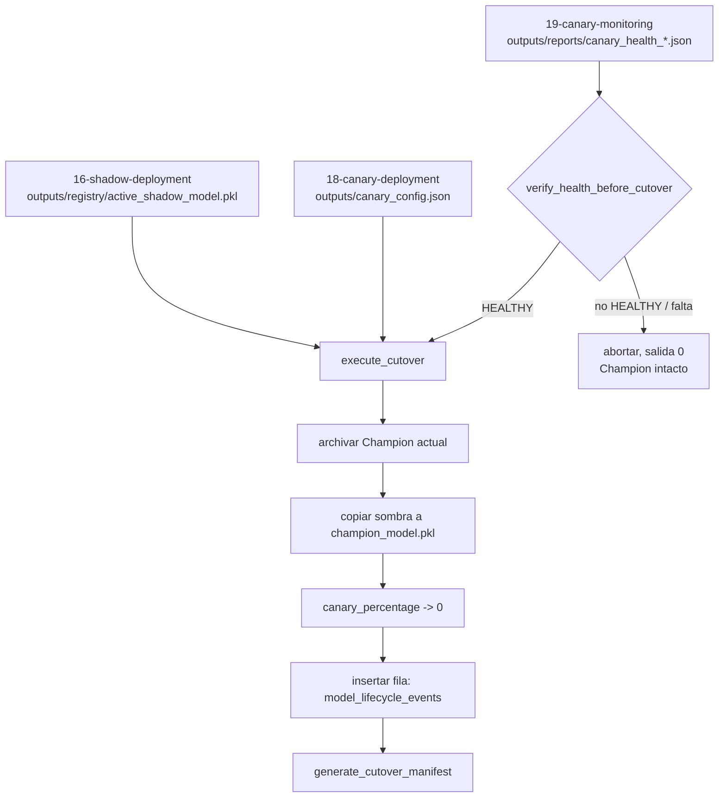

<div align="center">

# 🚦 Conmutación Completa a Champion

**El último paso del ciclo de vida de un modelo, construido para que un cutover fallido nunca deje el sistema en un estado ambiguo: orden archivar-antes-de-sobrescribir, un rastro de auditoría inmutable en DuckDB, y un CLI que trata "no habia nada que promover" como una salida limpia, no un error**

🌐 **[English](README.md)** | **[Español](README.es.md)**

[](https://www.python.org/)
[](https://duckdb.org/)
[](tests/)
[](../LICENSE)

</div>

---

## Por qué lo construí así

Un cutover es la operación del ciclo de vida de un modelo donde "funcionó
a medias" es peor que funcionar por completo o negarse por completo a
correr. Si sobrescribe el Champion activo antes de archivar el anterior,
un paso de copia que falla destruye el único modelo conocido-bueno sin
nada a lo cual volver. Si escribe el modelo nuevo pero olvida bajar el
porcentaje de tráfico canario a cero, el laboratorio queda enrutando
tráfico de producción hacia un modelo que ya no existe en la versión que
la config espera. Y si no puede distinguir "el candidato todavia no esta
sano" de "el programa de promoción se cayó", cada cutover fallido empieza
a parecer un incidente.

`CutoverManager` se construye alrededor de una sola regla: nada se
sobrescribe antes de que lo que reemplaza este archivado de forma segura o
demostrablemente no se necesite en otro lado, y cada promoción — exitosa o
abortada limpiamente — es algo que una persona puede reconstruir despues a
partir del estado en disco y un registro inmutable, sin tener que confiar
en que "imprimio un mensaje de exito" fue toda la verdad.

## Qué construye el proyecto

Dos métodos, deliberadamente separados para que el riesgoso nunca sea
alcanzable por accidente:

- **`verify_health_before_cutover`** es una puerta pura. Lee un reporte
  `canary_health_<timestamp>.json` y retorna `True` solo si
  `status == "HEALTHY"`. No toca nada más — ni el sistema de archivos, ni
  la base de datos — asi que llamarlo especulativamente siempre es
  seguro, e ignora todos los campos que no necesita: el reporte real de
  `19-canary-monitoring/` trae `null_rate`, `mean_score_diff`,
  `high_risk_proportion` y mas, ninguno de los cuales le importa a la
  puerta.
- **`execute_cutover`** hace la promoción real, en un orden elegido para
  que una caida a mitad de camino deje un estado reconstruible en vez de
  una pérdida silenciosa: archivar el Champion existente (si hay uno) →
  copiar el candidato sombra a la posición de Champion → bajar el
  porcentaje de tráfico canario a cero → escribir una fila inmutable en
  `model_lifecycle_events` en DuckDB.
- **`generate_cutover_manifest`** serializa exactamente lo que
  `execute_cutover` acaba de hacer — el mismo diccionario que entró a la
  base de datos — en `cutover_manifest_<timestamp>.json`, para que el
  rastro de auditoría exista tanto como tabla consultable como archivo
  plano al lado.

`run_cutover.py` envuelve ambos en un script que un scheduler podria llamar
sin supervisión: si la cohorte canaria no esta `HEALTHY`, o falta el
reporte, o no hay un modelo sombra activo para promover, registra por qué
y termina con código `0` — "no habia nada que conmutar" es un resultado
esperado, no una falla que requiera despertar a alguien.

Esta es la duodecima técnica de la cadena mlops de este laboratorio
(`12-drift-monitoring-psi-ks/` hasta `19-canary-monitoring/`), y — como
cada etapa de esa cadena — se integra por archivo, no por import: el
reporte de salud viene de `../19-canary-monitoring/outputs/reports/`, el
candidato sombra de `../16-shadow-deployment/outputs/registry/`, y
`canary_config.json` es exactamente el archivo que `../18-canary-deployment/`
lee y escribe. Ninguna de esas técnicas produjo nunca un `champion_model.pkl`
propio — `16-shadow-deployment` y `18-canary-deployment` lo señalan
explicitamente y reciben "el modelo que ya está sirviendo" como parametro
en vez de asumir donde vive — asi que esta es la primera etapa de la
cadena que persiste un artefacto de Champion, y de aca en mas es la fuente
de verdad de "que modelo esta sirviendo".

## Resultados de una corrida real

Sembrando estado real previo — un candidato registrado a traves del CLI
real de `16-shadow-deployment`, enrutado por el router canario real de
`18-canary-deployment`, evaluado por el monitor de salud real de
`19-canary-monitoring` — y luego:

```bash
python run_cutover.py
```

produce, en el primer cutover que esta cadena corrio jamas (todavia no
existia ningun Champion):

```json
{
  "event_id": "dfd5b490-7d73-4a90-aad8-7c8b2062f6be",
  "event_type": "FULL_CUTOVER",
  "previous_champion": null,
  "new_champion": "champion_model.pkl",
  "promoted_at": "2026-09-30T01:46:15.988213+00:00",
  "champion_path": "outputs/models/champion/champion_model.pkl",
  "archived_path": null,
  "shadow_model_path": "../16-shadow-deployment/outputs/registry/active_shadow_model.pkl",
  "canary_config_path": "../18-canary-deployment/outputs/canary_config.json",
  "db_path": "outputs/lab_lifecycle.duckdb"
}
```

y `../18-canary-deployment/outputs/canary_config.json` vuelve como
`{"canary_percentage": 0, "updated_at": "2026-09-30T01:46:15+00:00"}` — el
archivo exacto que el router canario lee antes de decidir como repartir
el trafico. Abriendo el canary de nuevo a 30% y corriendo un segundo
cutover contra un segundo reporte `HEALTHY` real muestra la ruta de
archivado funcionando de verdad, no solo en una prueba:
`previous_champion` vuelve como
`champion_archive_20260930T014633176211Z.pkl`, y ese archivo existe,
idéntico byte a byte a lo que un momento antes era el Champion. Apuntando
`--health-report-path` a un reporte `ROLLBACK_TRIGGERED` en cambio:

```
WARNING: Estado canario 'ROLLBACK_TRIGGERED' (se esperaba HEALTHY) en ...; cutover abortado.
INFO: Cutover abortado: la cohorte canaria no esta HEALTHY (o falta el reporte). El Champion activo no fue modificado.
```

termina con código `0`, y el Champion en disco queda idéntico byte a byte.

## Hallazgos honestos

- **El nombre de campo que elegi primero para el split canario estaba mal,
  y solo lo descubri corriendo de verdad las tecnicas vecinas.** La
  primera version de esta tecnica escribia `canary_traffic_percent` en
  `canary_config.json` — un nombre que inventé porque construí esta
  técnica asumiendo que `18-canary-deployment` y `19-canary-monitoring`
  todavia no existian en este laboratorio. Si existen: ambas usan de
  verdad `canary_percentage`. Escribir el campo con el nombre equivocado
  no habria roto ninguna prueba de esta carpeta — habria producido en
  silencio un archivo de config que el propio CLI de la tecnica 18 no
  podria leer correctamente, descubierto recien en producción. Corregido
  una vez que se verificaron las tecnicas vecinas reales, en vez de
  asumirlas.
- **Los timestamps con resolución de segundos colisionan en silencio.** La
  primera version de `execute_cutover` nombraba los archivos
  `champion_archive_<timestamp>.pkl` con un timestamp de precisión de
  segundos. Dos cutover dentro del mismo segundo — exactamente lo que hace
  una suite de pruebas — le daban al segundo llamado el mismo nombre de
  archivo que al primero, sobrescribiendo en silencio el primer Champion
  archivado. Se corrigio derivando el nombre del archivo y `promoted_at`
  del mismo timestamp con precision de microsegundos. Lo atrapo
  `test_cutover_repetido_archiva_cada_champion_anterior_por_separado`, que
  verifica que existan dos archivos distintos — fallaba con un solo
  archivo antes de la correccion.
- **Un 0% de cutover y un 0% de rollback se ven identicos si no se tiene
  cuidado, y significan lo opuesto.** `18-canary-deployment` escribe
  `{"rollback": true, "rollback_reason": ...}` junto a `canary_percentage:
  0` cuando fuerza un rollback de emergencia. Un cutover que llega a 0% es
  la situación opuesta — el candidato ganó, no perdió — asi que
  `execute_cutover` reemplaza el archivo de config por completo en vez de
  fusionarlo, para que un `rollback: true` de un incidente pasado nunca
  sobreviva a una promoción exitosa.
- **La verificacion de salud y la ejecucion estan separadas a proposito, y
  eso cuesta un llamado extra en cada invocador.** Seria marginalmente mas
  conveniente que `execute_cutover` verificara la salud ella misma.
  Mantenerlo afuera permite que la puerta se pruebe, se registre y se
  razone de forma completamente independiente de todo lo que muta estado —
  vale la linea extra en `run_cutover.py`.

## Arquitectura



| Módulo | Qué hace |
|---|---|
| [`src/cutover_manager.py`](src/cutover_manager.py) | `CutoverManager`: la puerta de salud, la secuencia archivar-promover-registrar, y el escritor del manifiesto. |
| [`src/fixtures.py`](src/fixtures.py) | Estado sembrado solo para pruebas (un Champion, un candidato sombra, una config canaria, un reporte `canary_health`) construido bajo `tmp_path`, con el mismo esquema de archivo que usan las tecnicas reales previas. |
| [`run_cutover.py`](run_cutover.py) | El CLI: resuelve el reporte de salud real mas reciente de `19-canary-monitoring/`, el modelo sombra activo de `16-shadow-deployment/`, y la config canaria de `18-canary-deployment/`, y corre el cutover o aborta limpiamente. |

## Cómo correrlo

```bash
python -m venv venv
venv\Scripts\activate            # Windows;  source venv/bin/activate en Linux/macOS
pip install -r requirements.txt

python run_cutover.py            # aborta limpiamente si 16/18/19 aun no produjeron estado real
pytest -v                        # 10 tests
```

Un cutover real necesita que `16-shadow-deployment`, `18-canary-deployment`
y `19-canary-monitoring` hayan producido de verdad sus artefactos primero
(sus propios README muestran como); `pytest -v` en esta carpeta no
necesita nada de eso — construye su propio estado aislado por prueba con
[`src/fixtures.py`](src/fixtures.py).

## Tests

10 tests (`pytest -v`), cada uno construyendo su propio estado de
laboratorio aislado bajo `tmp_path` en vez de compartir fixtures entre
pruebas: un cutover `HEALTHY` exitoso (el candidato se vuelve Champion, el
Champion anterior queda archivado byte a byte); la fila exacta en
`model_lifecycle_events` dentro de DuckDB; `ROLLBACK_TRIGGERED` y un
reporte faltante abortando ambos con el Champion intacto; la config
canaria volviendo a `0%` con el campo real `canary_percentage`; un
`rollback: true` de un incidente previo que no sobrevive a un cutover
exitoso; el manifiesto coincidiendo exactamente con el resultado
ejecutado; un `RuntimeError` claro cuando se pide el manifiesto antes de
correr un cutover; dos cutover en la misma prueba archivando dos archivos
distintos en vez de que uno sobrescriba al otro; y la puerta de salud
ignorando los campos extra (`null_rate`, `mean_score_diff`, ...) que trae
el reporte real de `19-canary-monitoring` junto a `status`.

## Alcance

Verificada contra las tecnicas vecinas reales, no solo contra sus propios
fixtures: los resultados de arriba vienen de correr de verdad
`16-shadow-deployment/run_shadow_serving.py`,
`18-canary-deployment/run_canary.py` y
`19-canary-monitoring/run_health_check.py` en secuencia, y luego apuntar
el CLI de esta tecnica a sus archivos de salida reales. `src/fixtures.py`
existe solo para la suite de pruebas, asi que `pytest` no requiere que el
resto de la cadena haya corrido antes.

## Autor

Pablo Reyes — [github.com/Rxyxs](https://github.com/Rxyxs)
Código: MIT — ver [LICENSE](../LICENSE)
