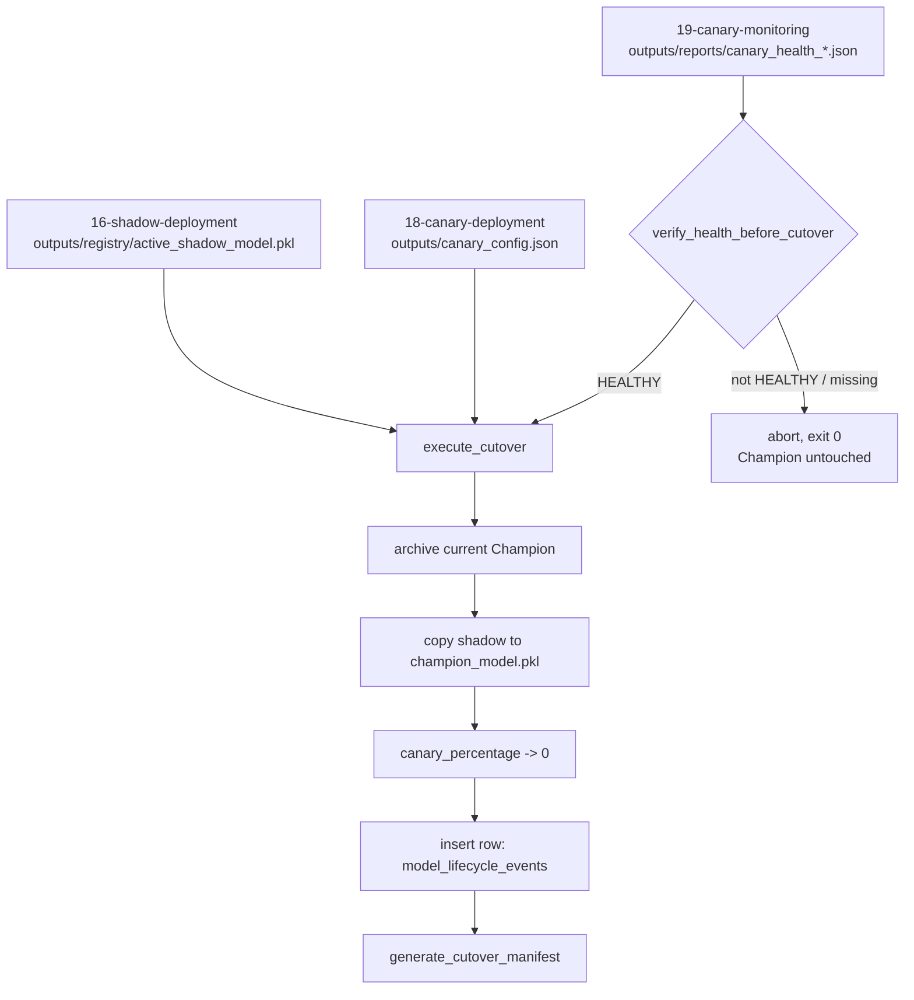

<div align="center">

# 🚦 Full Promotion Cutover

**The last step of a model's lifecycle, engineered so a failed cutover never leaves the system in an ambiguous state: archive-then-overwrite ordering, an immutable DuckDB audit trail, and a CLI that treats "nothing to promote" as a clean exit, not an error**

🌐 **[English](README.md)** | **[Español](README.es.md)**

[](https://www.python.org/)
[](https://duckdb.org/)
[](tests/)
[](../LICENSE)

</div>

---

## Why I built it this way

A cutover is the one operation in a model's lifecycle where "mostly worked"
is worse than either fully succeeding or fully refusing to run. If it
overwrites the active Champion before archiving the old one, a bad copy
step destroys the only known-good model with nothing to roll back to. If
it writes the new model but forgets to zero out the canary traffic split,
the lab ends up routing production traffic to a model that no longer
exists at the version the config expects. And if it can't tell "the
candidate isn't healthy yet" apart from "the promotion program crashed",
every failed cutover starts looking like an incident.

`CutoverManager` is built around one rule: nothing is overwritten before
whatever it replaces is either safely archived or provably not needed
elsewhere, and every promotion — success or clean abort — is something a
human can reconstruct afterward from disk state and an immutable log,
without having to trust that "it printed a success message" was the whole
truth.

## What the project builds

Two methods, deliberately separated so the risky one is never reachable
by accident:

- **`verify_health_before_cutover`** is a pure gate. It reads a
  `canary_health_<timestamp>.json` report and returns `True` only if
  `status == "HEALTHY"`. It touches nothing else — not the filesystem, not
  the database — so calling it speculatively is always safe, and it
  ignores every field it doesn't need: the real report from
  `19-canary-monitoring/` carries `null_rate`, `mean_score_diff`,
  `high_risk_proportion` and more, none of which the gate cares about.
- **`execute_cutover`** does the actual promotion, in an order chosen so a
  crash mid-way leaves a reconstructable state rather than a silent loss:
  archive the existing Champion (if any) → copy the shadow candidate into
  the Champion slot → zero out the canary traffic percentage → write one
  immutable row to `model_lifecycle_events` in DuckDB.
- **`generate_cutover_manifest`** serializes exactly what
  `execute_cutover` just did — the same dict that went into the database —
  to `cutover_manifest_<timestamp>.json`, so the audit trail exists both as
  a queryable table and as a plain file next to it.

`run_cutover.py` wraps both into a script that a scheduler could call
unattended: if the canary isn't `HEALTHY`, or the report is missing, or
there's no active shadow model to promote, it logs why and exits `0` —
"there was nothing to cut over" is an expected outcome, not a failure the
caller needs to page someone about.

This is the twelfth technique in this lab's mlops chain
(`12-drift-monitoring-psi-ks/` through `19-canary-monitoring/`), and — like
every stage in that chain — it integrates by file, not by import: the
health report comes from `../19-canary-monitoring/outputs/reports/`, the
shadow candidate from `../16-shadow-deployment/outputs/registry/`, and
`canary_config.json` is the exact file `../18-canary-deployment/` reads
and writes. None of those techniques ever produced a `champion_model.pkl`
of their own — `16-shadow-deployment` and `18-canary-deployment` both note
explicitly that no earlier stage does, and take "the model already
serving" as a parameter instead — so this is the first stage in the chain
that persists a Champion artifact at all, and from here on it's the
source of truth for "what model is serving".

## Results from an actual run

Seeding real upstream state — a candidate registered through
`16-shadow-deployment`'s actual CLI, routed through
`18-canary-deployment`'s actual canary router, evaluated by
`19-canary-monitoring`'s actual health monitor — and then:

```bash
python run_cutover.py
```

produces, on the very first cutover this chain has ever run (no Champion
existed yet):

```json
{
  "event_id": "dfd5b490-7d73-4a90-aad8-7c8b2062f6be",
  "event_type": "FULL_CUTOVER",
  "previous_champion": null,
  "new_champion": "champion_model.pkl",
  "promoted_at": "2026-09-30T01:46:15.988213+00:00",
  "champion_path": "outputs/models/champion/champion_model.pkl",
  "archived_path": null,
  "shadow_model_path": "../16-shadow-deployment/outputs/registry/active_shadow_model.pkl",
  "canary_config_path": "../18-canary-deployment/outputs/canary_config.json",
  "db_path": "outputs/lab_lifecycle.duckdb"
}
```

and `../18-canary-deployment/outputs/canary_config.json` comes back as
`{"canary_percentage": 0, "updated_at": "2026-09-30T01:46:15+00:00"}` — the
exact file the canary router itself reads before deciding how to split
traffic. Opening the canary back up to 30% and running a second cutover
against a second real `HEALTHY` report shows the archive path working for
real, not just in a test: `previous_champion` comes back as
`champion_archive_20260930T014633176211Z.pkl`, and that file exists,
byte-for-byte identical to what was the Champion a moment before. Pointing
`--health-report-path` at a `ROLLBACK_TRIGGERED` report instead:

```
WARNING: Estado canario 'ROLLBACK_TRIGGERED' (se esperaba HEALTHY) en ...; cutover abortado.
INFO: Cutover abortado: la cohorte canaria no esta HEALTHY (o falta el reporte). El Champion activo no fue modificado.
```

exits `0`, and the Champion on disk is byte-for-byte unchanged.

## Honest findings

- **The field name I picked first for the canary split was wrong, and I
  only found out by actually running the neighboring techniques.** The
  first version of this technique wrote `canary_traffic_percent` to
  `canary_config.json` — a name I invented because I built this technique
  assuming `18-canary-deployment` and `19-canary-monitoring` didn't exist
  yet in this lab. They do: both really use `canary_percentage`. Writing
  the field under the wrong name wouldn't have broken any test in this
  folder — it would have silently produced a config file `18`'s own CLI
  couldn't read correctly, discovered only in production. Fixed once the
  real neighboring techniques were checked against, not assumed.
- **Second-resolution timestamps silently collide.** The first version of
  `execute_cutover` named archives `champion_archive_<timestamp>.pkl` with
  a seconds-precision timestamp. Two cutovers inside the same second —
  exactly what a test suite does — gave the second call the same archive
  filename as the first, silently overwriting the first archived Champion.
  Fixed by deriving the archive name and `promoted_at` from the same
  microsecond-precision timestamp. Caught by
  `test_cutover_repetido_archiva_cada_champion_anterior_por_separado`,
  which asserts two distinct archive files exist — it failed with one file
  before the fix.
- **A cutover's 0% and a rollback's 0% look identical unless you're
  careful, and they mean opposite things.** `18-canary-deployment` writes
  `{"rollback": true, "rollback_reason": ...}` alongside `canary_percentage:
  0` when it forces an emergency rollback. A cutover reaching 0% is the
  opposite situation — the candidate won, not lost — so `execute_cutover`
  fully replaces the config file instead of merging into it, so a stale
  `rollback: true` from a past incident can never survive into a
  successful promotion's config.
- **The health check and the execution are split on purpose, and it costs
  an extra call in every caller.** It would be marginally more convenient
  for `execute_cutover` to check health itself. Keeping it out means the
  gate can be tested, logged, and reasoned about completely independently
  of anything that mutates state — worth the extra line in `run_cutover.py`.

## Architecture



| Module | What it does |
|---|---|
| [`src/cutover_manager.py`](src/cutover_manager.py) | `CutoverManager`: the health gate, the archive-then-promote-then-log sequence, and the manifest writer. |
| [`src/fixtures.py`](src/fixtures.py) | Test-only seed state (a Champion, a shadow candidate, a canary config, a `canary_health` report) built under `tmp_path`, with the same file schema the real upstream techniques use. |
| [`run_cutover.py`](run_cutover.py) | The CLI: resolves the latest real health report from `19-canary-monitoring/`, the active shadow model from `16-shadow-deployment/`, and the canary config from `18-canary-deployment/`, then runs the cutover or aborts cleanly. |

## Running it

```bash
python -m venv venv
venv\Scripts\activate            # Windows;  source venv/bin/activate on Linux/macOS
pip install -r requirements.txt

python run_cutover.py            # aborts cleanly if 16/18/19 haven't produced real state yet
pytest -v                        # 10 tests
```

A real cutover needs `16-shadow-deployment`, `18-canary-deployment` and
`19-canary-monitoring` to have actually produced their artifacts first
(their own READMEs show how); `pytest -v` in this folder doesn't need any
of that — it builds its own isolated state per test with
[`src/fixtures.py`](src/fixtures.py).

## Tests

10 tests (`pytest -v`), each building its own isolated laboratory state
under `tmp_path` rather than sharing fixtures across tests: a successful
`HEALTHY` cutover (candidate becomes Champion, previous Champion archived
byte for byte); the exact `model_lifecycle_events` row landing in DuckDB;
`ROLLBACK_TRIGGERED` and a missing report both aborting with the Champion
left untouched; the canary config returning to `0%` with the real
`canary_percentage` field; a stale `rollback: true` from a prior incident
not surviving a successful cutover; the manifest matching the executed
result exactly; a clear `RuntimeError` when the manifest is requested
before any cutover ran; two cutovers in the same test archiving two
distinct files rather than one overwriting the other; and the health gate
ignoring the extra fields (`null_rate`, `mean_score_diff`, ...) that the
real report from `19-canary-monitoring` carries alongside `status`.

## Scope

Verified against the real neighboring techniques, not just its own
fixtures: the results above come from actually running
`16-shadow-deployment/run_shadow_serving.py`,
`18-canary-deployment/run_canary.py` and
`19-canary-monitoring/run_health_check.py` in sequence, then pointing this
technique's CLI at their real output files. `src/fixtures.py` exists only
for the test suite, so `pytest` doesn't require the rest of the chain to
have run first.

## Author

Pablo Reyes — [github.com/Rxyxs](https://github.com/Rxyxs)
Code: MIT — see [LICENSE](../LICENSE)
