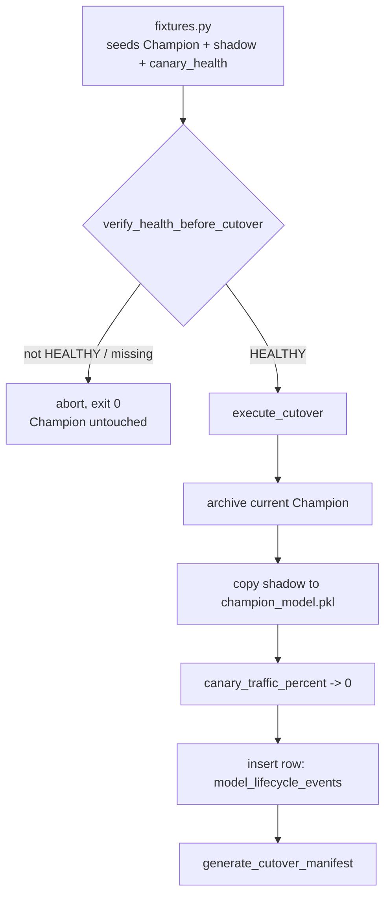

<div align="center">

# 🚦 Full Promotion Cutover

**The last step of a model's lifecycle, engineered so a failed cutover never leaves the system in an ambiguous state: archive-then-overwrite ordering, an immutable DuckDB audit trail, and a CLI that treats "nothing to promote" as a clean exit, not an error**

🌐 **[English](README.md)** | **[Español](README.es.md)**

[](https://www.python.org/)
[](https://duckdb.org/)
[](tests/)
[](../LICENSE)

</div>

---

## Why I built it this way

A cutover is the one operation in a model's lifecycle where "mostly worked"
is worse than either fully succeeding or fully refusing to run. If it
overwrites the active Champion before archiving the old one, a bad copy
step destroys the only known-good model with nothing to roll back to. If
it writes the new model but forgets to zero out the canary traffic split,
the lab ends up routing production traffic to a model that no longer
exists at the version the config expects. And if it can't tell "the
candidate isn't healthy yet" apart from "the promotion program crashed",
every failed cutover starts looking like an incident.

`CutoverManager` is built around one rule: nothing is overwritten before
whatever it replaces is either safely archived or provably not needed
elsewhere, and every promotion — success or clean abort — is something a
human can reconstruct afterward from disk state and an immutable log,
without having to trust that "it printed a success message" was the whole
truth.

## What the project builds

Two methods, deliberately separated so the risky one is never reachable
by accident:

- **`verify_health_before_cutover`** is a pure gate. It reads a
  `canary_health_<timestamp>.json` report and returns `True` only if
  `status == "HEALTHY"`. It touches nothing else — not the filesystem, not
  the database — so calling it speculatively is always safe.
- **`execute_cutover`** does the actual promotion, in an order chosen so a
  crash mid-way leaves a reconstructable state rather than a silent loss:
  archive the existing Champion (if any) → copy the shadow candidate into
  the Champion slot → zero out the canary traffic percentage → write one
  immutable row to `model_lifecycle_events` in DuckDB.
- **`generate_cutover_manifest`** serializes exactly what
  `execute_cutover` just did — the same dict that went into the database —
  to `cutover_manifest_<timestamp>.json`, so the audit trail exists both as
  a queryable table and as a plain file next to it.

`run_cutover.py` wraps both into a script that a scheduler could call
unattended: if the canary isn't `HEALTHY`, or the report is missing, or
there's no active shadow model to promote, it logs why and exits `0` —
"there was nothing to cut over" is an expected outcome, not a failure the
caller needs to page someone about.

This technique is self-contained, like every other one in this lab: there
is no `19-canary-monitoring/` folder for it to depend on, so
[`src/fixtures.py`](src/fixtures.py) generates the upstream state itself —
a seeded Champion, a candidate shadow model, and a `canary_health` report
in either state — so the cutover logic can be exercised and verified end
to end without inventing a dependency on techniques that aren't part of
this project.

## Results from an actual run

```bash
python run_cutover.py
```

against a freshly seeded `HEALTHY` state produces:

```json
{
  "event_id": "d9a6bc24-050a-4296-9808-d1e3871d58d8",
  "event_type": "FULL_CUTOVER",
  "previous_champion": "champion_archive_20260930T013708757020Z.pkl",
  "new_champion": "champion_model.pkl",
  "promoted_at": "2026-09-30T01:37:08.757020+00:00",
  "champion_path": ".../models/champion/champion_model.pkl",
  "archived_path": ".../models/archive/champion_archive_20260930T013708757020Z.pkl",
  "shadow_model_path": ".../models/shadow/active_shadow_model.pkl",
  "canary_config_path": ".../models/canary_config.json",
  "db_path": ".../lab_lifecycle.duckdb"
}
```

and the matching row lands in `model_lifecycle_events`; `canary_config.json`
comes back out with `canary_traffic_percent: 0`. Re-running against a
`ROLLBACK_TRIGGERED` report instead:

```
WARNING: Estado canario 'ROLLBACK_TRIGGERED' (se esperaba HEALTHY) en ...; cutover abortado.
INFO: Cutover abortado: la cohorte canaria no esta HEALTHY (o falta el reporte). El Champion activo no fue modificado.
```

exits `0`, and the Champion on disk is byte-for-byte unchanged.

## Honest findings

- **Second-resolution timestamps silently collide.** The first version of
  `execute_cutover` named archives `champion_archive_<timestamp>.pkl` with
  a seconds-precision timestamp. Two cutovers inside the same second —
  exactly what a test suite does — gave the second call the same archive
  filename as the first, silently overwriting the first archived Champion.
  Fixed by deriving the archive name and `promoted_at` from the same
  microsecond-precision timestamp. Caught by
  `test_cutover_repetido_archiva_cada_champion_anterior_por_separado`,
  which asserts two distinct archive files exist — it failed with one file
  before the fix.
- **The health check and the execution are split on purpose, and it costs
  an extra call in every caller.** It would be marginally more convenient
  for `execute_cutover` to check health itself. Keeping it out means the
  gate can be tested, logged, and reasoned about completely independently
  of anything that mutates state — worth the extra line in `run_cutover.py`.

## Architecture



| Module | What it does |
|---|---|
| [`src/cutover_manager.py`](src/cutover_manager.py) | `CutoverManager`: the health gate, the archive-then-promote-then-log sequence, and the manifest writer. |
| [`src/fixtures.py`](src/fixtures.py) | Self-contained seed state: a Champion, a shadow candidate, a canary config, and a `canary_health` report in either status. |
| [`run_cutover.py`](run_cutover.py) | The CLI: resolves the latest health report, checks for an active shadow model, and either runs the cutover or aborts cleanly. |

## Running it

```bash
python -m venv venv
venv\Scripts\activate            # Windows;  source venv/bin/activate on Linux/macOS
pip install -r requirements.txt

python run_cutover.py            # aborts cleanly: no state has been seeded yet
pytest -v                        # 8 tests
```

To see a real promotion, seed a `HEALTHY` state first:

```bash
python -c "from src.fixtures import sembrar_champion_y_sombra, escribir_reporte_salud; \
sembrar_champion_y_sombra('models'); escribir_reporte_salud('canary_monitoring_outputs', 'HEALTHY')"
python run_cutover.py
```

## Tests

8 tests (`pytest -v`), each building its own isolated laboratory state under
`tmp_path` rather than sharing fixtures across tests: a successful `HEALTHY`
cutover (candidate becomes Champion, previous Champion archived byte for
byte); the exact `model_lifecycle_events` row landing in DuckDB;
`ROLLBACK_TRIGGERED` and a missing report both aborting with the Champion
left untouched; the canary config returning to `0%` while preserving its
other fields; the manifest matching the executed result exactly; a clear
`RuntimeError` when the manifest is requested before any cutover ran; and
two cutovers in the same test archiving two distinct files rather than one
overwriting the other.

## Scope

Self-contained by design: `src/fixtures.py` simulates what a shadow-deploy
and canary-monitoring stage would have produced, since those stages are not
implemented as separate techniques in this lab. `CutoverManager` itself has
no dependency on how that upstream state was produced — it only needs a
health report, a shadow model file, and a canary config, so pointing it at
real upstream artifacts instead of the fixtures is a matter of changing the
paths, not the logic.

## Author

Pablo Reyes — [github.com/Rxyxs](https://github.com/Rxyxs)
Code: MIT — see [LICENSE](../LICENSE)
