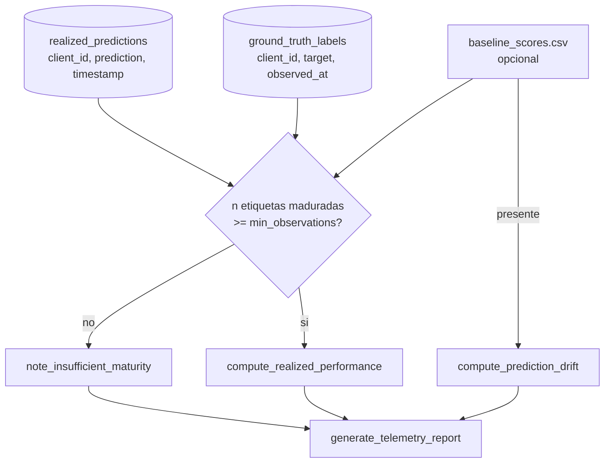

<div align="center">

# 📡 Telemetría Post-Cutover

**El canary evalua un modelo con horas de trafico; esto mide si de verdad acerto, meses despues, una vez que los prestamos que puntuo como Champion maduran — AUC realizado, Brier score y log-loss contra resultados reales, mas PSI sobre su propia distribucion de scores, reportado como "todavia no hay suficiente verdad de campo madurada" en vez de un numero falso cuando la cartera no alcanzo a madurar**

🌐 **[English](README.md)** | **[Español](README.es.md)**

[](https://www.python.org/)
[](https://duckdb.org/)
[](https://scikit-learn.org/)
[](tests/)
[](../LICENSE)

</div>

---

## Por qué lo construí así

Un release canario responde "¿el candidato se veia seguro con unas horas
o dias de trafico real?" — `19-canary-monitoring/` ya responde eso. No
puede responder la pregunta que de verdad importa para un modelo de
credito: ¿las probabilidades que asigno resultaron correctas, una vez que
los prestamos que puntuo tuvieron tiempo de caer en default o no? Esa
respuesta no existe hasta que pasa tiempo real — semanas o meses, segun el
producto — y construir un sistema que la reporte solo tiene sentido si
tambien sabe decir "todavia no hay nada util que reportar" de forma
limpia, en vez de calcular un AUC confiado con cinco etiquetas.

`PostCutoverTelemetryEngine` se construye alrededor de esa distincion: el
desempeño realizado (AUC, Brier, log-loss, calibracion) necesita verdad de
campo madurada y no vale nada por debajo de un minimo de muestra; el
drift de prediccion (PSI sobre la propia distribucion de scores del
Champion contra su baseline de entrenamiento) no necesita ninguna verdad
de campo y se puede revisar desde el dia uno. Los dos se calculan por
separado y se combinan en un solo reporte, para que una cartera que
todavia no maduro pueda igual decir algo cierto: "no hay desempeño
realizado que reportar, pero aca esta si los scores del modelo ya se
corrieron".

## Qué construye el proyecto

- **`compute_realized_performance`** une las predicciones logueadas del
  Champion con la verdad de campo madurada por `client_id` y reporta
  `realized_roc_auc`, `brier_score`, `log_loss`,
  `observed_default_rate` y `predicted_default_rate` — la brecha entre
  estas dos ultimas es el sesgo de calibracion, la misma lente que uso
  [`11-federated-credit-scoring`](../11-federated-credit-scoring) para
  atrapar una miscalibracion que las metricas de ranking solas no vieron.
- **`compute_prediction_drift`** calcula el PSI exclusivamente sobre las
  probabilidades predichas, nunca sobre las features de entrada: los
  deciles del baseline vienen de una distribucion de referencia de
  entrenamiento, los scores recientes de produccion se agrupan contra
  esos mismos cortes, y los umbrales estandar del PSI (`<0.10` sin
  cambio, `0.10–0.25` moderado, `>0.25` significativo) etiquetan el
  resultado.
- **`note_insufficient_maturity`** / **`generate_telemetry_report`**:
  cuando hay menos de `--min-observations` (default 50) etiquetas
  maduradas, el motor registra por qué en vez de calcular una metrica sin
  sentido, y el reporte —
  `post_cutover_telemetry_<timestamp>.json` — siempre se escribe de
  cualquier forma, con un campo `summary` en lenguaje llano.

Ninguna tecnica anterior de la cadena mlops de este laboratorio junta "lo
que el Champion predijo en produccion" con "lo que realmente paso, una
vez madurado" para el mismo cliente — `18-canary-deployment` loguea
predicciones solo durante la fase canaria, antes de un cutover completo,
y ninguna etapa tiene un concepto de default madurado. Esta tecnica
define ese emparejamiento por primera vez: `realized_predictions`
(`client_id`, `prediction`, `timestamp`) y `ground_truth_labels`
(`client_id`, `target`, `observed_at`), ambas en su propio almacen
DuckDB — trabajo de `run_telemetry.py`, no del motor, que solo ve
DataFrames y arrays planos.

## Resultados de una corrida real

Sembrando 120 predicciones realizadas del Champion, con 80 ya maduradas
(resultado conocido) y un baseline de entrenamiento de 1.000 valores:

```bash
python run_telemetry.py --baseline-preds-path baseline_scores.csv
```

```json
{
  "realized_performance": {
    "status": "EVALUATED",
    "realized_roc_auc": 0.77498388136686,
    "brier_score": 0.19204593044420298,
    "log_loss": 0.5650451819038808,
    "observed_default_rate": 0.5875,
    "predicted_default_rate": 0.5081284978072766,
    "n_evaluated": 80
  },
  "prediction_drift": {
    "psi": 0.08888687903997754,
    "num_buckets": 10,
    "severity": "no_shift",
    "n_baseline": 1000,
    "n_recent": 120
  },
  "summary": "Desempeno realizado sobre 80 observaciones: AUC=0.7750, Brier=0.1920, log-loss=0.5650, sesgo de calibracion=-7.94pp (predicho 50.81% vs. observado 58.75%). Drift de prediccion: PSI=0.0889 (no_shift) sobre 10 buckets (1000 baseline vs. 120 recientes)."
}
```

Apuntando el mismo CLI a un almacen DuckDB con solo 5 etiquetas maduradas
en vez de las 80 de arriba:

```
INFO: Solo 5 etiqueta(s) de verdad de campo cruzada(s) con una prediccion (se necesitan 50) -- reporte parcial, la cartera necesita mas tiempo de maduracion.
```

igual escribe un reporte — `"status": "INSUFFICIENT_MATURITY"`,
`"prediction_drift": null` — y termina con codigo `0`: no habia nada mal,
la cartera simplemente no maduro todavia.

## Hallazgos honestos

- **Un sesgo de calibracion de `-7.94pp` conviene con un AUC
  perfectamente respetable de 0.775 en la misma corrida.** Este es un
  ejemplo sintetico y sembrado, no una afirmacion sobre una cartera real —
  pero reproduce a proposito exactamente la forma del hallazgo de la
  tecnica 11: un modelo puede ordenar solicitantes razonablemente bien
  mientras se equivoca en el *nivel* real de riesgo, y el AUC solo nunca
  lo muestra. `predicted_default_rate` y `observed_default_rate` se
  reportan uno al lado del otro especificamente para que esa brecha no
  sea algo que el lector tenga que notar por su cuenta.
- **El PSI necesito una implementacion de referencia independiente,
  deliberadamente no vectorizada, para confiar en el, no solo una
  verificacion de "corrio sin errores".** El camino de produccion agrupa
  scores con `np.searchsorted` contra cortes derivados de cuantiles —
  rapido, pero facil de equivocar sutilmente en el borde del manejo de
  empates (la semantica de `side="right"`). La suite de pruebas incluye
  una segunda implementacion que agrupa un score a la vez con un loop de
  Python puro y compara las dos a `1e-9`, el mismo estandar que este
  laboratorio aplico a cada otro metodo numerico construido desde cero.
- **El umbral minimo de observaciones vive en el CLI, no en el motor.**
  `compute_realized_performance` calcula un AUC con gusto sobre 4
  etiquetas si se lo pide — no tiene opinion sobre que cuenta como
  "suficiente". Decidir ese umbral es una decision de negocio
  (`--min-observations`, default 50), asi que queda en el lugar donde se
  puede sobreescribir sin tocar el codigo de las metricas.

## Arquitectura



| Módulo | Qué hace |
|---|---|
| [`src/telemetry_engine.py`](src/telemetry_engine.py) | `PostCutoverTelemetryEngine`: desempeño realizado, drift PSI, el camino de maduracion insuficiente, y el escritor del reporte combinado. |
| [`run_telemetry.py`](run_telemetry.py) | El CLI: lee `realized_predictions`/`ground_truth_labels` de su propio almacen DuckDB, filtra por el umbral de maduracion, y opcionalmente lee un CSV de baseline para el PSI. |

## Cómo correrlo

```bash
python -m venv venv
venv\Scripts\activate            # Windows;  source venv/bin/activate en Linux/macOS
pip install -r requirements.txt

python run_telemetry.py          # reporte parcial: aun no hay estado sembrado
pytest -v                        # 12 tests
```

## Tests

12 tests (`pytest -v`): `compute_realized_performance` contra valores
derivados a mano de un ejemplo limpio y perfectamente separado (AUC=1.0,
Brier=0.04, log-loss=`-ln(0.8)` exacto); el caso de una sola clase dejando
el AUC sin definir pero calculando igual el Brier; errores por columnas
faltantes y por `client_id` sin overlap; el PSI coincidiendo a `1e-9` con
una implementacion de referencia independiente, no vectorizada; el PSI
etiquetando correctamente una distribucion identica como `no_shift` y una
deliberadamente corrida como `significant_shift`; la guarda de baseline
insuficiente; el camino de maduracion insuficiente registrando su razon
en vez de un numero; un reporte parcial escrito y legible como JSON
valido; un reporte combinado fusionando correctamente los dos grupos de
metricas; y un `RuntimeError` claro cuando se pide un reporte sin nada
calculado.

## Alcance

Verificada con un almacen DuckDB real que lleva el esquema que esta
tecnica define (`realized_predictions`, `ground_truth_labels`) y un CSV
de baseline de entrenamiento real, corrida de punta a punta a traves del
CLI real — no solo contra los DataFrames en memoria de la suite de
pruebas. Ninguna tecnica anterior de este laboratorio produce todavia ese
emparejamiento, asi que sembrarlo es trabajo de esta tecnica en
produccion, no algo que `run_telemetry.py` pueda descubrir de una carpeta
vecina como si hace `20-full-promotion-cutover`.

## Autor

Pablo Reyes — [github.com/Rxyxs](https://github.com/Rxyxs)
Código: MIT — ver [LICENSE](../LICENSE)
