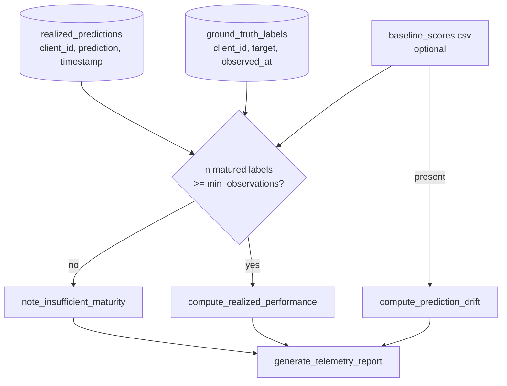

<div align="center">

# 📡 Post-Cutover Telemetry

**Canary health checks a model on hours of traffic; this measures whether it was actually right, months later, once the loans it scored as Champion mature — realized AUC, Brier score, and log-loss against real outcomes, plus PSI on its own score distribution, reported as "not enough matured data yet" rather than a false number when the portfolio hasn't caught up**

🌐 **[English](README.md)** | **[Español](README.es.md)**

[](https://www.python.org/)
[](https://duckdb.org/)
[](https://scikit-learn.org/)
[](tests/)
[](../LICENSE)

</div>

---

## Why I built it this way

A canary release answers "did the candidate look safe on a few hours or
days of live traffic?" — `19-canary-monitoring/` already answers that. It
cannot answer the question that actually matters for a credit model: did
the probabilities it assigned turn out to be right, once the loans it
scored have had time to either default or not? That answer doesn't exist
until real time passes — weeks or months, depending on the product — and
building a system that reports it only makes sense if it also knows how
to say nothing useful yet, cleanly, instead of computing a confident AUC
off five labels.

`PostCutoverTelemetryEngine` is built around that distinction: realized
performance (AUC, Brier, log-loss, calibration) needs matured ground
truth and is worthless below a minimum sample; prediction drift (PSI on
the Champion's own score distribution vs. its training-time baseline)
needs no ground truth at all and can be checked from day one. The two are
computed independently and combined into one report, so a portfolio that
hasn't matured yet can still say something true: "no realized performance
to report, but here's whether the model's scores have already drifted."

## What the project builds

- **`compute_realized_performance`** joins the Champion's logged
  predictions to matured ground truth on `client_id` and reports
  `realized_roc_auc`, `brier_score`, `log_loss`,
  `observed_default_rate` and `predicted_default_rate` — the gap between
  the last two is calibration bias, the same lens
  [`11-federated-credit-scoring`](../11-federated-credit-scoring) used to
  catch a miscalibration that ranking metrics alone missed.
- **`compute_prediction_drift`** computes PSI exclusively on predicted
  probabilities, never on input features: baseline deciles come from a
  training-time reference distribution, recent production scores are
  binned against those same cut points, and the standard PSI thresholds
  (`<0.10` no shift, `0.10–0.25` moderate, `>0.25` significant) label the
  result.
- **`note_insufficient_maturity`** / **`generate_telemetry_report`**: when
  fewer than `--min-observations` (default 50) matured labels exist, the
  engine records why instead of computing a meaningless metric, and the
  report — `post_cutover_telemetry_<timestamp>.json` — always gets written
  either way, with a plain-language `summary` field.

No earlier technique in this lab's mlops chain pairs "what the Champion
predicted in production" with "what actually happened, once it matured"
for the same client — `18-canary-deployment` logs predictions only during
the canary phase, before a full cutover, and no stage has a concept of a
matured default. This technique defines that pairing for the first time:
`realized_predictions` (`client_id`, `prediction`, `timestamp`) and
`ground_truth_labels` (`client_id`, `target`, `observed_at`), both in its
own DuckDB store — `run_telemetry.py`'s job, not the engine's, which only
ever sees plain DataFrames and arrays.

## Results from an actual run

Seeding 120 realized Champion predictions with 80 already matured
(known outcome) and a 1,000-value training-time baseline:

```bash
python run_telemetry.py --baseline-preds-path baseline_scores.csv
```

```json
{
  "realized_performance": {
    "status": "EVALUATED",
    "realized_roc_auc": 0.77498388136686,
    "brier_score": 0.19204593044420298,
    "log_loss": 0.5650451819038808,
    "observed_default_rate": 0.5875,
    "predicted_default_rate": 0.5081284978072766,
    "n_evaluated": 80
  },
  "prediction_drift": {
    "psi": 0.08888687903997754,
    "num_buckets": 10,
    "severity": "no_shift",
    "n_baseline": 1000,
    "n_recent": 120
  },
  "summary": "Desempeno realizado sobre 80 observaciones: AUC=0.7750, Brier=0.1920, log-loss=0.5650, sesgo de calibracion=-7.94pp (predicho 50.81% vs. observado 58.75%). Drift de prediccion: PSI=0.0889 (no_shift) sobre 10 buckets (1000 baseline vs. 120 recientes)."
}
```

Pointing the same CLI at a DuckDB store with only 5 matured labels instead
of the 80 above:

```
INFO: Solo 5 etiqueta(s) de verdad de campo cruzada(s) con una prediccion (se necesitan 50) -- reporte parcial, la cartera necesita mas tiempo de maduracion.
```

still writes a report — `"status": "INSUFFICIENT_MATURITY"`,
`"prediction_drift": null` — and exits `0`: there was nothing wrong, the
portfolio just hasn't matured.

## Honest findings

- **A `-7.94pp` calibration bias sits next to a perfectly respectable
  0.775 AUC in the same run.** This is a synthetic, seeded example, not a
  claim about a real portfolio — but it reproduces on purpose the exact
  shape of the finding from technique 11: a model can rank applicants
  reasonably well while getting the actual *level* of risk wrong, and
  AUC alone never surfaces that. `predicted_default_rate` and
  `observed_default_rate` are reported side by side specifically so that
  gap isn't the thing a reader has to notice on their own.
- **PSI needed an independent, deliberately un-vectorized reference
  implementation to trust, not just a "did it run" check.** The
  production path buckets scores with `np.searchsorted` against
  quantile-derived cut points — fast, but easy to get subtly wrong at the
  tie-handling boundary (`side="right"` semantics). The test suite
  includes a second implementation that buckets one score at a time with
  a plain Python loop and compares the two to `1e-9`, the same standard
  this lab has applied to every other from-scratch numerical method.
- **The minimum-observations gate lives in the CLI, not the engine.**
  `compute_realized_performance` will happily compute an AUC on 4 labels
  if asked to — it has no opinion about what counts as "enough". Deciding
  that threshold is a business call (`--min-observations`, default 50),
  so it's kept where it can be overridden without touching the metric
  code.

## Architecture



| Module | What it does |
|---|---|
| [`src/telemetry_engine.py`](src/telemetry_engine.py) | `PostCutoverTelemetryEngine`: realized performance, PSI drift, the insufficient-maturity path, and the combined report writer. |
| [`run_telemetry.py`](run_telemetry.py) | The CLI: reads `realized_predictions`/`ground_truth_labels` from its own DuckDB store, gates on the maturity threshold, optionally reads a baseline CSV for PSI. |

## Running it

```bash
python -m venv venv
venv\Scripts\activate            # Windows;  source venv/bin/activate on Linux/macOS
pip install -r requirements.txt

python run_telemetry.py          # partial report: no state seeded yet
pytest -v                        # 12 tests
```

## Tests

12 tests (`pytest -v`): `compute_realized_performance` against hand-derived
values from a clean, perfectly separated example (AUC=1.0, Brier=0.04,
log-loss=`-ln(0.8)` exactly); the single-class case leaving AUC undefined
but still computing Brier; missing-column and no-overlapping-`client_id`
errors; PSI matched to `1e-9` against an independent, non-vectorized
reference implementation; PSI correctly labeling an identical distribution
`no_shift` and a deliberately shifted one `significant_shift`; the
insufficient-baseline-size guard; the insufficient-maturity path recording
its reason instead of a number; a partial report written and readable as
valid JSON; a combined report correctly merging both metric groups; and a
clear `RuntimeError` when a report is requested with nothing computed.

## Scope

Verified with a real DuckDB store carrying the schema this technique
defines (`realized_predictions`, `ground_truth_labels`) and a real
training-time baseline CSV, run through the actual CLI end to end — not
just against the test suite's in-memory DataFrames. No earlier technique
in this lab produces that pairing yet, so seeding it is this technique's
own job in production, not something `run_telemetry.py` can discover from
a sibling folder the way `20-full-promotion-cutover` does.

## Author

Pablo Reyes — [github.com/Rxyxs](https://github.com/Rxyxs)
Code: MIT — see [LICENSE](../LICENSE)
