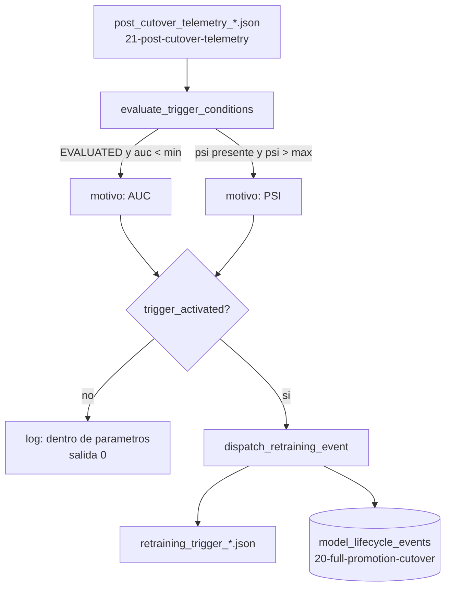

<div align="center">

# 🔁 Disparador Automatico de Reentrenamiento

**Lee la telemetria post-cutover y decide — con umbrales explicitos, no una persona mirando un dashboard — si el Champion necesita reentrenamiento: AUC realizado por debajo de un piso, o su propia distribucion de scores corrida mas alla de un techo, sin confundir nunca telemetria parcial con un modelo degradado**

🌐 **[English](README.md)** | **[Español](README.es.md)**

[](https://www.python.org/)
[](https://duckdb.org/)
[](tests/)
[](../LICENSE)

</div>

---

## Por qué lo construí así

[`21-post-cutover-telemetry`](../21-post-cutover-telemetry) produce un
numero, no una decision. Alguien — o algo — todavia tiene que mirar
`realized_roc_auc: 0.68` y decidir que eso es lo bastante malo como para
actuar, y hacerlo de forma consistente cada vez que llega un reporte, no
solo cuando alguien revisa el dashboard. La parte dificil no es la
comparacion contra el umbral en si; es no convertir "todavia no hay
suficiente verdad de campo madurada" en una falsa alarma, porque un
reporte `INSUFFICIENT_MATURITY` no tiene ningun AUC — comparar
`None < 0.72` o revienta o evalua en silencio a algo que no es una
decision real.

`RetrainingTriggerManager` trata las dos condiciones de disparo como
independientes a proposito. El desempeño realizado solo condiciona sobre
un reporte cuyo `status` es `EVALUATED` — un reporte parcial nunca puede
disparar *por el AUC*, sin importar como este escrita la comparacion. La
deriva de prediccion no necesita ninguna verdad de campo, asi que se
revisa siempre que hay un valor de PSI presente, con maduracion o sin
ella: un Champion cuyos propios scores ya se movieron respecto de su
baseline de entrenamiento es una señal valida incluso el primer dia
despues de un cutover, y confundir "esperar el AUC" con "esperar todo"
ocultaria eso.

## Qué construye el proyecto

- **`evaluate_trigger_conditions`** lee un
  `post_cutover_telemetry_<timestamp>.json`, revisa
  `realized_roc_auc < min_realized_auc` (solo cuando `status ==
  "EVALUATED"` y el AUC esta de verdad definido — la tecnica 21 puede
  dejarlo en `None` si solo se observo una clase) y
  `prediction_drift.psi > max_psi` (siempre que se haya calculado el
  drift, sin importar el estado de maduracion), y retorna
  `trigger_activated`, `reasons` (lista vacia si no disparo, una entrada
  por cada condicion que salto) y `evaluated_at`.
- **`dispatch_retraining_event`** escribe
  `retraining_trigger_<timestamp>.json` con la decision completa, e
  inserta una fila en `model_lifecycle_events` — exactamente la misma
  tabla que crea
  [`20-full-promotion-cutover`](../20-full-promotion-cutover), las mismas
  cinco columnas, `event_type = "RETRAINING_TRIGGERED"` con
  `previous_champion`/`new_champion` en `NULL` porque aca no hubo ningun
  swap — para que un cutover y la decision de reentrenamiento que
  eventualmente le sigue vivan en una sola linea de tiempo consultable,
  no en dos.
- **`run_trigger_check.py`** conecta todo: resuelve el reporte de
  telemetria real mas reciente en
  `../21-post-cutover-telemetry/outputs/reports/`, apunta a la misma
  `lab_lifecycle.duckdb` central en la que escribe la tecnica 20, y
  termina con codigo `0` en cada resultado posible — sin disparo, con
  disparo, o nada que evaluar — porque solo uno de esos tres es un error
  de sistema (y no es ninguno de ellos).

## Resultados de una corrida real

Apuntando el CLI al reporte de telemetria real de la tecnica 21 (AUC
0.775, PSI 0.089 sobre 120 predicciones logueadas, 80 maduradas) con los
umbrales por defecto:

```
INFO: Champion dentro de los parametros de salud (status=EVALUATED, auc=0.77498388136686, psi=0.08888687903997754) -- no se dispara reentrenamiento.
```

termina con codigo `0`, no escribe nada — correctamente sano, nada que
reportar. Ajustando el piso de AUC a `0.80` contra el mismo reporte real:

```bash
python run_trigger_check.py --min-realized-auc 0.80
```

```json
{
  "trigger_activated": true,
  "reasons": [
    "realized_roc_auc=0.7750 por debajo del minimo 0.8000"
  ],
  "evaluated_at": "2026-09-30T18:46:03+00:00",
  "telemetry_report_path": "../21-post-cutover-telemetry/outputs/reports/post_cutover_telemetry_20260930T184514719730Z.json",
  "telemetry_status": "EVALUATED",
  "realized_roc_auc": 0.77498388136686,
  "psi": 0.08888687903997754,
  "min_realized_auc": 0.8,
  "max_psi": 0.2
}
```

y la fila correspondiente llega a la `20-full-promotion-cutover/outputs/lab_lifecycle.duckdb`
real — confirmado consultandola directamente despues de la corrida,
sentada junto a las propias filas `FULL_CUTOVER` de esa tecnica.

## Hallazgos honestos

- **`duckdb.connect` no crea su directorio padre, y solo lo descubri
  corriendo el CLI real, no la suite de pruebas.** Cada prueba aca
  construye su base de datos dentro de `tmp_path`, cuyos ancestros pytest
  ya crea — 12/12 en verde no me decia nada sobre esto. Apuntar el CLI
  real a `../20-full-promotion-cutover/outputs/lab_lifecycle.duckdb`
  antes de que existiera el `outputs/` de esa carpeta lanzo un
  `IOException` crudo. Se corrigio con un `mkdir(parents=True,
  exist_ok=True)` explicito antes de conectar — y resulto que el mismo
  bug latente ya existia en
  `20-full-promotion-cutover/src/cutover_manager.py`, solo que
  enmascarado ahi porque su propio `champion_dir.mkdir()` de casualidad
  crea el `outputs/` compartido como efecto secundario primero. Las dos
  estan corregidas ahora, cada una fijada por una prueba de regresion que
  apunta deliberadamente a una ruta de base de datos cuyo padre todavia
  no existe.
- **Las dos condiciones de disparo son independientes por diseño, y un
  reporte puede disparar solo por drift mientras sigue siendo
  `INSUFFICIENT_MATURITY`.** Esta es una lectura deliberada de "evitar
  falsos disparos por falta de maduracion": bloquea especificamente la
  via del AUC, no la deteccion de drift en general, porque el PSI no
  necesita verdad de campo para significar algo.
  `test_reporte_parcial_con_drift_alto_igual_dispara_por_psi` fija esto a
  proposito — seria facil sobre-corregir y silenciar la deteccion de
  drift por completo en cualquier reporte parcial, lo que ocultaria una
  señal real sin ninguna buena razon.

## Arquitectura



| Módulo | Qué hace |
|---|---|
| [`src/retraining_trigger.py`](src/retraining_trigger.py) | `RetrainingTriggerManager`: las dos condiciones de disparo independientes, el escritor del manifiesto, y el insert al ledger de auditoria compartido. |
| [`run_trigger_check.py`](run_trigger_check.py) | El CLI: resuelve el reporte de telemetria real mas reciente, evalua, y despacha o registra un no-op limpio. |

## Cómo correrlo

```bash
python -m venv venv
venv\Scripts\activate            # Windows;  source venv/bin/activate en Linux/macOS
pip install -r requirements.txt

python run_trigger_check.py      # aborta limpiamente si la tecnica 21 aun no produjo un reporte
pytest -v                        # 12 tests
```

## Tests

12 tests (`pytest -v`): un reporte sano (AUC 0.78, PSI 0.05) que no
dispara; un AUC bajo y un PSI alto disparando cada uno por separado con
el texto de motivo correcto; ambos disparando juntos acumulando dos
motivos; un reporte `EVALUATED` con `realized_roc_auc: null` (caso de una
sola clase) sin disparar por AUC correctamente; un reporte
`INSUFFICIENT_MATURITY` sin drift sin disparar en absoluto; el mismo
estado parcial *con* un PSI real y alto igual disparando — confirmando
que la deteccion de drift no queda silenciada por verdad de campo
inmadura; un archivo faltante y un JSON corrupto lanzando ambos
`TelemetryReportError` limpiamente; el manifiesto y la fila de DuckDB
coincidiendo exactamente con la decision evaluada; una prueba de
regresion para el bug del directorio padre faltante; y una fila
`RETRAINING_TRIGGERED` conviviendo correctamente con una fila
`FULL_CUTOVER` preexistente en la misma tabla.

## Alcance

Verificada contra un reporte de telemetria real producido por
`21-post-cutover-telemetry/run_telemetry.py` y una `lab_lifecycle.duckdb`
real compartida con `20-full-promotion-cutover` — no solo contra los
fixtures JSON sinteticos de la suite de pruebas. Sigue sin reentrenar
nada: como `15-model-promotion` antes, el trabajo de esta tecnica termina
en una decision escrita y auditable.

## Autor

Pablo Reyes — [github.com/Rxyxs](https://github.com/Rxyxs)
Código: MIT — ver [LICENSE](../LICENSE)
