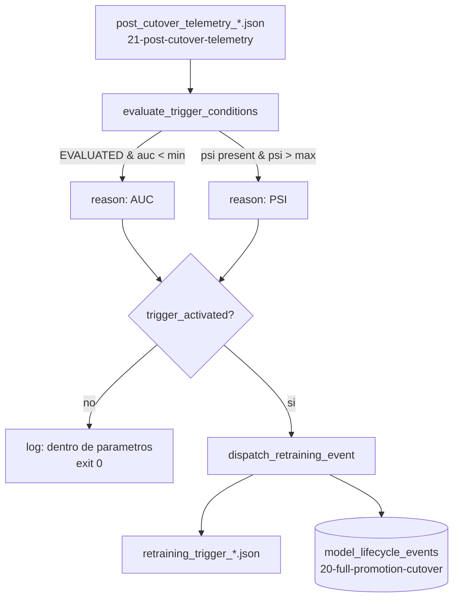

<div align="center">

# 🔁 Automated Retraining Trigger

**Reads post-cutover telemetry and decides — with explicit thresholds, not a human staring at a dashboard — whether the Champion needs retraining: realized AUC below a floor, or its own score distribution drifted past a ceiling, with partial telemetry never mistaken for a degraded model**

🌐 **[English](README.md)** | **[Español](README.es.md)**

[](https://www.python.org/)
[](https://duckdb.org/)
[](tests/)
[](../LICENSE)

</div>

---

## Why I built it this way

[`21-post-cutover-telemetry`](../21-post-cutover-telemetry) produces a
number, not a decision. Someone — or something — still has to look at
`realized_roc_auc: 0.68` and decide that's bad enough to act on, and do it
consistently every time a report lands, not only when someone happens to
check the dashboard. The harder part isn't the threshold comparison
itself; it's not turning "we don't have enough matured data yet" into a
false alarm, since an `INSUFFICIENT_MATURITY` report has no AUC at all —
comparing `None < 0.72` either crashes or silently evaluates to something
that isn't a real decision.

`RetrainingTriggerManager` treats the two trigger conditions as
independent on purpose. Realized performance only ever gates on a report
whose `status` is `EVALUATED` — a partial report can never trigger
*because of AUC*, no matter how the comparison is written. Prediction
drift doesn't need ground truth at all, so it's checked whenever a PSI
value is present, maturity or not: a Champion whose own scores already
moved away from its training baseline is a valid signal even on day one
after a cutover, and conflating "wait for AUC" with "wait for everything"
would hide that.

## What the project builds

- **`evaluate_trigger_conditions`** reads a
  `post_cutover_telemetry_<timestamp>.json`, checks
  `realized_roc_auc < min_realized_auc` (only when `status == "EVALUATED"`
  and the AUC is actually defined — technique 21 can leave it `None` when
  only one class was observed) and `prediction_drift.psi > max_psi`
  (whenever drift was computed, independent of maturity status), and
  returns `trigger_activated`, `reasons` (empty list if not triggered,
  one entry per condition that fired), and `evaluated_at`.
- **`dispatch_retraining_event`** writes
  `retraining_trigger_<timestamp>.json` with the full decision, and
  inserts one row into `model_lifecycle_events` — the exact same table
  [`20-full-promotion-cutover`](../20-full-promotion-cutover) created,
  same five columns, `event_type = "RETRAINING_TRIGGERED"` with
  `previous_champion`/`new_champion` left `NULL` since no swap happened
  here — so a cutover and the retraining decision that eventually follows
  it live in one queryable timeline, not two.
- **`run_trigger_check.py`** ties them together: resolves the latest real
  telemetry report from `../21-post-cutover-telemetry/outputs/reports/`,
  points at the same central `lab_lifecycle.duckdb` technique 20 writes
  to, and exits `0` in every outcome — no trigger, a trigger, or nothing
  to evaluate — because only one of those three is a system error (and it
  isn't any of them).

## Results from an actual run

Pointing the CLI at technique 21's real telemetry report (AUC 0.775, PSI
0.089 on 120 logged predictions, 80 matured) with default thresholds:

```
INFO: Champion dentro de los parametros de salud (status=EVALUATED, auc=0.77498388136686, psi=0.08888687903997754) -- no se dispara reentrenamiento.
```

exits `0`, writes nothing — correctly healthy, nothing to report.
Tightening the AUC floor to `0.80` against the exact same real report:

```bash
python run_trigger_check.py --min-realized-auc 0.80
```

```json
{
  "trigger_activated": true,
  "reasons": [
    "realized_roc_auc=0.7750 por debajo del minimo 0.8000"
  ],
  "evaluated_at": "2026-09-30T18:46:03+00:00",
  "telemetry_report_path": "../21-post-cutover-telemetry/outputs/reports/post_cutover_telemetry_20260930T184514719730Z.json",
  "telemetry_status": "EVALUATED",
  "realized_roc_auc": 0.77498388136686,
  "psi": 0.08888687903997754,
  "min_realized_auc": 0.8,
  "max_psi": 0.2
}
```

and the matching row lands in the real `20-full-promotion-cutover/outputs/lab_lifecycle.duckdb`
— confirmed by querying it directly after the run, sitting next to that
technique's own `FULL_CUTOVER` rows.

## Honest findings

- **`duckdb.connect` doesn't create its parent directory, and I only found
  out by running the real CLI, not the test suite.** Every test here
  builds its database inside `tmp_path`, whose ancestors pytest already
  creates — 12/12 green told me nothing about this. Pointing the real CLI
  at `../20-full-promotion-cutover/outputs/lab_lifecycle.duckdb` before
  that folder's `outputs/` existed raised a raw `IOException`. Fixed with
  an explicit `mkdir(parents=True, exist_ok=True)` before connecting —
  and the same latent bug turned out to already exist in
  `20-full-promotion-cutover/src/cutover_manager.py` itself, just masked
  there because its own `champion_dir.mkdir()` happens to create the
  shared `outputs/` parent as a side effect first. Both are fixed now,
  each pinned by a regression test that deliberately points at a
  database path whose parent doesn't exist yet.
- **The two trigger conditions are independent by design, and a report
  can trigger on drift alone while still being `INSUFFICIENT_MATURITY`.**
  This is a deliberate reading of "avoid false triggers from lack of
  maturation": it blocks the AUC path specifically, not drift detection
  in general, since PSI doesn't need ground truth to mean something.
  `test_reporte_parcial_con_drift_alto_igual_dispara_por_psi` pins this
  on purpose — it would be easy to over-correct and silence drift
  detection entirely on any partial report, which would hide a real
  signal for no good reason.

## Architecture



| Module | What it does |
|---|---|
| [`src/retraining_trigger.py`](src/retraining_trigger.py) | `RetrainingTriggerManager`: the two independent trigger conditions, the manifest writer, and the shared audit-ledger insert. |
| [`run_trigger_check.py`](run_trigger_check.py) | The CLI: resolves the latest real telemetry report, evaluates, and dispatches or logs a clean no-op. |

## Running it

```bash
python -m venv venv
venv\Scripts\activate            # Windows;  source venv/bin/activate on Linux/macOS
pip install -r requirements.txt

python run_trigger_check.py      # aborts cleanly if 21 hasn't produced a report yet
pytest -v                        # 12 tests
```

## Tests

12 tests (`pytest -v`): a healthy report (AUC 0.78, PSI 0.05) not
triggering; a low AUC and a high PSI each triggering independently with
the right reason text; both triggering together accumulating two reasons;
an `EVALUATED` report with `realized_roc_auc: null` (single-class case)
correctly not triggering on AUC; an `INSUFFICIENT_MATURITY` report with no
drift not triggering at all; the same partial status *with* a real, high
PSI still triggering — confirming drift detection isn't silenced by
immature ground truth; a missing file and corrupted JSON both raising
`TelemetryReportError` cleanly; the manifest and the DuckDB row matching
the evaluated decision exactly; a regression test for the missing-parent-
directory bug; and a `RETRAINING_TRIGGERED` row coexisting correctly with
a pre-existing `FULL_CUTOVER` row in the same table.

## Scope

Verified against a real telemetry report produced by
`21-post-cutover-telemetry/run_telemetry.py` and a real
`lab_lifecycle.duckdb` shared with `20-full-promotion-cutover` — not just
the test suite's synthetic JSON fixtures. Still does not retrain anything:
like `15-model-promotion` before it, this technique's job ends at a
written, auditable decision.

## Author

Pablo Reyes — [github.com/Rxyxs](https://github.com/Rxyxs)
Code: MIT — see [LICENSE](../LICENSE)
