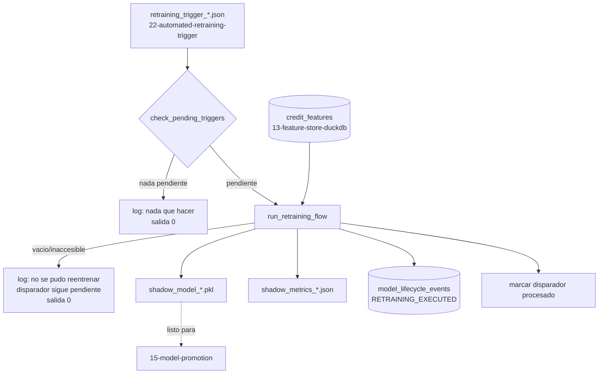

<div align="center">

# ♻️ Pipeline de Reentrenamiento Automatico

**Cierra el circuito: lee un disparador de reentrenamiento activo (Dia 26), extrae el snapshot mas fresco del Feature Store, entrena un nuevo Challenger, y lo devuelve al mismo pipeline de promocion que ya existia — sin atajo paralelo, sin una forma de artefacto nueva que `15-model-promotion` no reconociera ya**

🌐 **[English](README.md)** | **[Español](README.es.md)**

[](https://www.python.org/)
[](https://duckdb.org/)
[](https://scikit-learn.org/)
[](tests/)
[](../LICENSE)

</div>

---

## Por qué lo construí así

Cada técnica de la 12 a la 22 en la cadena mlops de este laboratorio
construye un eslabón: detectar drift, ingerir un snapshot, entrenar un
modelo sombra, decidir si promoverlo, correrlo en paralelo, enrutar
tráfico canario, vigilar su salud, decidir si hay que reemplazarlo. Cada
una se detiene en una decisión escrita y deja el siguiente paso para otra
cosa. Esta técnica es donde eso deja de ser cierto especificamente para el
reentrenamiento: es lo que de verdad actúa sobre la decisión de
`22-automated-retraining-trigger`, en vez de dejar un manifiesto mas para
que una persona lo note.

La decisión de diseño que mas importa aca es que *es*, archivo por
archivo, el nuevo Challenger. Habria sido facil inventar una convención
de nombres nueva — `challenger_v2_<ts>.pkl`, una forma de JSON propia — y
llamar a eso un circuito cerrado. No lo seria:
`15-model-promotion` ya sabe leer `shadow_model_<timestamp>.pkl` emparejado
con `shadow_metrics_<timestamp>.json` (mismo timestamp, mismo directorio),
y ya sabe derivar un nombre del otro. Producir cualquier otra cosa
significaria que el circuito "automatico" se bifurca en silencio del
pipeline que una persona corre a mano, y los dos se irian separando en
cuanto alguien tocara uno sin tocar el otro. Asi que el Challenger
reentrenado sale exactamente con esa forma — el unico trabajo real de esta
técnica es producirlo automaticamente, ante un disparador, en vez de ante
un comando que alguien tiene que acordarse de escribir.

## Qué construye el proyecto

- **`check_pending_triggers`** es de solo lectura, a proposito: escanea un
  directorio en busca de `retraining_trigger_<timestamp>.json`, retorna
  `True` si alguno sin procesar tiene `trigger_activated: true`, y deja el
  mas antiguo de esos en `self.pending_trigger_path` — sin efectos
  secundarios, seguro de llamar desde un loop de polling sin entrenar
  nada por accidente.
- **`run_retraining_flow`** hace el trabajo real, en un orden elegido para
  que una caida a mitad de camino deje el disparador todavia pendiente en
  vez de perderlo en silencio: extraer la `credit_features` mas reciente
  del Feature Store → entrenar un Challenger (`StandardScaler` +
  `LogisticRegression`, `C=0.5` — mas regularizado que el default, una
  respuesta deliberada a que el reentrenamiento se dispara por
  degradacion sobre una ventana reciente posiblemente corrida, no una
  busqueda de hiperparametros) → evaluar sobre un split de validacion →
  escribir `shadow_model_<timestamp>.pkl` /
  `shadow_metrics_<timestamp>.json` → insertar una fila
  `RETRAINING_EXECUTED` en el mismo ledger `model_lifecycle_events` que
  creo la técnica 20 → recien ahi marcar el disparador como procesado.
- **`run_orchestrator.py`** conecta todo contra rutas reales: el
  disparador mas reciente de `22-automated-retraining-trigger`, el
  Feature Store de `13-feature-store-duckdb`, la `lab_lifecycle.duckdb`
  compartida de `20-full-promotion-cutover`. Sin disparador pendiente, o
  con un Feature Store vacio/inaccesible: ambos terminan con codigo `0` y
  un log explicando por que — "nada que hacer ahora" y "no se pudo, hay
  que reintentar despues" son dos resultados legitimos, no errores de
  sistema.

## Resultados de una corrida real de punta a punta

No son fixtures sembrados — la cadena real corriendo de verdad: la
técnica 12 detecta drift real (`ingreso_mensual` PSI 0.82, en rojo), la
técnica 13 ingiere el snapshot resultante en una tabla `credit_features`
real (2.000 filas), la técnica 22 evalua un reporte de telemetria con un
AUC genuinamente bajo (0.65) y despacha un disparador activo real.
Despues:

```bash
python run_orchestrator.py
```

```
INFO: Disparador activo detectado: ../22-automated-retraining-trigger/outputs/manifests/retraining_trigger_20260930T190858881598Z.json -- iniciando flujo de reentrenamiento.
INFO: Challenger reentrenado: ROC-AUC=0.9511, n=2000 -> outputs/models/shadow_model_20260930T190904908877Z.pkl (evento f4b2be33-9a4a-4c07-8fdf-659fe75106ec)
INFO: Nuevo candidato Challenger generado: ROC-AUC=0.9511, n=2000 -> outputs/models/shadow_model_20260930T190904908877Z.pkl (outputs/reports/shadow_metrics_20260930T190904908877Z.json)
```

```json
{
  "roc_auc": 0.9510738659173023,
  "n_samples": 2000,
  "n_train": 1600,
  "n_test": 400,
  "challenger_c": 0.5,
  "trained_at": "2026-09-30T19:09:04+00:00"
}
```

y consultando la `lab_lifecycle.duckdb` compartida despues muestra las dos
mitades del circuito, en orden:

```
event_type              promoted_at
RETRAINING_TRIGGERED    2026-09-30T19:08:58+00:00
RETRAINING_EXECUTED     2026-09-30T19:09:04+00:00
```

Corriendo el CLI una segunda vez contra el mismo directorio de
disparadores no encuentra nada pendiente y termina con codigo `0` sin
reentrenar de nuevo — el disparador quedo marcado como procesado despues
de que la primera corrida termino.

## Hallazgos honestos

- **El AUC de 0.95 de arriba es un artefacto de los datos de
  entrenamiento, no una afirmacion de que el circuito de reentrenamiento
  "arreglo" algo.** El feature store real sobre el que entreno es la
  demo sintetica de drift de la técnica 12, donde `default_flag` es una
  funcion deterministica limpia de dos features por construccion —
  cualquier clasificador razonable la ajusta casi perfectamente. Lo que
  hay que confiar de esta corrida es estructural (un disparador real
  llevo a un artefacto nuevo real con exactamente la forma esperada,
  aterrizando en exactamente el ledger esperado), no el valor de AUC en
  si.
- **El bug del directorio padre faltante de `duckdb.connect` aparecio
  por tercera vez, y esta vez no lo hizo — porque se corrigio antes de
  correr.** La técnica 22 lo encontro y lo corrigio en si misma y en la
  técnica 20; esta técnica heredo la correccion escribiendo
  `db_path.parent.mkdir(...)` antes del primer llamado a
  `duckdb.connect`, en vez de descubrirlo de la misma forma por tercera
  vez.
  `test_directorio_padre_de_duckdb_inexistente_se_crea_automaticamente`
  lo fija igual como prueba de regresion, siguiendo el mismo estandar
  que las otras dos técnicas ya se exigen a si mismas.
- **Marcar un disparador como "procesado" pasa despues de cada efecto
  secundario, no antes.** El archivo del modelo, el archivo de metricas,
  y la fila de DuckDB se escriben todos antes de que `run_retraining_flow`
  toque el estado local de disparadores procesados. Si el proceso muere
  entre escribir el modelo y marcar el disparador, el disparador sigue
  pendiente y la proxima corrida reentrena de nuevo — produciendo un
  segundo Challenger redundante en vez de perder en silencio un
  disparador que nunca se atendio de verdad. El trabajo redundante se
  juzgo el modo de falla mas seguro aca, no una señal perdida.

## Arquitectura



| Módulo | Qué hace |
|---|---|
| [`src/pipeline_orchestrator.py`](src/pipeline_orchestrator.py) | `RetrainingPipelineOrchestrator`: el escaneo de disparadores, el flujo extraer-entrenar-evaluar-guardar-registrar-marcar, y el manejo de errores del Feature Store. |
| [`run_orchestrator.py`](run_orchestrator.py) | El CLI: resuelve las rutas reales del disparador, el Feature Store, y el ledger, y corre el flujo o registra un no-op limpio. |

## Cómo correrlo

```bash
python -m venv venv
venv\Scripts\activate            # Windows;  source venv/bin/activate en Linux/macOS
pip install -r requirements.txt

python run_orchestrator.py       # aun no hay disparador pendiente: no-op limpio
pytest -v                        # 11 tests
```

## Tests

11 tests (`pytest -v`): sin disparadores pendientes, y un disparador
presente pero inactivo, ambos reportando correctamente que no hay nada
que hacer; un archivo de disparador corrupto que se salta mientras el
escaneo sigue hasta uno valido; el camino feliz completo — un disparador
activo produciendo un `Pipeline` `.pkl` cargable, un JSON de metricas
correspondiente, y la fila exacta `RETRAINING_EXECUTED` en DuckDB; un
disparador procesado que no vuelve a aparecer en una instancia nueva del
orquestador que lee el mismo estado persistido; la prueba de regresion
del directorio padre faltante para la conexion a la base de datos; y un
Feature Store faltante, sin tabla, demasiado chico, y sin columna de
target, cada uno lanzando un `EmptyFeatureStoreError` claro en vez de un
crash sin manejar.

## Alcance

Verificada contra una cadena real de punta a punta: el detector de drift
real de la técnica 12, la ingesta real de la técnica 13, el despacho real
de disparador de la técnica 22, y el propio CLI de esta técnica — no solo
los fixtures sinteticos de la suite de pruebas. El Challenger resultante
es real y cargable, pero su AUC de 0.9511 refleja etiquetas de
entrenamiento sinteticas limpias, no una afirmacion sobre la calidad del
reentrenamiento en ninguna cartera real.

## Autor

Pablo Reyes — [github.com/Rxyxs](https://github.com/Rxyxs)
Código: MIT — ver [LICENSE](../LICENSE)
