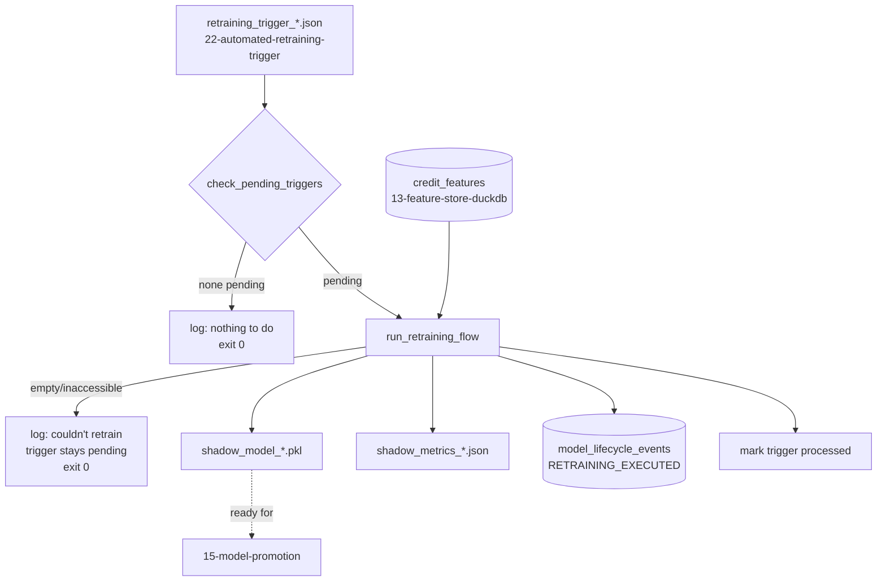

<div align="center">

# ♻️ Automated Retraining Pipeline

**Closes the loop: reads an active retraining trigger (Day 26), pulls the freshest Feature Store snapshot, trains a new Challenger, and hands it back into the exact same promotion pipeline that already existed — no parallel fast-path, no new artifact shape `15-model-promotion` wouldn't already recognize**

🌐 **[English](README.md)** | **[Español](README.es.md)**

[](https://www.python.org/)
[](https://duckdb.org/)
[](https://scikit-learn.org/)
[](tests/)
[](../LICENSE)

</div>

---

## Why I built it this way

Every technique from 12 through 22 in this lab's mlops chain builds one
link: detect drift, ingest a snapshot, train a shadow model, decide
whether to promote it, run it in parallel, route canary traffic, watch its
health, decide whether it needs replacing. Each one stops at a written
decision and leaves the next step to something else. This technique is
where that stops being true for retraining specifically: it's the thing
that actually acts on `22-automated-retraining-trigger`'s decision,
instead of leaving one more manifest for a human to notice.

The one design choice that matters most here is what the new Challenger
*is*, file-for-file. It would have been easy to invent a new naming
convention — `challenger_v2_<ts>.pkl`, a bespoke JSON shape — and call
that a closed loop. It isn't one: `15-model-promotion` already knows how
to read `shadow_model_<timestamp>.pkl` paired with
`shadow_metrics_<timestamp>.json` (same timestamp, same directory), and
already knows how to derive one name from the other. Producing anything
else would mean the "automated" loop quietly forks away from the
pipeline a human runs by hand, and the two would drift apart the moment
anyone touched one without the other. So the retrained Challenger comes
out in exactly that shape — this technique's only real job is producing
it automatically, on a trigger, instead of on a command someone has to
remember to type.

## What the project builds

- **`check_pending_triggers`** is read-only, on purpose: it scans a
  directory for `retraining_trigger_<timestamp>.json` files, returns
  `True` if any unprocessed one has `trigger_activated: true`, and leaves
  the oldest such file on `self.pending_trigger_path` — no side effects,
  safe to call from a polling loop without ever training anything by
  accident.
- **`run_retraining_flow`** does the actual work, in an order chosen so a
  crash partway through leaves the trigger still pending rather than
  silently dropped: fetch the latest `credit_features` from the Feature
  Store → train a Challenger (`StandardScaler` + `LogisticRegression`,
  `C=0.5` — more regularized than the default, a deliberate response to
  retraining being triggered by degradation on a possibly-shifted recent
  window, not a hyperparameter search) → evaluate on a held-out split →
  write `shadow_model_<timestamp>.pkl` / `shadow_metrics_<timestamp>.json`
  → insert one `RETRAINING_EXECUTED` row into the same
  `model_lifecycle_events` ledger technique 20 created → only then mark
  the trigger processed.
- **`run_orchestrator.py`** wires it together against real paths: the
  latest trigger from `22-automated-retraining-trigger`, the Feature
  Store from `13-feature-store-duckdb`, the shared `lab_lifecycle.duckdb`
  from `20-full-promotion-cutover`. No pending trigger, or an empty/
  inaccessible Feature Store: both exit `0` with a log explaining why —
  "nothing to do right now" and "couldn't do it, try again later" are
  both legitimate outcomes, not system errors.

## Results from an actual end-to-end run

Not seeded fixtures — the real upstream chain, run for real: technique 12
detects real drift (`ingreso_mensual` PSI 0.82, red), technique 13 ingests
the resulting snapshot into a real `credit_features` table (2,000 rows),
technique 22 evaluates a telemetry report with a genuinely low AUC (0.65)
and dispatches a real active trigger. Then:

```bash
python run_orchestrator.py
```

```
INFO: Disparador activo detectado: ../22-automated-retraining-trigger/outputs/manifests/retraining_trigger_20260930T190858881598Z.json -- iniciando flujo de reentrenamiento.
INFO: Challenger reentrenado: ROC-AUC=0.9511, n=2000 -> outputs/models/shadow_model_20260930T190904908877Z.pkl (evento f4b2be33-9a4a-4c07-8fdf-659fe75106ec)
INFO: Nuevo candidato Challenger generado: ROC-AUC=0.9511, n=2000 -> outputs/models/shadow_model_20260930T190904908877Z.pkl (outputs/reports/shadow_metrics_20260930T190904908877Z.json)
```

```json
{
  "roc_auc": 0.9510738659173023,
  "n_samples": 2000,
  "n_train": 1600,
  "n_test": 400,
  "challenger_c": 0.5,
  "trained_at": "2026-09-30T19:09:04+00:00"
}
```

and querying the shared `lab_lifecycle.duckdb` afterward shows both
halves of the loop, in order:

```
event_type              promoted_at
RETRAINING_TRIGGERED    2026-09-30T19:08:58+00:00
RETRAINING_EXECUTED     2026-09-30T19:09:04+00:00
```

Running the CLI a second time against the same trigger directory finds
nothing pending and exits `0` without retraining again — the trigger was
marked processed after the first run completed.

## Honest findings

- **The 0.95 AUC above is a training-data artifact, not a claim the
  retraining loop "fixed" anything.** The real feature store it trained
  on is technique 12's synthetic drift demo data, where `default_flag` is
  a clean deterministic function of two features by construction — any
  reasonable classifier fits it almost perfectly. The number to trust
  from this run is structural (a real trigger led to a real new artifact
  in the exact expected shape, landing in the exact expected ledger), not
  the AUC value itself.
- **`duckdb.connect`'s missing-parent-directory bug showed up a third
  time, and this time it didn't — because it was fixed before running.**
  Technique 22 found and fixed this in itself and in technique 20; this
  technique inherited the fix by writing `db_path.parent.mkdir(...)`
  before the first `duckdb.connect` call, rather than discovering it the
  same way a third time. `test_directorio_padre_de_duckdb_inexistente_se_crea_automaticamente`
  pins it as a regression test anyway, per the same standard the other
  two techniques now hold themselves to.
- **Marking a trigger "processed" happens after every side effect, not
  before.** The model file, the metrics file, and the DuckDB row are all
  written before `run_retraining_flow` touches the local processed-
  triggers state. If the process dies between writing the model and
  marking the trigger, the trigger stays pending and the next run
  retrains again — producing a second, redundant Challenger rather than
  silently losing a trigger that was never actually acted on. Redundant
  work was judged the safer failure mode here, not a lost signal.

## Architecture



| Module | What it does |
|---|---|
| [`src/pipeline_orchestrator.py`](src/pipeline_orchestrator.py) | `RetrainingPipelineOrchestrator`: trigger scanning, the fetch-train-evaluate-save-log-mark flow, and the Feature Store error handling. |
| [`run_orchestrator.py`](run_orchestrator.py) | The CLI: resolves real trigger, Feature Store, and ledger paths, and runs the flow or logs a clean no-op. |

## Running it

```bash
python -m venv venv
venv\Scripts\activate            # Windows;  source venv/bin/activate on Linux/macOS
pip install -r requirements.txt

python run_orchestrator.py       # no pending trigger yet: clean no-op
pytest -v                        # 11 tests
```

## Tests

11 tests (`pytest -v`): no pending triggers, and a present-but-inactive
trigger, both correctly reporting nothing to do; a corrupted trigger file
being skipped while scanning continues to a valid one; the full happy path
— an active trigger producing a loadable `.pkl` `Pipeline`, a matching
metrics JSON, and the exact `RETRAINING_EXECUTED` row in DuckDB; a
processed trigger not resurfacing across a fresh orchestrator instance
reading the same persisted state; the missing-parent-directory regression
for the database connection; and a missing, table-less, too-small, and
target-column-less Feature Store each raising a clear
`EmptyFeatureStoreError` rather than an unhandled crash.

## Scope

Verified against a real, end-to-end chain: technique 12's actual drift
detector, technique 13's actual ingestion, technique 22's actual trigger
dispatch, and this technique's own CLI — not only the test suite's
synthetic fixtures. The resulting Challenger is real and loadable, but its
0.9511 AUC reflects clean synthetic training labels, not a claim about
retraining quality on any real portfolio.

## Author

Pablo Reyes — [github.com/Rxyxs](https://github.com/Rxyxs)
Code: MIT — see [LICENSE](../LICENSE)
