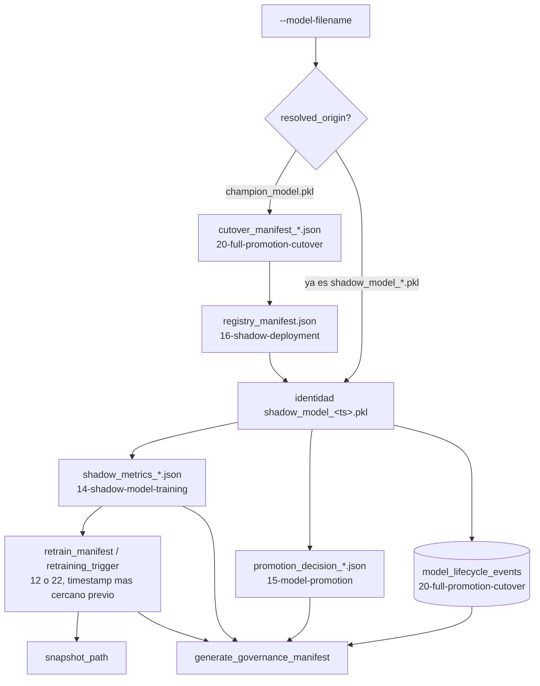

<div align="center">

# 📜 Linaje de Modelos y Gobernanza

**Reconstruye "todo lo que le paso a este modelo" — la alerta de drift que lo causo, con que entreno, sus metricas, su decision de promocion, cada cutover por el que paso — leyendo los mismos archivos y tablas que otras doce tecnicas ya dejaron atras, sin importar ni una linea de su codigo**

🌐 **[English](README.md)** | **[Español](README.es.md)**

[](https://www.python.org/)
[](https://duckdb.org/)
[](tests/)
[](../LICENSE)

</div>

---

## Por qué lo construí así

Cada técnica de la 12 a la 23 en la cadena mlops de este laboratorio
escribe su propio registro, en su propia carpeta, con su propia forma, y
se conecta con sus vecinas solo por convencion de nombres de archivo o
por una referencia cruzada explicita — nunca por codigo. Esa es una
decision deliberada que toda la cadena tomo de forma consistente (ver el
propio docstring de `19-canary-monitoring` sobre por que reimplementa en
vez de importar). El costo de esa decision es que "que le paso a este
modelo" no lo responde nadie — esta disperso en seis carpetas y una base
de datos compartida, y reconstruirlo hoy significa abrir todas a mano.

Esta técnica es esa reconstruccion, automatizada. No agrega una fuente de
verdad nueva; lee las que ya existen y camina la cadena de referencias
entre ellas, de la misma forma que lo haria una persona auditando el
laboratorio. Lo que vale la pena ser honesto desde el principio: algunas
de esas referencias son exactas (un nombre de archivo coincide, caracter
por caracter) y otras son inferidas (el timestamp de un disparador de
drift simplemente precede al de una corrida de entrenamiento). El
expediente de gobernanza mantiene esa distincion visible en vez de
aplanar las dos en el mismo tipo de certeza.

## Qué construye el proyecto

- **`trace_model_lineage`** toma un nombre de archivo de modelo —
  `champion_model.pkl` o cualquier `shadow_model_<timestamp>.pkl` — y
  reconstruye: `data_origin` (el snapshot de drift que alimento sus
  datos de entrenamiento), `drift_trigger` (la alerta que lo causo),
  `training_metrics` (ROC-AUC, tamaño de muestra), `promotion_decision`
  (PROMOTED/REJECTED y cuando), y `deployment_events` (cada
  `FULL_CUTOVER` en el que aparece, tanto del ledger compartido
  `model_lifecycle_events` como de los propios manifiestos de la
  técnica 20). Un modelo sin historial en ningun lado vuelve con
  `status: "UNTRACED"` en vez de una excepcion — la ausencia de
  historial es una respuesta legitima, no una falla de buscar lo
  suficiente.
- **`generate_governance_manifest`** escribe el linaje reconstruido en
  `model_lineage_<model_name>_<timestamp>.json` — el registro de
  auditoria que una revision de gobernanza de verdad pediria.
- **`run_lineage.py`** conecta los dos contra las carpetas reales que
  esta cadena produce, e imprime el expediente completo en stdout
  ademas de guardarlo.

## Resultados de una corrida real, sobre la cadena real

No son fixtures sembrados — la cadena completa corrida de verdad, en
orden: la técnica 12 detecta drift y escribe un manifiesto de
reentrenamiento, la 13 ingiere el snapshot, la 14 entrena un modelo
sombra (ROC-AUC 0.9071), la 15 lo promueve, la 16 lo registra como
challenger activo (renombrandolo a `active_shadow_model.pkl` en su
registro — mas sobre esto abajo), las 18/19 lo corren por un canary que
vuelve `HEALTHY`, la 20 lo conmuta a `champion_model.pkl`, las 21/22
despues lo marcan para reentrenamiento por un AUC realizado
genuinamente bajo, y la 23 entrena un Challenger nuevo en respuesta.
Despues:

```bash
python run_lineage.py --model-filename champion_model.pkl
```

```json
{
  "model_id": "champion_model.pkl",
  "resolved_origin": "shadow_model_20261001T003614Z.pkl",
  "status": "TRACED",
  "data_origin": {
    "snapshot_path": "outputs/snapshots/retrain_data_20261001T003611Z.csv",
    "trigger_reason": "CRITICAL_DRIFT_PSI",
    "features_affected": ["ingreso_mensual"]
  },
  "drift_trigger": {
    "source_file": "retrain_manifest_20261001T003611Z.json",
    "matched_by": "nearest_preceding_timestamp",
    "generated_at": "2026-10-01T00:36:11+00:00"
  },
  "training_metrics": {
    "roc_auc": 0.9071156162183862,
    "n_samples": 2000,
    "trained_at": "2026-10-01T00:36:14+00:00"
  },
  "promotion_decision": {
    "candidate_model": "shadow_model_20261001T003614Z.pkl",
    "decision": "PROMOTED",
    "reason": "Meets minimum ROC-AUC and sample size thresholds"
  },
  "deployment_events": [
    {"source": "cutover_manifest", "event_type": "FULL_CUTOVER",
     "new_champion": "champion_model.pkl", "promoted_at": "2026-10-01T00:37:02.959419+00:00"},
    {"event_type": "FULL_CUTOVER", "new_champion": "champion_model.pkl",
     "promoted_at": "2026-10-01T00:37:02.959419+00:00"}
  ]
}
```

Cada campo de este ejemplo vino de un archivo o una fila de base de
datos escrita por el CLI real de otra técnica, corrido en secuencia, sin
atajos.

## Hallazgos honestos

- **`champion_model.pkl` no lleva a su historial de entrenamiento en un
  salto — lleva dos, y la primera version de esta técnica solo
  implementaba uno.** El `shadow_model_path` del manifiesto de cutover
  no apunta a `shadow_model_<timestamp>.pkl`; apunta a
  `active_shadow_model.pkl`, el nombre fijo que el registro de
  `16-shadow-deployment` siempre usa para el candidato que este activo
  en ese momento (su propio docstring lo dice explicitamente). Correr
  esta técnica contra la cadena real por primera vez produjo un trazado
  con todos los campos en `null` salvo el evento de cutover desnudo — la
  logica de resolucion encontro el manifiesto, encontro
  `shadow_model_path`, y no tenia a donde mas ir. El nombre original con
  su timestamp sobrevive un salto mas atras, en el campo
  `active_version` de `registry_manifest.json`, sentado justo al lado
  de `active_shadow_model.pkl`. Se corrigio siguiendo ese segundo salto,
  y los fixtures de las pruebas ahora modelan la cadena real de dos
  saltos en vez de la cadena mas simple de un salto que la primera
  version asumia.
- **Un `FULL_CUTOVER` aparece dos veces en `deployment_events`, a
  proposito.** La fila de DuckDB solo tiene cinco columnas; el propio
  `cutover_manifest_<timestamp>.json` de la técnica 20 tiene el detalle
  completo (ruta archivada, ruta de config canaria, ruta de la base).
  Deduplicar a una sola significaria elegir cual fuente confiar menos,
  asi que se conservan las dos, cada una etiquetada con su origen.
- **Un disparador de drift se adjunta por "timestamp mas cercano antes
  del entrenamiento", no por ningun ID que los dos archivos realmente
  compartan** — porque ese ID no existe en esta cadena. Esa es una
  limitacion real, no disimulada: el manifiesto trae
  `"matched_by": "nearest_preceding_timestamp"` explicitamente, para que
  nadie que lea un expediente de gobernanza confunda una inferencia con
  una cita.

## Arquitectura



| Módulo | Qué hace |
|---|---|
| [`src/lineage_tracker.py`](src/lineage_tracker.py) | `ModelLineageTracker`: resolucion de identidad a traves de la cadena de dos saltos champion/registro, las uniones exactas y las inferidas por tiempo, y el escritor del manifiesto. |
| [`run_lineage.py`](run_lineage.py) | El CLI: apunta a las carpetas de salida reales de las tecnicas 12, 14, 15, 20, 22, 23 y al ledger compartido. |

## Cómo correrlo

```bash
python -m venv venv
venv\Scripts\activate            # Windows;  source venv/bin/activate en Linux/macOS
pip install -r requirements.txt

python run_lineage.py --model-filename champion_model.pkl   # UNTRACED hasta que la cadena haya corrido
pytest -v                                                    # 9 tests
```

## Tests

9 tests (`pytest -v`): el linaje completo de un Champion reconstruido
exactamente a traves de la cadena real de dos saltos (manifiesto de
cutover → manifiesto de registro → nombre original del shadow),
con las metricas de entrenamiento, una decision `PROMOTED`, y el evento
de cutover todos presentes; el mismo modelo trazado directamente por su
nombre `shadow_model_<timestamp>.pkl`, sin necesitar ningun salto de
resolucion; el manifiesto guardado coincidiendo exactamente con el
trazado en memoria; una ruta de base de datos cuyo padre todavia no
existe sin romper el trazado (los eventos de despliegue simplemente
vuelven vacios); `generate_governance_manifest` creando su directorio de
salida automaticamente; un `RuntimeError` claro cuando se pide un
manifiesto antes de correr un trazado; un archivo JSON corrupto sentado
entre otros validos siendo saltado sin abortar el escaneo; y un modelo
sin historial en ningun lado volviendo `UNTRACED` sin lanzar excepcion,
ya sea porque la carpeta de reportes esta vacia o porque directamente no
existe.

## Alcance

Verificada contra la salida real de las tecnicas 12, 13, 14, 15, 16, 18,
19, 20, 22 y 23, corridas en secuencia para este README — no solo el
fixture sintetico de dos eventos de la suite de pruebas. De solo lectura
en todo momento: esta técnica nunca escribe en la carpeta de ninguna
otra técnica ni en el ledger compartido, solo en su propio
`outputs/manifests/`.

## Autor

Pablo Reyes — [github.com/Rxyxs](https://github.com/Rxyxs)
Código: MIT — ver [LICENSE](../LICENSE)
