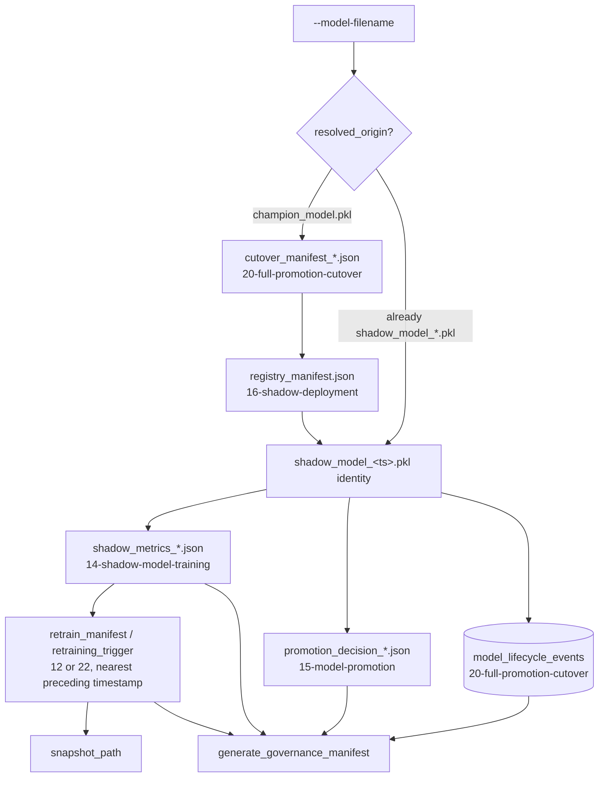

<div align="center">

# 📜 Model Lineage & Governance

**Reconstructs "everything that happened to this model" — the drift alert that caused it, what it trained on, its metrics, its promotion decision, every cutover it went through — by reading the same files and tables twelve other techniques already left behind, without importing a line of their code**

🌐 **[English](README.md)** | **[Español](README.es.md)**

[](https://www.python.org/)
[](https://duckdb.org/)
[](tests/)
[](../LICENSE)

</div>

---

## Why I built it this way

Every technique from 12 through 23 in this lab's mlops chain writes its
own record, in its own folder, in its own shape, and connects to its
neighbors only by file-naming convention or by one explicit cross-file
reference — never by code. That's a deliberate choice this whole chain
has made consistently (see `19-canary-monitoring`'s own docstring on why
it reimplements rather than imports). The cost of that choice is that
"what happened to this model" isn't answered anywhere — it's scattered
across six folders and a shared database, and reconstructing it today
means opening all of them by hand.

This technique is that reconstruction, automated. It doesn't add a new
source of truth; it reads the ones that already exist and walks the
chain of references between them, the same way a person auditing the
lab would. The one thing worth being honest about from the start: some
of those references are exact (a filename matches, character for
character) and some are inferred (a drift trigger's timestamp merely
precedes a training run's). The governance manifest keeps that
distinction visible instead of flattening both into the same kind of
certainty.

## What the project builds

- **`trace_model_lineage`** takes a model filename —
  `champion_model.pkl` or any `shadow_model_<timestamp>.pkl` — and
  reconstructs: `data_origin` (the drift snapshot that fed its training
  data), `drift_trigger` (the alert that caused it), `training_metrics`
  (ROC-AUC, sample size), `promotion_decision` (PROMOTED/REJECTED and
  when), and `deployment_events` (every `FULL_CUTOVER` it appears in,
  from the shared `model_lifecycle_events` ledger and from technique
  20's own manifests). A model with no history anywhere comes back with
  `status: "UNTRACED"` rather than an exception — absence of history is
  a legitimate answer, not a failure to look hard enough.
- **`generate_governance_manifest`** writes the reconstructed lineage to
  `model_lineage_<model_name>_<timestamp>.json` — the audit record a
  governance review would actually ask for.
- **`run_lineage.py`** wires both together against the real folders this
  chain produces, and prints the full expediente to stdout as well as
  saving it.

## Results from an actual run, over the real chain

Not seeded fixtures — the full chain run for real, in order: technique
12 detects drift and writes a retrain manifest, 13 ingests the snapshot,
14 trains a shadow model (ROC-AUC 0.9071), 15 promotes it, 16 registers
it as the active challenger (renaming it to `active_shadow_model.pkl` in
its registry — more on that below), 18/19 run it through a canary that
comes back `HEALTHY`, 20 cuts it over to `champion_model.pkl`, 21/22
later flag it for retraining on a genuinely low realized AUC, and 23
trains a fresh Challenger in response. Then:

```bash
python run_lineage.py --model-filename champion_model.pkl
```

```json
{
  "model_id": "champion_model.pkl",
  "resolved_origin": "shadow_model_20261001T003614Z.pkl",
  "status": "TRACED",
  "data_origin": {
    "snapshot_path": "outputs/snapshots/retrain_data_20261001T003611Z.csv",
    "trigger_reason": "CRITICAL_DRIFT_PSI",
    "features_affected": ["ingreso_mensual"]
  },
  "drift_trigger": {
    "source_file": "retrain_manifest_20261001T003611Z.json",
    "matched_by": "nearest_preceding_timestamp",
    "generated_at": "2026-10-01T00:36:11+00:00"
  },
  "training_metrics": {
    "roc_auc": 0.9071156162183862,
    "n_samples": 2000,
    "trained_at": "2026-10-01T00:36:14+00:00"
  },
  "promotion_decision": {
    "candidate_model": "shadow_model_20261001T003614Z.pkl",
    "decision": "PROMOTED",
    "reason": "Meets minimum ROC-AUC and sample size thresholds"
  },
  "deployment_events": [
    {"source": "cutover_manifest", "event_type": "FULL_CUTOVER",
     "new_champion": "champion_model.pkl", "promoted_at": "2026-10-01T00:37:02.959419+00:00"},
    {"event_type": "FULL_CUTOVER", "new_champion": "champion_model.pkl",
     "promoted_at": "2026-10-01T00:37:02.959419+00:00"}
  ]
}
```

Every field in this example came from a file or a database row written
by a different technique's real CLI, run in sequence, with no shortcuts.

## Honest findings

- **`champion_model.pkl` doesn't lead to its training history in one
  hop — it takes two, and the first version of this technique only
  implemented one.** The cutover manifest's `shadow_model_path` doesn't
  point at `shadow_model_<timestamp>.pkl`; it points at
  `active_shadow_model.pkl`, the fixed name `16-shadow-deployment`'s
  registry always uses for whatever candidate is currently active (its
  own docstring says so explicitly). Running this technique against the
  real chain for the first time produced a trace with every field
  `null` except the bare cutover event — the resolution logic found the
  manifest, found `shadow_model_path`, and had nowhere left to go. The
  original timestamped name survives one more hop back, in
  `registry_manifest.json`'s `active_version` field, sitting right next
  to `active_shadow_model.pkl`. Fixed by following that second hop, and
  the test fixtures now model the real two-hop chain instead of the
  simpler one-hop chain the first version assumed.
- **A `FULL_CUTOVER` shows up twice in `deployment_events`, on purpose.**
  The DuckDB row only has five columns; technique 20's own
  `cutover_manifest_<timestamp>.json` has the full detail (archived
  path, canary config path, DB path). Deduplicating down to one would
  mean picking which source to trust less, so both are kept, each
  tagged with where it came from.
- **A drift trigger is attached by "closest timestamp before training",
  not by any ID the two files actually share** — because no such ID
  exists in this chain. That's a real limitation, not a glossed-over
  one: the manifest carries `"matched_by": "nearest_preceding_timestamp"`
  explicitly, so nobody reading a governance manifest mistakes an
  inference for a citation.

## Architecture



| Module | What it does |
|---|---|
| [`src/lineage_tracker.py`](src/lineage_tracker.py) | `ModelLineageTracker`: identity resolution across the two-hop champion/registry chain, the exact and time-inferred joins, and the manifest writer. |
| [`run_lineage.py`](run_lineage.py) | The CLI: points at the real output folders of techniques 12, 14, 15, 20, 22, 23 and the shared ledger. |

## Running it

```bash
python -m venv venv
venv\Scripts\activate            # Windows;  source venv/bin/activate on Linux/macOS
pip install -r requirements.txt

python run_lineage.py --model-filename champion_model.pkl   # UNTRACED until the chain has run
pytest -v                                                    # 9 tests
```

## Tests

9 tests (`pytest -v`): a Champion's full lineage reconstructed exactly
through the real two-hop chain (cutover manifest → registry manifest →
original shadow filename), with training metrics, a `PROMOTED` decision,
and the cutover event all present; the same model traced directly by its
`shadow_model_<timestamp>.pkl` name, with no resolution hop needed; the
saved manifest matching the in-memory trace exactly; a database path
whose parent doesn't exist yet not breaking the trace (deployment events
just come back empty); `generate_governance_manifest` creating its output
directory automatically; a clear `RuntimeError` when a manifest is
requested before any trace ran; a corrupted JSON file sitting among valid
ones being skipped without aborting the scan; and a model with no history
anywhere coming back `UNTRACED` without raising, whether because the
reports directory is empty or because it doesn't exist at all.

## Scope

Verified against the real output of techniques 12, 13, 14, 15, 16, 18,
19, 20, 22 and 23, run in sequence for this README — not only the test
suite's synthetic two-event fixture. Read-only throughout: this technique
never writes to any other technique's folder or to the shared ledger,
only to its own `outputs/manifests/`.

## Author

Pablo Reyes — [github.com/Rxyxs](https://github.com/Rxyxs)
Code: MIT — see [LICENSE](../LICENSE)
