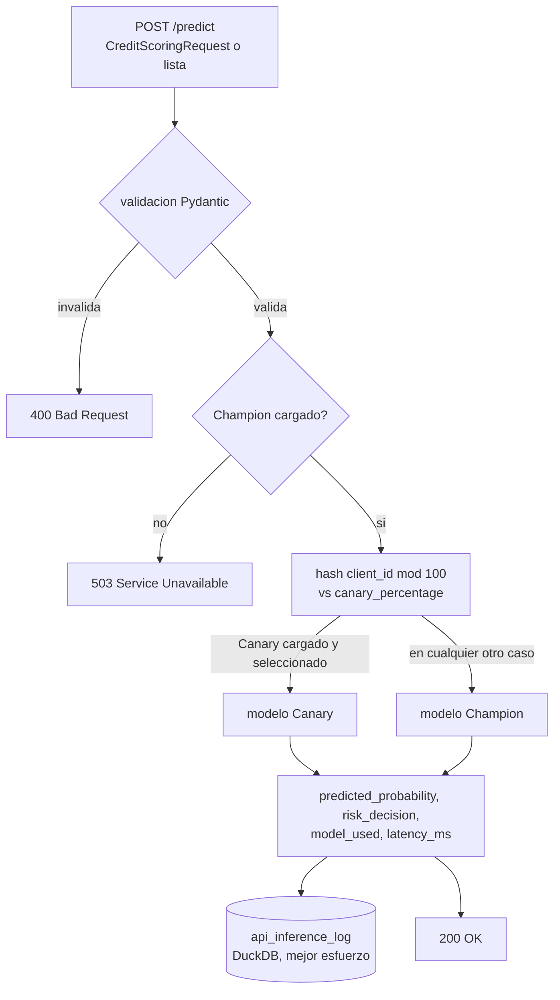

<div align="center">

# ⚡ API de Inferencia en Tiempo Real

**El unico lugar de este laboratorio donde quien llama recibe una respuesta en milisegundos en vez de un archivo que otra tecnica lee despues — FastAPI, validacion con Pydantic, enrutamiento canario deterministico reutilizado de la tecnica 18, y dos reglas de degradado seguro deliberadas en vez de un servidor que miente o se cae**

🌐 **[English](README.md)** | **[Español](README.es.md)**

[](https://www.python.org/)
[](https://fastapi.tiangolo.com/)
[](https://docs.pydantic.dev/)
[](tests/)
[](../LICENSE)

</div>

---

## Por qué lo construí así

Cada técnica de la 12 a la 24 en la cadena mlops de este laboratorio se
integra a su propio ritmo: escribir un archivo, dejar que otra cosa lo
lea cuando le toque. Esa es la forma correcta para deteccion de drift,
entrenamiento, promocion, gobernanza. Es la forma equivocada para lo
unico que un sistema de scoring de credito de verdad tiene que hacer en
produccion: responder la solicitud de un oficial de credito *ahora
mismo*, no cuando corra el proximo batch.

Las dos decisiones que mas importan aca son ambas sobre que pasa cuando
algo falta o esta mal, porque esa es la parte que una demo suele
saltarse:

- **Que no haya Champion cargado no es un 500, y tampoco es un 200 que
  miente.** Tanto `/health` como `/predict` retornan
  `503 Service Unavailable` con un cuerpo que dice por que. Quien reciba
  un `200 OK` de esta API puede confiar en que un modelo real puntuo de
  verdad la solicitud.
- **Un `canary_percentage` de 100 sin modelo Canary cargado no rompe
  nada.** El enrutamiento cae al Champion para el 100% del trafico. Un
  candidato canario que fallo al cargar es motivo para servir a todos
  desde el modelo que se sabe que funciona, nunca motivo para no servir a
  nadie.

## Qué construye el proyecto

- **`CreditScoringRequest`** (Pydantic): `client_id` mas las mismas tres
  features con las que entrena todo modelo de esta cadena desde la
  técnica 12 (`ingreso_mensual`, `dti`, `antiguedad_laboral_meses`) — no
  un esquema arbitrario, el que el Champion que esta API carga realmente
  espera.
- **`GET /health`**: `200` con `champion_loaded`/`canary_loaded`/
  `canary_percentage` cuando hay un Champion en memoria, `503` cuando no
  lo hay.
- **`POST /predict`**: acepta un `CreditScoringRequest` o una lista de
  ellos, enruta cada uno con la misma asignacion de cohorte
  deterministica por hash MD5 que ya usa
  `CanaryRouter.determine_route` de `18-canary-deployment`
  (reimplementada aca, no importada — ver el propio docstring de
  `19-canary-monitoring` sobre por que este laboratorio nunca importa
  entre carpetas de técnicas), lo puntua con el modelo resultante, y
  retorna `predicted_probability`, `risk_decision`
  (`APPROVED`/`REJECTED` con un umbral de 0.5), `model_used`
  (`CHAMPION`/`CANARY`), y `latency_ms` — por solicitud, incluso dentro
  de un lote.
- **Los errores de validacion retornan `400`, no el `422` por defecto de
  FastAPI.** Un manejador de excepciones propio intercepta
  `RequestValidationError` y reescribe el codigo de estado, porque
  `400 Bad Request` es el contrato que pide la especificacion de esta
  técnica y el que esperara quien integre contra esta API.
- Cada prediccion se loguea, en mejor esfuerzo, en `api_inference_log`
  dentro de un archivo DuckDB local — una falla al loguear se traga y se
  advierte, nunca se permite que convierta una prediccion ya calculada en
  una respuesta fallida.

## Resultados de una corrida real

Contra un `champion_model.pkl` real producido corriendo de verdad las
tecnicas 12→13→14→15→16→18→20 en secuencia (drift detectado, ingerido,
entrenado con ROC-AUC 0.92, promovido, registrado, enrutado por canary,
conmutado):

```bash
python run_server.py --port 8123
```

```bash
curl -X POST http://127.0.0.1:8123/predict -H "Content-Type: application/json" \
  -d '{"client_id": "CLI-000042", "ingreso_mensual": 650000.0, "dti": 0.42, "antiguedad_laboral_meses": 18.0}'
```

```json
{
  "predictions": [
    {
      "client_id": "CLI-000042",
      "predicted_probability": 0.992762605199298,
      "risk_decision": "REJECTED",
      "model_used": "CHAMPION",
      "latency_ms": 1.2084999980288558
    }
  ],
  "batch_size": 1
}
```

Un lote de dos en un solo llamado se divide en dos entradas puntuadas de
forma independiente; enviar `"ingreso_mensual": "mucho"` en vez de un
numero vuelve con `400` y el detalle exacto de validacion de Pydantic, no
un stack trace:

```json
{"detail":[{"type":"float_parsing","loc":["body","CreditScoringRequest","ingreso_mensual"],
            "msg":"Input should be a valid number, unable to parse string as a number","input":"mucho"}]}
```

Y el log real en DuckDB muestra cada uno de esos llamados, sin importar
que endpoint o forma de payload los produjo:

```
client_id    predicted_probability  risk_decision  model_used
CLI-000042   0.992763               REJECTED       CHAMPION
CLI-000001   0.111434               APPROVED       CHAMPION
CLI-000002   0.999920               REJECTED       CHAMPION
```

## Hallazgos honestos

- **`Union[List[CreditScoringRequest], CreditScoringRequest]` de FastAPI
  como cuerpo de la solicitud simplemente funciona, incluso para errores
  de validacion** — un solo endpoint de verdad acepta un objeto unico o
  un arreglo en lote sin ninguna logica de ramificacion propia, y
  Pydantic v2 agrega correctamente los errores de ambos miembros del
  union cuando ninguna forma calza. Esta era la unica parte del diseño
  que se sentia como que podia necesitar un workaround, y no lo
  necesito.
- **Un `canary_percentage` de 0 despues de esta corrida no es un bug —
  es `20-full-promotion-cutover` haciendo exactamente su trabajo.** El
  servidor real de arriba cargo un modelo Canary que de verdad existe
  (el registro de `16-shadow-deployment`) junto a un Champion que acaba
  de pasar por un cutover real, que pone `canary_percentage` en cero
  como parte de promover un candidato al 100% — asi que `/health`
  reporta correctamente `canary_loaded: true` con
  `canary_percentage: 0`. Los dos numeros son ciertos a la vez, y
  ninguno necesito esconderse para que la respuesta se viera mas
  prolija.
- **El umbral de riesgo (0.5) es una constante, no un archivo de config
  que esta API lea de ningun lado de la cadena**, porque ninguna técnica
  anterior define uno — `15-model-promotion` tiene un ROC-AUC minimo, no
  un corte de riesgo de negocio. Tratar 0.5 como un default documentado
  en vez de inventar un esquema de config que ninguna otra técnica usa
  se sintio mas honesto que construir infraestructura para una decision
  que nadie rio arriba tomo todavia de verdad.

## Arquitectura



| Módulo | Qué hace |
|---|---|
| [`src/inference_api.py`](src/inference_api.py) | La app FastAPI: esquemas de solicitud/respuesta, la puerta de salud, el enrutamiento canario, la prediccion, y el logueo en mejor esfuerzo. |
| [`run_server.py`](run_server.py) | El CLI: arranca uvicorn contra `src.inference_api:app` en un host/puerto configurable. |

## Cómo correrlo

```bash
python -m venv venv
venv\Scripts\activate            # Windows;  source venv/bin/activate en Linux/macOS
pip install -r requirements.txt

python run_server.py --port 8000     # necesita un champion_model.pkl real para responder 200 en /health
pytest -v                            # 11 tests, completamente autocontenidos
```

## Tests

11 tests (`pytest -v`), via `fastapi.testclient.TestClient` contra la app
real (lifespan incluido) con modelos y config sembrados bajo `tmp_path`:
`/health` retornando `200`/`503` segun si cargo un Champion; una
solicitud individual valida y un lote de 3 registros, ambos retornando
exactamente la estructura esperada; un Champion faltante haciendo que
`/predict` tambien retorne `503`; un string en un campo numerico, un
campo obligatorio faltante, y un registro invalido dentro de un lote por
lo demas valido, los tres retornando `400` con el detalle de validacion,
nunca `422` ni `500`; un `canary_percentage` de 100 de verdad enrutando a
`CANARY`; el mismo porcentaje cayendo de forma segura a `CHAMPION`
cuando el archivo del modelo Canary no existe; y el directorio del log
DuckDB creandose automaticamente cuando su padre todavia no existe — la
misma clase de regresion ya encontrada y corregida en las tecnicas 20,
22 y 23.

## Alcance

Verificada contra un `champion_model.pkl` real producido corriendo de
verdad las tecnicas 12 a la 20 en secuencia, no solo contra los modelos
de prueba sembrados de la suite de pruebas — las respuestas de ejemplo
de arriba vinieron de un proceso `uvicorn` real respondiendo solicitudes
HTTP reales. El umbral de riesgo de 0.5 y el esquema de features estan
fijos para calzar con lo que el pipeline de entrenamiento de este
laboratorio (técnica 14) realmente produce; un conjunto de features o
una politica de umbral distintos necesitarian cambiar esta API y ese
pipeline juntos.

## Autor

Pablo Reyes — [github.com/Rxyxs](https://github.com/Rxyxs)
Código: MIT — ver [LICENSE](../LICENSE)
