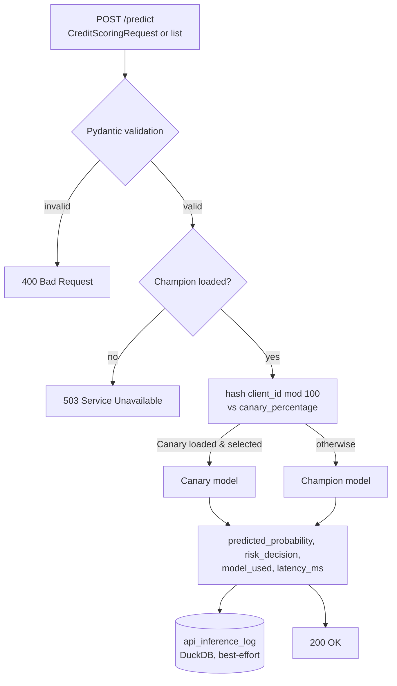

<div align="center">

# ⚡ Real-Time Inference API

**The one place in this lab where an external caller gets an answer in milliseconds instead of a file another technique reads later — FastAPI, Pydantic validation, deterministic canary routing reused from technique 18, and two deliberate safe-degrade rules instead of a server that either lies or crashes**

🌐 **[English](README.md)** | **[Español](README.es.md)**

[](https://www.python.org/)
[](https://fastapi.tiangolo.com/)
[](https://docs.pydantic.dev/)
[](tests/)
[](../LICENSE)

</div>

---

## Why I built it this way

Every technique from 12 through 24 in this lab's mlops chain integrates
on its own schedule: write a file, let something else read it whenever it
gets around to it. That's the right shape for drift detection, training,
promotion, governance. It's the wrong shape for the one thing a credit
scoring system actually has to do in production: answer a loan officer's
request *right now*, not whenever a batch job runs next.

The two decisions that matter most here are both about what happens when
something is missing or wrong, because that's the part a demo usually
skips:

- **No Champion loaded is not a 500, and it's not a lying 200 either.**
  Both `/health` and `/predict` return `503 Service Unavailable` with a
  body that says why. A caller that gets a `200 OK` from this API can
  trust that a real model actually scored the request.
- **A `canary_percentage` of 100 with no Canary model loaded doesn't
  break anything.** Routing falls back to the Champion for 100% of
  traffic. A canary candidate that failed to load is a reason to serve
  everyone from the model that's known to work, never a reason to serve
  no one.

## What the project builds

- **`CreditScoringRequest`** (Pydantic): `client_id` plus the same three
  features every model in this chain has been trained on since technique
  12 (`ingreso_mensual`, `dti`, `antiguedad_laboral_meses`) — not an
  arbitrary schema, the one the Champion this API loads actually expects.
- **`GET /health`**: `200` with `champion_loaded`/`canary_loaded`/
  `canary_percentage` when a Champion is in memory, `503` when it isn't.
- **`POST /predict`**: accepts one `CreditScoringRequest` or a list of
  them, routes each by the same deterministic MD5-hash cohort assignment
  `18-canary-deployment`'s `CanaryRouter.determine_route` already uses
  (reimplemented here, not imported — see
  `19-canary-monitoring`'s own docstring on why this lab never imports
  across technique folders), scores it with the resulting model, and
  returns `predicted_probability`, `risk_decision`
  (`APPROVED`/`REJECTED` at a 0.5 threshold), `model_used`
  (`CHAMPION`/`CANARY`), and `latency_ms` — per request, even inside a
  batch.
- **Validation errors return `400`, not FastAPI's default `422`.** A
  custom exception handler intercepts `RequestValidationError` and
  rewrites the status code, because `400 Bad Request` is the contract
  this technique's spec calls for and the one a caller integrating
  against this API will be built to expect.
- Every prediction is logged, best-effort, to
  `api_inference_log` in a local DuckDB file — a logging failure is
  swallowed and warned about, never allowed to turn an already-computed
  prediction into a failed response.

## Results from an actual run

Against a real `champion_model.pkl` produced by actually running
techniques 12→13→14→15→16→18→20 in sequence (drift detected, ingested,
trained at ROC-AUC 0.92, promoted, registered, canary-routed, cut over):

```bash
python run_server.py --port 8123
```

```bash
curl -X POST http://127.0.0.1:8123/predict -H "Content-Type: application/json" \
  -d '{"client_id": "CLI-000042", "ingreso_mensual": 650000.0, "dti": 0.42, "antiguedad_laboral_meses": 18.0}'
```

```json
{
  "predictions": [
    {
      "client_id": "CLI-000042",
      "predicted_probability": 0.992762605199298,
      "risk_decision": "REJECTED",
      "model_used": "CHAMPION",
      "latency_ms": 1.2084999980288558
    }
  ],
  "batch_size": 1
}
```

A batch of two in one call splits into two independently-scored entries;
sending `"ingreso_mensual": "mucho"` instead of a number comes back `400`
with the exact Pydantic validation detail, not a stack trace:

```json
{"detail":[{"type":"float_parsing","loc":["body","CreditScoringRequest","ingreso_mensual"],
            "msg":"Input should be a valid number, unable to parse string as a number","input":"mucho"}]}
```

And the real DuckDB log shows every one of those calls, independent of
which endpoint or payload shape produced them:

```
client_id    predicted_probability  risk_decision  model_used
CLI-000042   0.992763               REJECTED       CHAMPION
CLI-000001   0.111434               APPROVED       CHAMPION
CLI-000002   0.999920               REJECTED       CHAMPION
```

## Honest findings

- **FastAPI's `Union[List[CreditScoringRequest], CreditScoringRequest]`
  as a request body just works, including for validation errors** — one
  endpoint genuinely accepts a single object or a batch array with no
  branching logic of its own, and Pydantic v2 correctly aggregates
  errors from both union members when neither shape matches. This was
  the one part of the design that felt like it might need a workaround,
  and it didn't.
- **A `canary_percentage` of 0 after this run isn't a bug — it's
  `20-full-promotion-cutover` doing exactly its job.** The real server
  above loaded a Canary model that genuinely exists
  (`16-shadow-deployment`'s registry) alongside a Champion that just went
  through a real cutover, which zeroes `canary_percentage` as part of
  promoting a candidate to 100% — so `/health` correctly reports
  `canary_loaded: true` with `canary_percentage: 0`. Both numbers are
  true at once, and neither needed to be hidden to make the response
  look cleaner.
- **The risk threshold (0.5) is a constant, not a config file this API
  reads from anywhere in the chain**, because no earlier technique
  defines one — `15-model-promotion` has a minimum ROC-AUC, not a
  business risk cutoff. Treating 0.5 as a documented default rather than
  inventing a config schema no other technique uses felt more honest
  than building infrastructure for a decision nobody upstream has
  actually made yet.

## Architecture



| Module | What it does |
|---|---|
| [`src/inference_api.py`](src/inference_api.py) | The FastAPI app: request/response schemas, the health gate, canary routing, prediction, and best-effort logging. |
| [`run_server.py`](run_server.py) | The CLI: starts uvicorn against `src.inference_api:app` on a configurable host/port. |

## Running it

```bash
python -m venv venv
venv\Scripts\activate            # Windows;  source venv/bin/activate on Linux/macOS
pip install -r requirements.txt

python run_server.py --port 8000     # needs a real champion_model.pkl to answer 200 on /health
pytest -v                            # 11 tests, fully self-contained
```

## Tests

11 tests (`pytest -v`), via `fastapi.testclient.TestClient` against the
real app (lifespan included) with models and config seeded under
`tmp_path`: `/health` returning `200`/`503` depending on whether a
Champion loaded; a single valid request and a 3-record batch both
returning the exact expected structure; a missing Champion making
`/predict` return `503` too; a string in a numeric field, a missing
required field, and one invalid record inside an otherwise-valid batch
all returning `400` with validation detail, never `422` or `500`; a
`canary_percentage` of 100 actually routing to `CANARY`; the same
percentage safely falling back to `CHAMPION` when the Canary model file
doesn't exist; and the DuckDB log directory being created automatically
when its parent doesn't exist yet — the same regression class already
found and fixed in techniques 20, 22, and 23.

## Scope

Verified against a real `champion_model.pkl` produced by actually running
techniques 12 through 20 in sequence, not only the test suite's seeded
stub models — the example responses above came from a real `uvicorn`
process answering real HTTP requests. The 0.5 risk threshold and the
feature schema are fixed to match what this lab's training pipeline
(technique 14) actually produces; a different feature set or threshold
policy would need to change both this API and that pipeline together.

## Author

Pablo Reyes — [github.com/Rxyxs](https://github.com/Rxyxs)
Code: MIT — see [LICENSE](../LICENSE)
