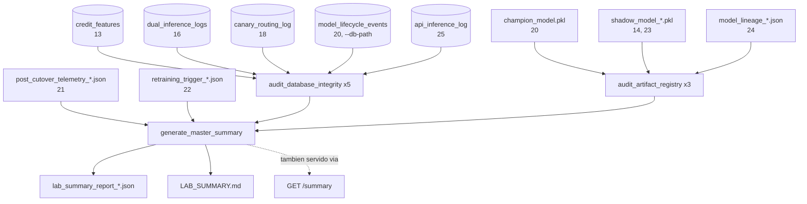

<div align="center">

# 🩺 Panel de Resumen del Laboratorio

**La técnica de cierre: ningun comportamiento mlops nuevo, solo una auditoria de todo lo que las otras veinticinco ya hicieron — cada tabla DuckDB, cada artefacto de modelo, la ultima telemetria, el ultimo disparador de reentrenamiento — consolidado en un veredicto `HEALTHY`/`DEGRADED` con la razon especifica, nunca un numero promediado en una falsa confianza**

🌐 **[English](README.md)** | **[Español](README.es.md)**

[](https://www.python.org/)
[](https://duckdb.org/)
[](https://fastapi.tiangolo.com/)
[](tests/)
[](../LICENSE)

</div>

---

## Por qué lo construí así

Veinticinco técnicas, veinticinco fuentes de verdad independientes, y
ningun lugar unico que diga "¿esta bien el laboratorio, en conjunto,
ahora mismo?". Esa pregunta no se reduce a una sola consulta de base de
datos, porque no hay una sola base de datos —
`13-feature-store-duckdb`, `16-shadow-deployment`,
`18-canary-deployment`, `20-full-promotion-cutover`, y
`25-api-inference-service` cada una guarda su propio archivo DuckDB con
su propia tabla. La primera decision real de esta técnica fue admitir
eso en vez de fingir lo contrario: `audit_database_integrity` toma *una*
ruta e introspecciona lo que ese archivo especifico realmente tiene
(`information_schema.tables`, no una lista fija), y
`generate_master_summary` es quien la llama cinco veces contra los cinco
archivos reales y suma los resultados.

La otra decision que vale la pena dejar explicita es que significa
`DEGRADED`. Habria sido facil construir un puntaje de salud ponderado a
partir de ROC-AUC, PSI, conteos de filas, y validez de artefactos, y
reportar el numero que saliera. Eso esconde exactamente el tipo de cosa
que una auditoria de gobernanza existe para mostrar: *por que*. Asi que
el veredicto aca viene de dos condiciones concretas y nombradas — ningun
Champion valido en servicio, o un disparador de reentrenamiento activo
que nadie atendio todavia — y el reporte siempre dice cual de las dos
disparo, nunca solo la palabra.

## Qué construye el proyecto

- **`audit_database_integrity(db_path)`**: para cualquier archivo DuckDB
  individual, cada tabla que realmente contiene, con su conteo de filas
  y (cuando la tabla tiene una columna de timestamp reconocible) la
  fecha de su evento mas reciente. Un archivo faltante no es un error —
  es una técnica que todavia no corrio — asi que esto nunca intenta
  conectarse a uno; no hay directorio padre que crear para un archivo
  que es, el, lo que falta.
- **`audit_artifact_registry(registry_dir)`**: para cualquier directorio
  individual, si `champion_model.pkl` esta presente y de verdad
  deserializa, cada candidato `shadow_model_*.pkl` y si cada uno es
  valido, y cada reporte `model_lineage_*.json` y si parsea.
- **`generate_master_summary(db_path, outputs_dir)`**: llama a los dos
  metodos de arriba contra las cinco bases reales y los tres directorios
  de artefactos reales que este laboratorio produce, suma las
  ejecuciones totales entre todas las tablas, saca el ultimo ROC-AUC
  realizado/PSI de `21-post-cutover-telemetry` y el ultimo estado de
  disparador de `22-automated-retraining-trigger`, decide
  `HEALTHY`/`DEGRADED`, y escribe tanto
  `lab_summary_report_<timestamp>.json` (el registro estructurado
  completo) como `LAB_SUMMARY.md` (lo mismo, legible).
- **`GET /summary`**: el mismo reporte, por HTTP — un endpoint FastAPI
  para que cualquier dashboard externo lo consulte en vez de leer un
  archivo del disco, el mismo instinto que impulso
  `25-api-inference-service`.

## Resultados de una corrida real, sobre la cadena real

No son fixtures sembrados — la cadena completa corrida de verdad una vez
mas, de punta a punta: la 12 detecta drift, la 13 ingiere, la 14
entrena, la 15 promueve, la 16 registra, la 18 enruta trafico canario,
la 19 reporta `HEALTHY`, la 20 conmuta a `champion_model.pkl`, la
telemetria de la 21 vuelve con un ROC-AUC genuinamente bajo (0.64), la
22 dispara un disparador real, la 23 entrena un Challenger nuevo en
respuesta, la 24 traza el linaje completo del Champion, y la 25 sirve
una prediccion real. Despues:

```bash
python run_lab_summary.py
```

```
estado del laboratorio: DEGRADED
ejecuciones totales registradas: 2404
champion en servicio: ../20-full-promotion-cutover/outputs/models/champion/champion_model.pkl (pickle valido: True)
ultima telemetria: ROC-AUC=0.64  PSI=0.08
disparador de reentrenamiento mas reciente: activo=True
```

```json
{
  "lab_status": "DEGRADED",
  "total_executions": 2404,
  "champion_in_service": {"path": "...champion_model.pkl", "valid_pickle": true, "size_bytes": 1318},
  "latest_telemetry": {"status": "EVALUATED", "realized_roc_auc": 0.64, "psi": 0.08},
  "retraining_trigger_status": {
    "trigger_activated": true,
    "reasons": ["realized_roc_auc=0.6400 por debajo del minimo 0.7200"]
  }
}
```

**`DEGRADED` aca es la respuesta correcta, no un bug.** La técnica 23 si
entreno un Challenger nuevo en respuesta al disparador — esta ahi mismo,
en `shadow_candidate_registries`, un `.pkl` valido y cargable — pero
nunca se corrio de vuelta por 15→16→20 para de verdad volverse el nuevo
Champion. El laboratorio, auditado con honestidad, esta exactamente
donde un circuito cerrado real lo dejaria a mitad de ciclo: la señal
disparo, la respuesta empezo, el circuito todavia no se cerro. Un
dashboard que reportara `HEALTHY` aca porque el archivo del Champion
resulta que sigue siendo valido estaria escondiendo justo lo que esta
auditoria existe para atrapar.

## Hallazgos honestos

- **No existe una unica base de datos "central" en este laboratorio, y
  fingir que la habia habria hecho que esta técnica estuviera mal desde
  el primer dia.** La tarea describia `model_lifecycle_events`,
  `dual_inference_logs`, y otras como si un solo `db_path` las tuviera a
  todas. Construir `audit_database_integrity` de forma generica —
  introspeccionar lo que realmente esta ahi, no asumir un esquema —
  significo que `generate_master_summary` pudiera simplemente llamarla
  cinco veces contra cinco archivos reales en vez de necesitar una
  reescritura en el momento en que esa suposicion chocara con la
  realidad (la misma leccion que la técnica 20 aprendio por las malas
  sobre `canary_percentage` vs. `canary_traffic_percent`).
- **2.404 "ejecuciones" son cinco tipos distintos de fila, sumadas, y el
  numero solo seria activamente enganoso sin el desglose al lado.**
  2.000 filas del feature store, 200 predicciones de inferencia dual,
  200 predicciones enrutadas por canary, 3 eventos de ciclo de vida, y
  un solo llamado real a la API no son la misma unidad de nada. El total
  se reporta porque se pidio, pero el desglose por base es lo que
  encabeza el reporte — la suma es una nota al pie, no el titular.
- **`shadow_candidate_registries` lista dos directorios, y solo uno de
  ellos es alcanzable desde el propio linaje del Champion.** El
  candidato original de `14-shadow-model-training` y el Challenger
  reentrenado de `23-automated-retraining-pipeline` aparecen ambos como
  artefactos validos, pero nada en este reporte dice cual es "el"
  candidato activo ahora mismo — esa pregunta es trabajo de
  `24-model-lineage-governance`, no de esta técnica, y el reporte no
  finge lo contrario eligiendo uno arbitrariamente.

## Arquitectura



| Módulo | Qué hace |
|---|---|
| [`src/lab_summary_engine.py`](src/lab_summary_engine.py) | `LabSummaryEngine`: los auditores genericos de bases/artefactos, la decision `HEALTHY`/`DEGRADED`, y los escritores de JSON + Markdown. |
| [`src/dashboard_api.py`](src/dashboard_api.py) | Un unico endpoint FastAPI `GET /summary` que envuelve el mismo motor. |
| [`run_lab_summary.py`](run_lab_summary.py) | El CLI: corre la auditoria completa e imprime el veredicto en consola. |

## Cómo correrlo

```bash
python -m venv venv
venv\Scripts\activate            # Windows;  source venv/bin/activate en Linux/macOS
pip install -r requirements.txt

python run_lab_summary.py        # audita lo que de las tecnicas 12-25 haya corrido de verdad
pytest -v                        # 12 tests, completamente autocontenidos
```

## Tests

12 tests (`pytest -v`), cada prueba de `generate_master_summary`
sobreescribiendo *todas* las rutas por defecto del motor via
`monkeypatch` para quedar aislada de lo que este checkout tenga o no en
sus propias carpetas `outputs/`: deteccion de tablas con conteos de
filas y la heuristica de ultimo-timestamp, incluyendo una tabla sin
columna de timestamp reconocible reportando `None` en vez de adivinar;
una base faltante y una con directorio padre faltante, ambas manejadas
sin excepcion; un Champion valido, un candidato sombra valido, y un
reporte de linaje valido, todos detectados correctamente, junto a un
pickle corrupto correctamente marcado invalido y un directorio de
registro faltante manejado con elegancia; `HEALTHY` con un Champion
valido y sin disparador activo; `DEGRADED` sin ningun Champion;
`DEGRADED` por un disparador activo sin atender aunque haya un Champion
valido presente; el directorio de salida creandose automaticamente
cuando su padre no existe; y el endpoint `GET /summary` retornando la
misma estructura por HTTP via `TestClient`.

## Alcance

Verificada contra una corrida real y completa de las tecnicas 12 a la 25
en secuencia — el resultado `DEGRADED` y el conteo de 2.404 ejecuciones
de arriba vinieron de una auditoria real de archivos reales y tablas
DuckDB reales, no de un escenario sembrado para producir una respuesta
prolija. De solo lectura en todo momento, como la técnica 24: esto
audita el laboratorio, nunca lo cambia.

## Autor

Pablo Reyes — [github.com/Rxyxs](https://github.com/Rxyxs)
Código: MIT — ver [LICENSE](../LICENSE)
