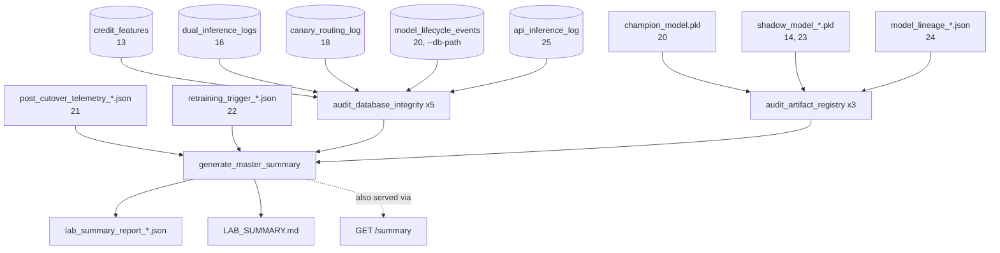

<div align="center">

# 🩺 Lab Summary Dashboard

**The closing technique: no new mlops behavior, only an audit of everything the other twenty-five already did — every DuckDB table, every model artifact, the latest telemetry, the latest retraining trigger — consolidated into one `HEALTHY`/`DEGRADED` verdict with the specific reason, never a number averaged into false confidence**

🌐 **[English](README.md)** | **[Español](README.es.md)**

[](https://www.python.org/)
[](https://duckdb.org/)
[](https://fastapi.tiangolo.com/)
[](tests/)
[](../LICENSE)

</div>

---

## Why I built it this way

Twenty-five techniques, twenty-five independent sources of truth, and no
single place that says "is the lab, as a whole, okay right now." That
question doesn't reduce to one database query, because there isn't one
database — `13-feature-store-duckdb`, `16-shadow-deployment`,
`18-canary-deployment`, `20-full-promotion-cutover`, and
`25-api-inference-service` each keep their own DuckDB file with their own
table. This technique's first real decision was admitting that instead of
pretending otherwise: `audit_database_integrity` takes *one* path and
introspects whatever tables that specific file actually has
(`information_schema.tables`, not a hardcoded list), and
`generate_master_summary` is the one that calls it five times against the
five real files and adds the results together.

The other decision worth being explicit about is what `DEGRADED` means.
It would have been easy to build a weighted health score out of ROC-AUC,
PSI, row counts, and artifact validity, and report whichever number came
out. That hides exactly the kind of thing a governance audit exists to
surface: *why*. So the verdict here comes from two concrete, named
conditions — no valid Champion in service, or an active retraining
trigger nobody has acted on yet — and the report always says which one
fired, never just the word.

## What the project builds

- **`audit_database_integrity(db_path)`**: for any single DuckDB file,
  every table it actually contains, with its row count and (when the
  table has a recognizable timestamp column) the date of its most recent
  event. A missing file isn't an error — it's a technique that hasn't run
  yet — so this never attempts to connect to one; there's no parent
  directory to create for a file that's the thing missing.
- **`audit_artifact_registry(registry_dir)`**: for any single directory,
  whether `champion_model.pkl` is present and actually unpickles, every
  `shadow_model_*.pkl` candidate and whether each one is valid, and every
  `model_lineage_*.json` report and whether it parses.
- **`generate_master_summary(db_path, outputs_dir)`**: calls the two
  methods above against all five real databases and the three real
  artifact directories this lab produces, adds up total executions across
  every table, pulls the latest realized ROC-AUC/PSI from
  `21-post-cutover-telemetry` and the latest trigger state from
  `22-automated-retraining-trigger`, decides `HEALTHY`/`DEGRADED`, and
  writes both `lab_summary_report_<timestamp>.json` (the full structured
  record) and `LAB_SUMMARY.md` (the same thing, readable).
- **`GET /summary`**: the same report, over HTTP — a FastAPI endpoint for
  whatever external dashboard wants to poll this instead of reading a
  file off disk, the same instinct that drove
  `25-api-inference-service`.

## Results from an actual run, over the real chain

Not seeded fixtures — the full chain run for real one more time, start to
finish: 12 detects drift, 13 ingests, 14 trains, 15 promotes, 16
registers, 18 routes canary traffic, 19 reports `HEALTHY`, 20 cuts over
to `champion_model.pkl`, 21's telemetry comes back with a genuinely low
ROC-AUC (0.64), 22 fires a real trigger, 23 trains a fresh Challenger in
response, 24 traces the Champion's full lineage, and 25 serves one real
prediction. Then:

```bash
python run_lab_summary.py
```

```
estado del laboratorio: DEGRADED
ejecuciones totales registradas: 2404
champion en servicio: ../20-full-promotion-cutover/outputs/models/champion/champion_model.pkl (pickle valido: True)
ultima telemetria: ROC-AUC=0.64  PSI=0.08
disparador de reentrenamiento mas reciente: activo=True
```

```json
{
  "lab_status": "DEGRADED",
  "total_executions": 2404,
  "champion_in_service": {"path": "...champion_model.pkl", "valid_pickle": true, "size_bytes": 1318},
  "latest_telemetry": {"status": "EVALUATED", "realized_roc_auc": 0.64, "psi": 0.08},
  "retraining_trigger_status": {
    "trigger_activated": true,
    "reasons": ["realized_roc_auc=0.6400 por debajo del minimo 0.7200"]
  }
}
```

**`DEGRADED` here is the correct answer, not a bug.** Technique 23 did
train a fresh Challenger in response to the trigger — it's sitting right
there in `shadow_candidate_registries`, a valid, loadable `.pkl` — but it
was never run back through 15→16→20 to actually become the new Champion.
The lab, audited honestly, is exactly where a real closed loop would
leave it mid-cycle: the signal fired, the response started, the loop
hasn't closed yet. A dashboard that reported `HEALTHY` here because the
Champion file happens to still be valid would be hiding the one thing
this audit exists to catch.

## Honest findings

- **There is no single "central" database in this lab, and pretending
  there was one would have made this technique wrong on day one.** The
  task described `model_lifecycle_events`, `dual_inference_logs`, and
  others as if one `db_path` held them all. Building
  `audit_database_integrity` generically — introspect what's actually
  there, don't assume a schema — meant `generate_master_summary` could
  just call it five times against five real files instead of needing a
  rewrite the moment that assumption met reality (the same lesson
  technique 20 learned the hard way about `canary_percentage` vs.
  `canary_traffic_percent`).
- **2,404 "executions" is five different kinds of row, added together,
  and the number alone would be actively misleading without the
  breakdown next to it.** 2,000 feature-store rows, 200 dual-inference
  predictions, 200 canary-routed predictions, 3 lifecycle events, and one
  single real API call aren't the same unit of anything. The total is
  reported because it was asked for, but the per-database breakdown is
  what the report leads with — the sum is a footnote, not the headline.
- **`shadow_candidate_registries` lists two directories, and only one of
  them is reachable from the Champion's own lineage.** `14-shadow-model-
  training`'s original candidate and `23-automated-retraining-pipeline`'s
  retrained Challenger both show up as valid artifacts, but nothing in
  this report says which one is "the" active candidate right now — that
  question is `24-model-lineage-governance`'s job, not this technique's,
  and the report doesn't pretend otherwise by picking one arbitrarily.

## Architecture



| Module | What it does |
|---|---|
| [`src/lab_summary_engine.py`](src/lab_summary_engine.py) | `LabSummaryEngine`: the generic database/artifact auditors, the `HEALTHY`/`DEGRADED` decision, and the JSON + Markdown writers. |
| [`src/dashboard_api.py`](src/dashboard_api.py) | A single `GET /summary` FastAPI endpoint wrapping the same engine. |
| [`run_lab_summary.py`](run_lab_summary.py) | The CLI: runs the full audit and prints the verdict to the console. |

## Running it

```bash
python -m venv venv
venv\Scripts\activate            # Windows;  source venv/bin/activate on Linux/macOS
pip install -r requirements.txt

python run_lab_summary.py        # audits whatever of techniques 12-25 has actually run
pytest -v                        # 12 tests, fully self-contained
```

## Tests

12 tests (`pytest -v`), every `generate_master_summary` test overriding
*all* of the engine's default paths via `monkeypatch` so each one is
isolated from whatever this checkout's own `outputs/` folders happen to
contain: table detection with row counts and the latest-timestamp
heuristic, including a table with no recognizable timestamp column
reporting `None` rather than guessing; a missing database and one with a
missing parent directory both handled without an exception; a valid
Champion, a valid shadow candidate, and a valid lineage report all
detected correctly, alongside a corrupted pickle correctly flagged
invalid and a missing registry directory handled gracefully; `HEALTHY`
with a valid Champion and no active trigger; `DEGRADED` with no Champion
at all; `DEGRADED` from an unresolved active trigger even with a valid
Champion present; the output directory being created automatically when
its parent doesn't exist; and the `GET /summary` endpoint returning the
same structure over HTTP via `TestClient`.

## Scope

Verified against a real, complete run of techniques 12 through 25 in
sequence — the `DEGRADED` result and the 2,404-execution count above came
from a real audit of real files and real DuckDB tables, not a seeded
scenario built to produce a clean answer. Read-only throughout, like
technique 24: this audits the lab, it never changes it.

## Author

Pablo Reyes — [github.com/Rxyxs](https://github.com/Rxyxs)
Code: MIT — see [LICENSE](../LICENSE)
