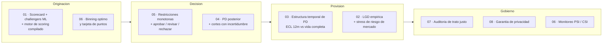

[ 🇺🇸 Read in English ](README.md) | [ 🇨🇱 Español ]

# Credit Risk Scoring Lab

**Ocho enfoques autocontenidos para una misma pregunta — *.que tan probable es que este deudor caiga en default, y que se hace con eso?* — cada uno respondiendola con un metodo distinto, y cada uno reportando lo que su metodo cuesta ademas de lo que aporta.**

[](https://www.python.org/)
[](https://www.r-project.org/)
[](https://es.wikipedia.org/wiki/C_(lenguaje_de_programaci%C3%B3n))
[](#las-ocho-tecnicas)
[](#estandar-de-testing)
[](LICENSE)

---

## Que es este repositorio

Casi todo el material de scoring crediticio se detiene en un modelo y un
numero: ajustar un clasificador, reportar un AUC, listo. Eso deja fuera casi
todo lo que un area de riesgo efectivamente discute — *cuando* llega el
riesgo, cuanto sabe el modelo de los segmentos que apenas vio, si un supervisor
aceptaria su logica, si trata distinto a unos grupos que a otros, si filtra los
datos con los que se entreno, y como alguien se enteraria de que dejo de
funcionar.

Este laboratorio toma cada una de esas preguntas como un problema de
ingenieria propio y lo construye de punta a punta. Cada carpeta es un proyecto
completo: README en dos idiomas, sus propias dependencias y tests, un pipeline
que corre con un solo comando, numeros reales de una corrida real, y una
seccion explicita sobre lo que *no* funciono.

La restriccion que las une es que **las afirmaciones tienen que ser
verificables**. Por eso la mayoria de los algoritmos centrales estan escritos
desde cero en vez de importados, y por eso los datos se simulan desde un
proceso conocido: cuando uno controla la verdad, "el modelo recupero los
coeficientes reales" o "el 91,6% de esa brecha es legitimo" deja de ser una
afirmacion y pasa a ser una medicion.

## Las ocho tecnicas

| # | Tecnica | Carpeta | El problema que aborda |
|---|---|---|---|
| 01 | Scorecard poliglota (R + Python + C) | [`01-polyglot-scorecard-r-python-c`](01-polyglot-scorecard-r-python-c) | El mismo scorecard tiene que ser interpretable *y* rapido en produccion, y esas dos cosas tiran para lados distintos. R construye el scorecard regulatorio WOE/IV, Python entrena los challengers de ML con SHAP, y C implementa el hot-path de scoring compilado. |
| 02 | Interoperabilidad bidireccional R↔Python | [`02-bidirectional-r-python-interop`](02-bidirectional-r-python-interop) | El riesgo de credito no se estima aislado del riesgo de mercado, y la herramienta adecuada para cada uno vive en un lenguaje distinto. Dos puentes vivos — `reticulate` y `rpy2` — mas volatilidad GARCH y LGD calibrada empiricamente con datos macro reales de Chile. |
| 03 | PD de por vida con analisis de supervivencia | [`03-survival-lifetime-pd-term-structure`](03-survival-lifetime-pd-term-structure) | Una PD a 12 meses no dice nada sobre *cuando* llega el riesgo, que es justo de lo que depende la provision bajo IFRS 9. Riesgos proporcionales de Cox desde cero mas un modelo de hazard en tiempo discreto, convertidos en una estructura temporal de PD. |
| 04 | Scorecard bayesiano jerarquico | [`04-bayesian-hierarchical-partial-pooling`](04-bayesian-hierarchical-partial-pooling) | Un solo modelo para una cartera heterogenea esta mal, un modelo por segmento es ruido, y una estimacion puntual esconde cuanto sabe realmente el modelo. Pooling parcial sobre 32 segmentos con un Gibbs de Polya-Gamma. |
| 05 | Restricciones monotonas + decision conforme | [`05-monotonic-constraints-conformal-decisioning`](05-monotonic-constraints-conformal-decisioning) | Un modelo que contradice al dominio no se aprueba, y uno que no puede abstenerse automatiza justo las decisiones que no deberia tomar. Gradient boosting restringido, auditado por perturbacion contrafactual y envuelto en un predictor conforme. |
| 06 | Scorecard con binning optimo | [`06-optimal-binning-scorecard`](06-optimal-binning-scorecard) | El binning decide la mayor parte de la calidad de un scorecard y suele hacerse por costumbre; y un modelo que nadie monitorea falla en silencio. El binning como optimizacion con restricciones resuelta de forma exacta, mas backtesting PSI/CSI por vintage. |
| 07 | Auditoria de trato justo en credito | [`07-fair-lending-bias-audit`](07-fair-lending-bias-audit) | Dejar el atributo protegido fuera del modelo no hace justa la decision, y las correcciones habituales rara vez vienen con su precio. Cinco metricas de equidad con intervalos de confianza, un detector de proxies, y cuatro mitigaciones costeadas en AUC y en pesos. |
| 08 | Scoring con privacidad diferencial | [`08-differential-privacy-scoring`](08-differential-privacy-scoring) | El modelo mismo carga informacion sobre las personas con las que se entreno, y "los datos estan anonimizados" no responde a eso. DP-SGD y un contador RDP desde cero, y despues atacados para ver si la garantia significa algo. |

### Donde cae cada una en el ciclo de vida del credito



## Resultados de un vistazo

Cada numero sale de una corrida real del pipeline de esa carpeta y esta
reproducido en su README con todo el contexto — incluida la advertencia que lo
acompana:

| # | Resultado principal | La advertencia que viene con el |
|---|---|---|
| 01 | El motor de scoring en C calza con el scorecard de R hasta **4,79e-11**; Gini del scorecard 0,466 contra 0,461 del mejor challenger de ML | El modelo interpretable gano con estos datos — reportado derecho, no disfrazado de historia de "gana el modelo mas sofisticado" |
| 02 | LGD calibrada empiricamente **67,4% → 83,7%** bajo una recesion anclada en 2020; ECL de cartera **+24,2%** | Suponer una relacion macro lineal subestima la cola en 8,6 puntos |
| 03 | El **50,5%** del riesgo de default de vida completa llega despues del mes 12; el staging IFRS 9 sube la provision **+19,3%** | El termino variable en el tiempo es contundente dentro de muestra (p = 2,9e-06) y mueve el AUC fuera de muestra en −0,0003 |
| 04 | El pooling parcial reduce **39%** el error de los efectos de segmento; τ posterior 0,515 [0,391, 0,668] cubre el verdadero 0,450 | El corte con incertidumbre **perdio** 3,6% de utilidad — un resultado negativo medido, y reportado como tal |
| 05 | Las restricciones de monotonia llevan las violaciones de **97,15% de los solicitantes a 0,00%** sin costo de precision (AUC 0,7655 → 0,7695) | La politica conforme manda el 50% de la cartera a revision manual con α = 0,10; esa dotacion hay que costearla |
| 06 | El binning por DP encuentra **13% mas IV** que los deciles, con cero variables no monotonas; las bandas separan **9,3x** | Un arbol greedy igual le gana por 0,7 pp de AUC out-of-time — el barrido de resolucion de grilla muestra por que |
| 07 | El modelo reconstruye el genero desde sus propias features con **AUC 0,768**; el **91,6%** de la brecha es correlacion legitima | Sacar el proxy empeoro la disparidad (−2,53 → −4,14 pp) |
| 08 | Los canarios inyectados prueban memorizacion sin DP (**+2,50 pp, t = 44,8**); con ε = 1 la fuga deja de ser detectable | Ese presupuesto cuesta **18,4% del AUC**, y el ataque de membresia de manual no encontro nada en ningun escenario — incluido el modelo que demostrablemente filtraba |

## Que esta implementado desde cero, y como se verifica

Llamar a una libreria es el default correcto en produccion. Es el default
equivocado cuando la mecanica *es* el tema: el codigo que reporta tu
presupuesto de privacidad, o que elige tus bins, es justamente la parte que uno
tiene que poder defender. Cada componente esta construido directamente y
anclado a una verificacion independiente:

| Componente | Donde | Como se establece que esta bien |
|---|---|---|
| Verosimilitud parcial de Cox (Breslow + Efron), gradiente y hessiano analiticos | [03](03-survival-lifetime-pd-term-structure/src/cox_ph.py) | Diferencias finitas (error maximo 6,7e-07) y recuperacion de los coeficientes del simulador (MAE 0,0224) |
| Kaplan-Meier, C-index de Harrell, test PH de Schoenfeld | [03](03-survival-lifetime-pd-term-structure/src/evaluation.py) | Ejemplos de cinco filas calculados a mano; el test PH se gatilla con un efecto variable plantado y con nada mas |
| Aumentacion Polya-Gamma + muestreador de Gibbs conjugado | [04](04-bayesian-hierarchical-partial-pooling/src/polya_gamma.py) | Momentos muestrales contra la media analitica tanh(c/2)/(2c) y la varianza; sesgo de truncamiento acotado y demostradamente unidireccional |
| R̂ dividido y tamano de muestra efectivo de Geyer | [04](04-bayesian-hierarchical-partial-pooling/src/diagnostics.py) | R̂ ≈ 1 con cadenas iid, > 1,5 con cadenas separadas, > 1,2 con deriva interna; ESS < N/5 para AR(1) con ρ = 0,9 |
| Prediccion conforme split Mondrian | [05](05-monotonic-constraints-conformal-decisioning/src/conformal.py) | La cobertura se cumple sobre datos intercambiables **incluso con un modelo deliberadamente inutil**: la garantia es del procedimiento, no del modelo |
| Auditoria contrafactual de monotonia | [05](05-monotonic-constraints-conformal-decisioning/src/monotonicity_audit.py) | Un modelo construido a mano con un escalon a la baja es detectado, uno monotono marca cero, y una direccion invertida marca 100% |
| Binning optimo por programacion dinamica | [06](06-optimal-binning-scorecard/src/binning.py) | Enumeracion exhaustiva de todas las particiones factibles en instancias chicas, con y sin restriccion de monotonia |
| Monitoreo de estabilidad PSI / CSI | [06](06-optimal-binning-scorecard/src/monitoring.py) | Cero para distribuciones identicas, calza con un calculo a mano en un caso de dos bins, y nombra la variable que efectivamente se movio |
| Cinco metricas de equidad + intervalos por bootstrap | [07](07-fair-lending-bias-audit/src/fairness_metrics.py) | Tasas de seleccion calculadas a mano sobre un ejemplo de ocho filas; intercambiar los grupos invierte todos los signos |
| Contador RDP del gaussiano submuestreado | [08](08-differential-privacy-scoring/src/accountant.py) | Con q = 1 tiene que dar exactamente α/(2σ²), verificado sobre varios ordenes de Renyi y niveles de ruido |
| DP-SGD (recorte por ejemplo, ruido gaussiano, muestreo de Poisson) | [08](08-differential-privacy-scoring/src/dp_sgd.py) | Calza con la regresion logistica de scikit-learn al desactivar ruido y recorte (AUC dentro de 0,01, coseno de coeficientes > 0,98) |

## Estandares que cumple cada carpeta

- **Un comando corre todo.** `python run_pipeline.py` regenera los datos,
  ajusta los modelos, evalua y escribe reportes y graficos. Cada etapa ademas
  corre sola con el comando exacto que usa el orquestador, para que "correr
  todo" y "correr un paso" no puedan divergir.
- **Documentacion bilingue.** README en ingles y espanol con selector de
  idioma, y cada numero trazable a un archivo de `outputs/reports/`.
- **Una seccion de hallazgos honestos, siempre.** Los resultados negativos, lo
  que rindio peor de lo esperado y los errores detectados durante la
  construccion quedan escritos en vez de descartados. Varios son la parte mas
  util de su proyecto.
- **Supuestos declarados.** Donde una cifra economica es un supuesto de
  laboratorio (LGD de 45%, margen de 7%, CLP 12.000 por revision manual), se
  dice al lado del resultado que lo usa.
- **Los artefactos generados no entran a git.** Datos y reportes son
  reproducibles desde el pipeline y estan en `.gitignore`; los graficos si se
  versionan porque los READMEs los referencian.

### Estandar de testing

Las tecnicas 03-08 traen **194 tests**; la tecnica 01 reporta 29 en su propio
README. Apuntan a lo que falla *en silencio* y no con un error: una identidad
analitica que la implementacion tiene que reproducir, un ejemplo calculado a
mano, una propiedad que debe cumplirse (cobertura, monotonia, composicion), o
un efecto plantado que un diagnostico esta obligado a detectar — y, igual de
importante, casos donde un diagnostico debe quedarse callado.

| # | Tests | Una verificacion representativa |
|---|---|---|
| 03 | 38 | Breslow ≡ Efron cuando no hay empates, y Breslow estrictamente atenuado cuando los eventos se discretizan mas grueso |
| 04 | 34 | El shrinkage tiene que ser mayor en segmentos chicos, y la incertidumbre posterior correlacionar negativamente con el volumen del segmento |
| 05 | 23 | Los conjuntos de prediccion estan anidados en α: subir α solo puede sacar etiquetas, nunca agregarlas |
| 06 | 34 | La programacion dinamica iguala a la busqueda exhaustiva sobre todas las particiones factibles |
| 07 | 22 | La reponderacion iguala demostrablemente la tasa mala ponderada — y no hace nada si los grupos ya son independientes |
| 08 | 43 | AUC del ataque > 0,70 contra un modelo con tantos parametros como filas, entrenado sobre etiquetas aleatorias |

## Por que los datos son sinteticos

Porque las afirmaciones de este laboratorio son sobre *recuperar* cosas, y una
recuperacion solo se puede verificar contra una verdad que uno controla:

- **03** afirma que la implementacion de Cox devuelve los coeficientes
  verdaderos — el simulador los escribio primero.
- **04** reporta que el pooling parcial estima los efectos de segmento 39%
  mejor; esos efectos se sortearon de un τ conocido, que la posterior despues
  tiene que cubrir.
- **05** sostiene que las restricciones de monotonia salen gratis *aca*
  precisamente porque el proceso generador es monotono donde se imponen — y
  dice derecho que costarian desempeno real donde no lo fuera.
- **07** atribuye el 91,6% de la brecha de genero a factores legitimos, lo que
  solo tiene sentido porque el genero quedo deliberadamente fuera del proceso
  que genera el default.
- **08** demuestra memorizacion con canarios, que solo funcionan como
  instrumento si uno decide que entra al entrenamiento.

La tecnica 02 es la excepcion: usa **datos macro reales de Chile** desde la API
del Banco Mundial para su calibracion de LGD y sus escenarios de stress, porque
esa mitad del proyecto trata de econometria sobre series reales y no de
recuperar parametros conocidos.

## Hallazgos transversales

Los resultados que costo mas trabajo establecer son, en su mayoria, los
incomodos:

- **Una alarma de monitoreo no es un modelo roto.** En la 06 el PSI llego a
  0,36 — catorce veces el umbral de alerta — mientras el AUC *subia* y la
  calibracion se mantenia dentro de 0,12 pp. La poblacion cambio y el modelo
  tenia razon al respecto. Leer el PSI como falla del modelo habria gatillado
  un redesarrollo que la evidencia no respalda.
- **Significancia estadistica no es valor predictivo.** En la 03 un efecto
  variable en el tiempo es contundente dentro de muestra (LR = 21,91,
  p = 2,9e-06) y mueve el AUC fuera de muestra en −0,0003. Se gana su lugar
  mejorando la calibracion, no el ranking — y el pipeline selecciona con ese
  criterio, escrito en el codigo.
- **Sacar un proxy puede aumentar la disparidad.** En la 07, eliminar la
  variable con 11 veces mas senal de grupo que de riesgo empeoro la brecha,
  porque la informacion de grupo que transmitia era favorable. "Saquen las
  variables correlacionadas" mueve la equidad en cualquiera de las dos
  direcciones.
- **Un ataque que no encuentra nada es evidencia debil.** En la 08 el ataque de
  inferencia de membresia estandar reporto cero filtracion para un modelo que
  demostrablemente memorizo 40 registros. El sobreajuste global y la
  memorizacion por registro son fenomenos distintos y necesitan instrumentos
  distintos.
- **Un algoritmo exacto lo es solo respecto de su discretizacion.** En la 06 la
  programacion dinamica es demostrablemente optima y un arbol greedy igual le
  gano, porque la DP solo podia cortar en bordes de la grilla. Refinar la
  grilla cierra casi toda la brecha e identifica el resto como el precio de la
  restriccion de monotonia.

## Como correr una tecnica

Cada carpeta es autocontenida; en la raiz del repositorio no hay nada que
instalar:

```bash
cd 03-survival-lifetime-pd-term-structure    # o cualquier otra carpeta
python -m venv venv
venv\Scripts\activate                        # source venv/bin/activate en Linux/macOS
pip install -r requirements.txt

python run_pipeline.py                       # datos → modelos → reportes → graficos
pytest -q                                    # la suite de tests de esa carpeta
```

Las tecnicas 01 y 02 ademas necesitan R (y, en el caso de la 01, un compilador
de C); sus READMEs cubren ese setup. Las tecnicas 03-08 son Python puro y se
instalan en un paso.

```
credit-risk-scoring-lab/
├── 01-polyglot-scorecard-r-python-c/     R + Python + C, FastAPI, reject inference
├── 02-bidirectional-r-python-interop/    reticulate + rpy2, GARCH, LGD Tobit/GAM
├── 03-survival-lifetime-pd-term-structure/
├── 04-bayesian-hierarchical-partial-pooling/
├── 05-monotonic-constraints-conformal-decisioning/
├── 06-optimal-binning-scorecard/
├── 07-fair-lending-bias-audit/
├── 08-differential-privacy-scoring/
│   ├── README.md / README.es.md          documentacion con resultados reales
│   ├── requirements.txt, pytest.ini
│   ├── run_pipeline.py                   toda la tecnica, un comando
│   ├── src/                              modulos + visualization/
│   ├── tests/
│   └── outputs/plots/                    graficos versionados (los reportes se regeneran)
└── LICENSE
```

## Stack

| Capa | Herramientas |
|---|---|
| Modelamiento base | NumPy, SciPy, pandas, scikit-learn |
| Estadistica / econometria | R (`dplyr`, `glm`, `rugarch`, `AER`, `mgcv`); implementaciones desde cero de Cox, Gibbs, conformal y DP |
| Gradient boosting y explicabilidad | XGBoost, LightGBM, SHAP (01); `HistGradientBoostingClassifier` con restricciones monotonas (05, 07) |
| Deep learning | MLP en PyTorch con focal loss (01) |
| Serving y almacenamiento | FastAPI, DuckDB (01) |
| Interoperabilidad | `reticulate` (R → Python), `rpy2` (Python → R), `ctypes` (Python → C) |
| Graficos | Matplotlib (estaticos, versionados), Plotly (interactivos, regenerados localmente) |

## Autor

Pablo Reyes — [github.com/Rxyxs](https://github.com/Rxyxs)
Codigo: MIT — ver [LICENSE](LICENSE)
