[ 🇺🇸 Read in English ](README.md) | [ 🇨🇱 Español ]

# Credit Risk Scoring Lab

**Ocho enfoques autocontenidos para una misma pregunta — *.que tan probable es que este deudor caiga en default, y que se hace con eso?* — cada uno respondiendola con un metodo distinto, y cada uno reportando lo que su metodo cuesta ademas de lo que aporta.**

[](https://github.com/Rxyxs/credit-risk-scoring-lab/actions/workflows/tests.yml)
[](https://www.python.org/)
[](https://www.r-project.org/)
[](https://es.wikipedia.org/wiki/C_(lenguaje_de_programaci%C3%B3n))
[](#las-ocho-tecnicas-en-detalle)
[](#estandar-de-testing)
[](LICENSE)

---

## Que es este repositorio

Casi todo el material de scoring crediticio se detiene en un modelo y un
numero: ajustar un clasificador, reportar un AUC, listo. Eso deja fuera casi
todo lo que un area de riesgo efectivamente discute — *cuando* llega el riesgo,
cuanto sabe el modelo de los segmentos que apenas vio, si un supervisor
aceptaria su logica, si trata distinto a unos grupos que a otros, si filtra los
datos con los que se entreno, y como alguien se enteraria de que dejo de
funcionar.

Este laboratorio toma cada una de esas preguntas como un problema de ingenieria
propio y lo construye de punta a punta. Cada carpeta es un proyecto completo:
README en dos idiomas, sus propias dependencias y tests, un pipeline que corre
con un solo comando, numeros reales de una corrida real, y una seccion
explicita sobre lo que *no* funciono.

La restriccion que las une es que **las afirmaciones tienen que ser
verificables**. Por eso la mayoria de los algoritmos centrales estan escritos
desde cero en vez de importados, y por eso los datos se simulan desde un proceso
conocido: cuando uno controla la verdad, "el modelo recupero los coeficientes
reales" o "el 91,6% de esa brecha es legitimo" deja de ser una afirmacion y pasa
a ser una medicion.

### Donde cae cada tecnica en el ciclo de vida del credito

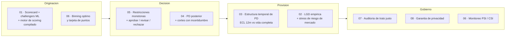

### Resultados de un vistazo

| # | Tecnica | Resultado principal | La advertencia que viene con el |
|---|---|---|---|
| [01](#01--scorecard-poliglota-r--python--c) | Scorecard poliglota | El motor en C calza con el scorecard de R hasta **4,79e-11** a **270,6M filas/s** | El scorecard interpretable ademas *gano* en precision — reportado derecho |
| [02](#02--interoperabilidad-bidireccional-rpython) | Interop R↔Python | LGD empirica **67,4% → 83,7%** en escenario de recesion; ECL **+24,2%** | Suponer relacion macro lineal subestima la cola en 8,6 puntos |
| [03](#03--pd-de-por-vida-con-analisis-de-supervivencia) | PD de por vida | El **50,5%** del riesgo llega despues del mes 12; provisiones **+19,3%** | El termino variable es significativo dentro de muestra y mueve el AUC en −0,0003 |
| [04](#04--scorecard-bayesiano-jerarquico) | Bayes jerarquico | Error de efectos de segmento **−39%**; τ posterior cubre el valor verdadero | El corte con incertidumbre **perdio** 3,6% de utilidad |
| [05](#05--restricciones-monotonas--decision-conforme) | Monotonia + conformal | Violaciones **97,15% → 0,00%** sin costo de precision | El volumen de revision conforme es 50% de la cartera con α = 0,10 |
| [06](#06--scorecard-con-binning-optimo) | Binning optimo | **+13% de IV** sobre deciles, cero variables no monotonas, bandas separan **9,3x** | Un arbol greedy igual le gana por 0,7 pp de AUC out-of-time |
| [07](#07--auditoria-de-trato-justo-en-credito) | Auditoria de equidad | El genero se reconstruye desde las features del modelo con **AUC 0,768** | Sacar el proxy empeoro la disparidad |
| [08](#08--scoring-con-privacidad-diferencial) | Privacidad diferencial | Los canarios prueban memorizacion (**t = 44,8**); ε = 1 la vuelve indetectable | Ese presupuesto cuesta **18,4% del AUC** |

---

# Las ocho tecnicas, en detalle

## 01 · Scorecard poliglota (R + Python + C)

**Carpeta:** [`01-polyglot-scorecard-r-python-c`](01-polyglot-scorecard-r-python-c)

**El problema.** Un scorecard tiene dos jefes. El comite de riesgo y el
regulador quieren leerlo: cada variable, cada tramo, cada punto. El sistema de
originacion quiere puntuar una solicitud en lo que demora en cargar una pagina,
miles de veces por minuto. Esos requisitos tiran el diseno para lados opuestos,
y la respuesta habitual es elegir uno y pedir disculpas por el otro.

**El metodo.** Cada lenguaje hace el trabajo que efectivamente hace en un area
de riesgo. **R** construye el scorecard regulatorio WOE/IV con regresion
logistica y puntos PDO. **Python** entrena los challengers de ML (XGBoost,
LightGBM, Random Forest) con explicabilidad SHAP, un MLP en PyTorch con focal
loss, y experimentos de reject inference. **C** implementa el hot-path de
scoring compilado, expuesto via `ctypes`, y su salida se **verifica** contra el
score de R en vez de suponerse igual. Un servicio FastAPI expone campeon y
retador detras del mismo endpoint.

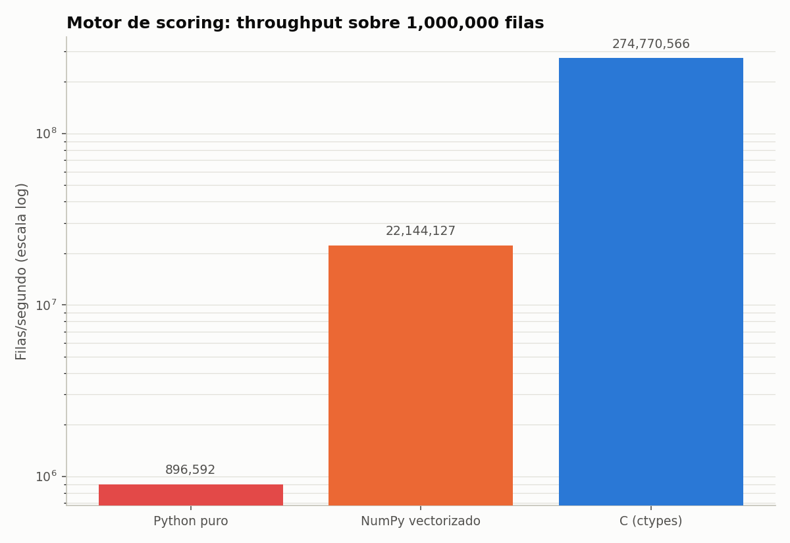

*Throughput sobre 1.000.000 de filas, escala log. El motor compilado puntua
270,6M filas/segundo contra 24,3M de NumPy vectorizado y 0,97M de un loop de
Python puro — y entrega el mismo numero que el scorecard de R hasta 4,79e-11,
que es la parte que hace la velocidad utilizable y no solo llamativa.*

**Que salio.** El scorecard llego a Gini 0,466 y KS 0,358; el mejor challenger
de ML llego a Gini 0,461. **Gano el modelo interpretable**, y el proyecto lo
dice en vez de reformular la comparacion. La seccion de reject inference
encuentra que el AUC medido solo sobre los aprobados es sistematicamente menor
que sobre la poblacion completa — un efecto de seleccion de manual, medido en
vez de citado.

---

## 02 · Interoperabilidad bidireccional R↔Python

**Carpeta:** [`02-bidirectional-r-python-interop`](02-bidirectional-r-python-interop)

**El problema.** El riesgo de credito y el de mercado se gestionan juntos y se
modelan por separado. Las tasas de default y la volatilidad de mercado suben
juntas — el *wrong-way risk* que preocupa a un comite — pero la herramienta
natural para cada uno vive en un lenguaje distinto: pandas y XGBoost de un
lado, `quantmod`, `rugarch` y regresion censurada del otro.

**El metodo.** Dos puentes genuinos corriendo en direcciones opuestas, no dos
carpetas intercambiando CSVs. `reticulate` permite que R llame a Python y reciba
un DataFrame de pandas vivo como data frame de R; `rpy2` permite que Python
llame a R y cargue un objeto de modelo entrenado en R. Python se encarga de la
limpieza y el scoring; R del analisis de mercado en velas, la volatilidad GARCH
y la LGD calibrada empiricamente con Tobit y GAM sobre **datos macro reales de
Chile** desde la API del Banco Mundial.

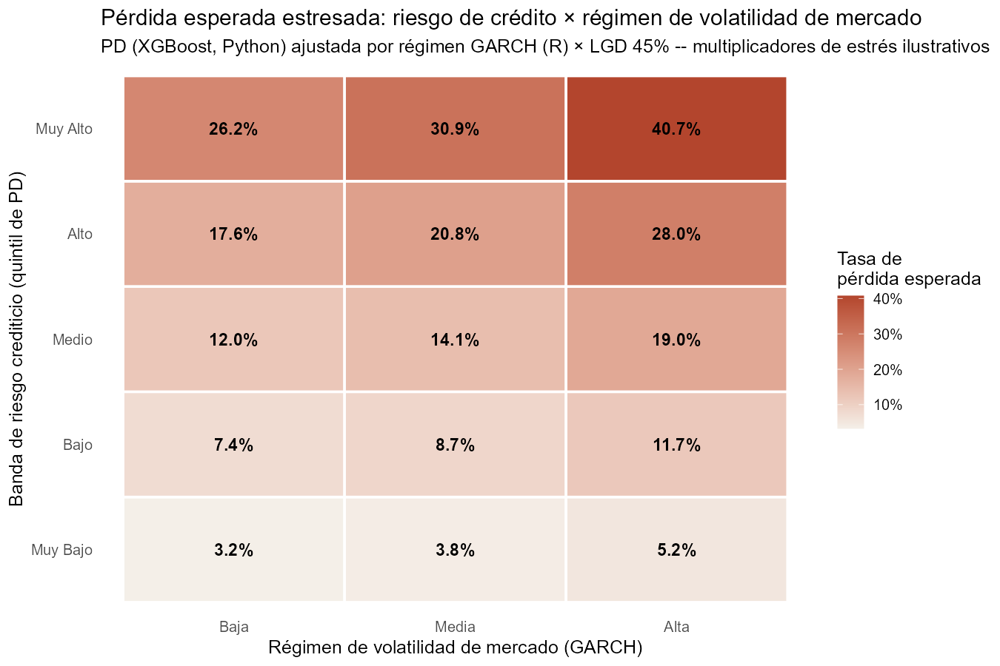

*La pieza central: perdida esperada por banda de riesgo crediticio estresada
contra tres regimenes de volatilidad de mercado — un numero que un comite de
riesgo puede leer, producido por un modelo de ML en Python y uno econometrico en
R dentro de la misma figura.*

**Que salio.** Discriminacion de PD con AUC 0,750 y KS 0,424 desde regresion
logistica (de nuevo ganandole a XGBoost, de nuevo reportado derecho). LGD
calibrada empiricamente de **67,4%** en el escenario base contra el supuesto
plano de 45% tipico de la industria, subiendo a **83,7%** en un escenario severo
anclado en 2020, y ECL de cartera **+24,2%** bajo staging IFRS 9. Suponer una
relacion macro *lineal* subestima la LGD del escenario severo en 8,6 puntos —
el argumento para ajustar un GAM y no una recta.

---

## 03 · PD de por vida con analisis de supervivencia

**Carpeta:** [`03-survival-lifetime-pd-term-structure`](03-survival-lifetime-pd-term-structure) · 38 tests

**El problema.** Un scorecard responde *si* un deudor cae en default en los
proximos 12 meses. No puede responder *cuando*, y de "cuando" depende la
provision: IFRS 9 pide perdida esperada a 12 meses en Stage 1 y perdida esperada
a **vida completa** en Stage 2. Un solo numero no produce las dos.

**El metodo.** Modelar el hazard en vez de la etiqueta. Cada credito se sigue
mes a mes hasta que cae en default, prepaga o sale de la ventana de observacion,
y un credito censurado se trata como observacion incompleta y no como cliente
bueno. El modelo de Cox esta escrito desde cero — verosimilitudes parciales de
Breslow *y* Efron, gradiente y hessiano analiticos via sumas acumuladas por
sufijo, Newton-Raphson amortiguado, residuos de Schoenfeld escalados — junto a
un modelo de hazard en tiempo discreto sobre datos persona-periodo, que trata
los empates mensuales de forma exacta.

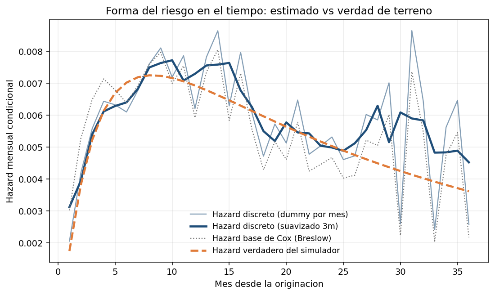

*El hazard estimado contra el que efectivamente uso el simulador. La joroba de
seasoning — el riesgo subiendo despues de la originacion, con peak alrededor del
mes 8-10, y despues bajando — queda recuperada, y la curva se vuelve
visiblemente mas ruidosa pasado el mes 25, cuando los creditos a 12 y 24 meses
salen de la cartera y adelgazan el conjunto en riesgo. Esa degradacion esta en
el grafico porque es real.*

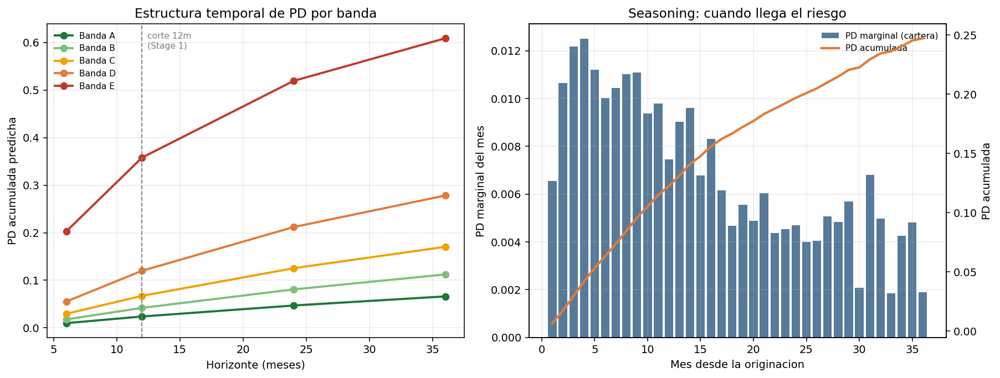

*Izquierda: PD acumulada por horizonte para cada banda de riesgo, con el corte
de 12 meses (Stage 1) marcado. Derecha: cuando llega efectivamente el riesgo en
la cartera. La banda A llega a 2,4% a los 12 meses y a 6,6% en la vida completa
— casi dos tercios de su riesgo queda mas alla del corte que un modelo a 12
meses alcanza a ver.*

**Que salio.** El motor escrito desde cero recupera los coeficientes del
simulador con un error absoluto medio de **0,0224**, su gradiente analitico
calza con diferencias finitas hasta 6,7e-07, y el test de Schoenfeld marca
**exactamente una** covariable — la construida con efecto decreciente — sin
falsas alarmas entre las otras ocho. Fuera de muestra: C-index 0,7841, AUC
0,8132 a 12 meses. El **50,5% del riesgo de default de vida completa llega
despues del mes 12**, y reconocerlo sobre el 9,3% de la cartera que gatilla el
proxy de SICR sube la provision de CLP 660,6M a 787,8M (**+19,3%**).

**La advertencia.** La especificacion variable en el tiempo es contundente
dentro de muestra (LR = 21,91, p = 2,9e-06) y mueve el AUC fuera de muestra en
**−0,0003**. Se gana su lugar mejorando la calibracion (−13% de error), no el
ranking — y el pipeline selecciona con ese criterio, escrito en el codigo.

---

## 04 · Scorecard bayesiano jerarquico

**Carpeta:** [`04-bayesian-hierarchical-partial-pooling`](04-bayesian-hierarchical-partial-pooling) · 34 tests

**El problema.** Una cartera nunca es una sola poblacion. El mismo banco presta
en Santiago y en Los Lagos, a asalariados e informales, por sucursal y por app.
Modelarlos juntos le pone al segmento delgado el precio del promedio; modelarlos
por separado convierte 30 observaciones en politica. Y una estimacion puntual no
dice en cual de las dos situaciones uno esta.

**El metodo.** Pooling parcial: el efecto de cada segmento se sortea de una
distribucion comun cuya dispersion τ tambien se estima, asi que los segmentos
con historia conservan su estimacion y los delgados se corren hacia el promedio
— sin constante de shrinkage que elegir. El muestreador esta escrito desde cero
sobre **aumentacion Polya-Gamma**, que vuelve la verosimilitud logistica
condicionalmente gaussiana y colapsa todo a pasos de Gibbs en forma cerrada: sin
Metropolis, sin tasa de aceptacion, sin tuning. El R̂ dividido y el ESS de Geyer
tambien estan implementados directamente.

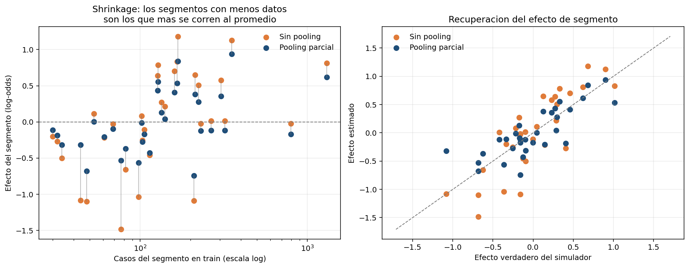

*Izquierda: el efecto estimado de cada segmento con y sin pooling, contra
cuantos casos de entrenamiento tiene (escala log). Las lineas grises son el
shrinkage: largas donde los datos son escasos, casi invisibles donde abundan.
Derecha: recuperacion contra los efectos verdaderos del simulador; las
estimaciones con pooling quedan mas cerca de la diagonal.*

**Que salio.** El pooling parcial gana en todas las metricas predictivas (AUC
0,8309, mejor log-loss) y reduce **39%** el error de los efectos de segmento
recuperados frente a los dos extremos. El parametro de dispersion vuelve en
**τ = 0,515 con intervalo creible al 90% de [0,391, 0,668]**, cubriendo el
verdadero 0,450 — y al modelo nunca se le dijo que los segmentos difieren. La
configuracion sin pooling falla legitimamente su chequeo de convergencia
(R̂ = 1,36), porque el intercepto y los efectos de segmento solo estan
identificados por su *suma*; diagnosticar esa suma por separado (R̂ = 1,0028)
distingue "este modelo esta roto" de "esta parametrizacion no es
identificable".

**La advertencia.** Decidir con el percentil 95 de la posterior en vez de su
media **costo 3,6% de utilidad** al 80% de aprobacion. El mecanismo funciona
como se diseno — los solicitantes que rechaza cargan 2,5 veces la desviacion
posterior de la cartera — pero no quedaba suficiente incertidumbre, a este
tamano de muestra, para que la cautela pagara. Reportado como el resultado
negativo medido que es.

---

## 05 · Restricciones monotonas + decision conforme

**Carpeta:** [`05-monotonic-constraints-conformal-decisioning`](05-monotonic-constraints-conformal-decisioning) · 23 tests

**El problema.** Hay dos cosas que hunden un modelo en la sala donde se
aprueba, y ninguna es el AUC. La primera: contesta mal una pregunta que
cualquiera puede hacer — *si a este solicitante le sube la carga financiera y
todo lo demas queda igual, .el modelo dice que el riesgo es mayor?* La segunda:
no tiene forma de decir "no se", asi que decide sobre solicitantes en los que no
tiene nada que opinar.

**El metodo.** Restricciones de monotonia donde el dominio las respalda (siete
features) y deliberadamente **no** en la edad, cuyo efecto real tiene forma de
U. Despues, una auditoria contrafactual que mueve una variable por una grilla
para cada solicitante, dejando el resto fijo, y cuenta reversiones. Encima, un
predictor conforme Mondrian convierte la PD en aprobar / revision manual /
rechazar con garantia de cobertura sin supuestos distribucionales.

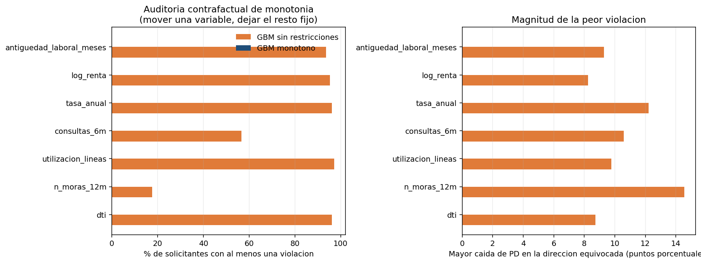

*El modelo sin restricciones viola la monotonia en hasta 97,6% de los
solicitantes en una sola variable, con reversiones de hasta 14,5 puntos de PD.
Las barras del modelo restringido son invisibles porque valen cero: por
construccion, no por suerte. Notar ademas que su curva de respuesta *promedio*
se ve casi bien: las violaciones son a nivel individual, que es exactamente el
nivel en el que opera un reclamo de un cliente o una revision del supervisor.*

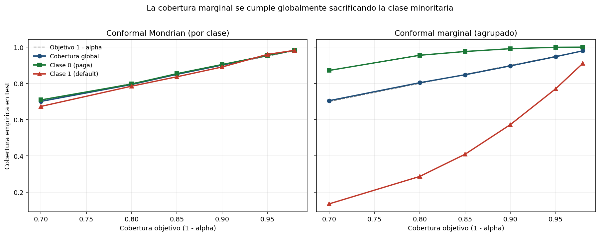

*Por que importa la variante condicional por clase (Mondrian). Izquierda: la
cobertura sigue al objetivo en las dos clases. Derecha: la version marginal
cumple el mismo objetivo global cubriendo a la clase que paga en 99% y dejando
caer a la clase de default hasta 57%. Con una tasa base de 23%, "90% de
cobertura" calculado sobre la poblacion agrupada es casi enteramente una
afirmacion sobre la clase mayoritaria.*

**Que salio.** Restringir no costo **nada**: el AUC paso de 0,7655 a **0,7695**
— con un proceso de riesgo genuinamente monotono, la restriccion saca justo la
flexibilidad que estaba ajustando ruido. Con α = 0,10, la politica conforme en
tres vias comete **un tercio menos de errores** en lo que automatiza que una
banda de score que manda el mismo volumen a revision (19,79% contra 29,41%), y
8% mas de utilidad. Un stress de cambio poblacional muestra despues donde se
rompe la garantia: en una cartera deteriorada la clase que paga cae nueve puntos
bajo el objetivo y las aprobaciones automaticas se reducen a la mitad —
recalibrar con 2.100 casos nuevos lo restituye.

**La advertencia.** La mitad de la cartera va a revision manual con α = 0,10.
Eso es el modelo reportando honestamente que no puede descartar ninguna de las
dos etiquetas para la mayoria, pero a los analistas hay que pagarlos; el barrido
de α le pone precio a ese dial.

---

## 06 · Scorecard con binning optimo

**Carpeta:** [`06-optimal-binning-scorecard`](06-optimal-binning-scorecard) · 34 tests

**El problema.** El paso menos glamoroso de un scorecard define la mayor parte
de su calidad: **donde se corta cada variable**. Las respuestas habituales son
deciles (rapido, ciego a la etiqueta) o un arbol de decision (usa la etiqueta,
pero es un heuristico greedy sin garantia de optimalidad y ninguna de
monotonia). Y una vez en produccion, un scorecard que nadie monitorea falla en
silencio.

**El metodo.** Plantear el binning como lo que es — particionar un eje ordenado
maximizando el Information Value sujeto a a lo mas K bins, un minimo de
poblacion y de eventos por bin, y una secuencia de WOE monotona — y resolverlo
**exacto** por programacion dinamica sobre sumas de prefijos de todos los
tramos. Despues, una tarjeta de puntos con la transformacion PDO estandar, y
monitoreo PSI/CSI reproducido vintage por vintage sobre una cartera con un
quiebre de poblacion conocido.

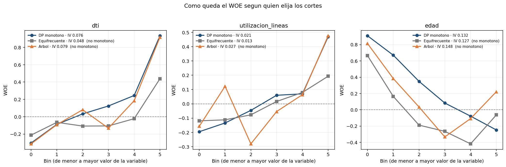

*Las mismas tres variables, cortadas de tres formas. La DP produce un WOE
monotono y limpio en todos los casos; el arbol zigzaguea en la utilizacion de
lineas (baja, sube, baja, sube entre bins consecutivos) — una tarjeta que nadie
quiere defender. En la edad, cuyo efecto real es en U, la DP monotona
deliberadamente resigna IV en vez de fingir una forma que el dominio no tiene.*

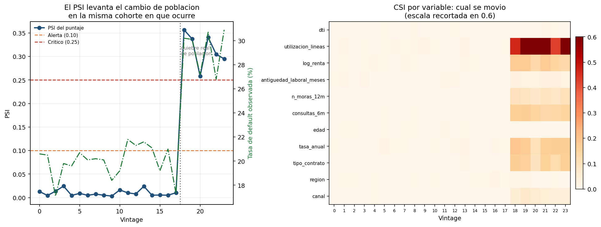

*Izquierda: el PSI se mantiene bajo 0,025 durante dieciocho vintages estables —
sin falsas alarmas — y salta a 0,36 exactamente en la cohorte donde se quiebra
la poblacion. Derecha: el CSI por variable nombra al culpable en vez de solo
levantar la bandera; la utilizacion de lineas es la variable que el simulador
movio con mas fuerza.*

**Que salio.** La DP recupera **13% mas IV** que el binning equifrecuente y es
el unico metodo que produce una tarjeta con cero variables no monotonas. Las
bandas resultantes separan **9,3x** en tasa de default observada (47,79% en la
banda E contra 5,16% en la A). La afirmacion de exactitud no es retorica: un
test enumera *todas* las particiones factibles en instancias chicas y la DP
coincide, con y sin restriccion de monotonia.

**La advertencia, y el hallazgo mas interesante.** Un arbol greedy igual le gana
a la DP por 0,7 pp de AUC out-of-time — porque la DP solo puede cortar en bordes
de la grilla de pre-binning, cosa que el barrido de resolucion demuestra al
converger a los cortes del arbol cuando la grilla se refina. Y el resultado del
monitoreo va contra la lectura obvia: el PSI grito (0,36, catorce veces el
umbral de alerta) **mientras el modelo seguia siendo correcto** — el AUC incluso
subio y la calibracion se mantuvo dentro de 0,12 pp. La poblacion cambio; el
modelo tenia razon al respecto.

---

## 07 · Auditoria de trato justo en credito

**Carpeta:** [`07-fair-lending-bias-audit`](07-fair-lending-bias-audit) · 22 tests

**El problema.** Todo modelo de credito parte de la misma regla: el atributo
protegido no entra al modelo. Esa regla es exigible legalmente y, como garantia
de equidad, vale bastante poco por si sola: si las features correlacionan lo
suficiente con el grupo, el modelo lo reconstruye haya o no intencion de por
medio.

**El metodo.** Un simulador donde **el genero esta ausente del proceso que
genera el default**, pero correlaciona con la renta y la antiguedad laboral (una
brecha salarial, trayectorias interrumpidas) y donde el sector laboral esta
fuertemente segregado por genero aportando casi nada de senal de riesgo.
Cualquier disparidad que aparezca despues es, entonces, correlacion legitima o
artefacto del modelo, nunca causalidad. Sobre eso: cinco metricas de equidad con
intervalos por bootstrap, un detector de proxies por variable, una descomposicion
estratificada de la brecha, y cuatro mitigaciones comparadas a igual volumen de
aprobacion.

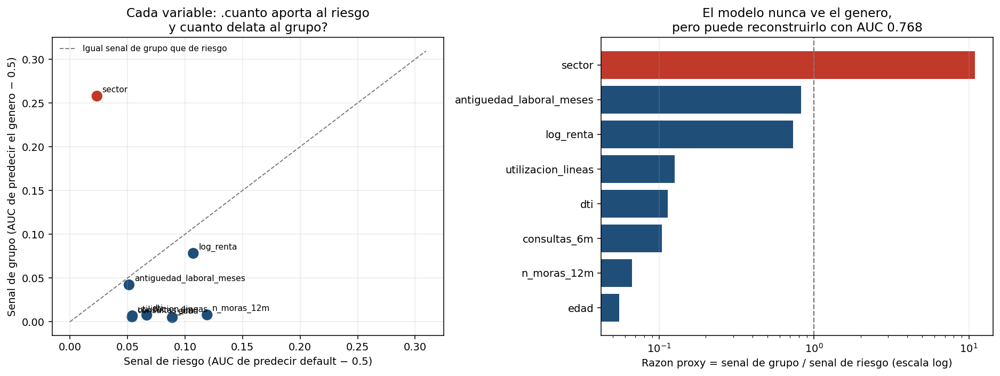

*Izquierda: la senal de grupo de cada feature contra su senal de riesgo. Todo
queda bajo la diagonal — ganandose su lugar — excepto `sector`, que carga mucha
mas informacion sobre el genero que sobre el default. Derecha: lo mismo como
razon en escala log, con el titular arriba: un modelo que nunca ve el genero
puede reconstruirlo desde sus propios insumos con AUC 0,768.*

**Que salio.** `sector` carga **11 veces mas senal de grupo que de riesgo**. La
brecha en PD predicha es de **+1,430 pp bruta y +0,120 pp entre perfiles
comparables** — el **91,6% es correlacion legitima** con la renta y la carga
financiera. Las cinco metricas se reportan con intervalos: ratio de impacto
adverso 0,9688 [0,9462, 0,9971], comodamente sobre el umbral regulatorio de
0,80; paridad demografica −2,53 pp [−4,39, −0,23], chica pero distinguible de
cero; y una brecha de calibracion que **no** se distingue de cero.

**La advertencia — el resultado mas util del proyecto.** Sacar el proxy empeoro
la disparidad (−2,53 → −4,14 pp). La informacion de grupo que `sector`
transmitia era *favorable*: los sectores mayoritariamente femeninos tienen
riesgo levemente menor, asi que incluirlo compensaba en parte la brecha de
renta. "Saquen las variables correlacionadas" es una regla de dedo que mueve la
equidad en cualquiera de las dos direcciones, y hay que medirla variable por
variable sobre la cartera real.

---

## 08 · Scoring con privacidad diferencial

**Carpeta:** [`08-differential-privacy-scoring`](08-differential-privacy-scoring) · 43 tests

**El problema.** Un modelo de credito se entrena con los datos mas sensibles
que una persona entrega, y despues sale de la sala: a un proveedor, a una API, a
veces a un paper. Anonimizar la tabla de entrenamiento no zanja el asunto,
porque el modelo mismo carga informacion sobre las personas que lo entrenaron.

**El metodo.** Las dos mitades escritas desde cero. **DP-SGD**: gradientes por
ejemplo, recorte L2 para acotar la influencia de una persona, ruido gaussiano, y
submuestreo de Poisson — el esquema de muestreo que la contabilidad
efectivamente supone. **Un contador RDP** para el mecanismo gaussiano
submuestreado, compuesto sobre los pasos de entrenamiento y convertido a
(ε, δ), con el ruido calibrado por busqueda binaria al presupuesto objetivo. Y
despues la parte que casi todo escrito sobre DP se salta: atacar el resultado,
con un ataque de inferencia de membresia y 40 canarios inyectados — perfiles de
solicitante impecables etiquetados como default, cuya PD elevada solo puede ser
memorizacion.

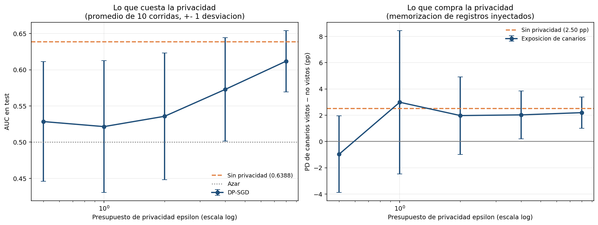

*Izquierda: lo que cuesta la privacidad — AUC contra epsilon, promediado sobre
diez corridas independientes con una desviacion estandar, contra la linea del
modelo sin privacidad. Derecha: lo que compra — la brecha de PD entre los
canarios que el modelo entreno y otros identicos que nunca vio. Las barras de
error de la derecha son el hallazgo: bajo ruido el efecto deja de distinguirse
de cero en vez de desaparecer limpiamente.*

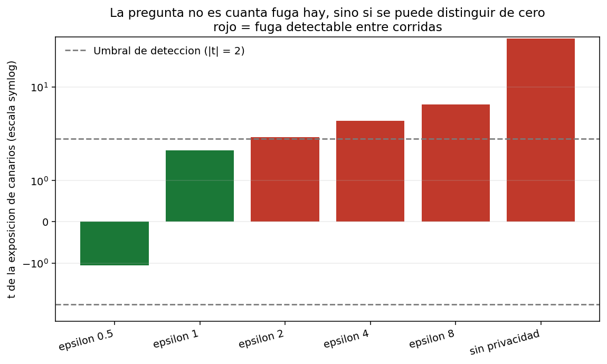

*Los mismos datos preguntados como corresponde: no "cuanta fuga hay" sino "se
puede distinguir de cero". Las barras rojas son los presupuestos donde el efecto
de los canarios sobrevive a su propia variacion entre corridas. La fuga deja de
ser detectable entre ε = 2 y ε = 1.*

**Que salio.** Sin DP la fuga es inequivoca: los canarios reciben una PD **2,50
puntos mas alta** que solicitantes identicos no vistos, y el efecto se reproduce
en las diez corridas (**t = 44,8**). El presupuesto que la vuelve indetectable es
**ε = 1**, y cuesta **18,4% del AUC** (0,6388 → 0,5215). Con ε = 8 sobrevive
casi toda la precision (0,6118) pero la fuga sigue siendo claramente detectable.
Con 1.200 filas no hay un medio comodo, y ese es el resultado.

**La advertencia.** El ataque de inferencia de membresia de manual reporto un
AUC entre 0,4959 y 0,5142 en **todos** los escenarios, incluido el modelo sin
ninguna privacidad. Una regresion logistica de 8 parametros sobre 1.240 filas no
sobreajusta lo suficiente como para que un ataque por umbral de perdida
funcione, asi que el ataque estandar certifica como privado a un modelo que
demostrablemente memorizo 40 registros. Los dos ataques estan en el repo porque
esa brecha es el punto: un MIA negativo es evidencia debil, y se presenta
rutinariamente como evidencia fuerte.

---

# Como esta construido el laboratorio

## Que esta implementado desde cero, y como se verifica

Llamar a una libreria es el default correcto en produccion. Es el default
equivocado cuando la mecanica *es* el tema: el codigo que reporta tu presupuesto
de privacidad, o que elige tus bins, es justamente la parte que uno tiene que
poder defender. Cada componente esta construido directamente y anclado a una
verificacion independiente:

| Componente | Donde | Como se establece que esta bien |
|---|---|---|
| Verosimilitud parcial de Cox (Breslow + Efron), gradiente y hessiano analiticos | [03](03-survival-lifetime-pd-term-structure/src/cox_ph.py) | Diferencias finitas (error maximo 6,7e-07) y recuperacion de los coeficientes del simulador (MAE 0,0224) |
| Kaplan-Meier, C-index de Harrell, test PH de Schoenfeld | [03](03-survival-lifetime-pd-term-structure/src/evaluation.py) | Ejemplos de cinco filas calculados a mano; el test PH se gatilla con un efecto variable plantado y con nada mas |
| Aumentacion Polya-Gamma + muestreador de Gibbs conjugado | [04](04-bayesian-hierarchical-partial-pooling/src/polya_gamma.py) | Momentos muestrales contra la media analitica tanh(c/2)/(2c) y la varianza; sesgo de truncamiento acotado y demostradamente unidireccional |
| R̂ dividido y tamano de muestra efectivo de Geyer | [04](04-bayesian-hierarchical-partial-pooling/src/diagnostics.py) | R̂ ≈ 1 con cadenas iid, > 1,5 con cadenas separadas, > 1,2 con deriva interna; ESS < N/5 para AR(1) con ρ = 0,9 |
| Prediccion conforme split Mondrian | [05](05-monotonic-constraints-conformal-decisioning/src/conformal.py) | La cobertura se cumple sobre datos intercambiables **incluso con un modelo deliberadamente inutil**: la garantia es del procedimiento, no del modelo |
| Auditoria contrafactual de monotonia | [05](05-monotonic-constraints-conformal-decisioning/src/monotonicity_audit.py) | Un modelo construido a mano con un escalon a la baja es detectado, uno monotono marca cero, y una direccion invertida marca 100% |
| Binning optimo por programacion dinamica | [06](06-optimal-binning-scorecard/src/binning.py) | Enumeracion exhaustiva de todas las particiones factibles en instancias chicas, con y sin restriccion de monotonia |
| Monitoreo de estabilidad PSI / CSI | [06](06-optimal-binning-scorecard/src/monitoring.py) | Cero para distribuciones identicas, calza con un calculo a mano en un caso de dos bins, y nombra la variable que efectivamente se movio |
| Cinco metricas de equidad + intervalos por bootstrap | [07](07-fair-lending-bias-audit/src/fairness_metrics.py) | Tasas de seleccion calculadas a mano sobre un ejemplo de ocho filas; intercambiar los grupos invierte todos los signos |
| Contador RDP del gaussiano submuestreado | [08](08-differential-privacy-scoring/src/accountant.py) | Con q = 1 tiene que dar exactamente α/(2σ²), verificado sobre varios ordenes de Renyi y niveles de ruido |
| DP-SGD (recorte por ejemplo, ruido gaussiano, muestreo de Poisson) | [08](08-differential-privacy-scoring/src/dp_sgd.py) | Calza con la regresion logistica de scikit-learn al desactivar ruido y recorte (AUC dentro de 0,01, coseno de coeficientes > 0,98) |

## Estandares que cumple cada carpeta

- **Un comando corre todo.** `python run_pipeline.py` regenera los datos, ajusta
  los modelos, evalua y escribe reportes y graficos. Cada etapa ademas corre
  sola con el comando exacto que usa el orquestador, para que "correr todo" y
  "correr un paso" no puedan divergir.
- **Documentacion bilingue.** README en ingles y espanol con selector de idioma,
  y cada numero trazable a un archivo de `outputs/reports/`.
- **Una seccion de hallazgos honestos, siempre.** Los resultados negativos, lo
  que rindio peor de lo esperado y los errores detectados durante la
  construccion quedan escritos en vez de descartados. Varios son la parte mas
  util de su proyecto.
- **Supuestos declarados.** Donde una cifra economica es un supuesto de
  laboratorio (LGD de 45%, margen de 7%, CLP 12.000 por revision manual), se
  dice al lado del resultado que lo usa.
- **Los artefactos generados no entran a git.** Datos y reportes son
  reproducibles desde el pipeline y estan en `.gitignore`; los graficos si se
  versionan porque los READMEs los referencian.

### Estandar de testing

Las tecnicas 03-08 traen **194 tests**; la tecnica 01 reporta 29 en su propio
README. Apuntan a lo que falla *en silencio* y no con un error: una identidad
analitica que la implementacion tiene que reproducir, un ejemplo calculado a
mano, una propiedad que debe cumplirse (cobertura, monotonia, composicion), o un
efecto plantado que un diagnostico esta obligado a detectar — y, igual de
importante, casos donde un diagnostico debe quedarse callado.

| # | Tests | Una verificacion representativa |
|---|---|---|
| 03 | 38 | Breslow ≡ Efron cuando no hay empates, y Breslow estrictamente atenuado cuando los eventos se discretizan mas grueso |
| 04 | 34 | El shrinkage tiene que ser mayor en segmentos chicos, y la incertidumbre posterior correlacionar negativamente con el volumen del segmento |
| 05 | 23 | Los conjuntos de prediccion estan anidados en α: subir α solo puede sacar etiquetas, nunca agregarlas |
| 06 | 34 | La programacion dinamica iguala a la busqueda exhaustiva sobre todas las particiones factibles |
| 07 | 22 | La reponderacion iguala demostrablemente la tasa mala ponderada — y no hace nada si los grupos ya son independientes |
| 08 | 43 | AUC del ataque > 0,70 contra un modelo con tantos parametros como filas, entrenado sobre etiquetas aleatorias |

## Por que los datos son sinteticos

Porque las afirmaciones de este laboratorio son sobre *recuperar* cosas, y una
recuperacion solo se puede verificar contra una verdad que uno controla:

- **03** afirma que la implementacion de Cox devuelve los coeficientes
  verdaderos — el simulador los escribio primero.
- **04** reporta que el pooling parcial estima los efectos de segmento 39%
  mejor; esos efectos se sortearon de un τ conocido, que la posterior despues
  tiene que cubrir.
- **05** sostiene que las restricciones de monotonia salen gratis *aca*
  precisamente porque el proceso generador es monotono donde se imponen — y dice
  derecho que costarian desempeno real donde no lo fuera.
- **07** atribuye el 91,6% de la brecha de genero a factores legitimos, lo que
  solo tiene sentido porque el genero quedo deliberadamente fuera del proceso
  que genera el default.
- **08** demuestra memorizacion con canarios, que solo funcionan como
  instrumento si uno decide que entra al entrenamiento.

La tecnica 02 es la excepcion: usa **datos macro reales de Chile** desde la API
del Banco Mundial para su calibracion de LGD y sus escenarios de stress, porque
esa mitad del proyecto trata de econometria sobre series reales y no de
recuperar parametros conocidos.

Una cosa que deliberadamente *no* aparece en ningun lado de este README: un
grafico comparando el AUC de las ocho tecnicas. Corren sobre procesos
generadores distintos, con tasas base y horizontes distintos, asi que ese
ranking se veria informativo y no significaria nada.

## Hallazgos transversales

Los resultados que costo mas trabajo establecer son, en su mayoria, los
incomodos:

- **Una alarma de monitoreo no es un modelo roto.** En la 06 el PSI llego a 0,36
  — catorce veces el umbral de alerta — mientras el AUC *subia* y la calibracion
  se mantenia dentro de 0,12 pp. Leer el PSI como falla del modelo habria
  gatillado un redesarrollo que la evidencia no respalda.
- **Significancia estadistica no es valor predictivo.** En la 03 un efecto
  variable en el tiempo es contundente dentro de muestra (p = 2,9e-06) y mueve
  el AUC fuera de muestra en −0,0003. Se gana su lugar mejorando la calibracion,
  no el ranking.
- **Sacar un proxy puede aumentar la disparidad.** En la 07, eliminar la
  variable con 11 veces mas senal de grupo que de riesgo empeoro la brecha,
  porque la informacion de grupo que transmitia era favorable.
- **Un ataque que no encuentra nada es evidencia debil.** En la 08 el ataque de
  membresia estandar reporto cero filtracion para un modelo que demostrablemente
  memorizo 40 registros. El sobreajuste global y la memorizacion por registro
  son fenomenos distintos y necesitan instrumentos distintos.
- **Un algoritmo exacto lo es solo respecto de su discretizacion.** En la 06 la
  programacion dinamica es demostrablemente optima y un arbol greedy igual le
  gano, porque la DP solo podia cortar en bordes de la grilla. Refinar la grilla
  cierra casi toda la brecha e identifica el resto como el precio de la
  restriccion de monotonia.

## Como correr una tecnica

Cada carpeta es autocontenida; en la raiz del repositorio no hay nada que
instalar:

```bash
cd 03-survival-lifetime-pd-term-structure    # o cualquier otra carpeta
python -m venv venv
venv\Scripts\activate                        # source venv/bin/activate en Linux/macOS
pip install -r requirements.txt

python run_pipeline.py                       # datos → modelos → reportes → graficos
pytest -q                                    # la suite de tests de esa carpeta
```

Las tecnicas 01 y 02 ademas necesitan R (y, en el caso de la 01, un compilador
de C); sus READMEs cubren ese setup. Las tecnicas 03-08 son Python puro y se
instalan en un paso.

```
credit-risk-scoring-lab/
├── 01-polyglot-scorecard-r-python-c/     R + Python + C, FastAPI, reject inference
├── 02-bidirectional-r-python-interop/    reticulate + rpy2, GARCH, LGD Tobit/GAM
├── 03-survival-lifetime-pd-term-structure/
├── 04-bayesian-hierarchical-partial-pooling/
├── 05-monotonic-constraints-conformal-decisioning/
├── 06-optimal-binning-scorecard/
├── 07-fair-lending-bias-audit/
├── 08-differential-privacy-scoring/
│   ├── README.md / README.es.md          documentacion con resultados reales
│   ├── requirements.txt, pytest.ini
│   ├── run_pipeline.py                   toda la tecnica, un comando
│   ├── src/                              modulos + visualization/
│   ├── tests/
│   └── outputs/plots/                    graficos versionados (los reportes se regeneran)
└── LICENSE
```

## Stack

| Capa | Herramientas |
|---|---|
| Modelamiento base | NumPy, SciPy, pandas, scikit-learn |
| Estadistica / econometria | R (`dplyr`, `glm`, `rugarch`, `AER`, `mgcv`); implementaciones desde cero de Cox, Gibbs, conformal y DP |
| Gradient boosting y explicabilidad | XGBoost, LightGBM, SHAP (01); `HistGradientBoostingClassifier` con restricciones monotonas (05, 07) |
| Deep learning | MLP en PyTorch con focal loss (01) |
| Serving y almacenamiento | FastAPI, DuckDB (01) |
| Interoperabilidad | `reticulate` (R → Python), `rpy2` (Python → R), `ctypes` (Python → C) |
| Graficos | Matplotlib (estaticos, versionados), Plotly (interactivos, regenerados localmente) |

## Autor

Pablo Reyes — [github.com/Rxyxs](https://github.com/Rxyxs)
Codigo: MIT — ver [LICENSE](LICENSE)
