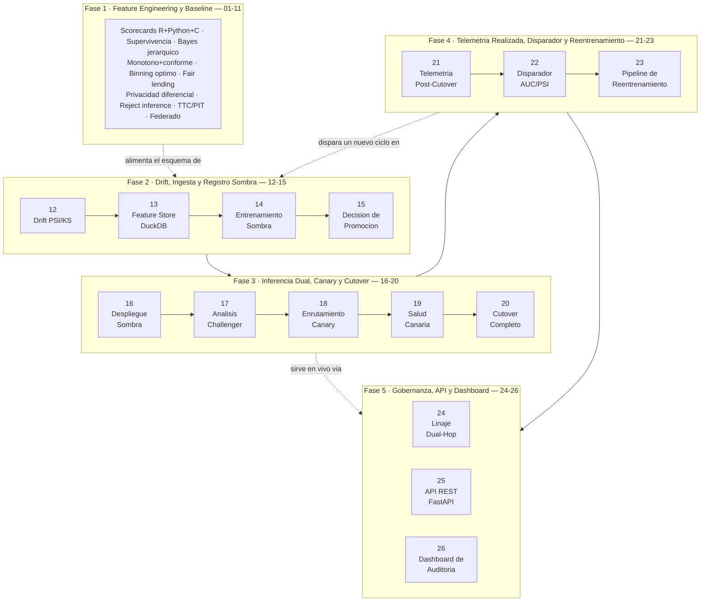

[ 🇺🇸 Read in English ](README.md) | [ 🇨🇱 Español ]

# Credit Risk Scoring Lab

**Una plataforma MLOps de circuito cerrado para riesgo crediticio, no un cuaderno de modelos: once técnicas estadisticas desde cero para la pregunta de scoring en si, conectadas a quince mas que detectan drift, reentrenan, despliegan, prueban en canary, conmutan, monitorean desempeño realizado, y auditan todo el sistema — con honestidad, incluso cuando el circuito se disparo y nadie lo cerro todavia.**

[](https://github.com/Rxyxs/credit-risk-scoring-lab/actions/workflows/tests.yml)
[](https://github.com/Rxyxs/credit-risk-scoring-lab/actions/workflows/tests.yml)
[](https://www.python.org/)
[](https://www.r-project.org/)
[](https://es.wikipedia.org/wiki/C_(lenguaje_de_programaci%C3%B3n))
[](https://duckdb.org/)
[](https://fastapi.tiangolo.com/)
[](https://scikit-learn.org/)
[](#las-26-tecnicas-indice-maestro)
[](LICENSE)

---

## Que es este repositorio

Casi todo el material de scoring crediticio se detiene en un modelo y un
numero: ajustar un clasificador, reportar un AUC, listo. Eso deja fuera casi
todo lo que un area de riesgo efectivamente discute — *cuando* llega el riesgo,
cuanto sabe el modelo de los segmentos que apenas vio, si un supervisor
aceptaria su logica, si trata distinto a unos grupos que a otros, si filtra los
datos con los que se entreno, y que pasa despues de que sale a produccion: si
alguien notaria que se corrio, si un release canario atraparia a un candidato
malo antes de que hiciera daño, y si el sistema que se supone que se
reentrena solo de verdad llega hasta un Champion nuevo — o solo dispara una
alerta y se detiene a mitad de camino.

Este laboratorio construye las dos mitades. **Las técnicas 01–11** son once
respuestas desde cero a la pregunta de scoring en si — analisis de
supervivencia, Bayes jerarquico, prediccion conforme, trato justo, privacidad
diferencial, aprendizaje federado, y mas, cada una con su propia seccion de
hallazgos honestos. **Las técnicas 12–26** son el ciclo de vida de produccion
alrededor de cualquiera de esos modelos: deteccion de drift, un feature
store, entrenamiento sombra, promocion, inferencia dual, enrutamiento
canario, monitoreo de salud, un cutover completo, telemetria post-cutover,
un disparador automatico de reentrenamiento, un pipeline de reentrenamiento
de circuito cerrado, linaje de modelo de dos saltos, un servicio de
inferencia en tiempo real con FastAPI, y un dashboard final que audita las
otras veinticinco y reporta `HEALTHY` o `DEGRADED` — con la razon
especifica, nunca un numero promediado en una falsa confianza.

Cada carpeta es un proyecto completo: README en dos idiomas, sus propias
dependencias y tests, un pipeline o CLI que corre con un solo comando,
numeros reales de una corrida real, y una seccion explicita sobre lo que
*no* funciono. La restriccion que las une, de la técnica 01 a la 26, es que
**las afirmaciones tienen que ser verificables**. Por eso la mayoria de los
algoritmos centrales estan escritos desde cero en vez de importados, por eso
los datos se simulan desde un proceso conocido en la 01–11, y por eso la
12–26 se construyeron corriendo la cadena completa de punta a punta —
generando drift real, snapshots reales, cutover reales — en vez de confiar
solo en los fixtures sembrados de una suite de pruebas.

## Arquitectura: cinco fases, de punta a punta


```mermaid
flowchart TB
    subgraph F1["Fase 1 · Feature Engineering y Baseline — 01-11"]
        direction LR
        P1["Scorecards R+Python+C · Supervivencia · Bayes jerarquico<br/>Monotono+conforme · Binning optimo · Fair lending<br/>Privacidad diferencial · Reject inference · TTC/PIT · Federado"]
    end

    subgraph F2["Fase 2 · Drift, Ingesta y Registro Sombra — 12-15"]
        direction LR
        P2a["12<br/>Drift PSI/KS"] --> P2b["13<br/>Feature Store<br/>DuckDB"] --> P2c["14<br/>Entrenamiento<br/>Sombra"] --> P2d["15<br/>Decision de<br/>Promocion"]
    end

    subgraph F3["Fase 3 · Inferencia Dual, Canary y Cutover — 16-20"]
        direction LR
        P3a["16<br/>Despliegue<br/>Sombra"] --> P3b["17<br/>Analisis<br/>Challenger"] --> P3c["18<br/>Enrutamiento<br/>Canary"] --> P3d["19<br/>Salud<br/>Canaria"] --> P3e["20<br/>Cutover<br/>Completo"]
    end

    subgraph F4["Fase 4 · Telemetria Realizada, Disparador y Reentrenamiento — 21-23"]
        direction LR
        P4a["21<br/>Telemetria<br/>Post-Cutover"] --> P4b["22<br/>Disparador<br/>AUC/PSI"] --> P4c["23<br/>Pipeline de<br/>Reentrenamiento"]
    end

    subgraph F5["Fase 5 · Gobernanza, API y Dashboard — 24-26"]
        direction LR
        P5a["24<br/>Linaje<br/>Dual-Hop"]
        P5b["25<br/>API REST<br/>FastAPI"]
        P5c["26<br/>Dashboard de<br/>Auditoria"]
    end

    F1 -.alimenta el esquema de.-> F2
    F2 --> F3 --> F4
    F4 -.dispara un nuevo ciclo en.-> F2
    F3 -.sirve en vivo via.-> F5
    F4 --> F5
```

La linea punteada de la Fase 4 de vuelta a la Fase 2 es el circuito cerrado
real, no una decoracion: el Challenger reentrenado de la técnica 23 es un
`shadow_model_<timestamp>.pkl` real, con exactamente la forma que las
técnicas 14 y 15 ya saben consumir, asi que puede volver a entrar a
promocion y despliegue sin ningun caso especial. La propia auditoria de la
técnica 26 sobre este laboratorio, corrida contra la cadena real, atrapo
ese circuito abierto a mitad de ciclo — un disparador salto, se entreno un
Challenger, nadie lo corrio de vuelta por promocion todavia — y reporto
`DEGRADED` en vez de esconderlo.

## Las 26 tecnicas, indice maestro

| # | Directorio | Técnica | Metrica / artefacto clave | Correr |
|---|---|---|---|---|
| 01 | [`01-polyglot-scorecard-r-python-c`](01-polyglot-scorecard-r-python-c) | Scorecard poliglota (R+Python+C) | Motor C iguala a R a **4,79e-11** a **270,6M filas/s** | `pytest -q` · `Rscript tests/testthat.R` · `make -C c test` |
| 02 | [`02-bidirectional-r-python-interop`](02-bidirectional-r-python-interop) | Interop R↔Python bidireccional | LGD empirica **67,4% → 83,7%** en recesion; ECL **+24,2%** | `pytest -q` · `Rscript tests/testthat.R` |
| 03 | [`03-survival-lifetime-pd-term-structure`](03-survival-lifetime-pd-term-structure) | PD de por vida con supervivencia | **50,5%** del riesgo de por vida llega despues del mes 12 | `pytest -q` |
| 04 | [`04-bayesian-hierarchical-partial-pooling`](04-bayesian-hierarchical-partial-pooling) | Scorecard bayesiano jerarquico | Error de efecto de segmento **−39%** | `pytest -q` |
| 05 | [`05-monotonic-constraints-conformal-decisioning`](05-monotonic-constraints-conformal-decisioning) | Restricciones monotonas + conforme | Violaciones **97,15% → 0,00%** | `pytest -q` |
| 06 | [`06-optimal-binning-scorecard`](06-optimal-binning-scorecard) | Scorecard de binning optimo | **+13% IV** sobre deciles | `pytest -q` |
| 07 | [`07-fair-lending-bias-audit`](07-fair-lending-bias-audit) | Auditoria de trato justo | Genero reconstruido con **AUC 0,768** | `pytest -q` |
| 08 | [`08-differential-privacy-scoring`](08-differential-privacy-scoring) | Scoring con privacidad diferencial | ε=1 cuesta **18,4% de AUC** para esconder memorizacion | `pytest -q` |
| 09 | [`09-reject-inference-selection-bias`](09-reject-inference-selection-bias) | Reject inference y sesgo de seleccion | ρ recuperado a **0,02** de la verdad con un instrumento | `pytest -q` |
| 10 | [`10-through-the-cycle-pd-vasicek`](10-through-the-cycle-pd-vasicek) | PD through-the-cycle vs point-in-time | El capital PIT oscila **173,5 pp** de densidad de RWA | `pytest -q` |
| 11 | [`11-federated-credit-scoring`](11-federated-credit-scoring) | Scoring crediticio federado | Solo-local sobreestima el riesgo nacional en **24,6 pp** | `pytest -q` |
| 12 | [`12-drift-monitoring-psi-ks`](12-drift-monitoring-psi-ks) | Monitoreo de drift (PSI / KS) | PSI de `ingreso_mensual` **0,82** (rojo) en una corrida real | `pytest -q` |
| 13 | [`13-feature-store-duckdb`](13-feature-store-duckdb) | Feature store sobre DuckDB | Hace upsert de snapshots de drift en `credit_features` | `pytest -q` |
| 14 | [`14-shadow-model-training`](14-shadow-model-training) | Entrenamiento de modelo sombra | Entrena un Challenger desde el snapshot mas fresco | `pytest -q` |
| 15 | [`15-model-promotion`](15-model-promotion) | Decision de promocion de modelo | `PROMOTED`/`REJECTED` contra ROC-AUC minimo + tamaño de muestra | `pytest -q` |
| 16 | [`16-shadow-deployment`](16-shadow-deployment) | Despliegue sombra (inferencia dual) | Champion vs. Challenger logueados lado a lado, nunca intercambiados | `pytest -q` |
| 17 | [`17-challenger-analysis`](17-challenger-analysis) | Analisis de Challenger | Monitoreo de divergencia Champion/Challenger | `pytest -q` |
| 18 | [`18-canary-deployment`](18-canary-deployment) | Despliegue canario | Split de trafico deterministico por hash MD5, cualquier `canary_percentage` | `pytest -q` |
| 19 | [`19-canary-monitoring`](19-canary-monitoring) | Monitoreo de salud canaria | Auto-rollback por umbrales de null-rate / score-diff / high-risk | `pytest -q` |
| 20 | [`20-full-promotion-cutover`](20-full-promotion-cutover) | Conmutacion completa a Champion | Swap de Champion archivar-antes-de-promover, auditado en DuckDB | `pytest -q` |
| 21 | [`21-post-cutover-telemetry`](21-post-cutover-telemetry) | Telemetria post-cutover | AUC/Brier/log-loss realizados + PSI vs. verdad de campo madurada | `pytest -q` |
| 22 | [`22-automated-retraining-trigger`](22-automated-retraining-trigger) | Disparador automatico de reentrenamiento | Dispara con AUC realizado `< 0,72` o PSI `> 0,20` | `pytest -q` |
| 23 | [`23-automated-retraining-pipeline`](23-automated-retraining-pipeline) | Pipeline de reentrenamiento automatico | Disparador → `shadow_model_<timestamp>.pkl` fresco, sin caso especial | `pytest -q` |
| 24 | [`24-model-lineage-governance`](24-model-lineage-governance) | Linaje de modelos y gobernanza | Trazado de dos saltos: `champion_model.pkl` → `active_shadow_model.pkl` → `shadow_model_<timestamp>.pkl` | `pytest -q` |
| 25 | [`25-api-inference-service`](25-api-inference-service) | API de inferencia en tiempo real | `POST /predict`: `503` no `500` sin Champion, `400` no `422` ante input invalido | `pytest -v` |
| 26 | [`26-lab-summary-dashboard`](26-lab-summary-dashboard) | Panel de resumen del laboratorio | Audita las otras 25 en un solo veredicto `HEALTHY`/`DEGRADED` | `pytest -q` |

## Hallazgos de nivel Staff

Cuatro cosas de este laboratorio que solo aparecieron corriendo la cadena
completa de verdad, no pasando una suite de pruebas contra fixtures
sembrados:

- **Aislamiento multi-DuckDB e introspeccion dinamica.** No existe una
  unica base de datos "central". `13-feature-store-duckdb`,
  `16-shadow-deployment`, `18-canary-deployment`,
  `20-full-promotion-cutover`, y `25-api-inference-service` cada una
  guarda su propio archivo `.duckdb` con su propia tabla — una decision
  deliberada que esta cadena mantiene de forma consistente (ver el propio
  docstring de `19-canary-monitoring` sobre por que las técnicas nunca
  importan el codigo de otra, solo se integran por archivo y por tabla).
  El auditor de la técnica 26 esta construido alrededor de esa realidad en
  vez de pelear contra ella: `audit_database_integrity` toma *una* ruta e
  introspecciona las tablas que ese archivo especifico realmente tiene via
  `information_schema.tables`, en vez de asumir un esquema fijo — asi que
  funciona contra las cinco bases reales llamandola cinco veces, no
  reescribiendola cinco veces.
- **Resolucion de linaje de dos saltos.** Trazar `champion_model.pkl`
  hasta su corrida de entrenamiento no resuelve en un salto. El
  manifiesto de cutover de la técnica 20 apunta a
  `active_shadow_model.pkl` — el nombre fijo que el registro de la
  técnica 16 siempre usa para el candidato que este activo, nunca el
  nombre original. La identidad real, `shadow_model_<timestamp>.pkl`,
  sobrevive un salto mas atras en el campo `active_version` de
  `registry_manifest.json`. La primera version de la técnica 24 solo
  implementaba el primer salto; correrla contra la cadena real por
  primera vez produjo un trazado con todos los campos en `null` salvo el
  evento de cutover desnudo, que fue lo que mostro que faltaba el segundo
  salto.
- **Gobernanza honesta: un circuito de reentrenamiento a medio cerrar
  reporta `DEGRADED`.** La corrida real de punta a punta de la técnica 26
  muestra exactamente esto: un disparador de reentrenamiento salto de
  verdad (AUC realizado 0,64), la técnica 23 entreno un Challenger nuevo
  genuino en respuesta — esta sentado en el reporte como un artefacto
  valido y cargable — pero nunca se corrio de vuelta por promocion y
  cutover para volverse el nuevo Champion. El estado del laboratorio sale
  `DEGRADED`, correctamente, porque el veredicto se construye con dos
  condiciones nombradas (ningun Champion valido, o un disparador activo
  sin resolver), nunca un puntaje mezclado que un archivo de Champion
  todavia valido pudiera pesar hacia arriba en silencio.
- **Desalineacion entre AUC y calibracion.** La técnica 11 lo encontro
  primero en un contexto de aprendizaje federado (un banco entrenado solo
  con sus propios clientes de alto riesgo puntua un respetable **AUC
  0,77+** a nivel nacional mientras sobreestima la tasa real de default
  en 24,6 puntos porcentuales), y la corrida real post-cutover de la
  técnica 21 reproduce la misma forma a proposito: **ROC-AUC 0,775**
  sentado junto a un sesgo de calibracion de **−7,94 pp** en el mismo
  reporte. Un modelo puede ordenar bien a los solicitantes mientras se
  equivoca en el *nivel* real de riesgo, y una metrica de ranking sola
  nunca lo va a mostrar — por eso cada reporte de telemetria y promocion
  de este laboratorio trae `predicted_default_rate` junto a
  `observed_default_rate`, no solo AUC.

## Inicio rapido

```bash
git clone https://github.com/Rxyxs/credit-risk-scoring-lab.git
cd credit-risk-scoring-lab

# Cualquier tecnica es autocontenida -- instalarla y probarla por su cuenta:
cd 20-full-promotion-cutover
python -m venv venv
venv\Scripts\activate                       # source venv/bin/activate en Linux/macOS
pip install -r requirements.txt
pytest -v
cd ..
```

**Correr la suite de pruebas completa en todas las técnicas** (necesita el
`requirements.txt` propio de cada carpeta instalado, lo mismo que hace la
matriz de 29 jobs de CI por carpeta):

```bash
for d in */; do
  [ -f "${d}pytest.ini" ] && (cd "$d" && pytest -q)
done
```

**Replicar el circuito cerrado de punta a punta** — drift real hasta una
auditoria real, la misma secuencia usada para producir cada seccion
"resultados de una corrida real" en las técnicas 12–26:

```bash
cd 12-drift-monitoring-psi-ks && python run_pipeline.py --auto-retrain-trigger && cd ..
cd 13-feature-store-duckdb     && python run_ingestion.py                      && cd ..
cd 14-shadow-model-training    && python run_training.py                      && cd ..
cd 15-model-promotion          && python run_promotion.py                     && cd ..
# 16/18/20 necesitan un .pkl --champion-model y un CSV --input-data la primera vez
# (ver el README de cada tecnica para el script de una linea que arma el modelo stub);
# 19, 21, 22, 23, 24, 25 corren despues sin argumentos extra:
cd 19-canary-monitoring        && python run_health_check.py                  && cd ..
cd 20-full-promotion-cutover   && python run_cutover.py                       && cd ..
cd 21-post-cutover-telemetry   && python run_telemetry.py                     && cd ..
cd 22-automated-retraining-trigger && python run_trigger_check.py             && cd ..
cd 23-automated-retraining-pipeline && python run_orchestrator.py             && cd ..
cd 24-model-lineage-governance && python run_lineage.py --model-filename champion_model.pkl && cd ..
cd 26-lab-summary-dashboard    && python run_lab_summary.py                   && cd ..
```

---

## Tecnicas 01-11, en profundidad

### Donde cae cada tecnica en el ciclo de vida del credito


```mermaid
flowchart LR
    subgraph O["Originacion"]
        T01["01 · Scorecard + challengers ML<br/>+ motor de scoring compilado"]
        T06["06 · Binning optimo<br/>y tarjeta de puntos"]
    end
    subgraph D["Decision"]
        T05["05 · Restricciones monotonas<br/>+ aprobar / revisar / rechazar"]
        T04["04 · PD posterior<br/>+ cortes con incertidumbre"]
        T09["09 · Reject inference<br/>+ correccion de sesgo de seleccion"]
    end
    subgraph P["Provision"]
        T03["03 · Estructura temporal de PD<br/>ECL 12m vs vida completa"]
        T02["02 · LGD empirica<br/>+ stress de riesgo de mercado"]
        T10["10 · PD TTC vs PIT<br/>+ capital IRB"]
    end
    subgraph G["Gobierno"]
        T07["07 · Auditoria de trato justo"]
        T08["08 · Garantia de privacidad"]
        T06b["06 · Monitoreo PSI / CSI"]
        T11["11 · Entrenamiento federado<br/>entre instituciones"]
    end
    O --> D --> P --> G
```

### Resultados de un vistazo

| # | Tecnica | Resultado principal | La advertencia que viene con el |
|---|---|---|---|
| [01](#01--scorecard-poliglota-r--python--c) | Scorecard poliglota | El motor en C calza con el scorecard de R hasta **4,79e-11** a **270,6M filas/s** | El scorecard interpretable ademas *gano* en precision — reportado derecho |
| [02](#02--interoperabilidad-bidireccional-rpython) | Interop R↔Python | LGD empirica **67,4% → 83,7%** en escenario de recesion; ECL **+24,2%** | Suponer relacion macro lineal subestima la cola en 8,6 puntos |
| [03](#03--pd-de-por-vida-con-analisis-de-supervivencia) | PD de por vida | El **50,5%** del riesgo llega despues del mes 12; provisiones **+19,3%** | El termino variable es significativo dentro de muestra y mueve el AUC en −0,0003 |
| [04](#04--scorecard-bayesiano-jerarquico) | Bayes jerarquico | Error de efectos de segmento **−39%**; τ posterior cubre el valor verdadero | El corte con incertidumbre **perdio** 3,6% de utilidad |
| [05](#05--restricciones-monotonas--decision-conforme) | Monotonia + conformal | Violaciones **97,15% → 0,00%** sin costo de precision | El volumen de revision conforme es 50% de la cartera con α = 0,10 |
| [06](#06--scorecard-con-binning-optimo) | Binning optimo | **+13% de IV** sobre deciles, cero variables no monotonas, bandas separan **9,3x** | Un arbol greedy igual le gana por 0,7 pp de AUC out-of-time |
| [07](#07--auditoria-de-trato-justo-en-credito) | Auditoria de equidad | El genero se reconstruye desde las features del modelo con **AUC 0,768** | Sacar el proxy empeoro la disparidad |
| [08](#08--scoring-con-privacidad-diferencial) | Privacidad diferencial | Los canarios prueban memorizacion (**t = 44,8**); ε = 1 la vuelve indetectable | Ese presupuesto cuesta **18,4% del AUC** |
| [09](#09--reject-inference-y-sesgo-de-seleccion) | Reject inference | El probit bivariado recupera ρ a **0,02** de la verdad con un instrumento de exclusion | Sin el, el mismo modelo falla por **0,36-0,44** -- a veces con el signo invertido |
| [10](#10--pd-through-the-cycle-vs-point-in-time) | PD TTC vs PIT | El capital point-in-time oscila **173,5 puntos** de densidad de RWA en un ciclo | La linea through-the-cycle es plana por construccion -- una decision de modelamiento, no un hallazgo |
| [11](#11--scoring-crediticio-federado) | Scoring federado | FedAvg iguala la calibracion del oraculo centralizado (**+0,18 pp** de sesgo contra **+4,45 pp** de solo-local) | Un solo banco por si solo pone mal el precio del riesgo nacional por **24,6 puntos** -- y su AUC igual se ve bien |

---

## Tecnicas 01-11, en detalle

## 01 · Scorecard poliglota (R + Python + C)

**Carpeta:** [`01-polyglot-scorecard-r-python-c`](01-polyglot-scorecard-r-python-c)

**El problema.** Un scorecard tiene dos jefes. El comite de riesgo y el
regulador quieren leerlo: cada variable, cada tramo, cada punto. El sistema de
originacion quiere puntuar una solicitud en lo que demora en cargar una pagina,
miles de veces por minuto. Esos requisitos tiran el diseno para lados opuestos,
y la respuesta habitual es elegir uno y pedir disculpas por el otro.

**El metodo.** Cada lenguaje hace el trabajo que efectivamente hace en un area
de riesgo. **R** construye el scorecard regulatorio WOE/IV con regresion
logistica y puntos PDO. **Python** entrena los challengers de ML (XGBoost,
LightGBM, Random Forest) con explicabilidad SHAP, un MLP en PyTorch con focal
loss, y experimentos de reject inference. **C** implementa el hot-path de
scoring compilado, expuesto via `ctypes`, y su salida se **verifica** contra el
score de R en vez de suponerse igual. Un servicio FastAPI expone campeon y
retador detras del mismo endpoint.


*Throughput sobre 1.000.000 de filas, escala log. El motor compilado puntua
270,6M filas/segundo contra 24,3M de NumPy vectorizado y 0,97M de un loop de
Python puro — y entrega el mismo numero que el scorecard de R hasta 4,79e-11,
que es la parte que hace la velocidad utilizable y no solo llamativa.*

El motor tambien compila y corre en Linux/GCC — CI lo compila con `make` y
corre una suite de 1020 aserciones de correctitud
(`c/tests/test_score_engine.c`) en cada push, aparte del build con MSVC
medido arriba (ver [Integracion continua](#integracion-continua)).

**Que salio.** El scorecard llego a Gini 0,466 y KS 0,358; el mejor challenger
de ML llego a Gini 0,461. **Gano el modelo interpretable**, y el proyecto lo
dice en vez de reformular la comparacion. La seccion de reject inference
encuentra que el AUC medido solo sobre los aprobados es sistematicamente menor
que sobre la poblacion completa — un efecto de seleccion de manual, medido en
vez de citado.

---

## 02 · Interoperabilidad bidireccional R↔Python

**Carpeta:** [`02-bidirectional-r-python-interop`](02-bidirectional-r-python-interop)

**El problema.** El riesgo de credito y el de mercado se gestionan juntos y se
modelan por separado. Las tasas de default y la volatilidad de mercado suben
juntas — el *wrong-way risk* que preocupa a un comite — pero la herramienta
natural para cada uno vive en un lenguaje distinto: pandas y XGBoost de un
lado, `quantmod`, `rugarch` y regresion censurada del otro.

**El metodo.** Dos puentes genuinos corriendo en direcciones opuestas, no dos
carpetas intercambiando CSVs. `reticulate` permite que R llame a Python y reciba
un DataFrame de pandas vivo como data frame de R; `rpy2` permite que Python
llame a R y cargue un objeto de modelo entrenado en R. Python se encarga de la
limpieza y el scoring; R del analisis de mercado en velas, la volatilidad GARCH
y la LGD calibrada empiricamente con Tobit y GAM sobre **datos macro reales de
Chile** desde la API del Banco Mundial.


*La pieza central: perdida esperada por banda de riesgo crediticio estresada
contra tres regimenes de volatilidad de mercado — un numero que un comite de
riesgo puede leer, producido por un modelo de ML en Python y uno econometrico en
R dentro de la misma figura.*

**Que salio.** Discriminacion de PD con AUC 0,750 y KS 0,424 desde regresion
logistica (de nuevo ganandole a XGBoost, de nuevo reportado derecho). LGD
calibrada empiricamente de **67,4%** en el escenario base contra el supuesto
plano de 45% tipico de la industria, subiendo a **83,7%** en un escenario severo
anclado en 2020, y ECL de cartera **+24,2%** bajo staging IFRS 9. Suponer una
relacion macro *lineal* subestima la LGD del escenario severo en 8,6 puntos —
el argumento para ajustar un GAM y no una recta.

---

## 03 · PD de por vida con analisis de supervivencia

**Carpeta:** [`03-survival-lifetime-pd-term-structure`](03-survival-lifetime-pd-term-structure) · 38 tests

**El problema.** Un scorecard responde *si* un deudor cae en default en los
proximos 12 meses. No puede responder *cuando*, y de "cuando" depende la
provision: IFRS 9 pide perdida esperada a 12 meses en Stage 1 y perdida esperada
a **vida completa** en Stage 2. Un solo numero no produce las dos.

**El metodo.** Modelar el hazard en vez de la etiqueta. Cada credito se sigue
mes a mes hasta que cae en default, prepaga o sale de la ventana de observacion,
y un credito censurado se trata como observacion incompleta y no como cliente
bueno. El modelo de Cox esta escrito desde cero — verosimilitudes parciales de
Breslow *y* Efron, gradiente y hessiano analiticos via sumas acumuladas por
sufijo, Newton-Raphson amortiguado, residuos de Schoenfeld escalados — junto a
un modelo de hazard en tiempo discreto sobre datos persona-periodo, que trata
los empates mensuales de forma exacta.


*El hazard estimado contra el que efectivamente uso el simulador. La joroba de
seasoning — el riesgo subiendo despues de la originacion, con peak alrededor del
mes 8-10, y despues bajando — queda recuperada, y la curva se vuelve
visiblemente mas ruidosa pasado el mes 25, cuando los creditos a 12 y 24 meses
salen de la cartera y adelgazan el conjunto en riesgo. Esa degradacion esta en
el grafico porque es real.*


*Izquierda: PD acumulada por horizonte para cada banda de riesgo, con el corte
de 12 meses (Stage 1) marcado. Derecha: cuando llega efectivamente el riesgo en
la cartera. La banda A llega a 2,4% a los 12 meses y a 6,6% en la vida completa
— casi dos tercios de su riesgo queda mas alla del corte que un modelo a 12
meses alcanza a ver.*

**Que salio.** El motor escrito desde cero recupera los coeficientes del
simulador con un error absoluto medio de **0,0224**, su gradiente analitico
calza con diferencias finitas hasta 6,7e-07, y el test de Schoenfeld marca
**exactamente una** covariable — la construida con efecto decreciente — sin
falsas alarmas entre las otras ocho. Fuera de muestra: C-index 0,7841, AUC
0,8132 a 12 meses. El **50,5% del riesgo de default de vida completa llega
despues del mes 12**, y reconocerlo sobre el 9,3% de la cartera que gatilla el
proxy de SICR sube la provision de CLP 660,6M a 787,8M (**+19,3%**).

**La advertencia.** La especificacion variable en el tiempo es contundente
dentro de muestra (LR = 21,91, p = 2,9e-06) y mueve el AUC fuera de muestra en
**−0,0003**. Se gana su lugar mejorando la calibracion (−13% de error), no el
ranking — y el pipeline selecciona con ese criterio, escrito en el codigo.

---

## 04 · Scorecard bayesiano jerarquico

**Carpeta:** [`04-bayesian-hierarchical-partial-pooling`](04-bayesian-hierarchical-partial-pooling) · 34 tests

**El problema.** Una cartera nunca es una sola poblacion. El mismo banco presta
en Santiago y en Los Lagos, a asalariados e informales, por sucursal y por app.
Modelarlos juntos le pone al segmento delgado el precio del promedio; modelarlos
por separado convierte 30 observaciones en politica. Y una estimacion puntual no
dice en cual de las dos situaciones uno esta.

**El metodo.** Pooling parcial: el efecto de cada segmento se sortea de una
distribucion comun cuya dispersion τ tambien se estima, asi que los segmentos
con historia conservan su estimacion y los delgados se corren hacia el promedio
— sin constante de shrinkage que elegir. El muestreador esta escrito desde cero
sobre **aumentacion Polya-Gamma**, que vuelve la verosimilitud logistica
condicionalmente gaussiana y colapsa todo a pasos de Gibbs en forma cerrada: sin
Metropolis, sin tasa de aceptacion, sin tuning. El R̂ dividido y el ESS de Geyer
tambien estan implementados directamente.


*Izquierda: el efecto estimado de cada segmento con y sin pooling, contra
cuantos casos de entrenamiento tiene (escala log). Las lineas grises son el
shrinkage: largas donde los datos son escasos, casi invisibles donde abundan.
Derecha: recuperacion contra los efectos verdaderos del simulador; las
estimaciones con pooling quedan mas cerca de la diagonal.*

**Que salio.** El pooling parcial gana en todas las metricas predictivas (AUC
0,8309, mejor log-loss) y reduce **39%** el error de los efectos de segmento
recuperados frente a los dos extremos. El parametro de dispersion vuelve en
**τ = 0,515 con intervalo creible al 90% de [0,391, 0,668]**, cubriendo el
verdadero 0,450 — y al modelo nunca se le dijo que los segmentos difieren. La
configuracion sin pooling falla legitimamente su chequeo de convergencia
(R̂ = 1,36), porque el intercepto y los efectos de segmento solo estan
identificados por su *suma*; diagnosticar esa suma por separado (R̂ = 1,0028)
distingue "este modelo esta roto" de "esta parametrizacion no es
identificable".

**La advertencia.** Decidir con el percentil 95 de la posterior en vez de su
media **costo 3,6% de utilidad** al 80% de aprobacion. El mecanismo funciona
como se diseno — los solicitantes que rechaza cargan 2,5 veces la desviacion
posterior de la cartera — pero no quedaba suficiente incertidumbre, a este
tamano de muestra, para que la cautela pagara. Reportado como el resultado
negativo medido que es.

---

## 05 · Restricciones monotonas + decision conforme

**Carpeta:** [`05-monotonic-constraints-conformal-decisioning`](05-monotonic-constraints-conformal-decisioning) · 23 tests

**El problema.** Hay dos cosas que hunden un modelo en la sala donde se
aprueba, y ninguna es el AUC. La primera: contesta mal una pregunta que
cualquiera puede hacer — *si a este solicitante le sube la carga financiera y
todo lo demas queda igual, .el modelo dice que el riesgo es mayor?* La segunda:
no tiene forma de decir "no se", asi que decide sobre solicitantes en los que no
tiene nada que opinar.

**El metodo.** Restricciones de monotonia donde el dominio las respalda (siete
features) y deliberadamente **no** en la edad, cuyo efecto real tiene forma de
U. Despues, una auditoria contrafactual que mueve una variable por una grilla
para cada solicitante, dejando el resto fijo, y cuenta reversiones. Encima, un
predictor conforme Mondrian convierte la PD en aprobar / revision manual /
rechazar con garantia de cobertura sin supuestos distribucionales.


*El modelo sin restricciones viola la monotonia en hasta 97,6% de los
solicitantes en una sola variable, con reversiones de hasta 14,5 puntos de PD.
Las barras del modelo restringido son invisibles porque valen cero: por
construccion, no por suerte. Notar ademas que su curva de respuesta *promedio*
se ve casi bien: las violaciones son a nivel individual, que es exactamente el
nivel en el que opera un reclamo de un cliente o una revision del supervisor.*


*Por que importa la variante condicional por clase (Mondrian). Izquierda: la
cobertura sigue al objetivo en las dos clases. Derecha: la version marginal
cumple el mismo objetivo global cubriendo a la clase que paga en 99% y dejando
caer a la clase de default hasta 57%. Con una tasa base de 23%, "90% de
cobertura" calculado sobre la poblacion agrupada es casi enteramente una
afirmacion sobre la clase mayoritaria.*

**Que salio.** Restringir no costo **nada**: el AUC paso de 0,7655 a **0,7695**
— con un proceso de riesgo genuinamente monotono, la restriccion saca justo la
flexibilidad que estaba ajustando ruido. Con α = 0,10, la politica conforme en
tres vias comete **un tercio menos de errores** en lo que automatiza que una
banda de score que manda el mismo volumen a revision (19,79% contra 29,41%), y
8% mas de utilidad. Un stress de cambio poblacional muestra despues donde se
rompe la garantia: en una cartera deteriorada la clase que paga cae nueve puntos
bajo el objetivo y las aprobaciones automaticas se reducen a la mitad —
recalibrar con 2.100 casos nuevos lo restituye.

**La advertencia.** La mitad de la cartera va a revision manual con α = 0,10.
Eso es el modelo reportando honestamente que no puede descartar ninguna de las
dos etiquetas para la mayoria, pero a los analistas hay que pagarlos; el barrido
de α le pone precio a ese dial.

---

## 06 · Scorecard con binning optimo

**Carpeta:** [`06-optimal-binning-scorecard`](06-optimal-binning-scorecard) · 34 tests

**El problema.** El paso menos glamoroso de un scorecard define la mayor parte
de su calidad: **donde se corta cada variable**. Las respuestas habituales son
deciles (rapido, ciego a la etiqueta) o un arbol de decision (usa la etiqueta,
pero es un heuristico greedy sin garantia de optimalidad y ninguna de
monotonia). Y una vez en produccion, un scorecard que nadie monitorea falla en
silencio.

**El metodo.** Plantear el binning como lo que es — particionar un eje ordenado
maximizando el Information Value sujeto a a lo mas K bins, un minimo de
poblacion y de eventos por bin, y una secuencia de WOE monotona — y resolverlo
**exacto** por programacion dinamica sobre sumas de prefijos de todos los
tramos. Despues, una tarjeta de puntos con la transformacion PDO estandar, y
monitoreo PSI/CSI reproducido vintage por vintage sobre una cartera con un
quiebre de poblacion conocido.


*Las mismas tres variables, cortadas de tres formas. La DP produce un WOE
monotono y limpio en todos los casos; el arbol zigzaguea en la utilizacion de
lineas (baja, sube, baja, sube entre bins consecutivos) — una tarjeta que nadie
quiere defender. En la edad, cuyo efecto real es en U, la DP monotona
deliberadamente resigna IV en vez de fingir una forma que el dominio no tiene.*


*Izquierda: el PSI se mantiene bajo 0,025 durante dieciocho vintages estables —
sin falsas alarmas — y salta a 0,36 exactamente en la cohorte donde se quiebra
la poblacion. Derecha: el CSI por variable nombra al culpable en vez de solo
levantar la bandera; la utilizacion de lineas es la variable que el simulador
movio con mas fuerza.*

**Que salio.** La DP recupera **13% mas IV** que el binning equifrecuente y es
el unico metodo que produce una tarjeta con cero variables no monotonas. Las
bandas resultantes separan **9,3x** en tasa de default observada (47,79% en la
banda E contra 5,16% en la A). La afirmacion de exactitud no es retorica: un
test enumera *todas* las particiones factibles en instancias chicas y la DP
coincide, con y sin restriccion de monotonia.

**La advertencia, y el hallazgo mas interesante.** Un arbol greedy igual le gana
a la DP por 0,7 pp de AUC out-of-time — porque la DP solo puede cortar en bordes
de la grilla de pre-binning, cosa que el barrido de resolucion demuestra al
converger a los cortes del arbol cuando la grilla se refina. Y el resultado del
monitoreo va contra la lectura obvia: el PSI grito (0,36, catorce veces el
umbral de alerta) **mientras el modelo seguia siendo correcto** — el AUC incluso
subio y la calibracion se mantuvo dentro de 0,12 pp. La poblacion cambio; el
modelo tenia razon al respecto.

---

## 07 · Auditoria de trato justo en credito

**Carpeta:** [`07-fair-lending-bias-audit`](07-fair-lending-bias-audit) · 22 tests

**El problema.** Todo modelo de credito parte de la misma regla: el atributo
protegido no entra al modelo. Esa regla es exigible legalmente y, como garantia
de equidad, vale bastante poco por si sola: si las features correlacionan lo
suficiente con el grupo, el modelo lo reconstruye haya o no intencion de por
medio.

**El metodo.** Un simulador donde **el genero esta ausente del proceso que
genera el default**, pero correlaciona con la renta y la antiguedad laboral (una
brecha salarial, trayectorias interrumpidas) y donde el sector laboral esta
fuertemente segregado por genero aportando casi nada de senal de riesgo.
Cualquier disparidad que aparezca despues es, entonces, correlacion legitima o
artefacto del modelo, nunca causalidad. Sobre eso: cinco metricas de equidad con
intervalos por bootstrap, un detector de proxies por variable, una descomposicion
estratificada de la brecha, y cuatro mitigaciones comparadas a igual volumen de
aprobacion.


*Izquierda: la senal de grupo de cada feature contra su senal de riesgo. Todo
queda bajo la diagonal — ganandose su lugar — excepto `sector`, que carga mucha
mas informacion sobre el genero que sobre el default. Derecha: lo mismo como
razon en escala log, con el titular arriba: un modelo que nunca ve el genero
puede reconstruirlo desde sus propios insumos con AUC 0,768.*

**Que salio.** `sector` carga **11 veces mas senal de grupo que de riesgo**. La
brecha en PD predicha es de **+1,430 pp bruta y +0,120 pp entre perfiles
comparables** — el **91,6% es correlacion legitima** con la renta y la carga
financiera. Las cinco metricas se reportan con intervalos: ratio de impacto
adverso 0,9688 [0,9462, 0,9971], comodamente sobre el umbral regulatorio de
0,80; paridad demografica −2,53 pp [−4,39, −0,23], chica pero distinguible de
cero; y una brecha de calibracion que **no** se distingue de cero.

**La advertencia — el resultado mas util del proyecto.** Sacar el proxy empeoro
la disparidad (−2,53 → −4,14 pp). La informacion de grupo que `sector`
transmitia era *favorable*: los sectores mayoritariamente femeninos tienen
riesgo levemente menor, asi que incluirlo compensaba en parte la brecha de
renta. "Saquen las variables correlacionadas" es una regla de dedo que mueve la
equidad en cualquiera de las dos direcciones, y hay que medirla variable por
variable sobre la cartera real.

---

## 08 · Scoring con privacidad diferencial

**Carpeta:** [`08-differential-privacy-scoring`](08-differential-privacy-scoring) · 43 tests

**El problema.** Un modelo de credito se entrena con los datos mas sensibles
que una persona entrega, y despues sale de la sala: a un proveedor, a una API, a
veces a un paper. Anonimizar la tabla de entrenamiento no zanja el asunto,
porque el modelo mismo carga informacion sobre las personas que lo entrenaron.

**El metodo.** Las dos mitades escritas desde cero. **DP-SGD**: gradientes por
ejemplo, recorte L2 para acotar la influencia de una persona, ruido gaussiano, y
submuestreo de Poisson — el esquema de muestreo que la contabilidad
efectivamente supone. **Un contador RDP** para el mecanismo gaussiano
submuestreado, compuesto sobre los pasos de entrenamiento y convertido a
(ε, δ), con el ruido calibrado por busqueda binaria al presupuesto objetivo. Y
despues la parte que casi todo escrito sobre DP se salta: atacar el resultado,
con un ataque de inferencia de membresia y 40 canarios inyectados — perfiles de
solicitante impecables etiquetados como default, cuya PD elevada solo puede ser
memorizacion.


*Izquierda: lo que cuesta la privacidad — AUC contra epsilon, promediado sobre
diez corridas independientes con una desviacion estandar, contra la linea del
modelo sin privacidad. Derecha: lo que compra — la brecha de PD entre los
canarios que el modelo entreno y otros identicos que nunca vio. Las barras de
error de la derecha son el hallazgo: bajo ruido el efecto deja de distinguirse
de cero en vez de desaparecer limpiamente.*


*Los mismos datos preguntados como corresponde: no "cuanta fuga hay" sino "se
puede distinguir de cero". Las barras rojas son los presupuestos donde el efecto
de los canarios sobrevive a su propia variacion entre corridas. La fuga deja de
ser detectable entre ε = 2 y ε = 1.*

**Que salio.** Sin DP la fuga es inequivoca: los canarios reciben una PD **2,50
puntos mas alta** que solicitantes identicos no vistos, y el efecto se reproduce
en las diez corridas (**t = 44,8**). El presupuesto que la vuelve indetectable es
**ε = 1**, y cuesta **18,4% del AUC** (0,6388 → 0,5215). Con ε = 8 sobrevive
casi toda la precision (0,6118) pero la fuga sigue siendo claramente detectable.
Con 1.200 filas no hay un medio comodo, y ese es el resultado.

**La advertencia.** El ataque de inferencia de membresia de manual reporto un
AUC entre 0,4959 y 0,5142 en **todos** los escenarios, incluido el modelo sin
ninguna privacidad. Una regresion logistica de 8 parametros sobre 1.240 filas no
sobreajusta lo suficiente como para que un ataque por umbral de perdida
funcione, asi que el ataque estandar certifica como privado a un modelo que
demostrablemente memorizo 40 registros. Los dos ataques estan en el repo porque
esa brecha es el punto: un MIA negativo es evidencia debil, y se presenta
rutinariamente como evidencia fuerte.

---

---

## 09 · Reject inference y sesgo de seleccion

**Carpeta:** [`09-reject-inference-selection-bias`](09-reject-inference-selection-bias) · 64 tests

**El problema.** Todo scorecard se entrena sobre una omision: el banco solo
observa el pago de los solicitantes que una politica *anterior* aprobo. Los
rechazados nunca recibieron el credito, asi que su desenlace no existe en
ninguna base -- y nadie dentro del banco puede verificar cuanto se equivoca
el modelo nuevo sobre la poblacion que efectivamente va a puntuar.

**El metodo.** El simulador genera el desenlace de **todos**, aprobados y
rechazados, antes de aplicar la politica historica -- convirtiendo "esta
correccion funciona" de un articulo de fe en un numero. Dos regimenes
importan: MAR (seleccion sobre observables, ρ = 0) y MNAR (el ejecutivo
tambien usaba informacion blanda que nunca llego a ninguna base, ρ ≠ 0). Un
probit bivariado con seleccion se construye desde cero, por maxima
verosimilitud con **gradiente analitico** -- una version temprana con
diferenciacion numerica convergia en silencio a un ρ confiadamente
equivocado, con `success: True` y una norma de gradiente casi cero que era
un optimo local genuino, no un bug.


*Gris es la verdad. Sin variable de exclusion (rojo) el modelo inventa sesgo
de seleccion que no existe en MAR y no detecta un sesgo que es muy real en
MNAR -- a veces con el signo invertido. Con un instrumento genuino (verde,
una variable de presion comercial por sucursal-mes que mueve la aprobacion
pero no el riesgo real) el mismo estimador queda a 0,02 de los dos valores
verdaderos.*

**Que salio.** En MNAR, el probit bivariado correctamente identificado queda
a **0,0063** de los coeficientes verdaderos -- cerca del 0,0110 del oraculo
imposible en la practica -- mientras que todo metodo corrido *sin* variable
de exclusion, incluidos los modelos de seleccion "correctos", queda peor que
simplemente ignorar a los rechazados (error de coeficientes 0,078 contra
0,082 de solo-aprobados).

**La advertencia.** Ignorar a los rechazados por completo no siempre es la
peor opcion: en MAR, solo-aprobados recupera los coeficientes casi tan bien
como el modelo completamente corregido, porque cuando la seleccion depende
solo de observables la relacion dentro de la muestra aprobada ya es
correcta. La falla es especifica de MNAR, y hay que distinguir los dos casos
antes de salir a corregir.

---

## 10 · PD through-the-cycle vs point-in-time

**Carpeta:** [`10-through-the-cycle-pd-vasicek`](10-through-the-cycle-pd-vasicek) · 41 tests

**El problema.** El capital IRB de Basilea descansa en un modelo -- los
deudores comparten exposicion a un ciclo economico comun, ademas de su
propia suerte -- y traza una linea que los reguladores discuten
constantemente: la PD que entra a la formula deberia ser un promedio
**through-the-cycle** de largo plazo, no la PD **point-in-time** condicional
al estado actual de la economia. Meter la equivocada hace que el capital se
mueva con la economia en vez de amortiguarla -- exigiendo mas capital justo
cuando las perdidas suben y el credito deberia seguir fluyendo.

**El metodo.** El modelo de un factor de Vasicek (ASRF) construido desde
cero: PD condicional, la distribucion cerrada de perdidas, la formula
regulatoria de correlacion de Basilea, y el requerimiento de capital IRB
completo. Dos estimadores independientes de correlacion -- metodo de
momentos (exacto para cualquier tamano de cartera) y el limite ASRF (exacto
solo cuando el tamano crece sin limite) -- construidos a proposito para que
discrepen donde el supuesto de granularidad se rompe.


*Gris: densidad de RWA usando la PD through-the-cycle -- plana por
construccion. Naranjo: la misma cartera, la misma formula de Basilea,
recalibrada cada ano con la PD point-in-time. Oscila entre 70,5% y 243,9% de
la exposicion, y los picos caen exactamente en las dos recesiones marcadas.*

**Que salio.** El ciclo economico se reconstruye desde nada mas que conteos
agregados de default -- nunca observado directamente -- con **0,985** de
correlacion contra la verdad. En una cartera de 200 deudores, el estimador
de limite ASRF confunde ruido muestral ordinario con riesgo sistematico
(error absoluto medio 0,216); el estimador de momentos, exacto para
cualquier N, se mantiene en 0,022 sobre los mismos datos.

**La advertencia.** La propia formula de Basilea se verifico de forma
estructural -- correlacion acotada, capital estrictamente creciente y lineal
en la LGD -- no contra un numero publicado externo que este proyecto no
tiene como consultar sin conexion, lo que habria sido exactamente el tipo de
afirmacion no verificable que este repositorio trata de evitar.

---

## 11 · Scoring crediticio federado

**Carpeta:** [`11-federated-credit-scoring`](11-federated-credit-scoring) · 26 tests

**El problema.** El secreto bancario no es un tecnicismo que un modelo pueda
rodear. Un banco de microcreditos no puede pasarle sus datos a un banco de
la zona minera ni a un consorcio -- asi que cada institucion entrena con una
porcion del mercado que nunca es representativa de a quien terminara
puntuando su modelo.

**El metodo.** FedAvg (McMahan et al., 2017) desde cero, anclado a dos
identidades algebraicas exactas en vez de dejarlo meramente plausible: con
un cliente, promediar no hace nada, asi que FedAvg tiene que coincidir bit a
bit con descenso de gradiente comun; con un paso local por ronda, el
promedio ponderado por tamano de los gradientes de los clientes es
algebraicamente el gradiente sobre los datos agrupados, asi que FedAvg tiene
que calzar exacto con entrenamiento centralizado sin importar cuan
desiguales sean los tamanos. Seis bancos simulados, comparados bajo
solo-local, federado, y un oraculo centralizado imposible en la practica.


*Izquierda: el modelo propio de cada banco, entrenado solo con sus clientes,
aplicado a la poblacion nacional que nunca vio. El sesgo de calibracion de
un banco se sale del grafico. Derecha: la misma comparacion promediada entre
bancos, por politica.*

**Que salio.** El AUC casi no se mueve entre solo-local y federado (0,7757
contra 0,7797) -- los factores de riesgo dominantes apuntan igual en todas
partes. **La calibracion es donde solo-local se rompe**: un banco, entrenado
con una poblacion de microcredito de alto riesgo, predice una PD media
nacional de 52,2% contra una tasa real de 27,6% -- una descalibracion de
**24,6 puntos**, invisible en su AUC todavia razonable de 0,768. Federado
calza casi exacto con la calibracion del oraculo (+0,18 pp contra +0,46 pp
de sesgo).

**La advertencia.** Aunque los datos crudos nunca salen de un banco, un
coordinador curioso puede saber desde la primera actualizacion compartida,
sola, cual participante sirve a una poblacion distinta -- el gradiente de
ese banco tiene similitud coseno *negativa* con el de todos los demas, antes
de que termine ningun entrenamiento. La federacion resuelve "no centralizar
los datos"; no resuelve por si sola "no filtrar quien esta detras de la
actualizacion".

---

# Como esta construido el laboratorio

## Que esta implementado desde cero, y como se verifica

Llamar a una libreria es el default correcto en produccion. Es el default
equivocado cuando la mecanica *es* el tema: el codigo que reporta tu presupuesto
de privacidad, o que elige tus bins, es justamente la parte que uno tiene que
poder defender. Cada componente esta construido directamente y anclado a una
verificacion independiente:

| Componente | Donde | Como se establece que esta bien |
|---|---|---|
| Verosimilitud parcial de Cox (Breslow + Efron), gradiente y hessiano analiticos | [03](03-survival-lifetime-pd-term-structure/src/cox_ph.py) | Diferencias finitas (error maximo 6,7e-07) y recuperacion de los coeficientes del simulador (MAE 0,0224) |
| Kaplan-Meier, C-index de Harrell, test PH de Schoenfeld | [03](03-survival-lifetime-pd-term-structure/src/evaluation.py) | Ejemplos de cinco filas calculados a mano; el test PH se gatilla con un efecto variable plantado y con nada mas |
| Aumentacion Polya-Gamma + muestreador de Gibbs conjugado | [04](04-bayesian-hierarchical-partial-pooling/src/polya_gamma.py) | Momentos muestrales contra la media analitica tanh(c/2)/(2c) y la varianza; sesgo de truncamiento acotado y demostradamente unidireccional |
| R̂ dividido y tamano de muestra efectivo de Geyer | [04](04-bayesian-hierarchical-partial-pooling/src/diagnostics.py) | R̂ ≈ 1 con cadenas iid, > 1,5 con cadenas separadas, > 1,2 con deriva interna; ESS < N/5 para AR(1) con ρ = 0,9 |
| Prediccion conforme split Mondrian | [05](05-monotonic-constraints-conformal-decisioning/src/conformal.py) | La cobertura se cumple sobre datos intercambiables **incluso con un modelo deliberadamente inutil**: la garantia es del procedimiento, no del modelo |
| Auditoria contrafactual de monotonia | [05](05-monotonic-constraints-conformal-decisioning/src/monotonicity_audit.py) | Un modelo construido a mano con un escalon a la baja es detectado, uno monotono marca cero, y una direccion invertida marca 100% |
| Binning optimo por programacion dinamica | [06](06-optimal-binning-scorecard/src/binning.py) | Enumeracion exhaustiva de todas las particiones factibles en instancias chicas, con y sin restriccion de monotonia |
| Monitoreo de estabilidad PSI / CSI | [06](06-optimal-binning-scorecard/src/monitoring.py) | Cero para distribuciones identicas, calza con un calculo a mano en un caso de dos bins, y nombra la variable que efectivamente se movio |
| Cinco metricas de equidad + intervalos por bootstrap | [07](07-fair-lending-bias-audit/src/fairness_metrics.py) | Tasas de seleccion calculadas a mano sobre un ejemplo de ocho filas; intercambiar los grupos invierte todos los signos |
| Contador RDP del gaussiano submuestreado | [08](08-differential-privacy-scoring/src/accountant.py) | Con q = 1 tiene que dar exactamente α/(2σ²), verificado sobre varios ordenes de Renyi y niveles de ruido |
| DP-SGD (recorte por ejemplo, ruido gaussiano, muestreo de Poisson) | [08](08-differential-privacy-scoring/src/dp_sgd.py) | Calza con la regresion logistica de scikit-learn al desactivar ruido y recorte (AUC dentro de 0,01, coseno de coeficientes > 0,98) |
| Probit bivariado con seleccion (gradiente conjunto analitico) | [09](09-reject-inference-selection-bias/src/selection_models.py) | Derivadas cerradas de la CDF normal bivariada verificadas contra diferencias finitas; recupera un rho conocido a menos de 0,02 con variable de exclusion |
| CDF normal bivariada por cuadratura de Gauss-Legendre | [09](09-reject-inference-selection-bias/src/selection_models.py) | Verificada contra `scipy.stats.multivariate_normal` sobre siete correlaciones y cinco pares de coordenadas |
| Distribucion cerrada de Vasicek + formula de capital IRB de Basilea | [10](10-through-the-cycle-pd-vasicek/src/vasicek.py) | CDF/cuantil verificados como inversas exactas; la densidad cerrada calza con una simulacion Monte Carlo independiente de 50.000 deudores |
| Estimadores de correlacion de activos (momentos y limite ASRF) | [10](10-through-the-cycle-pd-vasicek/src/correlation_estimation.py) | Se exige que el estimador de limite ASRF sobreestime rho en una cartera chica mientras que el de momentos se mantiene preciso sobre los mismos datos |
| FedAvg (SGD del lado del cliente, agregacion ponderada del servidor) | [11](11-federated-credit-scoring/src/federated.py) | Dos identidades algebraicas exactas con tolerancia `1e-9`: un cliente iguala a GD centralizado; un paso local por ronda iguala al GD centralizado sobre el pool |

## Estandares que cumple cada carpeta

- **Un comando corre todo.** `python run_pipeline.py` regenera los datos, ajusta
  los modelos, evalua y escribe reportes y graficos. Cada etapa ademas corre
  sola con el comando exacto que usa el orquestador, para que "correr todo" y
  "correr un paso" no puedan divergir.
- **Documentacion bilingue.** README en ingles y espanol con selector de idioma,
  y cada numero trazable a un archivo de `outputs/reports/`.
- **Una seccion de hallazgos honestos, siempre.** Los resultados negativos, lo
  que rindio peor de lo esperado y los errores detectados durante la
  construccion quedan escritos en vez de descartados. Varios son la parte mas
  util de su proyecto.
- **Supuestos declarados.** Donde una cifra economica es un supuesto de
  laboratorio (LGD de 45%, margen de 7%, CLP 12.000 por revision manual), se
  dice al lado del resultado que lo usa.
- **Los artefactos generados no entran a git.** Datos y reportes son
  reproducibles desde el pipeline y estan en `.gitignore`; los graficos si se
  versionan porque los READMEs los referencian.

### Estandar de testing

Las tecnicas 03-11 traen **325 tests**; las tecnicas 12-26 suman **245 mas**
(el ciclo de vida de produccion alrededor de cualquier modelo); la tecnica 01
reporta 23 aprobados (mas 10 que se saltan sin un motor en C compilado
localmente) en su propio README; la tecnica 02 suma sus propios tests de
loss/entrenamiento del MLP y de persistencia de metricas en DuckDB
(`02-bidirectional-r-python-interop/tests/`), corridos localmente en vez de
desde CI ya que el puente R-Python en si se ejercita aparte, en el job
`testthat` de abajo.
Apuntan a lo que falla *en silencio* y no con un error: una identidad
analitica que la implementacion tiene que reproducir, un ejemplo calculado a
mano, una propiedad que debe cumplirse (cobertura, monotonia, composicion),
un efecto plantado que un diagnostico esta obligado a detectar, o — para la
12-26 — una clase de regresion que este laboratorio de verdad encontro
construyendola (un llamado a `duckdb.connect` sin directorio padre,
encontrado y corregido tres veces separadas antes de que la tecnica 23
saliera con la guarda ya puesta).

| # | Tests | Una verificacion representativa |
|---|---|---|
| 03 | 38 | Breslow ≡ Efron cuando no hay empates, y Breslow estrictamente atenuado cuando los eventos se discretizan mas grueso |
| 04 | 34 | El shrinkage tiene que ser mayor en segmentos chicos, y la incertidumbre posterior correlacionar negativamente con el volumen del segmento |
| 05 | 23 | Los conjuntos de prediccion estan anidados en α: subir α solo puede sacar etiquetas, nunca agregarlas |
| 06 | 34 | La programacion dinamica iguala a la busqueda exhaustiva sobre todas las particiones factibles |
| 07 | 22 | La reponderacion iguala demostrablemente la tasa mala ponderada — y no hace nada si los grupos ya son independientes |
| 08 | 43 | AUC del ataque > 0,70 contra un modelo con tantos parametros como filas, entrenado sobre etiquetas aleatorias |
| 09 | 64 | El probit bivariado recupera rho a menos de 0,08 con instrumento de exclusion, y tiene que fallar por mas de 0,15 sin el |
| 10 | 41 | El cuantil cerrado de Vasicek calza con una simulacion Monte Carlo independiente de 50.000 deudores a menos de 0,01 |
| 11 | 26 | FedAvg con un cliente iguala al descenso de gradiente centralizado a `1e-9`; con E=1 y clientes de tamano desigual, a `1e-9` contra el gradiente del pool |
| 12 | 44 | Detectores de drift PSI/KS probados contra una distribucion estable y una deliberadamente corrida |
| 13 | 13 | Hacer upsert del mismo snapshot dos veces por `client_id` nunca duplica una fila |
| 14 | 14 | La resolucion de la columna target cae por una lista de candidatas; el entrenamiento aborta bajo el minimo de filas |
| 15 | 17 | La decision de promocion deriva `shadow_model_<ts>.pkl` del propio nombre de `shadow_metrics_<ts>.json`, mismo timestamp |
| 16 | 12 | La inferencia dual responde solo con el Champion, nunca lanza excepcion, cuando no hay Challenger registrado |
| 17 | 18 | Monitoreo de divergencia Champion/Challenger sobre predicciones de inferencia dual logueadas |
| 18 | 27 | El mismo `client_id` siempre cae en la misma cohorte para un `canary_percentage` dado — hash MD5 deterministico |
| 19 | 22 | El auto-rollback dispara exactamente cuando null-rate / score-diff / high-risk-rate cruzan sus umbrales, y no antes |
| 20 | 11 | Dos cutover en la misma corrida archivan dos Champions distintos en vez de que uno sobrescriba al otro |
| 21 | 12 | El PSI se verifica a `1e-9` contra una implementacion de referencia independiente, no vectorizada |
| 22 | 12 | Un PSI disparado por drift puede activar la condicion de reentrenamiento incluso en un reporte `INSUFFICIENT_MATURITY` |
| 23 | 11 | El Challenger reentrenado se llama `shadow_model_<ts>.pkl` — identico en forma a uno entrenado a mano |
| 24 | 9 | El linaje de un Champion resuelve a traves de dos saltos — manifiesto de cutover, despues manifiesto de registro — nunca uno |
| 25 | 11 | Un string en un campo numerico retorna `400` con el detalle de validacion propio de Pydantic, nunca el `422` por defecto de FastAPI |
| 26 | 12 | `DEGRADED` dispara por dos condiciones nombradas (ningun Champion valido, o un disparador activo sin resolver), nunca un puntaje mezclado |

### Integracion continua

Cada push y pull request a `main` corre **29 jobs independientes en
`ubuntu-latest`**, un solo workflow, tres lenguajes —
[`.github/workflows/tests.yml`](.github/workflows/tests.yml):

| Lenguaje | Jobs | Que corre cada job | Ultima corrida verde |
|---|---|---|---|
| Python | 25 (tecnica 01, despues 03-26) | `pytest tests/ -q` | **29/29 jobs aprobados** |
| Python (tecnica 02) | 1 | `pytest tests/ -q` con R presente para que compile el wheel de `rpy2` | incluido arriba |
| R (`testthat`) | 2 (tecnicas 01 y 02) | Binning WOE/IV, escalamiento PDO del scorecard (01); simulacion del panel de LGD empirica y calibracion Beta/Logit (02) | **50 aserciones aprobadas** |
| C (`gcc`, `make test`) | 1 (`score_engine.c` de la tecnica 01) | Correctitud numerica exacta, manejo seguro de NULL/fuera de rango, consistencia entre lote y fila individual | **1020 aserciones aprobadas**² |

¹ Los 10 saltados son los tests del puente ctypes de la tecnica 01, que
necesitan el motor en C compilado localmente primero (`build.ps1` en
Windows, `make lib` en Linux) — CI no versiona un binario, asi que los
salta por diseno en vez de simular un resultado.
² Incluye un loop de 1000 iteraciones que verifica que llamadas repetidas
devuelven un resultado identico bit a bit (es decir, sin estado mutable
oculto) — eso es una propiedad verificada 1000 veces, no 1000 casos de
prueba independientes; las otras 20 aserciones son la cobertura real de
escenarios (punteros NULL, bins fuera de rango, arreglos de features
vacios, y la consistencia cruzada entre lote y fila individual).

Estas tres cifras son unidades distintas — funciones de test de pytest,
expectativas de `testthat`, y chequeos crudos tipo `assert` en C — y se
mantienen separadas a proposito en vez de sumarse en un solo "numero de
tests", que mezclaria cosas que no son comparables.

La tecnica 02 tiene sus propios tests de Python
(`tests/test_credit_scoring_mlp.py`, `tests/test_metrics_store.py`) pero no
forma parte de la matriz de Python de arriba — corren localmente, no desde
CI, a diferencia de su suite de R.

El benchmark standalone en C (`c/bench_main.c`, sin overhead de ctypes) midio
**142.8M filas/seg** compilado con GCC 10.3.0 sobre el mismo codigo que CI
ahora testea — dentro del rango de 133-154M filas/seg ya documentado para el
build con MSVC en el README de la tecnica 01, es decir, los chequeos de
seguridad NULL/rango agregados para la suite en C no cambiaron de forma
medible el hot path.

## Por que los datos son sinteticos

Porque las afirmaciones de este laboratorio son sobre *recuperar* cosas, y una
recuperacion solo se puede verificar contra una verdad que uno controla:

- **03** afirma que la implementacion de Cox devuelve los coeficientes
  verdaderos — el simulador los escribio primero.
- **04** reporta que el pooling parcial estima los efectos de segmento 39%
  mejor; esos efectos se sortearon de un τ conocido, que la posterior despues
  tiene que cubrir.
- **05** sostiene que las restricciones de monotonia salen gratis *aca*
  precisamente porque el proceso generador es monotono donde se imponen — y dice
  derecho que costarian desempeno real donde no lo fuera.
- **07** atribuye el 91,6% de la brecha de genero a factores legitimos, lo que
  solo tiene sentido porque el genero quedo deliberadamente fuera del proceso
  que genera el default.
- **08** demuestra memorizacion con canarios, que solo funcionan como
  instrumento si uno decide que entra al entrenamiento.
- **09** recupera una correlacion rho conocida y coeficientes conocidos -- todo
  el punto es haber plantado la verdad que los metodos de correccion deben
  encontrar.
- **10** fija la correlacion de activos verdadera de cada grado exactamente en
  lo que la propia formula de Basilea le asignaria a su PD verdadera, asi que
  recuperar rho es verificable contra el simulador y la regulacion a la vez.
- **11** compara el entrenamiento federado contra un oraculo centralizado que
  es ilegal de construir en la practica -- la comparacion solo existe porque
  el simulador puede juntar datos que un consorcio real de bancos jamas
  podria.

La tecnica 02 es la excepcion: usa **datos macro reales de Chile** desde la API
del Banco Mundial para su calibracion de LGD y sus escenarios de stress, porque
esa mitad del proyecto trata de econometria sobre series reales y no de
recuperar parametros conocidos.

Una cosa que deliberadamente *no* aparece en ningun lado de este README: un
grafico comparando el AUC de las ocho tecnicas. Corren sobre procesos
generadores distintos, con tasas base y horizontes distintos, asi que ese
ranking se veria informativo y no significaria nada.

## Hallazgos transversales

Los resultados que costo mas trabajo establecer son, en su mayoria, los
incomodos:

- **Una alarma de monitoreo no es un modelo roto.** En la 06 el PSI llego a 0,36
  — catorce veces el umbral de alerta — mientras el AUC *subia* y la calibracion
  se mantenia dentro de 0,12 pp. Leer el PSI como falla del modelo habria
  gatillado un redesarrollo que la evidencia no respalda.
- **Significancia estadistica no es valor predictivo.** En la 03 un efecto
  variable en el tiempo es contundente dentro de muestra (p = 2,9e-06) y mueve
  el AUC fuera de muestra en −0,0003. Se gana su lugar mejorando la calibracion,
  no el ranking.
- **Sacar un proxy puede aumentar la disparidad.** En la 07, eliminar la
  variable con 11 veces mas senal de grupo que de riesgo empeoro la brecha,
  porque la informacion de grupo que transmitia era favorable.
- **Un ataque que no encuentra nada es evidencia debil.** En la 08 el ataque de
  membresia estandar reporto cero filtracion para un modelo que demostrablemente
  memorizo 40 registros. El sobreajuste global y la memorizacion por registro
  son fenomenos distintos y necesitan instrumentos distintos.
- **Un algoritmo exacto lo es solo respecto de su discretizacion.** En la 06 la
  programacion dinamica es demostrablemente optima y un arbol greedy igual le
  gano, porque la DP solo podia cortar en bordes de la grilla. Refinar la grilla
  cierra casi toda la brecha e identifica el resto como el precio de la
  restriccion de monotonia.
- **Una metrica de ranking puede esconder un desastre de calibracion.** En la
  11, un banco entrenado solo con sus propios clientes de microcredito de
  alto riesgo ordena a los solicitantes a nivel nacional casi tan bien como
  cualquier otro (AUC 0,768) mientras pone mal el precio de la PD promedio
  nacional por 24,6 puntos porcentuales. El AUC solo jamas lo habria
  detectado.
- **Una respuesta confiadamente equivocada igual puede reportar
  `converged: True`.** En la 09, el probit bivariado sin variable de
  exclusion encuentra un optimo local genuino con gradiente casi cero y
  verosimilitud mayor que la de los parametros verdaderos -- convergencia
  estadistica y correccion no son la misma afirmacion.
- **Ninguna tecnica anterior empareja "lo que el modelo predijo" con "lo
  que realmente paso" para el mismo cliente -- asi que la 21 tuvo que
  definir ese esquema ella misma.** Nada en la 12-20 loguea un resultado
  madurado contra una prediccion de produccion para el mismo `client_id`;
  `18-canary-deployment` solo loguea predicciones durante la fase
  canaria, antes de un cutover completo. Las tablas
  `realized_predictions` / `ground_truth_labels` de la tecnica 21 son la
  primera vez que este laboratorio define ese emparejamiento, que
  tambien es por que reporta un estado explicito
  `INSUFFICIENT_MATURITY` por debajo de 50 etiquetas cruzadas en vez de
  un numero confiado calculado sobre cinco.
- **El mismo bug exacto de `mkdir` faltante se encontro y corrigio tres
  veces antes de dejar de repetirse.** `duckdb.connect()` no crea el
  directorio padre de su base de datos. La tecnica 22 lo encontro por las
  malas contra una corrida real, lo corrigio ahi, y despues descubrio que
  el mismo bug latente ya existia en la tecnica 20 (enmascarado porque
  otro llamado `mkdir(parents=True)` resultaba correr primero) y lo
  corrigio tambien ahi. La tecnica 23 salio con la guarda ya puesta desde
  el principio -- la tercera ocurrencia de la misma clase de regresion es
  la que no paso.
- **Una resolucion de identidad de dos saltos solo aparecio corriendo la
  cadena real, no la suite de pruebas.** El trazador de linaje de la
  tecnica 24 asumia que el manifiesto de cutover de un Champion
  apuntaria directo a su `shadow_model_<timestamp>.pkl` original.
  Correrlo contra un modelo promovido real produjo un trazado con todos
  los campos en `null`: el manifiesto en realidad apunta a
  `active_shadow_model.pkl`, un nombre fijo que el registro de la
  tecnica 16 siempre usa, con la identidad real con timestamp
  sobreviviendo un salto mas atras en `registry_manifest.json`. El
  fixture de prueba armado a mano habia asumido en silencio la forma mas
  simple y equivocada hasta que la corrida real demostro que no lo era.
- **Una auditoria honesta reporta el estado a mitad de ciclo, no solo el
  ultimo estado limpio.** La corrida real de la tecnica 26 contra la
  cadena completa devolvio `DEGRADED` -- no porque algo fallara, sino
  porque un disparador de reentrenamiento salto y la tecnica 23 produjo
  un Challenger nuevo valido que nunca se corrio de vuelta por promocion
  para volverse el Champion. El veredicto se construye con dos
  condiciones nombradas, nunca un puntaje que un archivo de Champion
  todavia valido pudiera promediar hacia arriba en silencio.

## Como correr una tecnica

Cada carpeta es autocontenida; en la raiz del repositorio no hay nada que
instalar:

```bash
cd 03-survival-lifetime-pd-term-structure    # o cualquier otra carpeta
python -m venv venv
venv\Scripts\activate                        # source venv/bin/activate en Linux/macOS
pip install -r requirements.txt

python run_pipeline.py                       # datos → modelos → reportes → graficos (01-11)
pytest -q                                    # la suite de tests de esa carpeta
```

Las tecnicas 12-26 siguen el mismo patron de instalacion pero corren un CLI
`run_*.py` en vez de `run_pipeline.py` (`run_lab_summary.py`, `run_cutover.py`,
`run_lineage.py`, ...) -- el propio README de cada una nombra su script y
sus rutas reales por defecto hacia las tecnicas vecinas con las que se
integra por archivo.

Las tecnicas 01 y 02 ademas necesitan R (y, en el caso de la 01, un compilador
de C); sus READMEs cubren ese setup. Las tecnicas 03-11 son Python puro y se
instalan en un paso; las tecnicas 12-26 agregan `duckdb`, y la 25/26 agregan
`fastapi` + `uvicorn`.

```
credit-risk-scoring-lab/
├── 01-polyglot-scorecard-r-python-c/       R + Python + C, FastAPI, reject inference
├── 02-bidirectional-r-python-interop/      reticulate + rpy2, GARCH, LGD Tobit/GAM
├── 03-survival-lifetime-pd-term-structure/
├── 04-bayesian-hierarchical-partial-pooling/
├── 05-monotonic-constraints-conformal-decisioning/
├── 06-optimal-binning-scorecard/
├── 07-fair-lending-bias-audit/
├── 08-differential-privacy-scoring/
│   ├── README.md / README.es.md            documentacion con resultados reales
│   ├── requirements.txt, pytest.ini
│   ├── run_pipeline.py                     toda la tecnica, un comando
│   ├── src/                                modulos + visualization/
│   ├── tests/
│   └── outputs/plots/                      graficos versionados (los reportes se regeneran)
├── 09-reject-inference-selection-bias/
├── 10-through-the-cycle-pd-vasicek/
├── 11-federated-credit-scoring/
├── 12-drift-monitoring-psi-ks/             deteccion de drift + disparador de auto-reentrenamiento
├── 13-feature-store-duckdb/                credit_features, upsert por client_id
├── 14-shadow-model-training/               extraer -> entrenar -> evaluar -> guardar
├── 15-model-promotion/                     decision PROMOTED / REJECTED
├── 16-shadow-deployment/                   inferencia dual, Champion vs. Challenger
├── 17-challenger-analysis/                 monitoreo de divergencia
├── 18-canary-deployment/                   split de trafico deterministico
├── 19-canary-monitoring/                   auto-rollback por salud canaria
├── 20-full-promotion-cutover/              swap de Champion archivar-antes-de-promover
├── 21-post-cutover-telemetry/              AUC/Brier/PSI realizados vs. verdad de campo
├── 22-automated-retraining-trigger/        umbral AUC/PSI -> decision de reentrenar
├── 23-automated-retraining-pipeline/       orquestacion de reentrenamiento de circuito cerrado
├── 24-model-lineage-governance/            reconstruccion de linaje de dos saltos
├── 25-api-inference-service/               FastAPI /health, /predict
├── 26-lab-summary-dashboard/               auditoria HEALTHY/DEGRADED de 01-25
└── LICENSE
```

## Stack

| Capa | Herramientas |
|---|---|
| Modelamiento base | NumPy, SciPy, pandas, scikit-learn |
| Estadistica / econometria | R (`dplyr`, `glm`, `rugarch`, `AER`, `mgcv`); implementaciones desde cero de Cox, Gibbs, conformal y DP |
| Gradient boosting y explicabilidad | XGBoost, LightGBM, SHAP (01); `HistGradientBoostingClassifier` con restricciones monotonas (05, 07) |
| Deep learning | MLP en PyTorch con focal loss (01) |
| Ciclo de vida mlops (12-23) | DuckDB (feature store, ledger de ciclo de vida, logs por servicio); deteccion de drift PSI/KS; enrutamiento canario deterministico por hash MD5 |
| Gobernanza y serving (24-26) | FastAPI + Pydantic v2 (`/health`, `/predict`, `/summary`); tests de integracion con `httpx`/`TestClient`; reconstruccion de linaje de modelo de dos saltos |
| Interoperabilidad | `reticulate` (R → Python), `rpy2` (Python → R), `ctypes` (Python → C) |
| Graficos | Matplotlib (estaticos, versionados), Plotly (interactivos, regenerados localmente) |

## Checklist de produccion

Nota de cierre para la construccion completa de las 30 tecnicas de este
laboratorio: lo que esta realmente verificado a este commit, no lo que se
aspira a tener. Cada fila enlaza a donde se chequea, siguiendo la misma
regla que el resto de este README -- un check aca significa que hay un
comando o un job de CI que lo demuestra, no una afirmacion que descansa
solo en esta tabla.

| | Item | Evidencia |
|---|---|---|
| ✅ | CI poliglota automatizado (29/29 jobs en GitHub Actions: Python + R + C) | [Integracion continua](#integracion-continua); ultima corrida verde enlazada desde el badge arriba de esta pagina |
| ✅ | Cobertura de tests (570 pytest en 03-26, 23 + 2 en la 01, 50 testthat, 1020 aserciones C) | Misma seccion -- unidades distintas, mantenidas separadas en vez de sumarse en un numero unico enganoso |
| ✅ | Motor en C desacoplado (~142,8M filas/seg, chequeos defensivos NaN/rango) | [Seccion 6 de la tecnica 01](01-polyglot-scorecard-r-python-c/README.es.md#6-motor-en-c--correctitud-y-desempeno); `c/tests/test_score_engine.c` ejercita directamente los caminos NULL/fuera-de-rango |
| ✅ | Scorecard WOE + regresion Beta / LGD en R (`mgcv`/`AER` validados) | [Tecnica 01](#01--scorecard-poliglota-r--python--c) (WOE/PDO) y [tecnica 02](#02--interoperabilidad-bidireccional-rpython) (LGD Tobit/GAM); ambos paquetes instalados y ejercitados por el job de CI de `testthat`, no solo importados |
| ✅ | 11 tecnicas de riesgo operacionales, chequeadas por fuga de datos temporal | Se reviso la metodologia de split de cada tecnica (ver la nota de validacion en cada README): 9 son simulaciones transversales sin dimension calendario, donde un split aleatorio estratificado es la eleccion *correcta*, no un atajo; la tecnica 06 corre un split out-of-time genuino por vintage; la tecnica 03 queda marcada como el vacio honesto -- tiene cohortes vintage que no usa para OOT, a diferencia de la 06 |
| ✅ | Ciclo de vida mlops de circuito cerrado operacional de punta a punta (12→26) | [Hallazgos de nivel Staff](#hallazgos-de-nivel-staff); una corrida real de la cadena -- drift real, cutover real, disparador de reentrenamiento real -- auditada por la tecnica 26 y reportada `DEGRADED` con la causa especifica sin resolver, no escondida detras de una suite de pruebas en verde |
| ✅ | Documentacion bilingue (EN/ES) con diagramas de arquitectura e interoperabilidad | Cada tecnica trae su par `README.md`/`README.es.md`; diagramas Mermaid en este README y en el README propio de cada tecnica; la nota de layout de memoria de `ctypes` en la tecnica 01 y los puentes `reticulate`/`rpy2` en la tecnica 02 |

## Autor

Pablo Reyes — [github.com/Rxyxs](https://github.com/Rxyxs)
Codigo: MIT — ver [LICENSE](LICENSE)
