[ 🇺🇸 English ] | [ 🇨🇱 Leer en Español ](README.es.md)

# Credit Risk Scoring Lab

**Eight self-contained approaches to one question — *how likely is this borrower to default, and what should be done about it?* — each answering it with a different method, and each reporting what its method costs as well as what it buys.**

[](https://www.python.org/)
[](https://www.r-project.org/)
[](https://en.wikipedia.org/wiki/C_(programming_language))
[](#the-eight-techniques)
[](#testing-standard)
[](LICENSE)

---

## What this repository is

Most credit-scoring material stops at one model and one number: fit a
classifier, report an AUC, done. That leaves out almost everything a risk team
actually argues about — *when* the risk arrives, how much the model knows about
segments it barely saw, whether a supervisor would accept its logic, whether it
treats groups differently, whether it leaks the data it was trained on, and how
anyone would find out it stopped working.

This lab takes each of those as its own engineering problem and builds it end
to end. Every folder is a complete project: a README in two languages, its own
dependencies and tests, a pipeline that runs from a single command, real
numbers from an actual run, and an explicit section on what *didn't* work.

The unifying constraint is that **claims have to be checkable**. That is why
most of the core algorithms are written from scratch instead of imported, and
why the data is simulated from a known process: when you control the truth,
"the model recovered the real coefficients" or "91.6% of that gap is
legitimate" stops being a claim and becomes a measurement.

## The eight techniques

| # | Technique | Folder | The problem it takes on |
|---|---|---|---|
| 01 | Polyglot scorecard (R + Python + C) | [`01-polyglot-scorecard-r-python-c`](01-polyglot-scorecard-r-python-c) | The same scorecard has to be interpretable *and* fast in production, and those pull in different directions. R builds the regulatory WOE/IV scorecard, Python trains ML challengers with SHAP, C implements the compiled scoring hot path. |
| 02 | Bidirectional R↔Python interop | [`02-bidirectional-r-python-interop`](02-bidirectional-r-python-interop) | Credit risk is not estimated in isolation from market risk, and the right tooling for each lives in a different language. Two live bridges — `reticulate` and `rpy2` — plus GARCH volatility and empirically calibrated LGD on real Chilean macro data. |
| 03 | Lifetime PD from survival analysis | [`03-survival-lifetime-pd-term-structure`](03-survival-lifetime-pd-term-structure) | A 12-month PD says nothing about *when* risk arrives — which is exactly what IFRS 9 provisioning turns on. Cox proportional hazards from scratch plus a discrete-time hazard model, turned into a PD term structure. |
| 04 | Bayesian hierarchical scorecard | [`04-bayesian-hierarchical-partial-pooling`](04-bayesian-hierarchical-partial-pooling) | One model for a heterogeneous portfolio is wrong, one model per segment is noise, and a point estimate hides how much the model actually knows. Partial pooling over 32 segments via a Pólya-Gamma Gibbs sampler. |
| 05 | Monotonic constraints + conformal decisioning | [`05-monotonic-constraints-conformal-decisioning`](05-monotonic-constraints-conformal-decisioning) | A model that contradicts the domain does not get approved, and a model that cannot abstain automates decisions it should not be making. Constrained gradient boosting audited by counterfactual perturbation, wrapped in a conformal predictor. |
| 06 | Optimal-binning scorecard | [`06-optimal-binning-scorecard`](06-optimal-binning-scorecard) | The binning step decides most of a scorecard's quality and is usually done by habit; and a model nobody monitors fails silently. Binning as a constrained optimisation solved exactly, plus PSI/CSI backtesting by vintage. |
| 07 | Fair lending bias audit | [`07-fair-lending-bias-audit`](07-fair-lending-bias-audit) | Leaving the protected attribute out of the model does not make the decision fair, and the usual fixes are rarely priced. Five fairness metrics with confidence intervals, a proxy detector, and four mitigations costed in AUC and pesos. |
| 08 | Differentially private scoring | [`08-differential-privacy-scoring`](08-differential-privacy-scoring) | The model itself carries information about the people it was trained on, and "the data is anonymised" does not address that. DP-SGD and an RDP accountant from scratch, then attacked to see whether the guarantee means anything. |

### Where each one sits in the credit lifecycle

```mermaid
flowchart LR
    subgraph O["Origination"]
        T01["01 · Scorecard + ML challengers<br/>+ compiled scoring engine"]
        T06["06 · Optimal binning<br/>and points card"]
    end
    subgraph D["Decision"]
        T05["05 · Monotonic constraints<br/>+ approve / review / decline"]
        T04["04 · Posterior PD<br/>+ uncertainty-aware cutoffs"]
    end
    subgraph P["Provisioning"]
        T03["03 · PD term structure<br/>12m vs lifetime ECL"]
        T02["02 · Empirical LGD<br/>+ market-risk stress"]
    end
    subgraph G["Governance"]
        T07["07 · Fair lending audit"]
        T08["08 · Privacy guarantee"]
        T06b["06 · PSI / CSI monitoring"]
    end
    O --> D --> P --> G
```



## Results at a glance

Every number comes from an actual run of that folder's pipeline and is
reproduced in its README with full context — including the caveat next to it:

| # | Headline result | The caveat that comes with it |
|---|---|---|
| 01 | C scoring engine matches R's scorecard to **4.79e-11**; scorecard Gini 0.466 vs. 0.461 for the best ML challenger | The interpretable model won on this data — reported plainly rather than dressed up as a fancier-model story |
| 02 | Empirically calibrated LGD **67.4% → 83.7%** under a 2020-anchored recession; portfolio ECL **+24.2%** | Assuming a linear macro relationship understates the tail by 8.6 points |
| 03 | **50.5%** of lifetime default risk arrives after month 12; IFRS 9 staging raises provisions **+19.3%** | The time-varying term is overwhelming in-sample (p = 2.9e-06) and moves out-of-sample AUC by −0.0003 |
| 04 | Partial pooling cuts segment-effect error **39%**; τ posterior 0.515 [0.391, 0.668] covers the true 0.450 | The uncertainty-aware cutoff **lost** 3.6% of profit — a measured negative result, kept as one |
| 05 | Monotonic constraints take violations from **97.15% of applicants to 0.00%** at no accuracy cost (AUC 0.7655 → 0.7695) | The conformal policy sends 50% of the book to manual review at α = 0.10; that headcount has to be priced |
| 06 | DP binning finds **13% more IV** than deciles with zero non-monotone variables; risk bands separate **9.3×** | A greedy tree still edges it by 0.7 pp of out-of-time AUC — the grid-resolution sweep shows why |
| 07 | The model reconstructs gender from its own features with **AUC 0.768**; **91.6%** of the gap is legitimate correlation | Dropping the proxy made the disparity **worse** (−2.53 → −4.14 pp) |
| 08 | Injected canaries prove memorisation without DP (**+2.50 pp, t = 44.8**); ε = 1 makes the leak undetectable | That budget costs **18.4% of AUC**, and the textbook membership attack found nothing anywhere — including in the model that demonstrably leaked |

## What is implemented from scratch, and how it is verified

Calling a library is the right default in production. It is the wrong default
when the mechanics *are* the subject — the code that reports your privacy
budget, or picks your bins, is exactly the part you should be able to defend.
Each component below is built directly and pinned to an independent check:

| Component | Where | How correctness is established |
|---|---|---|
| Cox partial likelihood (Breslow + Efron), analytic gradient & Hessian | [03](03-survival-lifetime-pd-term-structure/src/cox_ph.py) | Finite differences (max error 6.7e-07) and recovery of the simulator's coefficients (MAE 0.0224) |
| Kaplan-Meier, Harrell's C-index, Schoenfeld PH test | [03](03-survival-lifetime-pd-term-structure/src/evaluation.py) | Hand-computed five-row examples; the PH test fires on a planted time-varying effect and on nothing else |
| Pólya-Gamma augmentation + conjugate Gibbs sampler | [04](04-bayesian-hierarchical-partial-pooling/src/polya_gamma.py) | Sample moments against the analytic mean tanh(c/2)/(2c) and variance; truncation bias bounded and shown to be one-directional |
| Split R̂ and Geyer effective sample size | [04](04-bayesian-hierarchical-partial-pooling/src/diagnostics.py) | R̂ ≈ 1 on i.i.d. chains, > 1.5 on separated chains, > 1.2 on within-chain drift; ESS < N/5 for AR(1) with ρ = 0.9 |
| Mondrian split-conformal prediction | [05](05-monotonic-constraints-conformal-decisioning/src/conformal.py) | Coverage holds on exchangeable data **even with a deliberately useless model** — the guarantee belongs to the procedure, not the model |
| Counterfactual monotonicity audit | [05](05-monotonic-constraints-conformal-decisioning/src/monotonicity_audit.py) | A hand-built model with a downward step is caught, a monotone one scores zero, a reversed expected direction flags 100% |
| Optimal binning by dynamic programming | [06](06-optimal-binning-scorecard/src/binning.py) | Exhaustive enumeration of every feasible partition on small instances, with and without the monotonicity constraint |
| PSI / CSI stability monitoring | [06](06-optimal-binning-scorecard/src/monitoring.py) | Zero for identical distributions, matches a hand calculation on a two-bin case, and names the variable that actually moved |
| Five fairness metrics + bootstrap intervals | [07](07-fair-lending-bias-audit/src/fairness_metrics.py) | Selection rates computed by hand on an eight-row example; swapping the groups flips every sign |
| RDP accountant for the subsampled Gaussian | [08](08-differential-privacy-scoring/src/accountant.py) | With q = 1 it must equal exactly α/(2σ²), checked across Rényi orders and noise levels |
| DP-SGD (per-example clipping, Gaussian noise, Poisson sampling) | [08](08-differential-privacy-scoring/src/dp_sgd.py) | Matches scikit-learn's logistic regression with noise and clipping disabled (AUC within 0.01, coefficient cosine > 0.98) |

## Standards every folder follows

- **One command runs everything.** `python run_pipeline.py` regenerates data,
  fits models, evaluates, and writes reports and charts. Each stage also runs
  standalone with the exact command the orchestrator uses, so "run it all" and
  "run one step" cannot drift apart.
- **Bilingual documentation.** English and Spanish READMEs with a language
  selector, and every number traceable to a file in `outputs/reports/`.
- **An honest-findings section, always.** Negative results, things that
  underperformed, and mistakes caught during the build get written up instead
  of dropped. Several of them are the most useful part of their project.
- **Declared assumptions.** Where an economic figure is a laboratory assumption
  (45% LGD, a 7% margin, CLP 12,000 per manual review), it says so next to the
  result that uses it.
- **Generated artefacts stay out of git.** Data and reports are reproducible
  from the pipeline and are `.gitignore`d; charts are versioned because the
  READMEs reference them.

### Testing standard

Techniques 03–08 ship **194 tests**; technique 01 reports 29 in its own README.
They target what fails *silently* rather than loudly: an analytic identity the
implementation must reproduce, a hand-computed example, a property that must
hold (coverage, monotonicity, composition), or a planted effect a diagnostic is
required to detect — and, just as important, cases where a diagnostic must stay
quiet.

| # | Tests | A representative check |
|---|---|---|
| 03 | 38 | Breslow ≡ Efron when there are no ties, and Breslow strictly attenuated when events are coarsely discretised |
| 04 | 34 | Shrinkage must be stronger in small segments, and posterior uncertainty must correlate negatively with segment volume |
| 05 | 23 | Prediction sets are nested in α: raising α can only remove labels, never add them |
| 06 | 34 | The dynamic program equals exhaustive search over every feasible partition |
| 07 | 22 | Reweighing provably equalises the weighted bad rate — and is a no-op when the groups are already independent |
| 08 | 43 | Attack AUC > 0.70 against a model with as many parameters as rows, trained on random labels |

## Why the data is synthetic

Because the claims in this lab are about *recovering* things, and a recovery
can only be checked against a truth you control:

- **03** states that the Cox implementation returns the true coefficients — the
  simulator wrote them down first.
- **04** reports that partial pooling estimates segment effects 39% better; the
  effects were drawn from a known τ, which the posterior then has to cover.
- **05** argues monotonic constraints are free *here* precisely because the
  generating process is monotone where the constraints are imposed — and says
  plainly that they would cost real performance where it isn't.
- **07** attributes 91.6% of the gender gap to legitimate factors, which is only
  meaningful because gender was deliberately kept out of the default process.
- **08** proves memorisation with canaries, which only work as an instrument if
  you decide what enters training.

Technique 02 is the exception: it pulls **real Chilean macro data** from the
World Bank API for its LGD calibration and stress scenarios, because that half
of the project is about econometrics on real series rather than recovery of
known parameters.

## Cross-cutting findings

The results that took the most work to establish are mostly the uncomfortable
ones:

- **A monitoring alarm is not a broken model.** In 06 the PSI hit 0.36 —
  fourteen times the alert threshold — while AUC *rose* and calibration stayed
  within 0.12 pp. The population changed and the model was right about it.
  Reading PSI as model failure would have triggered a redevelopment the
  evidence does not support.
- **Statistical significance is not predictive value.** In 03 a time-varying
  effect is overwhelming in-sample (LR = 21.91, p = 2.9e-06) and moves
  out-of-sample AUC by −0.0003. It earns its place by improving calibration,
  not ranking — and the pipeline selects on that basis, in code.
- **Removing a proxy can increase disparity.** In 07 dropping the variable with
  11× more group signal than risk signal made the gap worse, because the group
  information it carried was favourable. "Drop the correlated variables" moves
  fairness in either direction.
- **A negative attack result is weak evidence.** In 08 the standard
  membership-inference attack reported no leakage for a model that demonstrably
  memorised 40 records. Global overfitting and per-record memorisation are
  different phenomena and need different instruments.
- **An exact algorithm is only exact relative to its discretisation.** In 06 the
  dynamic program is provably optimal and a greedy tree still beat it, because
  the DP could only cut on grid boundaries. Refining the grid closes most of the
  gap and identifies the rest as the price of the monotonicity constraint.

## Running a technique

Each folder is self-contained; nothing at the repository root needs installing:

```bash
cd 03-survival-lifetime-pd-term-structure    # or any other folder
python -m venv venv
venv\Scripts\activate                        # source venv/bin/activate on Linux/macOS
pip install -r requirements.txt

python run_pipeline.py                       # data → models → reports → charts
pytest -q                                    # that folder's test suite
```

Techniques 01 and 02 additionally need R (and, for 01, a C compiler); their
READMEs cover that setup. Techniques 03–08 are pure Python and install in one
step.

```
credit-risk-scoring-lab/
├── 01-polyglot-scorecard-r-python-c/     R + Python + C, FastAPI, reject inference
├── 02-bidirectional-r-python-interop/    reticulate + rpy2, GARCH, Tobit/GAM LGD
├── 03-survival-lifetime-pd-term-structure/
├── 04-bayesian-hierarchical-partial-pooling/
├── 05-monotonic-constraints-conformal-decisioning/
├── 06-optimal-binning-scorecard/
├── 07-fair-lending-bias-audit/
├── 08-differential-privacy-scoring/
│   ├── README.md / README.es.md          documentation with real results
│   ├── requirements.txt, pytest.ini
│   ├── run_pipeline.py                   the whole technique, one command
│   ├── src/                              modules + visualization/
│   ├── tests/
│   └── outputs/plots/                    versioned charts (reports are regenerated)
└── LICENSE
```

## Stack

| Layer | Tools |
|---|---|
| Core modelling | NumPy, SciPy, pandas, scikit-learn |
| Statistical / econometric | R (`dplyr`, `glm`, `rugarch`, `AER`, `mgcv`); from-scratch Cox, Gibbs, conformal and DP implementations |
| Gradient boosting & explainability | XGBoost, LightGBM, SHAP (01); `HistGradientBoostingClassifier` with monotonic constraints (05, 07) |
| Deep learning | PyTorch MLP with focal loss (01) |
| Serving & storage | FastAPI, DuckDB (01) |
| Interop | `reticulate` (R → Python), `rpy2` (Python → R), `ctypes` (Python → C) |
| Charts | Matplotlib (static, versioned), Plotly (interactive, regenerated locally) |

## Author

Pablo Reyes — [github.com/Rxyxs](https://github.com/Rxyxs)
Code: MIT — see [LICENSE](LICENSE)
