```mermaid
flowchart LR
    subgraph O["Origination"]
        T01["01 · Scorecard + ML challengers<br/>+ compiled scoring engine"]
        T06["06 · Optimal binning<br/>and points card"]
    end
    subgraph D["Decision"]
        T05["05 · Monotonic constraints<br/>+ approve / review / decline"]
        T04["04 · Posterior PD<br/>+ uncertainty-aware cutoffs"]
    end
    subgraph P["Provisioning"]
        T03["03 · PD term structure<br/>12m vs lifetime ECL"]
        T02["02 · Empirical LGD<br/>+ market-risk stress"]
    end
    subgraph G["Governance"]
        T07["07 · Fair lending audit"]
        T08["08 · Privacy guarantee"]
        T06b["06 · PSI / CSI monitoring"]
    end
    O --> D --> P --> G
```

[ 🇺🇸 English ] | [ 🇨🇱 Leer en Español ](README.es.md)

# Credit Risk Scoring Lab

**Eight self-contained approaches to one question — *how likely is this borrower to default, and what should be done about it?* — each answering it with a different method, and each reporting what its method costs as well as what it buys.**

[](https://github.com/Rxyxs/credit-risk-scoring-lab/actions/workflows/tests.yml)
[](https://www.python.org/)
[](https://www.r-project.org/)
[](https://en.wikipedia.org/wiki/C_(programming_language))
[](#the-eight-techniques-in-detail)
[](#testing-standard)
[](LICENSE)

---

## What this repository is

Most credit-scoring material stops at one model and one number: fit a
classifier, report an AUC, done. That leaves out almost everything a risk team
actually argues about — *when* the risk arrives, how much the model knows about
segments it barely saw, whether a supervisor would accept its logic, whether it
treats groups differently, whether it leaks the data it was trained on, and how
anyone would find out it stopped working.

This lab takes each of those as its own engineering problem and builds it end
to end. Every folder is a complete project: a README in two languages, its own
dependencies and tests, a pipeline that runs from a single command, real
numbers from an actual run, and an explicit section on what *didn't* work.

The unifying constraint is that **claims have to be checkable**. That is why
most of the core algorithms are written from scratch instead of imported, and
why the data is simulated from a known process: when you control the truth,
"the model recovered the real coefficients" or "91.6% of that gap is
legitimate" stops being a claim and becomes a measurement.

### Where each technique sits in the credit lifecycle



### Results at a glance

| # | Technique | Headline result | The caveat that comes with it |
|---|---|---|---|
| [01](#01--polyglot-scorecard-r--python--c) | Polyglot scorecard | C engine matches R's scorecard to **4.79e-11** at **270.6M rows/s** | The interpretable scorecard also *won* on accuracy — reported plainly, not spun |
| [02](#02--bidirectional-rpython-interop) | R↔Python interop | Empirical LGD **67.4% → 83.7%** in a recession scenario; ECL **+24.2%** | A linear macro assumption understates the tail by 8.6 points |
| [03](#03--lifetime-pd-from-survival-analysis) | Lifetime PD | **50.5%** of lifetime risk arrives after month 12; provisions **+19.3%** | The time-varying term is significant in-sample and moves AUC by −0.0003 |
| [04](#04--bayesian-hierarchical-scorecard) | Hierarchical Bayes | Segment-effect error **−39%**; τ posterior covers the true value | The uncertainty-aware cutoff **lost** 3.6% of profit |
| [05](#05--monotonic-constraints--conformal-decisioning) | Monotonic + conformal | Violations **97.15% → 0.00%** at no accuracy cost | Conformal review volume is 50% of the book at α = 0.10 |
| [06](#06--optimal-binning-scorecard) | Optimal binning | **+13% IV** over deciles, zero non-monotone variables, bands separate **9.3×** | A greedy tree still edges it by 0.7 pp of out-of-time AUC |
| [07](#07--fair-lending-bias-audit) | Fair lending audit | Gender reconstructed from the model's own features at **AUC 0.768** | Dropping the proxy made the disparity **worse** |
| [08](#08--differentially-private-scoring) | Differential privacy | Canaries prove memorisation (**t = 44.8**); ε = 1 makes it undetectable | That budget costs **18.4% of AUC** |

---

# The eight techniques, in detail

## 01 · Polyglot scorecard (R + Python + C)

**Folder:** [`01-polyglot-scorecard-r-python-c`](01-polyglot-scorecard-r-python-c)

**The problem.** A scorecard has two masters. The risk committee and the
regulator want to read it — every variable, every band, every point. The
origination system wants to score an application in the time it takes a page to
load, thousands of times a minute. Those requirements pull the design in
opposite directions, and the usual answer is to pick one and apologise for the
other.

**The method.** Each language does the job it actually does in a risk
department. **R** builds the regulatory WOE/IV scorecard with logistic
regression and PDO points. **Python** trains the ML challengers (XGBoost,
LightGBM, Random Forest) with SHAP explainability, a PyTorch MLP with focal
loss, and reject-inference experiments. **C** implements the compiled scoring
hot path, exposed through `ctypes`, and its output is verified against R's
score rather than assumed equal. A FastAPI service exposes champion and
challenger behind the same endpoint.


*Throughput over 1,000,000 rows, log scale. The compiled engine scores 270.6M
rows/second against 24.3M for vectorised NumPy and 0.97M for a pure-Python
loop — and produces the same number as R's scorecard to within 4.79e-11, which
is the part that makes the speed usable rather than merely impressive.*

**What came out.** The scorecard reached Gini 0.466 and KS 0.358; the best ML
challenger reached Gini 0.461. **The interpretable model won**, and the project
says so instead of reframing the comparison. The reject-inference section finds
that AUC measured only on approved applicants is consistently lower than on the
full population — a textbook selection effect, measured rather than cited.

---

## 02 · Bidirectional R↔Python interop

**Folder:** [`02-bidirectional-r-python-interop`](02-bidirectional-r-python-interop)

**The problem.** Credit risk and market risk are managed together and modelled
apart. Default rates and market volatility rise together — the wrong-way risk a
risk committee worries about — but the natural tooling for each lives in a
different language: pandas and XGBoost on one side, `quantmod`, `rugarch` and
censored regression on the other.

**The method.** Two genuine bridges running in opposite directions, not two
folders exchanging CSVs. `reticulate` lets R call Python and receive a live
pandas DataFrame as an R data frame; `rpy2` lets Python call R and load a
trained R model object. Python handles cleaning and credit scoring; R handles
candlestick market analysis, GARCH volatility, and LGD calibrated empirically
with Tobit and GAM on **real Chilean macro data** from the World Bank API.


*The centrepiece: expected loss per credit-risk band stressed against three
market-volatility regimes — one number a risk committee can read, produced by a
Python ML model and an R econometric model in the same figure.*

**What came out.** PD discrimination of AUC 0.750 / KS 0.424 from logistic
regression (again beating XGBoost, again reported plainly). Empirically
calibrated LGD of **67.4%** in the base scenario against the industry-typical
flat 45% assumption, rising to **83.7%** in a 2020-anchored severe scenario, and
portfolio ECL **+24.2%** under IFRS 9 staging. Assuming a *linear* macro
relationship understates the severe-scenario LGD by 8.6 points — the argument
for fitting a GAM rather than a regression line.

---

## 03 · Lifetime PD from survival analysis

**Folder:** [`03-survival-lifetime-pd-term-structure`](03-survival-lifetime-pd-term-structure) · 38 tests

**The problem.** A scorecard answers *whether* a borrower defaults in the next
12 months. It cannot answer *when*, and "when" is what provisioning turns on:
IFRS 9 asks for a 12-month expected loss in Stage 1 and a **lifetime** expected
loss in Stage 2. A single number cannot produce both.

**The method.** Model the hazard instead of the label. Every loan is followed
month by month until it defaults, prepays, or leaves the observation window, and
a censored loan is treated as an incomplete observation rather than a good
customer. Cox proportional hazards is written from scratch — Breslow *and* Efron
partial likelihoods, analytic gradient and Hessian via suffix cumulative sums,
damped Newton-Raphson, scaled Schoenfeld residuals — alongside a discrete-time
hazard model on person-period data, which handles monthly ties exactly.


*The estimated hazard against the one the simulator actually used. The seasoning
hump — risk climbing after origination, peaking around month 8-10, then
declining — is recovered, and the curve gets visibly noisier past month 25 as
loans with 12- and 24-month terms leave the book and thin the risk set. That
degradation is in the chart because it is real.*


*Left: cumulative PD by horizon for each risk band, with the 12-month
Stage 1 cut-off marked. Right: when the risk actually arrives across the
portfolio. Band A reaches 2.4% at 12 months and 6.6% over the full life —
almost two thirds of its risk sits beyond the cut-off a 12-month model can see.*

**What came out.** The from-scratch engine recovers the simulator's
coefficients with a mean absolute error of **0.0224**, its analytic gradient
matches finite differences to 6.7e-07, and the Schoenfeld test flags **exactly
one** covariate — the one built to have a decaying effect — with no false
alarms among the other eight. Out of sample: C-index 0.7841, AUC 0.8132 at 12
months. **50.5% of lifetime default risk arrives after month 12**, and
recognising that on the 9.3% of the book that trips the SICR proxy raises
provisions from CLP 660.6M to 787.8M (**+19.3%**).

**The caveat.** The time-varying specification is overwhelming in-sample
(LR = 21.91, p = 2.9e-06) and moves out-of-sample AUC by **−0.0003**. It earns
its place by improving calibration (−13% error), not ranking — and the pipeline
selects on that basis, in code.

---

## 04 · Bayesian hierarchical scorecard

**Folder:** [`04-bayesian-hierarchical-partial-pooling`](04-bayesian-hierarchical-partial-pooling) · 34 tests

**The problem.** A portfolio is never one population. The same bank lends in
Santiago and in Los Lagos, to salaried and informal borrowers, through branches
and an app. Modelling them together prices a thin segment as the portfolio
average; modelling them separately turns 30 observations into policy. And a
point estimate says nothing about which of the two situations you are in.

**The method.** Partial pooling: each segment's effect is drawn from a common
distribution whose spread τ is itself estimated, so segments with history keep
their own estimate and thin ones are pulled toward the average — no shrinkage
constant to choose. The sampler is written from scratch on **Pólya-Gamma
augmentation**, which makes the logistic likelihood conditionally Gaussian and
collapses the whole thing into closed-form Gibbs steps: no Metropolis, no
acceptance rate, no tuning. Split R̂ and Geyer ESS are also implemented directly.


*Left: each segment's estimated effect with and without pooling, against how
many training cases it has (log scale). The grey lines are the shrinkage — long
where the data is thin, almost invisible where it is plentiful. Right:
recovery against the simulator's true effects; the pooled estimates sit closer
to the diagonal.*

**What came out.** Partial pooling wins on every predictive metric (AUC 0.8309,
best log-loss) and cuts the error in recovered segment effects by **39%**
against both extremes. The dispersion parameter comes back at **τ = 0.515 with
a 90% credible interval of [0.391, 0.668]**, covering the true 0.450 — and the
model was never told that segments differ at all. The no-pooling configuration
legitimately fails its convergence check (R̂ = 1.36), because the intercept and
the segment effects are only identified through their *sum*; diagnosing that sum
separately (R̂ = 1.0028) distinguishes "this model is broken" from "this
parameterisation is not identifiable".

**The caveat.** Deciding with the 95th percentile of the posterior instead of
its mean **cost 3.6% of profit** at 80% approval. The mechanism works as
designed — the applicants it declines carry 2.5× the portfolio's posterior
standard deviation — but there was not enough uncertainty left, at this sample
size, for caution to pay. Reported as the measured negative result it is.

---

## 05 · Monotonic constraints + conformal decisioning

**Folder:** [`05-monotonic-constraints-conformal-decisioning`](05-monotonic-constraints-conformal-decisioning) · 23 tests

**The problem.** Two things sink a model in the room where it gets approved,
and neither is AUC. The first: it answers a question wrong in a way anyone can
see — *if this applicant's debt burden rises and nothing else changes, does the
model say the risk is higher?* The second: it has no way to say "I don't know",
so it decides on applicants it has no business deciding on.

**The method.** Monotonic constraints where domain knowledge supports them
(seven features), and deliberately **not** on age, whose true effect is
U-shaped. Then a counterfactual audit that moves one variable along a grid per
applicant, holding everything else fixed, and counts reversals. On top, a
Mondrian split-conformal predictor turns PD into approve / manual review /
decline with a distribution-free coverage guarantee.


*The unconstrained model violates monotonicity for up to 97.6% of applicants on
a single variable, with reversals as large as 14.5 points of PD. The constrained
model's bars are invisible because they are zero — by construction, not by luck.
Note also that its *average* response curve looks almost fine: the violations
are individual-level, which is exactly the level a customer complaint or a
supervisory review operates at.*


*Why the class-conditional (Mondrian) variant matters. Left: coverage tracks the
target for both classes. Right: the marginal version hits the same global target
while covering the paying class at 99% and letting the default class fall to
57%. With a 23% base rate, "90% coverage" computed over the pooled population is
almost entirely a statement about the majority class.*

**What came out.** Constraining cost **nothing**: AUC went from 0.7655 to
**0.7695** — with a truly monotone risk process the constraint removes exactly
the flexibility that was fitting noise. At α = 0.10, the conformal three-way
policy makes **a third fewer errors** in what it automates than a score band
sending the same volume to review (19.79% vs. 29.41%), and 8% more profit. A
covariate-shift stress test then shows where the guarantee breaks: on a
deteriorated portfolio the paying class drops nine points below target and
automatic approvals halve — recalibrating on 2,100 new cases restores it.

**The caveat.** Half the book goes to manual review at α = 0.10. That is the
model honestly reporting that it cannot rule out either label for most
applicants, but the analysts have to be paid for; the α sweep prices that dial.

---

## 06 · Optimal-binning scorecard

**Folder:** [`06-optimal-binning-scorecard`](06-optimal-binning-scorecard) · 34 tests

**The problem.** The least glamorous step in a scorecard decides most of its
quality: **where each variable gets cut**. The usual answers are deciles (fast,
blind to the label) or a decision tree (uses the label, but is a greedy
heuristic with no guarantee of optimality and none at all of monotonicity). And
once deployed, a scorecard that nobody monitors fails silently.

**The method.** State binning as what it is — partition an ordered axis to
maximise Information Value subject to at most K bins, a minimum population and
event count per bin, and a monotone WOE sequence — and solve it **exactly** by
dynamic programming over all-segment prefix sums. Then a points card with the
standard PDO transformation, and PSI/CSI monitoring replayed vintage by vintage
against a book with a known population break.


*The same three variables, cut three ways. The DP produces a clean monotone WOE
in every case; the tree zig-zags on line utilisation (down, up, down, up across
consecutive bins) — a card no one wants to defend. On age, whose true effect is
U-shaped, the monotone DP deliberately gives up IV rather than fake a shape the
domain does not have.*


*Left: PSI stays under 0.025 for eighteen stable vintages — no false alarms —
and jumps to 0.36 in the exact cohort where the population breaks. Right: CSI
per variable names the culprit rather than just raising a flag; line
utilisation is the variable the simulator shifted hardest.*

**What came out.** The DP recovers **13% more IV** than equal-frequency binning
and is the only method producing a card with zero non-monotone variables. The
resulting bands separate **9.3×** in observed default rate (47.79% in band E vs.
5.16% in band A). The exactness claim is not rhetorical: a test enumerates
*every* feasible partition on small instances and the DP matches, with and
without the monotonicity constraint.

**The caveat, and the more interesting finding.** A greedy tree still edges the
DP by 0.7 pp of out-of-time AUC — because the DP can only cut on pre-binning
grid boundaries, which the grid-resolution sweep demonstrates by converging to
the tree's cut points as the grid refines. And the monitoring result cuts
against the obvious reading: PSI screamed (0.36, fourteen times the alert
threshold) **while the model stayed correct** — AUC actually rose and calibration
held within 0.12 pp. The population changed; the model was right about it.

---

## 07 · Fair lending bias audit

**Folder:** [`07-fair-lending-bias-audit`](07-fair-lending-bias-audit) · 22 tests

**The problem.** Every credit model starts from the same rule: the protected
attribute does not go into the model. That rule is legally required and, as a
fairness guarantee, close to worthless on its own — if the features correlate
enough with the group, the model reconstructs it whether or not anyone intended
that.

**The method.** A simulator where **gender is absent from the process that
generates default**, but correlates with income and job tenure (a wage gap,
interrupted careers) and where the labour sector is strongly gender-segregated
while carrying almost no risk signal. Any disparity found downstream is
therefore legitimate correlation or model artefact, never causation. Then five
fairness metrics with bootstrap intervals, a per-feature proxy detector, a
stratified decomposition of the gap, and four mitigations compared at equal
approval volume.


*Left: each feature's group signal against its risk signal. Everything sits
below the diagonal — earning its place — except `sector`, which carries far more
information about gender than about default. Right: the same as a ratio on a log
scale, with the headline above it: a model that never sees gender can
reconstruct it from its own inputs with AUC 0.768.*

**What came out.** `sector` carries **11× more group signal than risk signal**.
The gap in predicted PD is **+1.430 pp raw and +0.120 pp between comparable
profiles** — **91.6% is legitimate correlation** with income and debt burden.
The five metrics are reported with intervals: adverse impact ratio 0.9688
[0.9462, 0.9971], comfortably above the 0.80 regulatory threshold; demographic
parity −2.53 pp [−4.39, −0.23], small but distinguishable from zero; and a
calibration gap that is **not** distinguishable from zero.

**The caveat — the most useful result in the project.** Removing the proxy made
the disparity **worse** (−2.53 → −4.14 pp). The group information `sector`
carried was *favourable*: female-dominated sectors carry slightly lower risk, so
including it was partially offsetting the income gap. "Drop the correlated
variables" is a rule of thumb that moves fairness in either direction, and it
has to be measured per variable on the actual book.

---

## 08 · Differentially private scoring

**Folder:** [`08-differential-privacy-scoring`](08-differential-privacy-scoring) · 43 tests

**The problem.** A credit model is trained on the most sensitive data a person
hands over, and then it leaves the room — to a vendor, into an API, sometimes
into a paper. Anonymising the training table does not settle it, because the
model itself carries information about the people in it.

**The method.** Both halves written from scratch. **DP-SGD**: per-example
gradients, L2 clipping to bound one person's influence, Gaussian noise, and
Poisson subsampling — the sampling scheme the accounting actually assumes.
**An RDP accountant** for the subsampled Gaussian mechanism, composed over
training steps and converted to (ε, δ), with noise calibrated by binary search
to a target budget. And then the part most DP write-ups skip: attacking the
result, with a membership-inference attack and 40 injected canaries — pristine
applicant profiles labelled as defaults, whose elevated PD can only be
memorisation.


*Left: what privacy costs — AUC against ε, averaged over ten independent runs
with one standard deviation, against the non-private baseline. Right: what it
buys — the PD gap between canaries the model trained on and identical ones it
never saw. The error bars on the right are the finding: under noise the effect
stops being distinguishable from zero rather than cleanly disappearing.*


*The same data asked properly: not "how much leakage" but "can it be told apart
from zero". Red bars are budgets where the canary effect survives its own
run-to-run variance. The leak stops being detectable between ε = 2 and ε = 1.*

**What came out.** Without DP the leak is unambiguous: canaries get a PD **2.50
points higher** than identical unseen applicants, reproducing across all ten
runs (**t = 44.8**). The budget that makes it undetectable is **ε = 1**, and it
costs **18.4% of AUC** (0.6388 → 0.5215). At ε = 8 most accuracy survives
(0.6118) but the leak is still plainly detectable. On 1,200 rows there is no
comfortable middle — and that is the result.

**The caveat.** The textbook membership-inference attack reported AUC between
0.4959 and 0.5142 in **every** scenario, including the model with no privacy at
all. A logistic regression with 8 parameters on 1,240 rows does not overfit
enough for a loss-threshold attack to work, so the standard attack certifies as
private a model that demonstrably memorised 40 records. Both attacks are in the
repo because that gap is the point: a negative MIA is weak evidence, routinely
presented as strong evidence.

---

# How the lab is built

## What is implemented from scratch, and how it is verified

Calling a library is the right default in production. It is the wrong default
when the mechanics *are* the subject — the code that reports your privacy
budget, or picks your bins, is exactly the part you should be able to defend.
Each component below is built directly and pinned to an independent check:

| Component | Where | How correctness is established |
|---|---|---|
| Cox partial likelihood (Breslow + Efron), analytic gradient & Hessian | [03](03-survival-lifetime-pd-term-structure/src/cox_ph.py) | Finite differences (max error 6.7e-07) and recovery of the simulator's coefficients (MAE 0.0224) |
| Kaplan-Meier, Harrell's C-index, Schoenfeld PH test | [03](03-survival-lifetime-pd-term-structure/src/evaluation.py) | Hand-computed five-row examples; the PH test fires on a planted time-varying effect and on nothing else |
| Pólya-Gamma augmentation + conjugate Gibbs sampler | [04](04-bayesian-hierarchical-partial-pooling/src/polya_gamma.py) | Sample moments against the analytic mean tanh(c/2)/(2c) and variance; truncation bias bounded and shown to be one-directional |
| Split R̂ and Geyer effective sample size | [04](04-bayesian-hierarchical-partial-pooling/src/diagnostics.py) | R̂ ≈ 1 on i.i.d. chains, > 1.5 on separated chains, > 1.2 on within-chain drift; ESS < N/5 for AR(1) with ρ = 0.9 |
| Mondrian split-conformal prediction | [05](05-monotonic-constraints-conformal-decisioning/src/conformal.py) | Coverage holds on exchangeable data **even with a deliberately useless model** — the guarantee belongs to the procedure, not the model |
| Counterfactual monotonicity audit | [05](05-monotonic-constraints-conformal-decisioning/src/monotonicity_audit.py) | A hand-built model with a downward step is caught, a monotone one scores zero, a reversed expected direction flags 100% |
| Optimal binning by dynamic programming | [06](06-optimal-binning-scorecard/src/binning.py) | Exhaustive enumeration of every feasible partition on small instances, with and without the monotonicity constraint |
| PSI / CSI stability monitoring | [06](06-optimal-binning-scorecard/src/monitoring.py) | Zero for identical distributions, matches a hand calculation on a two-bin case, and names the variable that actually moved |
| Five fairness metrics + bootstrap intervals | [07](07-fair-lending-bias-audit/src/fairness_metrics.py) | Selection rates computed by hand on an eight-row example; swapping the groups flips every sign |
| RDP accountant for the subsampled Gaussian | [08](08-differential-privacy-scoring/src/accountant.py) | With q = 1 it must equal exactly α/(2σ²), checked across Rényi orders and noise levels |
| DP-SGD (per-example clipping, Gaussian noise, Poisson sampling) | [08](08-differential-privacy-scoring/src/dp_sgd.py) | Matches scikit-learn's logistic regression with noise and clipping disabled (AUC within 0.01, coefficient cosine > 0.98) |

## Standards every folder follows

- **One command runs everything.** `python run_pipeline.py` regenerates data,
  fits models, evaluates, and writes reports and charts. Each stage also runs
  standalone with the exact command the orchestrator uses, so "run it all" and
  "run one step" cannot drift apart.
- **Bilingual documentation.** English and Spanish READMEs with a language
  selector, and every number traceable to a file in `outputs/reports/`.
- **An honest-findings section, always.** Negative results, things that
  underperformed, and mistakes caught during the build get written up instead
  of dropped. Several of them are the most useful part of their project.
- **Declared assumptions.** Where an economic figure is a laboratory assumption
  (45% LGD, a 7% margin, CLP 12,000 per manual review), it says so next to the
  result that uses it.
- **Generated artefacts stay out of git.** Data and reports are reproducible
  from the pipeline and are `.gitignore`d; charts are versioned because the
  READMEs reference them.

### Testing standard

Techniques 03–08 ship **194 tests**; technique 01 reports 29 in its own README.
They target what fails *silently* rather than loudly: an analytic identity the
implementation must reproduce, a hand-computed example, a property that must
hold (coverage, monotonicity, composition), or a planted effect a diagnostic is
required to detect — and, just as important, cases where a diagnostic must stay
quiet.

| # | Tests | A representative check |
|---|---|---|
| 03 | 38 | Breslow ≡ Efron when there are no ties, and Breslow strictly attenuated when events are coarsely discretised |
| 04 | 34 | Shrinkage must be stronger in small segments, and posterior uncertainty must correlate negatively with segment volume |
| 05 | 23 | Prediction sets are nested in α: raising α can only remove labels, never add them |
| 06 | 34 | The dynamic program equals exhaustive search over every feasible partition |
| 07 | 22 | Reweighing provably equalises the weighted bad rate — and is a no-op when the groups are already independent |
| 08 | 43 | Attack AUC > 0.70 against a model with as many parameters as rows, trained on random labels |

## Why the data is synthetic

Because the claims in this lab are about *recovering* things, and a recovery can
only be checked against a truth you control:

- **03** states that the Cox implementation returns the true coefficients — the
  simulator wrote them down first.
- **04** reports that partial pooling estimates segment effects 39% better; the
  effects were drawn from a known τ, which the posterior then has to cover.
- **05** argues monotonic constraints are free *here* precisely because the
  generating process is monotone where the constraints are imposed — and says
  plainly that they would cost real performance where it isn't.
- **07** attributes 91.6% of the gender gap to legitimate factors, which is only
  meaningful because gender was deliberately kept out of the default process.
- **08** proves memorisation with canaries, which only work as an instrument if
  you decide what enters training.

Technique 02 is the exception: it pulls **real Chilean macro data** from the
World Bank API for its LGD calibration and stress scenarios, because that half
of the project is about econometrics on real series rather than recovery of
known parameters.

One thing deliberately *not* shown anywhere in this README: a chart comparing
AUC across the eight techniques. They run on different generating processes with
different base rates and horizons, so that ranking would look informative and
mean nothing.

## Cross-cutting findings

The results that took the most work to establish are mostly the uncomfortable
ones:

- **A monitoring alarm is not a broken model.** In 06 the PSI hit 0.36 —
  fourteen times the alert threshold — while AUC *rose* and calibration stayed
  within 0.12 pp. Reading PSI as model failure would have triggered a
  redevelopment the evidence does not support.
- **Statistical significance is not predictive value.** In 03 a time-varying
  effect is overwhelming in-sample (p = 2.9e-06) and moves out-of-sample AUC by
  −0.0003. It earns its place by improving calibration, not ranking.
- **Removing a proxy can increase disparity.** In 07 dropping the variable with
  11× more group signal than risk signal made the gap worse, because the group
  information it carried was favourable.
- **A negative attack result is weak evidence.** In 08 the standard
  membership-inference attack reported no leakage for a model that demonstrably
  memorised 40 records. Global overfitting and per-record memorisation are
  different phenomena and need different instruments.
- **An exact algorithm is only exact relative to its discretisation.** In 06 the
  dynamic program is provably optimal and a greedy tree still beat it, because
  the DP could only cut on grid boundaries. Refining the grid closes most of the
  gap and identifies the rest as the price of the monotonicity constraint.

## Running a technique

Each folder is self-contained; nothing at the repository root needs installing:

```bash
cd 03-survival-lifetime-pd-term-structure    # or any other folder
python -m venv venv
venv\Scripts\activate                        # source venv/bin/activate on Linux/macOS
pip install -r requirements.txt

python run_pipeline.py                       # data → models → reports → charts
pytest -q                                    # that folder's test suite
```

Techniques 01 and 02 additionally need R (and, for 01, a C compiler); their
READMEs cover that setup. Techniques 03–08 are pure Python and install in one
step.

```
credit-risk-scoring-lab/
├── 01-polyglot-scorecard-r-python-c/     R + Python + C, FastAPI, reject inference
├── 02-bidirectional-r-python-interop/    reticulate + rpy2, GARCH, Tobit/GAM LGD
├── 03-survival-lifetime-pd-term-structure/
├── 04-bayesian-hierarchical-partial-pooling/
├── 05-monotonic-constraints-conformal-decisioning/
├── 06-optimal-binning-scorecard/
├── 07-fair-lending-bias-audit/
├── 08-differential-privacy-scoring/
│   ├── README.md / README.es.md          documentation with real results
│   ├── requirements.txt, pytest.ini
│   ├── run_pipeline.py                   the whole technique, one command
│   ├── src/                              modules + visualization/
│   ├── tests/
│   └── outputs/plots/                    versioned charts (reports are regenerated)
└── LICENSE
```

## Stack

| Layer | Tools |
|---|---|
| Core modelling | NumPy, SciPy, pandas, scikit-learn |
| Statistical / econometric | R (`dplyr`, `glm`, `rugarch`, `AER`, `mgcv`); from-scratch Cox, Gibbs, conformal and DP implementations |
| Gradient boosting & explainability | XGBoost, LightGBM, SHAP (01); `HistGradientBoostingClassifier` with monotonic constraints (05, 07) |
| Deep learning | PyTorch MLP with focal loss (01) |
| Serving & storage | FastAPI, DuckDB (01) |
| Interop | `reticulate` (R → Python), `rpy2` (Python → R), `ctypes` (Python → C) |
| Charts | Matplotlib (static, versioned), Plotly (interactive, regenerated locally) |

## Author

Pablo Reyes — [github.com/Rxyxs](https://github.com/Rxyxs)
Code: MIT — see [LICENSE](LICENSE)
