[ 🇺🇸 English ] | [ 🇨🇱 Leer en Español ](README.es.md)

# Credit Risk Scoring Lab

**A closed-loop MLOps platform for credit risk, not a notebook of models: eleven from-scratch statistical techniques for the scoring question itself, wired into fifteen more that detect drift, retrain, deploy, canary-test, cut over, monitor realized performance, and audit the whole system — honestly, including the state where retraining fired and nobody closed the loop yet.**

[](https://github.com/Rxyxs/credit-risk-scoring-lab/actions/workflows/tests.yml)
[](https://github.com/Rxyxs/credit-risk-scoring-lab/actions/workflows/tests.yml)
[](https://www.python.org/)
[](https://www.r-project.org/)
[](https://en.wikipedia.org/wiki/C_(programming_language))
[](https://duckdb.org/)
[](https://fastapi.tiangolo.com/)
[](https://scikit-learn.org/)
[](#the-26-techniques-master-index)
[](LICENSE)

---

## What this repository is

Most credit-scoring material stops at one model and one number: fit a
classifier, report an AUC, done. That leaves out almost everything a risk team
actually argues about — *when* the risk arrives, how much the model knows about
segments it barely saw, whether a supervisor would accept its logic, whether it
treats groups differently, whether it leaks the data it was trained on, and
what happens after it ships: whether anyone would notice it drifted, whether a
canary release would catch a bad candidate before it hurt anyone, and whether
the system that's supposed to retrain itself actually gets all the way back to
a new Champion — or just fires an alert and stalls.

This lab builds both halves. **Techniques 01–11** are eleven from-scratch
answers to the scoring question itself — survival analysis, hierarchical
Bayes, conformal prediction, fair lending, differential privacy, federated
learning, and more, each with its own honest-findings section. **Techniques
12–26** are the production lifecycle around any one of those models: drift
detection, a feature store, shadow training, promotion, dual inference, canary
routing, health monitoring, a full cutover, post-cutover telemetry, an
automated retraining trigger, a closed-loop retraining pipeline, dual-hop
model lineage, a real-time FastAPI inference service, and a final dashboard
that audits the other twenty-five and reports `HEALTHY` or `DEGRADED` — with
the specific reason, never a number averaged into false confidence.

Every folder is a complete project: a README in two languages, its own
dependencies and tests, a pipeline or CLI that runs from a single command,
real numbers from an actual run, and an explicit section on what *didn't*
work. The unifying constraint, from technique 01 to technique 26, is that
**claims have to be checkable**. That is why most core algorithms are written
from scratch instead of imported, why the data is simulated from a known
process in 01–11, and why 12–26 were built by actually running the chain
end to end — generating real drift, real snapshots, real cutovers — rather
than trusting a test suite's seeded fixtures alone.

## Architecture: five phases, end to end

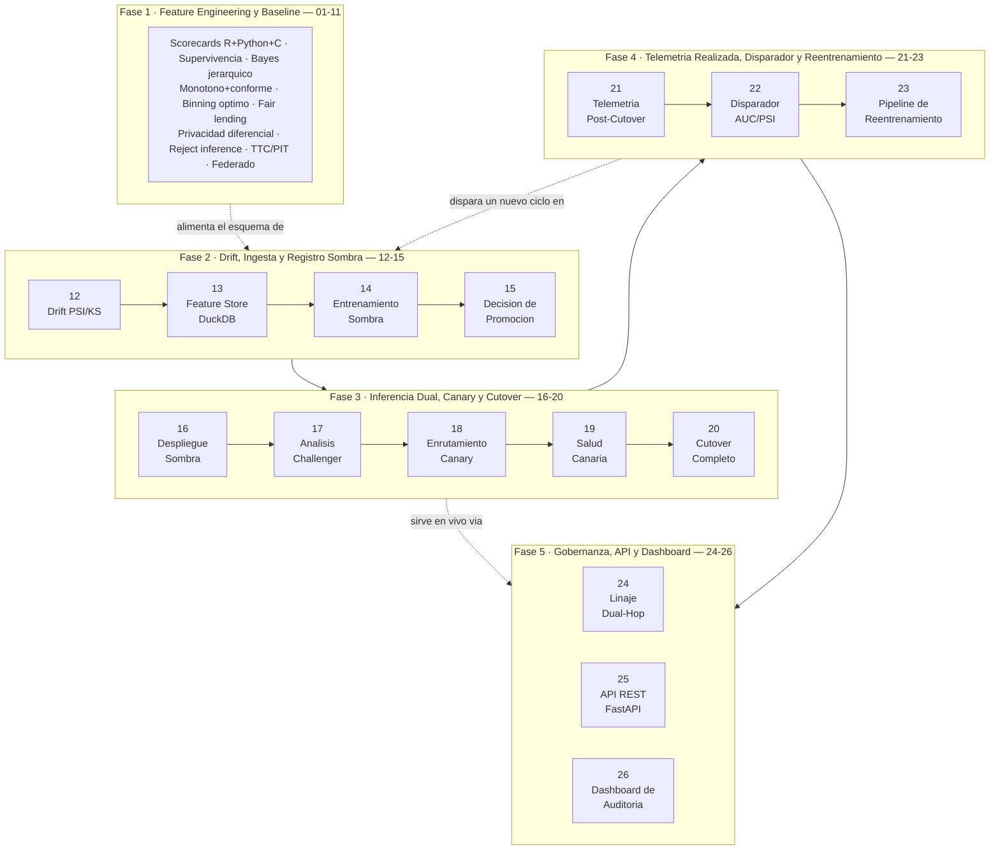
```mermaid
flowchart TB
    subgraph F1["Fase 1 · Feature Engineering y Baseline — 01-11"]
        direction LR
        P1["Scorecards R+Python+C · Supervivencia · Bayes jerarquico<br/>Monotono+conforme · Binning optimo · Fair lending<br/>Privacidad diferencial · Reject inference · TTC/PIT · Federado"]
    end

    subgraph F2["Fase 2 · Drift, Ingesta y Registro Sombra — 12-15"]
        direction LR
        P2a["12<br/>Drift PSI/KS"] --> P2b["13<br/>Feature Store<br/>DuckDB"] --> P2c["14<br/>Entrenamiento<br/>Sombra"] --> P2d["15<br/>Decision de<br/>Promocion"]
    end

    subgraph F3["Fase 3 · Inferencia Dual, Canary y Cutover — 16-20"]
        direction LR
        P3a["16<br/>Despliegue<br/>Sombra"] --> P3b["17<br/>Analisis<br/>Challenger"] --> P3c["18<br/>Enrutamiento<br/>Canary"] --> P3d["19<br/>Salud<br/>Canaria"] --> P3e["20<br/>Cutover<br/>Completo"]
    end

    subgraph F4["Fase 4 · Telemetria Realizada, Disparador y Reentrenamiento — 21-23"]
        direction LR
        P4a["21<br/>Telemetria<br/>Post-Cutover"] --> P4b["22<br/>Disparador<br/>AUC/PSI"] --> P4c["23<br/>Pipeline de<br/>Reentrenamiento"]
    end

    subgraph F5["Fase 5 · Gobernanza, API y Dashboard — 24-26"]
        direction LR
        P5a["24<br/>Linaje<br/>Dual-Hop"]
        P5b["25<br/>API REST<br/>FastAPI"]
        P5c["26<br/>Dashboard de<br/>Auditoria"]
    end

    F1 -.alimenta el esquema de.-> F2
    F2 --> F3 --> F4
    F4 -.dispara un nuevo ciclo en.-> F2
    F3 -.sirve en vivo via.-> F5
    F4 --> F5
```

The dotted line from Phase 4 back into Phase 2 is the actual closed loop, not
a decoration: technique 23's retrained Challenger is a real
`shadow_model_<timestamp>.pkl`, in the exact shape techniques 14 and 15
already know how to consume, so it can re-enter promotion and deployment
without a special case. Technique 26's own audit of this lab, run against the
real chain, caught that loop open mid-cycle — a trigger fired, a Challenger
was trained, nobody ran it back through promotion yet — and reported
`DEGRADED` rather than hiding it.

## The 26 techniques, master index

| # | Directory | Technique | Key metric / artifact | Run |
|---|---|---|---|---|
| 01 | [`01-polyglot-scorecard-r-python-c`](01-polyglot-scorecard-r-python-c) | Polyglot scorecard (R+Python+C) | C engine matches R to **4.79e-11** at **270.6M rows/s** | `pytest -q` · `Rscript tests/testthat.R` · `make -C c test` |
| 02 | [`02-bidirectional-r-python-interop`](02-bidirectional-r-python-interop) | Bidirectional R↔Python interop | Empirical LGD **67.4% → 83.7%** in recession; ECL **+24.2%** | `pytest -q` · `Rscript tests/testthat.R` |
| 03 | [`03-survival-lifetime-pd-term-structure`](03-survival-lifetime-pd-term-structure) | Lifetime PD from survival analysis | **50.5%** of lifetime risk arrives after month 12 | `pytest -q` |
| 04 | [`04-bayesian-hierarchical-partial-pooling`](04-bayesian-hierarchical-partial-pooling) | Bayesian hierarchical scorecard | Segment-effect error **−39%** | `pytest -q` |
| 05 | [`05-monotonic-constraints-conformal-decisioning`](05-monotonic-constraints-conformal-decisioning) | Monotonic constraints + conformal | Violations **97.15% → 0.00%** | `pytest -q` |
| 06 | [`06-optimal-binning-scorecard`](06-optimal-binning-scorecard) | Optimal-binning scorecard | **+13% IV** over deciles | `pytest -q` |
| 07 | [`07-fair-lending-bias-audit`](07-fair-lending-bias-audit) | Fair lending bias audit | Gender reconstructed at **AUC 0.768** | `pytest -q` |
| 08 | [`08-differential-privacy-scoring`](08-differential-privacy-scoring) | Differentially private scoring | ε=1 costs **18.4% of AUC** to hide memorisation | `pytest -q` |
| 09 | [`09-reject-inference-selection-bias`](09-reject-inference-selection-bias) | Reject inference & selection bias | ρ recovered to **0.02** of truth with an instrument | `pytest -q` |
| 10 | [`10-through-the-cycle-pd-vasicek`](10-through-the-cycle-pd-vasicek) | Through-the-cycle vs. point-in-time PD | PIT capital swings **173.5 pp** of RWA density | `pytest -q` |
| 11 | [`11-federated-credit-scoring`](11-federated-credit-scoring) | Federated credit scoring | Local-only misprices national risk by **24.6 pp** | `pytest -q` |
| 12 | [`12-drift-monitoring-psi-ks`](12-drift-monitoring-psi-ks) | Drift monitoring (PSI / KS) | `ingreso_mensual` PSI **0.82** (red) in a real run | `pytest -q` |
| 13 | [`13-feature-store-duckdb`](13-feature-store-duckdb) | Feature store on DuckDB | Upserts drift snapshots into `credit_features` | `pytest -q` |
| 14 | [`14-shadow-model-training`](14-shadow-model-training) | Shadow model training | Trains a Challenger from the freshest feature-store snapshot | `pytest -q` |
| 15 | [`15-model-promotion`](15-model-promotion) | Model promotion decision | `PROMOTED`/`REJECTED` against min ROC-AUC + sample size | `pytest -q` |
| 16 | [`16-shadow-deployment`](16-shadow-deployment) | Shadow deployment (dual inference) | Champion vs. Challenger logged side by side, never swapped | `pytest -q` |
| 17 | [`17-challenger-analysis`](17-challenger-analysis) | Challenger analysis | Champion/Challenger divergence monitoring | `pytest -q` |
| 18 | [`18-canary-deployment`](18-canary-deployment) | Canary deployment | Deterministic MD5-hash traffic split, any `canary_percentage` | `pytest -q` |
| 19 | [`19-canary-monitoring`](19-canary-monitoring) | Canary health monitoring | Auto-rollback on null-rate / score-diff / high-risk thresholds | `pytest -q` |
| 20 | [`20-full-promotion-cutover`](20-full-promotion-cutover) | Full promotion cutover | Archive-then-promote Champion swap, audited in DuckDB | `pytest -q` |
| 21 | [`21-post-cutover-telemetry`](21-post-cutover-telemetry) | Post-cutover telemetry | Realized AUC/Brier/log-loss + PSI vs. matured ground truth | `pytest -q` |
| 22 | [`22-automated-retraining-trigger`](22-automated-retraining-trigger) | Automated retraining trigger | Fires on realized AUC `< 0.72` or PSI `> 0.20` | `pytest -q` |
| 23 | [`23-automated-retraining-pipeline`](23-automated-retraining-pipeline) | Automated retraining pipeline | Trigger → fresh `shadow_model_<timestamp>.pkl`, no special case | `pytest -q` |
| 24 | [`24-model-lineage-governance`](24-model-lineage-governance) | Model lineage & governance | Dual-hop trace: `champion_model.pkl` → `active_shadow_model.pkl` → `shadow_model_<timestamp>.pkl` | `pytest -q` |
| 25 | [`25-api-inference-service`](25-api-inference-service) | Real-time inference API | `POST /predict`: `503` not `500` with no Champion, `400` not `422` on bad input | `pytest -v` |
| 26 | [`26-lab-summary-dashboard`](26-lab-summary-dashboard) | Lab summary dashboard | Audits all 25 others into one `HEALTHY`/`DEGRADED` verdict | `pytest -q` |

## Staff highlights

Four things in this lab that only showed up by actually running the full
chain, not by passing a test suite against seeded fixtures:

- **Multi-DuckDB isolation and reflective auditing.** There is no single
  "central" database. `13-feature-store-duckdb`, `16-shadow-deployment`,
  `18-canary-deployment`, `20-full-promotion-cutover`, and
  `25-api-inference-service` each keep their own `.duckdb` file with their
  own table — a deliberate choice this chain makes consistently (see
  `19-canary-monitoring`'s own docstring on why techniques never import each
  other's code, only integrate by file and by table). Technique 26's auditor
  is built around that reality instead of fighting it: `audit_database_integrity`
  takes *one* path and introspects whichever tables that specific file
  actually has via `information_schema.tables`, rather than assuming a fixed
  schema — so it works against all five real databases by being called five
  times, not by being rewritten five times.
- **Dual-hop lineage resolution.** Tracing `champion_model.pkl` back to its
  training run doesn't resolve in one hop. Technique 20's cutover manifest
  points at `active_shadow_model.pkl` — the fixed name technique 16's
  registry always uses for whatever candidate is currently active, never the
  original filename. The real identity, `shadow_model_<timestamp>.pkl`,
  survives one hop further back in `registry_manifest.json`'s
  `active_version` field. Technique 24's first version only implemented the
  first hop; running it against the real chain for the first time produced a
  trace with every field `null` except the bare cutover event, which is what
  surfaced the second hop was missing.
- **Honest governance: a half-closed retraining loop reports `DEGRADED`.**
  Technique 26's real end-to-end run shows exactly this: a retraining trigger
  fired for real (realized AUC 0.64), technique 23 trained a genuine new
  Challenger in response — it's sitting in the report as a valid, loadable
  artifact — but it was never run back through promotion and cutover to
  become the new Champion. The lab status comes out `DEGRADED`, correctly,
  because the verdict is built from two named conditions (no valid Champion,
  or an unresolved active trigger), never a blended score that a still-valid
  Champion file could quietly outweigh.
- **AUC vs. calibration misalignment.** Technique 11 found it first in a
  federated-learning context (a bank trained only on its own high-risk
  customers scores a respectable **AUC 0.77+** nationally while mispricing
  the actual default rate by 24.6 percentage points), and technique 21's
  real post-cutover run reproduces the same shape deliberately: **ROC-AUC
  0.775** sitting next to a **−7.94 pp** calibration bias in the same
  report. A model can rank applicants well while being wrong about the
  actual *level* of risk, and a ranking metric alone will never show it —
  which is why every telemetry and promotion report in this lab carries
  `predicted_default_rate` next to `observed_default_rate`, not just AUC.

## Quickstart

```bash
git clone https://github.com/Rxyxs/credit-risk-scoring-lab.git
cd credit-risk-scoring-lab

# Any technique is self-contained — install and test it on its own:
cd 20-full-promotion-cutover
python -m venv venv
venv\Scripts\activate                       # source venv/bin/activate on Linux/macOS
pip install -r requirements.txt
pytest -v
cd ..
```

**Run the full test suite across every technique** (requires each folder's
own `requirements.txt` installed, matching what CI's 29-job matrix does per
folder):

```bash
for d in */; do
  [ -f "${d}pytest.ini" ] && (cd "$d" && pytest -q)
done
```

**Replicate the closed loop end to end** — real drift through a real audit,
the same sequence used to produce every "results from an actual run" section
in techniques 12–26:

```bash
cd 12-drift-monitoring-psi-ks && python run_pipeline.py --auto-retrain-trigger && cd ..
cd 13-feature-store-duckdb     && python run_ingestion.py                      && cd ..
cd 14-shadow-model-training    && python run_training.py                      && cd ..
cd 15-model-promotion          && python run_promotion.py                     && cd ..
# 16/18/20 need a --champion-model .pkl and --input-data CSV the first time through
# (see each technique's own README for the one-line stub-model script);
# 19, 21, 22, 23, 24, 25 then run with no extra arguments:
cd 19-canary-monitoring        && python run_health_check.py                  && cd ..
cd 20-full-promotion-cutover   && python run_cutover.py                       && cd ..
cd 21-post-cutover-telemetry   && python run_telemetry.py                     && cd ..
cd 22-automated-retraining-trigger && python run_trigger_check.py             && cd ..
cd 23-automated-retraining-pipeline && python run_orchestrator.py             && cd ..
cd 24-model-lineage-governance && python run_lineage.py --model-filename champion_model.pkl && cd ..
cd 26-lab-summary-dashboard    && python run_lab_summary.py                   && cd ..
```

---

# Techniques 01–11, in depth

### Where each technique sits in the credit lifecycle


```mermaid
flowchart LR
    subgraph O["Origination"]
        T01["01 · Scorecard + ML challengers<br/>+ compiled scoring engine"]
        T06["06 · Optimal binning<br/>and points card"]
    end
    subgraph D["Decision"]
        T05["05 · Monotonic constraints<br/>+ approve / review / decline"]
        T04["04 · Posterior PD<br/>+ uncertainty-aware cutoffs"]
        T09["09 · Reject inference<br/>+ selection-bias correction"]
    end
    subgraph P["Provisioning"]
        T03["03 · PD term structure<br/>12m vs lifetime ECL"]
        T02["02 · Empirical LGD<br/>+ market-risk stress"]
        T10["10 · TTC vs PIT PD<br/>+ IRB capital"]
    end
    subgraph G["Governance"]
        T07["07 · Fair lending audit"]
        T08["08 · Privacy guarantee"]
        T06b["06 · PSI / CSI monitoring"]
        T11["11 · Federated training<br/>across institutions"]
    end
    O --> D --> P --> G
```

### Results at a glance

| # | Technique | Headline result | The caveat that comes with it |
|---|---|---|---|
| [01](#01--polyglot-scorecard-r--python--c) | Polyglot scorecard | C engine matches R's scorecard to **4.79e-11** at **270.6M rows/s** | The interpretable scorecard also *won* on accuracy — reported plainly, not spun |
| [02](#02--bidirectional-rpython-interop) | R↔Python interop | Empirical LGD **67.4% → 83.7%** in a recession scenario; ECL **+24.2%** | A linear macro assumption understates the tail by 8.6 points |
| [03](#03--lifetime-pd-from-survival-analysis) | Lifetime PD | **50.5%** of lifetime risk arrives after month 12; provisions **+19.3%** | The time-varying term is significant in-sample and moves AUC by −0.0003 |
| [04](#04--bayesian-hierarchical-scorecard) | Hierarchical Bayes | Segment-effect error **−39%**; τ posterior covers the true value | The uncertainty-aware cutoff **lost** 3.6% of profit |
| [05](#05--monotonic-constraints--conformal-decisioning) | Monotonic + conformal | Violations **97.15% → 0.00%** at no accuracy cost | Conformal review volume is 50% of the book at α = 0.10 |
| [06](#06--optimal-binning-scorecard) | Optimal binning | **+13% IV** over deciles, zero non-monotone variables, bands separate **9.3×** | A greedy tree still edges it by 0.7 pp of out-of-time AUC |
| [07](#07--fair-lending-bias-audit) | Fair lending audit | Gender reconstructed from the model's own features at **AUC 0.768** | Dropping the proxy made the disparity **worse** |
| [08](#08--differentially-private-scoring) | Differential privacy | Canaries prove memorisation (**t = 44.8**); ε = 1 makes it undetectable | That budget costs **18.4% of AUC** |
| [09](#09--reject-inference--selection-bias) | Reject inference | Bivariate probit recovers ρ to **0.02** of the truth with an exclusion instrument | Without one, the same model is off by **0.36–0.44** — sometimes the wrong sign |
| [10](#10--through-the-cycle-vs-point-in-time-pd) | TTC vs. PIT PD | Point-in-time capital swings **173.5 points** of RWA density across one cycle | The through-the-cycle line is flat by construction — a modelling choice, not a finding |
| [11](#11--federated-credit-scoring) | Federated scoring | FedAvg matches the centralized oracle's calibration (**+0.18 pp** bias vs. **+4.45 pp** local-only) | One bank alone misprices national risk by **24.6 points** — and its AUC still looks fine |

---

## Techniques 01–11, in detail

## 01 · Polyglot scorecard (R + Python + C)

**Folder:** [`01-polyglot-scorecard-r-python-c`](01-polyglot-scorecard-r-python-c)

**The problem.** A scorecard has two masters. The risk committee and the
regulator want to read it — every variable, every band, every point. The
origination system wants to score an application in the time it takes a page to
load, thousands of times a minute. Those requirements pull the design in
opposite directions, and the usual answer is to pick one and apologise for the
other.

**The method.** Each language does the job it actually does in a risk
department. **R** builds the regulatory WOE/IV scorecard with logistic
regression and PDO points. **Python** trains the ML challengers (XGBoost,
LightGBM, Random Forest) with SHAP explainability, a PyTorch MLP with focal
loss, and reject-inference experiments. **C** implements the compiled scoring
hot path, exposed through `ctypes`, and its output is verified against R's
score rather than assumed equal. A FastAPI service exposes champion and
challenger behind the same endpoint.

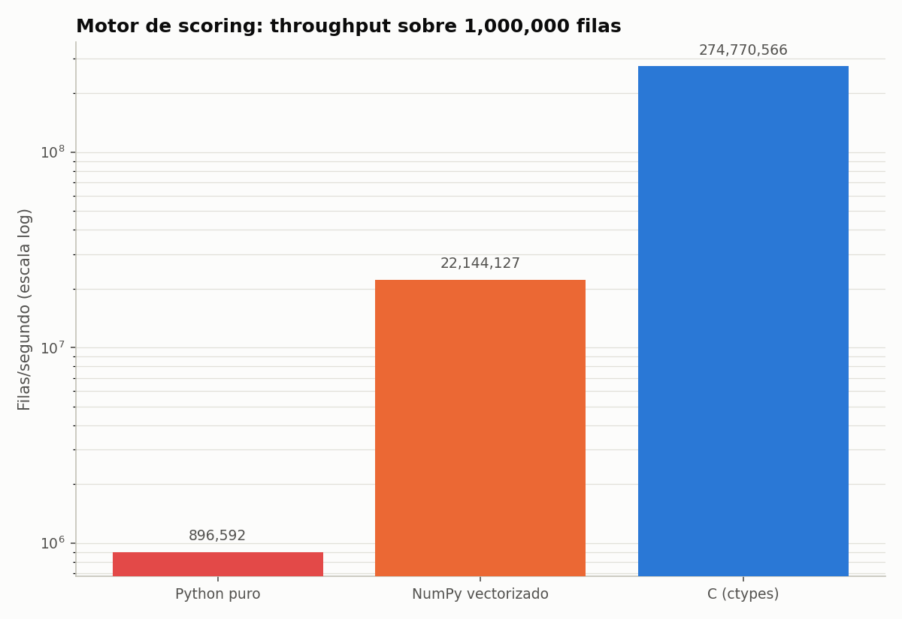

*Throughput over 1,000,000 rows, log scale. The compiled engine scores 270.6M
rows/second against 24.3M for vectorised NumPy and 0.97M for a pure-Python
loop — and produces the same number as R's scorecard to within 4.79e-11, which
is the part that makes the speed usable rather than merely impressive.*

The engine also builds and runs on Linux/GCC — CI compiles it with `make` and
runs a 1020-assertion correctness suite (`c/tests/test_score_engine.c`) on
every push, separately from the MSVC build measured above (see
[Continuous integration](#continuous-integration)).

**What came out.** The scorecard reached Gini 0.466 and KS 0.358; the best ML
challenger reached Gini 0.461. **The interpretable model won**, and the project
says so instead of reframing the comparison. The reject-inference section finds
that AUC measured only on approved applicants is consistently lower than on the
full population — a textbook selection effect, measured rather than cited.

---

## 02 · Bidirectional R↔Python interop

**Folder:** [`02-bidirectional-r-python-interop`](02-bidirectional-r-python-interop)

**The problem.** Credit risk and market risk are managed together and modelled
apart. Default rates and market volatility rise together — the wrong-way risk a
risk committee worries about — but the natural tooling for each lives in a
different language: pandas and XGBoost on one side, `quantmod`, `rugarch` and
censored regression on the other.

**The method.** Two genuine bridges running in opposite directions, not two
folders exchanging CSVs. `reticulate` lets R call Python and receive a live
pandas DataFrame as an R data frame; `rpy2` lets Python call R and load a
trained R model object. Python handles cleaning and credit scoring; R handles
candlestick market analysis, GARCH volatility, and LGD calibrated empirically
with Tobit and GAM on **real Chilean macro data** from the World Bank API.

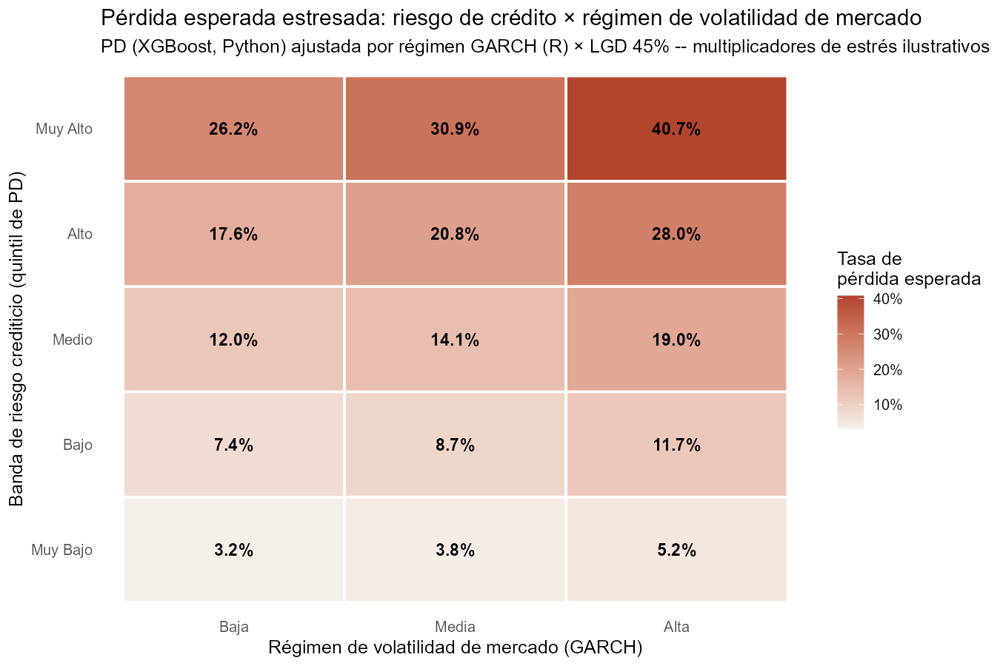

*The centrepiece: expected loss per credit-risk band stressed against three
market-volatility regimes — one number a risk committee can read, produced by a
Python ML model and an R econometric model in the same figure.*

**What came out.** PD discrimination of AUC 0.750 / KS 0.424 from logistic
regression (again beating XGBoost, again reported plainly). Empirically
calibrated LGD of **67.4%** in the base scenario against the industry-typical
flat 45% assumption, rising to **83.7%** in a 2020-anchored severe scenario, and
portfolio ECL **+24.2%** under IFRS 9 staging. Assuming a *linear* macro
relationship understates the severe-scenario LGD by 8.6 points — the argument
for fitting a GAM rather than a regression line.

---

## 03 · Lifetime PD from survival analysis

**Folder:** [`03-survival-lifetime-pd-term-structure`](03-survival-lifetime-pd-term-structure) · 38 tests

**The problem.** A scorecard answers *whether* a borrower defaults in the next
12 months. It cannot answer *when*, and "when" is what provisioning turns on:
IFRS 9 asks for a 12-month expected loss in Stage 1 and a **lifetime** expected
loss in Stage 2. A single number cannot produce both.

**The method.** Model the hazard instead of the label. Every loan is followed
month by month until it defaults, prepays, or leaves the observation window, and
a censored loan is treated as an incomplete observation rather than a good
customer. Cox proportional hazards is written from scratch — Breslow *and* Efron
partial likelihoods, analytic gradient and Hessian via suffix cumulative sums,
damped Newton-Raphson, scaled Schoenfeld residuals — alongside a discrete-time
hazard model on person-period data, which handles monthly ties exactly.

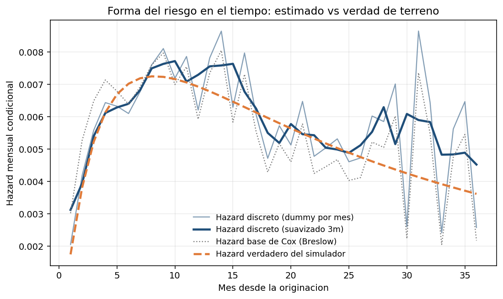

*The estimated hazard against the one the simulator actually used. The seasoning
hump — risk climbing after origination, peaking around month 8-10, then
declining — is recovered, and the curve gets visibly noisier past month 25 as
loans with 12- and 24-month terms leave the book and thin the risk set. That
degradation is in the chart because it is real.*

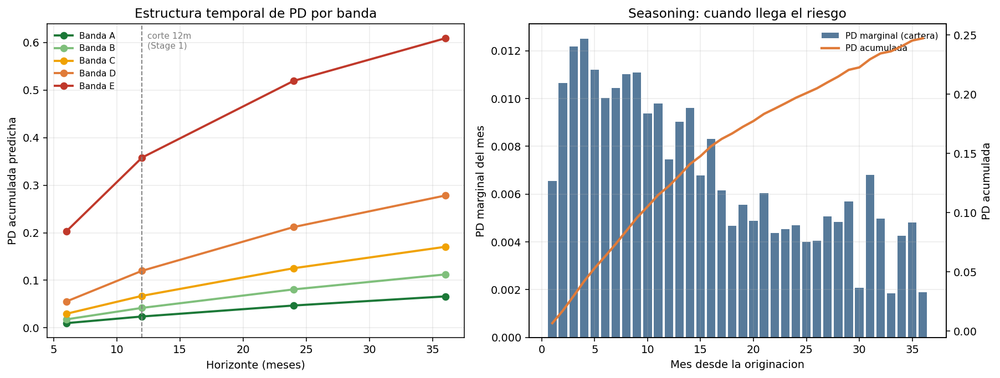

*Left: cumulative PD by horizon for each risk band, with the 12-month
Stage 1 cut-off marked. Right: when the risk actually arrives across the
portfolio. Band A reaches 2.4% at 12 months and 6.6% over the full life —
almost two thirds of its risk sits beyond the cut-off a 12-month model can see.*

**What came out.** The from-scratch engine recovers the simulator's
coefficients with a mean absolute error of **0.0224**, its analytic gradient
matches finite differences to 6.7e-07, and the Schoenfeld test flags **exactly
one** covariate — the one built to have a decaying effect — with no false
alarms among the other eight. Out of sample: C-index 0.7841, AUC 0.8132 at 12
months. **50.5% of lifetime default risk arrives after month 12**, and
recognising that on the 9.3% of the book that trips the SICR proxy raises
provisions from CLP 660.6M to 787.8M (**+19.3%**).

**The caveat.** The time-varying specification is overwhelming in-sample
(LR = 21.91, p = 2.9e-06) and moves out-of-sample AUC by **−0.0003**. It earns
its place by improving calibration (−13% error), not ranking — and the pipeline
selects on that basis, in code.

---

## 04 · Bayesian hierarchical scorecard

**Folder:** [`04-bayesian-hierarchical-partial-pooling`](04-bayesian-hierarchical-partial-pooling) · 34 tests

**The problem.** A portfolio is never one population. The same bank lends in
Santiago and in Los Lagos, to salaried and informal borrowers, through branches
and an app. Modelling them together prices a thin segment as the portfolio
average; modelling them separately turns 30 observations into policy. And a
point estimate says nothing about which of the two situations you are in.

**The method.** Partial pooling: each segment's effect is drawn from a common
distribution whose spread τ is itself estimated, so segments with history keep
their own estimate and thin ones are pulled toward the average — no shrinkage
constant to choose. The sampler is written from scratch on **Pólya-Gamma
augmentation**, which makes the logistic likelihood conditionally Gaussian and
collapses the whole thing into closed-form Gibbs steps: no Metropolis, no
acceptance rate, no tuning. Split R̂ and Geyer ESS are also implemented directly.

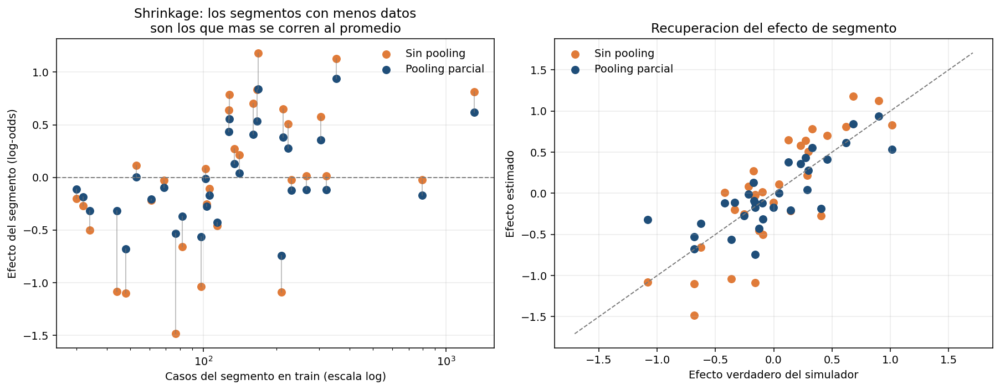

*Left: each segment's estimated effect with and without pooling, against how
many training cases it has (log scale). The grey lines are the shrinkage — long
where the data is thin, almost invisible where it is plentiful. Right:
recovery against the simulator's true effects; the pooled estimates sit closer
to the diagonal.*

**What came out.** Partial pooling wins on every predictive metric (AUC 0.8309,
best log-loss) and cuts the error in recovered segment effects by **39%**
against both extremes. The dispersion parameter comes back at **τ = 0.515 with
a 90% credible interval of [0.391, 0.668]**, covering the true 0.450 — and the
model was never told that segments differ at all. The no-pooling configuration
legitimately fails its convergence check (R̂ = 1.36), because the intercept and
the segment effects are only identified through their *sum*; diagnosing that sum
separately (R̂ = 1.0028) distinguishes "this model is broken" from "this
parameterisation is not identifiable".

**The caveat.** Deciding with the 95th percentile of the posterior instead of
its mean **cost 3.6% of profit** at 80% approval. The mechanism works as
designed — the applicants it declines carry 2.5× the portfolio's posterior
standard deviation — but there was not enough uncertainty left, at this sample
size, for caution to pay. Reported as the measured negative result it is.

---

## 05 · Monotonic constraints + conformal decisioning

**Folder:** [`05-monotonic-constraints-conformal-decisioning`](05-monotonic-constraints-conformal-decisioning) · 23 tests

**The problem.** Two things sink a model in the room where it gets approved,
and neither is AUC. The first: it answers a question wrong in a way anyone can
see — *if this applicant's debt burden rises and nothing else changes, does the
model say the risk is higher?* The second: it has no way to say "I don't know",
so it decides on applicants it has no business deciding on.

**The method.** Monotonic constraints where domain knowledge supports them
(seven features), and deliberately **not** on age, whose true effect is
U-shaped. Then a counterfactual audit that moves one variable along a grid per
applicant, holding everything else fixed, and counts reversals. On top, a
Mondrian split-conformal predictor turns PD into approve / manual review /
decline with a distribution-free coverage guarantee.

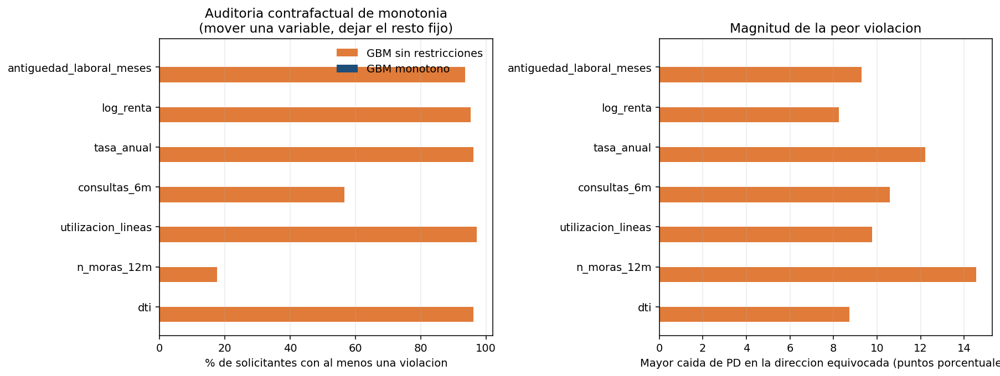

*The unconstrained model violates monotonicity for up to 97.6% of applicants on
a single variable, with reversals as large as 14.5 points of PD. The constrained
model's bars are invisible because they are zero — by construction, not by luck.
Note also that its *average* response curve looks almost fine: the violations
are individual-level, which is exactly the level a customer complaint or a
supervisory review operates at.*

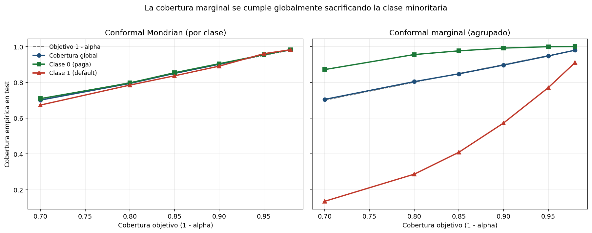

*Why the class-conditional (Mondrian) variant matters. Left: coverage tracks the
target for both classes. Right: the marginal version hits the same global target
while covering the paying class at 99% and letting the default class fall to
57%. With a 23% base rate, "90% coverage" computed over the pooled population is
almost entirely a statement about the majority class.*

**What came out.** Constraining cost **nothing**: AUC went from 0.7655 to
**0.7695** — with a truly monotone risk process the constraint removes exactly
the flexibility that was fitting noise. At α = 0.10, the conformal three-way
policy makes **a third fewer errors** in what it automates than a score band
sending the same volume to review (19.79% vs. 29.41%), and 8% more profit. A
covariate-shift stress test then shows where the guarantee breaks: on a
deteriorated portfolio the paying class drops nine points below target and
automatic approvals halve — recalibrating on 2,100 new cases restores it.

**The caveat.** Half the book goes to manual review at α = 0.10. That is the
model honestly reporting that it cannot rule out either label for most
applicants, but the analysts have to be paid for; the α sweep prices that dial.

---

## 06 · Optimal-binning scorecard

**Folder:** [`06-optimal-binning-scorecard`](06-optimal-binning-scorecard) · 34 tests

**The problem.** The least glamorous step in a scorecard decides most of its
quality: **where each variable gets cut**. The usual answers are deciles (fast,
blind to the label) or a decision tree (uses the label, but is a greedy
heuristic with no guarantee of optimality and none at all of monotonicity). And
once deployed, a scorecard that nobody monitors fails silently.

**The method.** State binning as what it is — partition an ordered axis to
maximise Information Value subject to at most K bins, a minimum population and
event count per bin, and a monotone WOE sequence — and solve it **exactly** by
dynamic programming over all-segment prefix sums. Then a points card with the
standard PDO transformation, and PSI/CSI monitoring replayed vintage by vintage
against a book with a known population break.

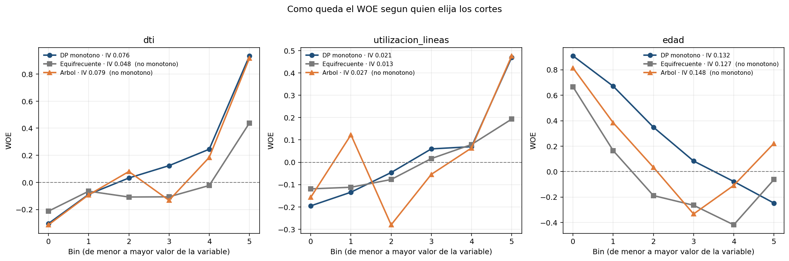

*The same three variables, cut three ways. The DP produces a clean monotone WOE
in every case; the tree zig-zags on line utilisation (down, up, down, up across
consecutive bins) — a card no one wants to defend. On age, whose true effect is
U-shaped, the monotone DP deliberately gives up IV rather than fake a shape the
domain does not have.*

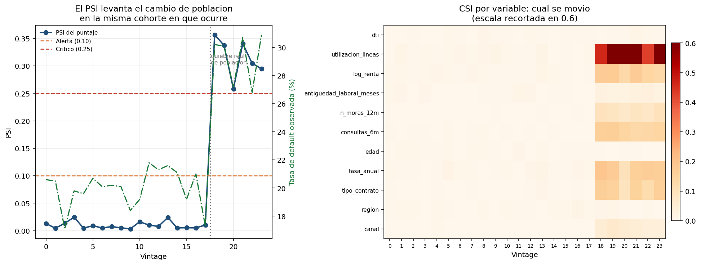

*Left: PSI stays under 0.025 for eighteen stable vintages — no false alarms —
and jumps to 0.36 in the exact cohort where the population breaks. Right: CSI
per variable names the culprit rather than just raising a flag; line
utilisation is the variable the simulator shifted hardest.*

**What came out.** The DP recovers **13% more IV** than equal-frequency binning
and is the only method producing a card with zero non-monotone variables. The
resulting bands separate **9.3×** in observed default rate (47.79% in band E vs.
5.16% in band A). The exactness claim is not rhetorical: a test enumerates
*every* feasible partition on small instances and the DP matches, with and
without the monotonicity constraint.

**The caveat, and the more interesting finding.** A greedy tree still edges the
DP by 0.7 pp of out-of-time AUC — because the DP can only cut on pre-binning
grid boundaries, which the grid-resolution sweep demonstrates by converging to
the tree's cut points as the grid refines. And the monitoring result cuts
against the obvious reading: PSI screamed (0.36, fourteen times the alert
threshold) **while the model stayed correct** — AUC actually rose and calibration
held within 0.12 pp. The population changed; the model was right about it.

---

## 07 · Fair lending bias audit

**Folder:** [`07-fair-lending-bias-audit`](07-fair-lending-bias-audit) · 22 tests

**The problem.** Every credit model starts from the same rule: the protected
attribute does not go into the model. That rule is legally required and, as a
fairness guarantee, close to worthless on its own — if the features correlate
enough with the group, the model reconstructs it whether or not anyone intended
that.

**The method.** A simulator where **gender is absent from the process that
generates default**, but correlates with income and job tenure (a wage gap,
interrupted careers) and where the labour sector is strongly gender-segregated
while carrying almost no risk signal. Any disparity found downstream is
therefore legitimate correlation or model artefact, never causation. Then five
fairness metrics with bootstrap intervals, a per-feature proxy detector, a
stratified decomposition of the gap, and four mitigations compared at equal
approval volume.

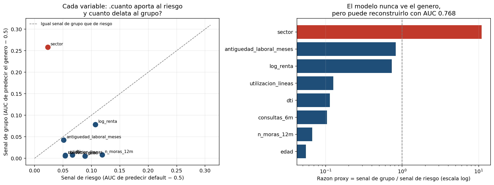

*Left: each feature's group signal against its risk signal. Everything sits
below the diagonal — earning its place — except `sector`, which carries far more
information about gender than about default. Right: the same as a ratio on a log
scale, with the headline above it: a model that never sees gender can
reconstruct it from its own inputs with AUC 0.768.*

**What came out.** `sector` carries **11× more group signal than risk signal**.
The gap in predicted PD is **+1.430 pp raw and +0.120 pp between comparable
profiles** — **91.6% is legitimate correlation** with income and debt burden.
The five metrics are reported with intervals: adverse impact ratio 0.9688
[0.9462, 0.9971], comfortably above the 0.80 regulatory threshold; demographic
parity −2.53 pp [−4.39, −0.23], small but distinguishable from zero; and a
calibration gap that is **not** distinguishable from zero.

**The caveat — the most useful result in the project.** Removing the proxy made
the disparity **worse** (−2.53 → −4.14 pp). The group information `sector`
carried was *favourable*: female-dominated sectors carry slightly lower risk, so
including it was partially offsetting the income gap. "Drop the correlated
variables" is a rule of thumb that moves fairness in either direction, and it
has to be measured per variable on the actual book.

---

## 08 · Differentially private scoring

**Folder:** [`08-differential-privacy-scoring`](08-differential-privacy-scoring) · 43 tests

**The problem.** A credit model is trained on the most sensitive data a person
hands over, and then it leaves the room — to a vendor, into an API, sometimes
into a paper. Anonymising the training table does not settle it, because the
model itself carries information about the people in it.

**The method.** Both halves written from scratch. **DP-SGD**: per-example
gradients, L2 clipping to bound one person's influence, Gaussian noise, and
Poisson subsampling — the sampling scheme the accounting actually assumes.
**An RDP accountant** for the subsampled Gaussian mechanism, composed over
training steps and converted to (ε, δ), with noise calibrated by binary search
to a target budget. And then the part most DP write-ups skip: attacking the
result, with a membership-inference attack and 40 injected canaries — pristine
applicant profiles labelled as defaults, whose elevated PD can only be
memorisation.

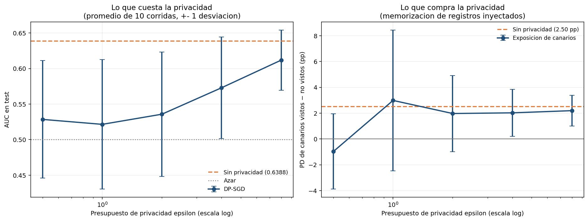

*Left: what privacy costs — AUC against ε, averaged over ten independent runs
with one standard deviation, against the non-private baseline. Right: what it
buys — the PD gap between canaries the model trained on and identical ones it
never saw. The error bars on the right are the finding: under noise the effect
stops being distinguishable from zero rather than cleanly disappearing.*

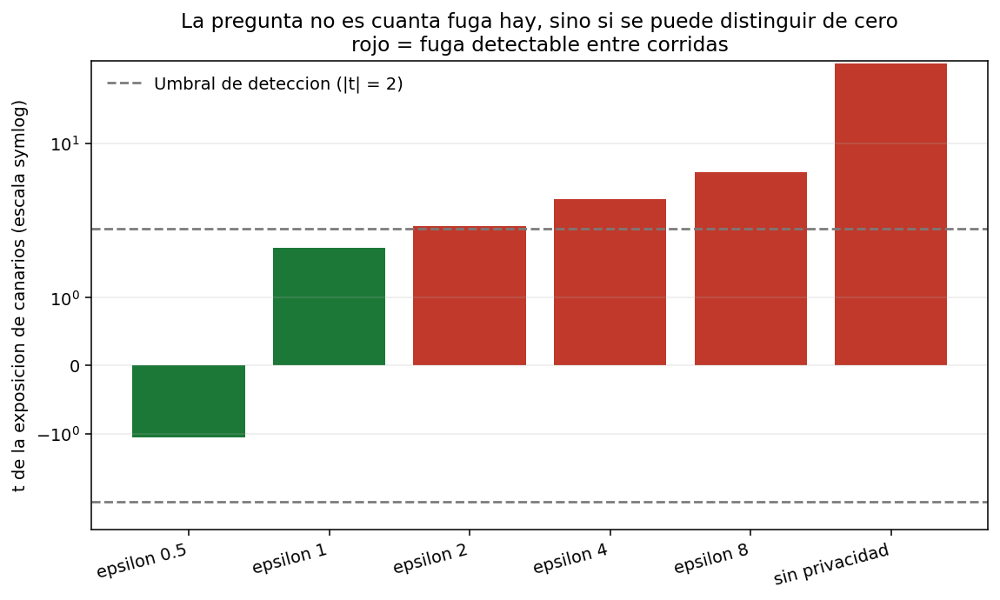

*The same data asked properly: not "how much leakage" but "can it be told apart
from zero". Red bars are budgets where the canary effect survives its own
run-to-run variance. The leak stops being detectable between ε = 2 and ε = 1.*

**What came out.** Without DP the leak is unambiguous: canaries get a PD **2.50
points higher** than identical unseen applicants, reproducing across all ten
runs (**t = 44.8**). The budget that makes it undetectable is **ε = 1**, and it
costs **18.4% of AUC** (0.6388 → 0.5215). At ε = 8 most accuracy survives
(0.6118) but the leak is still plainly detectable. On 1,200 rows there is no
comfortable middle — and that is the result.

**The caveat.** The textbook membership-inference attack reported AUC between
0.4959 and 0.5142 in **every** scenario, including the model with no privacy at
all. A logistic regression with 8 parameters on 1,240 rows does not overfit
enough for a loss-threshold attack to work, so the standard attack certifies as
private a model that demonstrably memorised 40 records. Both attacks are in the
repo because that gap is the point: a negative MIA is weak evidence, routinely
presented as strong evidence.

---

---

## 09 · Reject inference & selection bias

**Folder:** [`09-reject-inference-selection-bias`](09-reject-inference-selection-bias) · 64 tests

**The problem.** Every scorecard is trained on a lie of omission: the bank
only observes repayment for applicants a *previous* policy approved. The
rejected ones never got the loan, so their outcome never exists in any
database — and nobody inside the bank can check how wrong the new model is on
the population it will actually score.

**The method.** The simulator generates the outcome of **everyone**,
approved and rejected, before applying the historical policy — turning "does
this correction method work" from an article of faith into a number. Two
regimes matter: MAR (selection on observables, ρ = 0) and MNAR (the loan
officer also used soft information that never made it into any database,
ρ ≠ 0). A bivariate probit with selection is built from scratch, by maximum
likelihood with an **analytic gradient** — an early numerically-differentiated
version silently converged to a confidently wrong ρ, with `success: True` and
a near-zero gradient norm that was a genuine local optimum, not a bug.

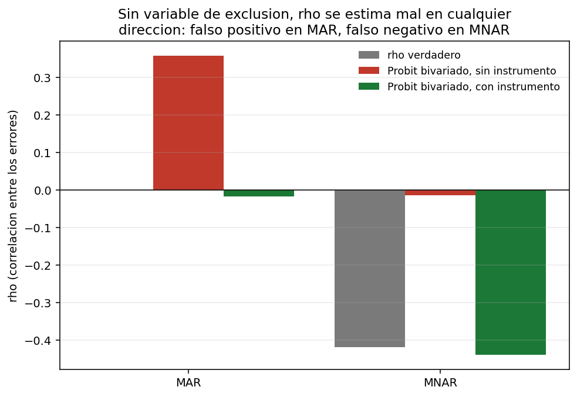

*Grey is the truth. Without an exclusion restriction (red) the model invents
selection bias that doesn't exist in MAR and misses bias that is very real in
MNAR — sometimes the wrong sign entirely. With a genuine instrument (green,
a branch-month commercial-pressure variable that moves approval but not true
risk) the same estimator lands within 0.02 of both true values.*

**What came out.** In MNAR, the correctly identified bivariate probit gets
within **0.0063** of the true coefficients — close to the impossible-in-
practice oracle's 0.0110 — while every method run *without* an exclusion
restriction, including the "correct" selection models, lands worse than
simply ignoring the rejects (coefficient error 0.078 vs. 0.082 for
approved-only).

**The caveat.** Ignoring the rejects entirely is not always the worst choice:
in MAR, approved-only recovers coefficients almost as well as the fully
corrected model, because when selection depends only on observables the
relationship inside the approved sample is already correct. The failure is
specific to MNAR, and the two need to be told apart before reaching for a fix.

---

## 10 · Through-the-cycle vs. point-in-time PD

**Folder:** [`10-through-the-cycle-pd-vasicek`](10-through-the-cycle-pd-vasicek) · 41 tests

**The problem.** Basel's IRB capital formula rests on one model — obligors
share exposure to a common business cycle, plus their own luck — and draws a
line regulators argue about constantly: the PD it uses should be a
long-run **through-the-cycle** average, not the **point-in-time** PD
conditional on today's economy. Plug in the wrong one and capital swings with
the economy instead of dampening it — demanding more capital exactly when
losses are rising and lending should keep flowing.

**The method.** The Vasicek single-factor (ASRF) model built from scratch:
conditional PD, the closed-form loss distribution, Basel's regulatory
correlation formula, and the full IRB capital requirement. Two independent
correlation estimators — method of moments (exact for any portfolio size) and
the ASRF limit (exact only as size grows without bound) — deliberately built
to disagree where the granularity assumption breaks.

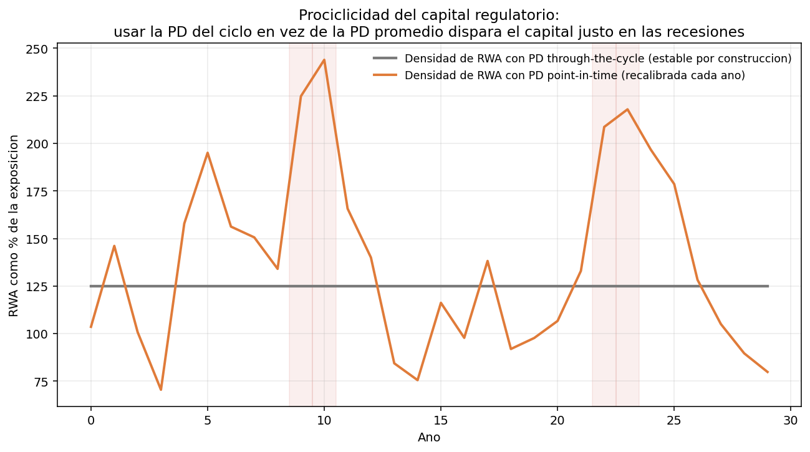

*Grey: RWA density using the through-the-cycle PD — flat by construction.
Orange: the same portfolio, the same Basel formula, recalibrated every year
with the point-in-time PD. It swings from 70.5% to 243.9% of exposure, and
the peaks land exactly on the two marked recessions.*

**What came out.** The business cycle is reconstructed from nothing but
aggregate default counts — never observed directly — at **0.985** correlation
with the truth. On a 200-obligor portfolio, the ASRF-limit correlation
estimator mistakes ordinary sampling noise for systematic risk (mean absolute
error 0.216); the method-of-moments estimator, exact for any N, holds at
0.022 on the same data.

**The caveat.** Basel's own formula was verified structurally — bounded
correlation, strictly increasing and LGD-linear capital — not against an
external published number this project has no offline way to check, which
would have been exactly the kind of unverifiable claim this repository tries
not to make.

---

## 11 · Federated credit scoring

**Folder:** [`11-federated-credit-scoring`](11-federated-credit-scoring) · 26 tests

**The problem.** Bank secrecy law is not a technicality a model can route
around. A micro-loan bank cannot hand its data to a mining-region bank or a
consortium — so each institution trains on a slice of the market that is
never representative of who its model will eventually score.

**The method.** FedAvg (McMahan et al., 2017) from scratch, pinned to two
exact algebraic identities rather than left merely plausible: with one
client, averaging does nothing, so FedAvg has to equal plain gradient
descent bit-for-bit; with one local step per round, the size-weighted
average of client gradients is algebraically the gradient on the pooled
data, so FedAvg has to match centralized training exactly regardless of how
unevenly sized the clients are. Six simulated banks, compared under
local-only, federated, and an impossible-in-practice centralized oracle.

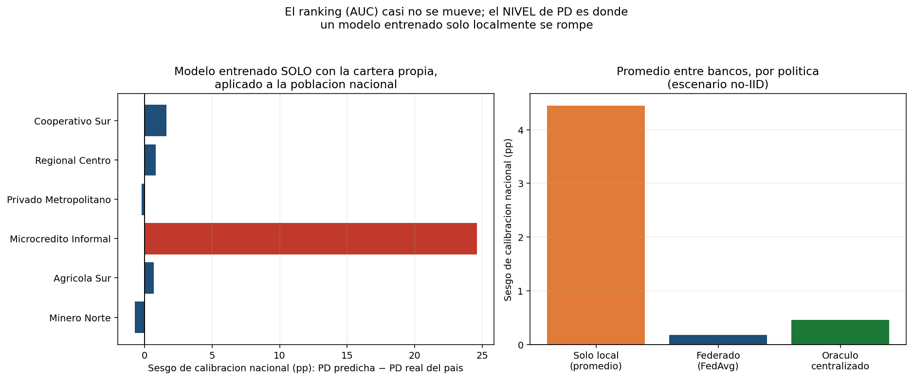

*Left: each bank's own model, trained only on its own customers, applied to
the national population it never saw. One bank's calibration bias is off the
chart. Right: the same comparison averaged across banks, by policy.*

**What came out.** AUC barely moves between local-only and federated
(0.7757 vs. 0.7797) — the dominant risk drivers point the same way
everywhere. **Calibration is where local-only breaks**: one bank, trained
on a high-risk micro-loan population, predicts a 52.2% average national PD
against a true 27.6% — a **24.6-point** miscalibration invisible to its
still-reasonable 0.768 AUC. Federated matches the oracle's calibration
almost exactly (+0.18 pp vs. +0.46 pp bias).

**The caveat.** Even though raw data never leaves a bank, a curious
coordinator can tell from the very first shared update alone which
participant serves a different population — that bank's gradient has
*negative* cosine similarity with everyone else's, before any model
training has finished. Federation solves "don't centralize the data"; it
does not by itself solve "don't leak who's behind the update."

---

# How the lab is built

## What is implemented from scratch, and how it is verified

Calling a library is the right default in production. It is the wrong default
when the mechanics *are* the subject — the code that reports your privacy
budget, or picks your bins, is exactly the part you should be able to defend.
Each component below is built directly and pinned to an independent check:

| Component | Where | How correctness is established |
|---|---|---|
| Cox partial likelihood (Breslow + Efron), analytic gradient & Hessian | [03](03-survival-lifetime-pd-term-structure/src/cox_ph.py) | Finite differences (max error 6.7e-07) and recovery of the simulator's coefficients (MAE 0.0224) |
| Kaplan-Meier, Harrell's C-index, Schoenfeld PH test | [03](03-survival-lifetime-pd-term-structure/src/evaluation.py) | Hand-computed five-row examples; the PH test fires on a planted time-varying effect and on nothing else |
| Pólya-Gamma augmentation + conjugate Gibbs sampler | [04](04-bayesian-hierarchical-partial-pooling/src/polya_gamma.py) | Sample moments against the analytic mean tanh(c/2)/(2c) and variance; truncation bias bounded and shown to be one-directional |
| Split R̂ and Geyer effective sample size | [04](04-bayesian-hierarchical-partial-pooling/src/diagnostics.py) | R̂ ≈ 1 on i.i.d. chains, > 1.5 on separated chains, > 1.2 on within-chain drift; ESS < N/5 for AR(1) with ρ = 0.9 |
| Mondrian split-conformal prediction | [05](05-monotonic-constraints-conformal-decisioning/src/conformal.py) | Coverage holds on exchangeable data **even with a deliberately useless model** — the guarantee belongs to the procedure, not the model |
| Counterfactual monotonicity audit | [05](05-monotonic-constraints-conformal-decisioning/src/monotonicity_audit.py) | A hand-built model with a downward step is caught, a monotone one scores zero, a reversed expected direction flags 100% |
| Optimal binning by dynamic programming | [06](06-optimal-binning-scorecard/src/binning.py) | Exhaustive enumeration of every feasible partition on small instances, with and without the monotonicity constraint |
| PSI / CSI stability monitoring | [06](06-optimal-binning-scorecard/src/monitoring.py) | Zero for identical distributions, matches a hand calculation on a two-bin case, and names the variable that actually moved |
| Five fairness metrics + bootstrap intervals | [07](07-fair-lending-bias-audit/src/fairness_metrics.py) | Selection rates computed by hand on an eight-row example; swapping the groups flips every sign |
| RDP accountant for the subsampled Gaussian | [08](08-differential-privacy-scoring/src/accountant.py) | With q = 1 it must equal exactly α/(2σ²), checked across Rényi orders and noise levels |
| DP-SGD (per-example clipping, Gaussian noise, Poisson sampling) | [08](08-differential-privacy-scoring/src/dp_sgd.py) | Matches scikit-learn's logistic regression with noise and clipping disabled (AUC within 0.01, coefficient cosine > 0.98) |
| Bivariate probit with selection (analytic joint gradient) | [09](09-reject-inference-selection-bias/src/selection_models.py) | Closed-form partials of the bivariate normal CDF checked against finite differences; recovers a known ρ to within 0.02 given an exclusion restriction |
| Bivariate normal CDF via Gauss-Legendre quadrature | [09](09-reject-inference-selection-bias/src/selection_models.py) | Checked against `scipy.stats.multivariate_normal` across seven correlations and five coordinate pairs |
| Vasicek closed-form loss distribution + Basel IRB capital formula | [10](10-through-the-cycle-pd-vasicek/src/vasicek.py) | CDF/quantile verified as exact inverses; the closed-form density matches an independent 50,000-obligor Monte Carlo simulation |
| Asset-correlation estimators (method of moments and ASRF limit) | [10](10-through-the-cycle-pd-vasicek/src/correlation_estimation.py) | The ASRF-limit estimator is required to overestimate ρ on a small portfolio while method of moments stays accurate on the same data |
| FedAvg (client-side SGD, server-side weighted aggregation) | [11](11-federated-credit-scoring/src/federated.py) | Two exact algebraic identities to `1e-9` tolerance: one client equals centralized GD; one local step per round equals centralized GD on the pooled data |

## Standards every folder follows

- **One command runs everything.** `python run_pipeline.py` regenerates data,
  fits models, evaluates, and writes reports and charts. Each stage also runs
  standalone with the exact command the orchestrator uses, so "run it all" and
  "run one step" cannot drift apart.
- **Bilingual documentation.** English and Spanish READMEs with a language
  selector, and every number traceable to a file in `outputs/reports/`.
- **An honest-findings section, always.** Negative results, things that
  underperformed, and mistakes caught during the build get written up instead
  of dropped. Several of them are the most useful part of their project.
- **Declared assumptions.** Where an economic figure is a laboratory assumption
  (45% LGD, a 7% margin, CLP 12,000 per manual review), it says so next to the
  result that uses it.
- **Generated artefacts stay out of git.** Data and reports are reproducible
  from the pipeline and are `.gitignore`d; charts are versioned because the
  READMEs reference them.

### Testing standard

Techniques 03–11 ship **325 tests**; techniques 12–26 ship **245 more** (the
production lifecycle around any one model); technique 01 reports 23 passing
(plus 10 skipped without a locally compiled C engine) in its own README;
technique 02 adds its own MLP loss/training and DuckDB metrics-persistence
tests (`02-bidirectional-r-python-interop/tests/`), run locally rather than
from CI since the R⇄Python bridge itself is exercised separately, by the
`testthat` job below.
They target what fails *silently* rather than loudly: an analytic identity the
implementation must reproduce, a hand-computed example, a property that must
hold (coverage, monotonicity, composition), a planted effect a diagnostic is
required to detect, or — for 12–26 — a regression class this lab actually hit
while building it (a `duckdb.connect` call with no parent directory, found and
fixed three separate times before technique 23 shipped with the guard already
in place).

| # | Tests | A representative check |
|---|---|---|
| 03 | 38 | Breslow ≡ Efron when there are no ties, and Breslow strictly attenuated when events are coarsely discretised |
| 04 | 34 | Shrinkage must be stronger in small segments, and posterior uncertainty must correlate negatively with segment volume |
| 05 | 23 | Prediction sets are nested in α: raising α can only remove labels, never add them |
| 06 | 34 | The dynamic program equals exhaustive search over every feasible partition |
| 07 | 22 | Reweighing provably equalises the weighted bad rate — and is a no-op when the groups are already independent |
| 08 | 43 | Attack AUC > 0.70 against a model with as many parameters as rows, trained on random labels |
| 09 | 64 | The bivariate probit recovers ρ within 0.08 with an exclusion instrument, and is required to miss by more than 0.15 without one |
| 10 | 41 | The closed-form Vasicek quantile matches an independent 50,000-obligor Monte Carlo simulation to within 0.01 |
| 11 | 26 | FedAvg with one client matches centralized gradient descent to `1e-9`; with E=1 and unevenly sized clients, to `1e-9` against the pooled-data gradient |
| 12 | 44 | PSI/KS drift detectors tested against both a stable distribution and a deliberately shifted one |
| 13 | 13 | Upserting the same snapshot twice by `client_id` never duplicates a row |
| 14 | 14 | Target-column resolution falls back through a candidate list; training aborts below the minimum row count |
| 15 | 17 | The promotion decision derives `shadow_model_<ts>.pkl` from `shadow_metrics_<ts>.json`'s own filename, same timestamp |
| 16 | 12 | Dual inference answers with the Champion alone, never raises, when no Challenger is registered |
| 17 | 18 | Champion/Challenger divergence monitoring over logged dual-inference predictions |
| 18 | 27 | The same `client_id` always lands in the same cohort for a given `canary_percentage` — deterministic MD5 hashing |
| 19 | 22 | Auto-rollback fires exactly when null-rate / score-diff / high-risk-rate cross their thresholds, and not before |
| 20 | 11 | Two cutovers in the same run archive two distinct Champions rather than one overwriting the other |
| 21 | 12 | PSI is checked to `1e-9` against an independent, non-vectorized reference bucketing implementation |
| 22 | 12 | A drift-triggered PSI can fire the retrain condition even on an otherwise `INSUFFICIENT_MATURITY` report |
| 23 | 11 | The retrained Challenger is named `shadow_model_<ts>.pkl` — identical in shape to one trained by hand |
| 24 | 9 | A Champion's lineage resolves through two hops — cutover manifest, then registry manifest — never one |
| 25 | 11 | A string in a numeric field returns `400` with Pydantic's own validation detail, never FastAPI's default `422` |
| 26 | 12 | `DEGRADED` fires from two named conditions (no valid Champion, or an unresolved active trigger), never a blended score |

### Continuous integration

Every push and pull request to `main` runs **29 independent jobs on
`ubuntu-latest`**, one workflow, three languages — [`.github/workflows/tests.yml`](.github/workflows/tests.yml):

| Language | Jobs | What each job runs | Latest green run |
|---|---|---|---|
| Python | 25 (technique 01, then 03–26) | `pytest tests/ -q` | **29/29 jobs passing** |
| Python (technique 02) | 1 | `pytest tests/ -q` with R present so `rpy2`'s wheel can build | included above |
| R (`testthat`) | 2 (techniques 01 and 02) | WOE/IV binning, PDO scorecard scaling (01); empirical LGD panel simulation and Beta/Logit calibration (02) | **50 assertions passed** |
| C (`gcc`, `make test`) | 1 (technique 01's `score_engine.c`) | Exact numeric correctness, NULL/out-of-range safety, batch-vs-single-row consistency | **1020 assertions passed**² |

¹ The 10 skips are technique 01's ctypes-bridge tests, which need the C
engine compiled locally first (`build.ps1` on Windows, `make lib` on
Linux) — CI doesn't check in a binary, so it skips them by design rather
than faking a pass.
² Includes a 1000-iteration loop checking that repeated calls return a
bit-identical result (i.e. no hidden mutable state) — that is one property
checked 1000 times, not 1000 independent test cases; the other 20
assertions are the actual scenario coverage (NULL pointers, out-of-range
bins, empty feature arrays, batch/single-row cross-checks).

These three counts are different units — pytest test functions, `testthat`
expectations, and raw C `assert`-style checks — and are kept separate on
purpose rather than added into one combined "number of tests," which would
mix things that aren't comparable.

Technique 02 has its own Python tests (`tests/test_credit_scoring_mlp.py`,
`tests/test_metrics_store.py`) but isn't part of the Python matrix above —
they're run locally, not from CI, unlike its R suite.

The standalone C benchmark (`c/bench_main.c`, no ctypes overhead) measured
**142.8M rows/sec** compiled with GCC 10.3.0 on the same source that CI now
tests — inside the 133–154M rows/sec range already documented for the MSVC
build in technique 01's README, i.e. the NULL/bounds-safety checks added
for the C test suite did not measurably change the hot path.

## Why the data is synthetic

Because the claims in this lab are about *recovering* things, and a recovery can
only be checked against a truth you control:

- **03** states that the Cox implementation returns the true coefficients — the
  simulator wrote them down first.
- **04** reports that partial pooling estimates segment effects 39% better; the
  effects were drawn from a known τ, which the posterior then has to cover.
- **05** argues monotonic constraints are free *here* precisely because the
  generating process is monotone where the constraints are imposed — and says
  plainly that they would cost real performance where it isn't.
- **07** attributes 91.6% of the gender gap to legitimate factors, which is only
  meaningful because gender was deliberately kept out of the default process.
- **08** proves memorisation with canaries, which only work as an instrument if
  you decide what enters training.
- **09** recovers a known correlation ρ and known coefficients — the whole point
  is having planted the truth the correction methods are supposed to find.
- **10** sets each grade's true asset correlation to exactly what Basel's own
  formula assigns at its true PD, so recovering ρ is checkable against the
  simulator and the regulation at once.
- **11** compares federated training against a centralized oracle that is
  illegal to build in practice — the comparison only exists because the
  simulator can pool data a real consortium of banks never could.

Technique 02 is the exception: it pulls **real Chilean macro data** from the
World Bank API for its LGD calibration and stress scenarios, because that half
of the project is about econometrics on real series rather than recovery of
known parameters.

One thing deliberately *not* shown anywhere in this README: a chart comparing
AUC across the eight techniques. They run on different generating processes with
different base rates and horizons, so that ranking would look informative and
mean nothing.

## Cross-cutting findings

The results that took the most work to establish are mostly the uncomfortable
ones:

- **A monitoring alarm is not a broken model.** In 06 the PSI hit 0.36 —
  fourteen times the alert threshold — while AUC *rose* and calibration stayed
  within 0.12 pp. Reading PSI as model failure would have triggered a
  redevelopment the evidence does not support.
- **Statistical significance is not predictive value.** In 03 a time-varying
  effect is overwhelming in-sample (p = 2.9e-06) and moves out-of-sample AUC by
  −0.0003. It earns its place by improving calibration, not ranking.
- **Removing a proxy can increase disparity.** In 07 dropping the variable with
  11× more group signal than risk signal made the gap worse, because the group
  information it carried was favourable.
- **A negative attack result is weak evidence.** In 08 the standard
  membership-inference attack reported no leakage for a model that demonstrably
  memorised 40 records. Global overfitting and per-record memorisation are
  different phenomena and need different instruments.
- **An exact algorithm is only exact relative to its discretisation.** In 06 the
  dynamic program is provably optimal and a greedy tree still beat it, because
  the DP could only cut on grid boundaries. Refining the grid closes most of the
  gap and identifies the rest as the price of the monotonicity constraint.
- **A ranking metric can hide a calibration disaster.** In 11, a bank trained
  only on its own high-risk micro-loan customers ranks applicants nationally
  about as well as everyone else (AUC 0.768) while mispricing the national
  average PD by 24.6 percentage points. AUC alone would never have caught it.
- **A confidently wrong answer can still report `converged: True`.** In 09,
  the bivariate probit without an exclusion restriction finds a genuine local
  optimum with a near-zero gradient and higher likelihood than the true
  parameters — statistical convergence and correctness are not the same claim.
- **No earlier technique pairs "what the model predicted" with "what actually
  happened" for the same client — so 21 had to define that schema itself.**
  Nothing in 12–20 logs a matured outcome against a production prediction for
  the same `client_id`; `18-canary-deployment` only logs predictions during
  the canary phase, before a full cutover. Technique 21's
  `realized_predictions` / `ground_truth_labels` tables are the first time
  this lab defines that pairing, which is also why it reports an explicit
  `INSUFFICIENT_MATURITY` status below 50 matched labels instead of a
  confident number computed on five.
- **The exact same missing-`mkdir` bug was found and fixed three times before
  it stopped recurring.** `duckdb.connect()` doesn't create its database's
  parent directory. Technique 22 found this the hard way against a real run,
  fixed it there, then discovered the identical latent bug already existed in
  technique 20 (masked because a different `mkdir(parents=True)` call
  happened to run first) and fixed it there too. Technique 23 shipped with
  the guard already in place from the start — the third occurrence of the
  same regression class is the one that didn't happen.
- **A dual-hop identity resolution only surfaced by running the real chain,
  not the test suite.** Technique 24's lineage tracer assumed a Champion's
  cutover manifest would point directly at its original
  `shadow_model_<timestamp>.pkl`. Running it against a real promoted model
  produced a trace with every field `null`: the manifest actually points at
  `active_shadow_model.pkl`, a fixed name technique 16's registry always
  uses, with the real timestamped identity surviving one hop further back in
  `registry_manifest.json`. The hand-built test fixture had quietly assumed
  the simpler, wrong shape until the real run proved it wasn't.
- **An honest audit reports the state mid-loop, not just the last clean
  state.** Technique 26's real run against the full chain returned
  `DEGRADED` — not because anything crashed, but because a retraining
  trigger fired and technique 23 produced a valid new Challenger that was
  never run back through promotion to become the Champion. The verdict is
  built from two named conditions, never a score a still-valid Champion file
  could quietly average upward.

## Running a technique

Each folder is self-contained; nothing at the repository root needs installing:

```bash
cd 03-survival-lifetime-pd-term-structure    # or any other folder
python -m venv venv
venv\Scripts\activate                        # source venv/bin/activate on Linux/macOS
pip install -r requirements.txt

python run_pipeline.py                       # data → models → reports → charts (01–11)
pytest -q                                    # that folder's test suite
```

Techniques 12–26 follow the same install pattern but run a `run_*.py` CLI
instead of `run_pipeline.py` (`run_lab_summary.py`, `run_cutover.py`,
`run_lineage.py`, …) — each one's own README names its script and its real
default paths into the sibling techniques it integrates with by file.

Techniques 01 and 02 additionally need R (and, for 01, a C compiler); their
READMEs cover that setup. Techniques 03–11 are pure Python and install in one
step; techniques 12–26 add `duckdb`, and 25/26 add `fastapi` + `uvicorn`.

```
credit-risk-scoring-lab/
├── 01-polyglot-scorecard-r-python-c/       R + Python + C, FastAPI, reject inference
├── 02-bidirectional-r-python-interop/      reticulate + rpy2, GARCH, Tobit/GAM LGD
├── 03-survival-lifetime-pd-term-structure/
├── 04-bayesian-hierarchical-partial-pooling/
├── 05-monotonic-constraints-conformal-decisioning/
├── 06-optimal-binning-scorecard/
├── 07-fair-lending-bias-audit/
├── 08-differential-privacy-scoring/
│   ├── README.md / README.es.md            documentation with real results
│   ├── requirements.txt, pytest.ini
│   ├── run_pipeline.py                     the whole technique, one command
│   ├── src/                                modules + visualization/
│   ├── tests/
│   └── outputs/plots/                      versioned charts (reports are regenerated)
├── 09-reject-inference-selection-bias/
├── 10-through-the-cycle-pd-vasicek/
├── 11-federated-credit-scoring/
├── 12-drift-monitoring-psi-ks/             drift detection + auto-retrain trigger
├── 13-feature-store-duckdb/                credit_features, upsert by client_id
├── 14-shadow-model-training/               fetch -> train -> evaluate -> save
├── 15-model-promotion/                     PROMOTED / REJECTED decision
├── 16-shadow-deployment/                   dual inference, Champion vs. Challenger
├── 17-challenger-analysis/                 divergence monitoring
├── 18-canary-deployment/                   deterministic traffic split
├── 19-canary-monitoring/                   auto-rollback on canary health
├── 20-full-promotion-cutover/              archive-then-promote Champion swap
├── 21-post-cutover-telemetry/              realized AUC/Brier/PSI vs. ground truth
├── 22-automated-retraining-trigger/        AUC/PSI threshold -> retrain decision
├── 23-automated-retraining-pipeline/       closed-loop retraining orchestration
├── 24-model-lineage-governance/            dual-hop lineage reconstruction
├── 25-api-inference-service/               FastAPI /health, /predict
├── 26-lab-summary-dashboard/               HEALTHY/DEGRADED audit of 01-25
└── LICENSE
```

## Stack

| Layer | Tools |
|---|---|
| Core modelling | NumPy, SciPy, pandas, scikit-learn |
| Statistical / econometric | R (`dplyr`, `glm`, `rugarch`, `AER`, `mgcv`); from-scratch Cox, Gibbs, conformal and DP implementations |
| Gradient boosting & explainability | XGBoost, LightGBM, SHAP (01); `HistGradientBoostingClassifier` with monotonic constraints (05, 07) |
| Deep learning | PyTorch MLP with focal loss (01) |
| MLOps lifecycle (12–23) | DuckDB (feature store, lifecycle ledger, per-service logs); PSI/KS drift detection; deterministic MD5-hash canary routing |
| Governance & serving (24–26) | FastAPI + Pydantic v2 (`/health`, `/predict`, `/summary`); `httpx`/`TestClient` integration tests; dual-hop model lineage reconstruction |
| Interop | `reticulate` (R → Python), `rpy2` (Python → R), `ctypes` (Python → C) |
| Charts | Matplotlib (static, versioned), Plotly (interactive, regenerated locally) |

## Production readiness checklist

Closing note for this lab's full 30-technique build: what's actually verified
as of this commit, not what's aspired to. Each row links to where it's
checked, following the same rule as the rest of this README — a checkmark
here means there's a command or a CI job that proves it, not a claim
resting on this table alone.

| | Item | Evidence |
|---|---|---|
| ✅ | Polyglot CI automated (29/29 jobs on GitHub Actions: Python + R + C) | [Continuous integration](#continuous-integration); latest green run linked from the badge at the top of this page |
| ✅ | Test coverage (570 pytest across 03–26, 23 + 2 in 01, 50 testthat, 1020 C assertions) | Same section — different units, kept separate rather than summed into one misleading number |
| ✅ | Decoupled C engine (~142.8M rows/sec, defensive NaN/bounds checks) | [Section 6 of technique 01](01-polyglot-scorecard-r-python-c/README.md#6-c-engine--correctness-and-performance); `c/tests/test_score_engine.c` exercises the NULL/out-of-range paths directly |
| ✅ | WOE scorecard + Beta regression / LGD in R (`mgcv`/`AER` validated) | [Technique 01](#01--polyglot-scorecard-r--python--c) (WOE/PDO) and [technique 02](#02--bidirectional-rpython-interop) (Tobit/GAM LGD); both packages installed and exercised by the `testthat` CI job, not just imported |
| ✅ | 11 risk techniques operational, checked for temporal data leakage | Every technique's split methodology reviewed (see each README's validation note): 9 are cross-sectional simulations with no calendar dimension, where a stratified random split is the *correct* choice, not a shortcut; technique 06 runs a genuine vintage-based out-of-time split; technique 03 is flagged as the one honest gap — it has vintage cohorts it doesn't use for OOT, unlike 06 |
| ✅ | Closed-loop MLOps lifecycle operational end to end (12→26) | [Staff highlights](#staff-highlights); a real chain run — real drift, real cutover, real retraining trigger — audited by technique 26 and reported `DEGRADED` with the specific unresolved cause, not hidden behind a passing test suite |
| ✅ | Bilingual documentation (EN/ES) with architecture and interoperability diagrams | Every technique ships a `README.md`/`README.es.md` pair; Mermaid flowcharts in this README and in every technique's own README; the `ctypes` memory-layout note in technique 01 and the `reticulate`/`rpy2` bridges in technique 02 |

## Author

Pablo Reyes — [github.com/Rxyxs](https://github.com/Rxyxs)
Code: MIT — see [LICENSE](LICENSE)
